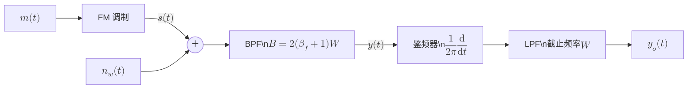
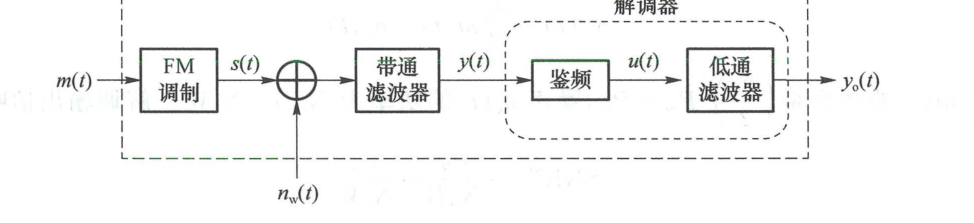
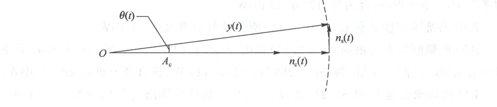
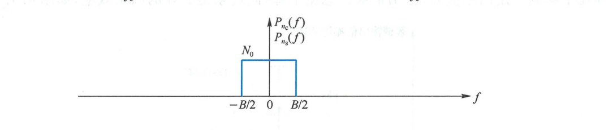
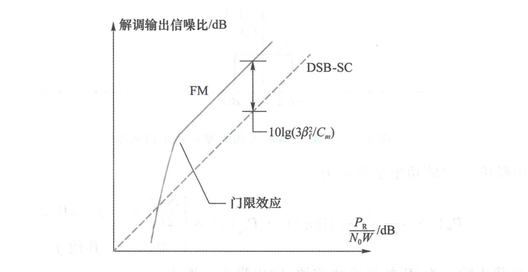
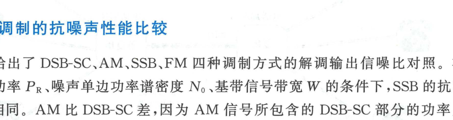

import Knowledge from '@/components/Knowledge.astro';
import Example from '@/components/Example.astro';
import Solution from '@/components/Solution.astro';

发送信号到达接收端时，信号强度通常非常微弱。接收端用低噪放（LNA）放大微弱信号的同时，也放大了信道中及前端器件产生的各种噪声，解调输出是有用信号与噪声的混合。解调器输出端的**信噪比（Signal-to-Noise Ratio, SNR）**是衡量模拟通信系统传输质量最基础的量化指标。

---

## 4.4.1 系统模型

考虑图 4.1.3 所示的系统模型。调制器输出的已调信号 $s(t)$ 通过加性高斯白噪声（AWGN）信道传输，信道噪声 $n_w(t)$ 的双边功率谱密度为 $N_0/2$。

接收端带通滤波器的带宽 $B$ 恰好能使已调信号 $s(t)$ 无失真通过。进入解调器的输入信号为：

$$
y(t) = s(t) + n(t) \tag{4.4.1}
$$

其中 $n(t)$ 是窄带高斯噪声，总平均功率为 $P_n = N_0 B$。将 $n(t)$ 用同相与正交分量表示：

$$
n(t) = n_c(t)\cos(2\pi f_c t) - n_s(t)\sin(2\pi f_c t)
$$

其中 $n_c(t)$ 与 $n_s(t)$ 均服从零均值高斯分布，且功率均为 $N_0 B$。

设解调器输入端的已调信号平均接收功率为 $P_R$，则**解调器输入信噪比**为：

$$
\mathrm{SNR}_i = \frac{P_R}{N_0 B} \tag{4.4.2}
$$

其中带通带宽 $B$ 由调制方式决定：
- DSB-SC 与 AM：$B = 2W$
- SSB：$B = W$
- FM：$B \approx 2(\beta_f + 1)W$

---

## 4.4.2 线性调制相干解调

DSB-SC、SSB、AM 均可采用相干解调。设接收端本地载波与发射载波理想同步，相干解调输出为输入信号复包络的实部（同相分量）：

$$
y_o(t) = \operatorname{Re}\{y_L(t)\} = \operatorname{Re}\{s_L(t)\} + n_c(t) \tag{4.4.3}
$$

### 1. DSB-SC

DSB-SC 信号为 $s(t) = A_c m(t)\cos(2\pi f_c t)$，接收功率为 $P_R = \frac{1}{2}A_c^2 P_m$。

解调输出为：

$$
y_o(t) = A_c m(t) + n_c(t) \tag{4.4.4}
$$

有用信号输出功率为 $S_o = A_c^2 P_m = 2P_R$，输出噪声功率为 $N_o = N_0 B = 2N_0 W$。因此，**DSB-SC 相干解调输出信噪比**为：

$$
\mathrm{SNR}_{o,\text{DSB-SC}} = \frac{S_o}{N_o} = \frac{2P_R}{2N_0 W} = \frac{P_R}{N_0 W} \tag{4.4.5}
$$

若接收载波存在恒定相位误差 $\theta_e = \varphi_c - \varphi$，解调输出变为：

$$
y_o(t) = A_c m(t)\cos\theta_e + \tilde{n}_c(t) \tag{4.4.6}
$$

由于窄带高斯噪声的复包络具有圆对称性，旋转后的实部噪声功率依然为 $2N_0 W$，输出信噪比退化为：

$$
\mathrm{SNR}_{o,\text{DSB-SC}} = \frac{P_R}{N_0 W}\cos^2\theta_e \tag{4.4.7}
$$

### 2. SSB

SSB 信号为 $s(t) = \frac{A_c}{2}[m(t)\cos(2\pi f_c t) \mp \hat{m}(t)\sin(2\pi f_c t)]$，接收功率为 $P_R = \frac{1}{4}A_c^2 P_m$。

相干解调输出为：

$$
y_o(t) = \frac{A_c}{2}m(t) + n_c(t) \tag{4.4.8}
$$

有用信号功率为 $S_o = \frac{1}{4}A_c^2 P_m = P_R$。由于 SSB 带宽仅为 $B = W$，输出噪声功率为 $N_o = N_0 B = N_0 W$。因此，**SSB 相干解调输出信噪比**为：

$$
\mathrm{SNR}_{o,\text{SSB}} = \frac{P_R}{N_0 W} \tag{4.4.9}
$$

可见，**在相同的接收功率 $P_R$ 和噪声谱密度 $N_0$ 下，SSB 与 DSB-SC 的解调输出信噪比完全相同**。但 SSB 节省了一半的信道传输带宽。

### 3. AM 相干解调

AM 信号为 $s(t) = [A_c + A' m(t)]\cos(2\pi f_c t)$，总接收功率为 $P_R = \frac{1}{2}A_c^2 + \frac{1}{2}A'^2 P_m$。若调制效率为 $\eta$，则有用边带功率为 $\eta P_R$。

相干解调并隔直后的输出为：

$$
y_o(t) = A' m(t) + n_c(t) \tag{4.4.10}
$$

有用信号功率为 $2\eta P_R$，噪声功率为 $2N_0 W$。解调输出信噪比为：

$$
\mathrm{SNR}_{o,\text{AM}} = \eta \frac{P_R}{N_0 W} \tag{4.4.11}
$$

因为 $\eta < 1$（单音满调幅时最大也仅为 $1/3$），AM 的解调输出信噪比必然显著低于 DSB-SC。

---

## 4.4.3 AM 包络检波与门限效应

叠加噪声后，包络检波器输入的复包络为：

$$
y_L(t) = [A_c + A' m(t) + n_c(t)] + \mathrm{j}n_s(t) \tag{4.4.12}
$$

其包络检波输出为：

$$
|y_L(t)| = \sqrt{[A_c + A' m(t) + n_c(t)]^2 + n_s^2(t)}
$$

<figure class="vp-figure">

  

  <figcaption>图 4.4.1 复包络中信号的几何关系（原书影印参考）</figcaption>
</figure>

- **大信噪比条件（$A_c \gg \sqrt{N_0 B}$）**：
  直角三角形的弦长近似等于底边长，正交分量 $n_s(t)$ 的影响可忽略：

  $$
  y_o(t) \approx A_c + A' m(t) + n_c(t) \tag{4.4.13}
  $$

  隔直流后其抗噪声性能与相干解调完全一致：

  $$
  \mathrm{SNR}_{o,\text{AM}} \approx \eta \frac{P_R}{N_0 W}
  $$

- **小信噪比条件（门限效应）**：
  当输入信噪比低于一定门限时，载波包络被大噪声彻底淹没，二极管包络检波器输出表现为严重的非线性解调畸变，输出信噪比发生雪崩式陡降，这一非线性劣化现象称为**门限效应（Threshold Effect）**。相干解调是线性系统，不存在门限效应。

---

## 4.4.4 FM 解调的抗噪声性能

FM 系统模型如图 4.4.2 所示。由于鉴频器是非线性系统，在**大信噪比条件**下可将其线性化，分别分析有用信号与噪声的输出功率。

<figure class="vp-figure">

  

  <figcaption>图 4.4.2 FM 系统模型（原书影印参考）</figcaption>
</figure>

### 1. 关闭噪声求信号功率

当 $n_w(t) = 0$ 时，设基带信号经幅度归一化后表示为 $m_n(t)$，其功率等于峰均比的倒数 $P_{mn} = 1/c_m$。鉴频器输出为：

$$
u_s(t) = \beta_f W m_n(t) \tag{4.4.14}
$$

经截止频率为 $W$ 的低通滤波器后，解调输出信号功率为：

$$
S_o = \frac{(\beta_f W)^2}{c_m} \tag{4.4.15}
$$

### 2. 关闭信号求噪声功率

当调制信号关闭（未调载波 $s(t) = A_c\cos(2\pi f_c t)$）时，在高信噪比条件下，正交噪声引起的瞬时相位抖动近似为 $\theta(t) \approx \frac{n_s(t)}{A_c}$（图 4.4.3）。

<figure class="vp-figure">

  

  <figcaption>图 4.4.3 鉴频器输入端的复包络示意图（原书影印参考）</figcaption>
</figure>

鉴频器对相位求导，输出噪声为：

$$
u_n(t) = \frac{1}{2\pi}\frac{\mathrm{d}\theta(t)}{\mathrm{d}t} \approx \frac{n_s'(t)}{2\pi A_c} \tag{4.4.17}
$$

微分运算对应的功率谱变换因子为 $|2\pi f|^2$。由于窄带正交噪声 $n_s(t)$ 的功率谱密度为 $P_{ns}(f) = N_0$（$|f| \leqslant B/2$），鉴频器输出噪声的功率谱密度为**抛物线形状**（图 4.4.4）：

$$
P_u(f) = \frac{1}{(2\pi A_c)^2}(2\pi f)^2 P_{ns}(f) = \frac{N_0 f^2}{2P_R}, \quad |f| \leqslant B/2 \tag{4.4.18}
$$

<figure class="vp-figure">

  

  <figcaption>图 4.4.4 解调器输入端的噪声功率谱密度（原书影印参考）</figcaption>
</figure>

低通滤波器（截止频率 $W$）滤除频带外的噪声，最终输出噪声功率为：

$$
N_o = 2\int_0^W \frac{N_0 f^2}{2P_R}\,\mathrm{d}f = \frac{N_0 W^3}{3P_R} \tag{4.4.19}
$$

### 3. 解调输出信噪比

综合式 (4.4.15) 与式 (4.4.19)，得到 **FM 解调输出信噪比**：

<Knowledge title="FM 解调输出信噪比增益公式">

$$
\mathrm{SNR}_{o,\text{FM}} = \frac{S_o}{N_o} = \frac{3\beta_f^2}{c_m}\frac{P_R}{N_0 W} \tag{4.4.20}
$$

式中系数 $\frac{3\beta_f^2}{c_m}$ 通常远大于 1。例如当 $\beta_f = 5$ 且单音调制（$c_m = 2$）时，信噪比改善倍数高达 $\frac{3 \times 25}{2} = 37.5$ 倍（约 $15.7\text{ dB}$）。

这揭示了调频系统的核心本质：**FM 通过成倍扩展传输带宽，换取了指数级的抗噪声信噪比增益**。

</Knowledge>

<figure class="vp-figure">

  

  <figcaption>图 4.4.5 FM 输出信噪比的门限效应（原书影印参考）</figcaption>
</figure>

### 4. 预加重与去加重网络

式 (4.4.18) 表明 FM 解调输出噪声功率谱随频率按 $f^2$ 抛物线上升，导致基带信号高频端的信噪比明显恶化。

为改善高频信噪比，调频广播系统引入了**预加重（Pre-emphasis）**与**去加重（De-emphasis）**网络（图 4.4.6）：
- 发射端通过微分型高通滤波器提升高频信号幅度；
- 接收端通过积分型低通网络还原信号频谱，同时大幅度压低了高频抛物线噪声，使输出信噪比再获得 $10 \sim 13\text{ dB}$ 的提升。

<figure class="vp-figure">

  

  <figcaption>图 4.4.6 预加重与去加重（原书影印参考）</figcaption>
</figure>

<Example id="4.4.1" title="不同模拟调制方式所需发射功率的综合比较">
设基带信号 $m(t)$ 的自相关函数为 $R_m(\tau) = 16\operatorname{sinc}^2(10\,000\tau)$，最大幅度为 $|m(t)|_{\max} = 6\text{ V}$。已调信号经信道传输衰减 $60\text{ dB}$，信道白噪声功率谱密度为 $N_0/2 = 10^{-12}\text{ W/Hz}$。若要求解调输出信噪比达到 $40\text{ dB}$，试求 DSB-SC、SSB、调幅系数 $\beta = 0.8$ 的 AM 以及调频指数 $\beta_f = 5$ 的 FM 四种调制方式各自所需的发射功率 $P_T$。
</Example>

<Solution title="解">
1. **参数提取**：
   - 自相关函数对应的功率谱为三角谱，最高频率为 $W = 10\text{ kHz}$；
   - 基带信号平均功率为 $P_m = R_m(0) = 16\text{ W}$，峰值功率为 $6^2 = 36\text{ W}$，峰均比为 $c_m = 36/16 = 9/4$；
   - 信道衰减 $60\text{ dB}$，即 $P_R = P_T \times 10^{-6}$；
   - 接收基带噪声功率为 $N_0 W = (2 \times 10^{-12}) \times 10^4 = 2 \times 10^{-8}\text{ W}$；
   - 输出信噪比指标为 $40\text{ dB} = 10\,000$。

2. **DSB-SC**：
   $\mathrm{SNR}_o = \frac{P_R}{N_0 W} = \frac{10^{-6}P_T}{2 \times 10^{-8}} = 50P_T = 10\,000 \implies P_T = 200\text{ W} = 23\text{ dBW}$。

3. **SSB**：
   抗噪声性能与 DSB-SC 完全一致，所需发射功率同样为 $P_T = 200\text{ W} = 23\text{ dBW}$。

4. **AM（$\beta = 0.8$）**：
   调制效率为 $\eta = \frac{1}{1 + c_m/\beta^2} = \frac{1}{1 + (9/4)/0.8^2} = \frac{64}{289} \approx 22.1\%$。
   所需发射功率为 DSB-SC 的 $1/\eta$ 倍：$P_T = 200 \times \frac{289}{64} \approx 903.1\text{ W} = 29.56\text{ dBW}$。

5. **FM（$\beta_f = 5$）**：
   调频增益倍数为 $\frac{3\beta_f^2}{c_m} = \frac{3 \times 5^2}{9/4} = \frac{100}{3} \approx 33.3$ 倍。
   所需发射功率仅为 DSB-SC 的 $3/100$：$P_T = 200 \times \frac{3}{100} = 6\text{ W} = 7.78\text{ dBW}$。
</Solution>

---

## 4.4.5 模拟调制的抗噪声性能综合对比

下表归纳总结了典型模拟调制系统在相同接收功率 $P_R$、噪声功率谱密度 $N_0$ 及基带带宽 $W$ 条件下的性能对照：

| 调制方式 | 传输带宽 $B$ | 解调输入信噪比 $\mathrm{SNR}_i$ | 解调方式 | 解调输出信噪比 $\mathrm{SNR}_o$ | 门限效应 |
| :--- | :--- | :--- | :--- | :--- | :--- |
| **DSB-SC** | $2W$ | $\frac{P_R}{2N_0 W}$ | 相干解调 | $\frac{P_R}{N_0 W}$ | 无 |
| **SSB** | $W$ | $\frac{P_R}{N_0 W}$ | 相干解调 | $\frac{P_R}{N_0 W}$ | 无 |
| **AM** | $2W$ | $\frac{P_R}{2N_0 W}$ | 包络检波（大信噪比） | $\eta\frac{P_R}{N_0 W}$ | 有 |
| **FM** | $2(\beta_f + 1)W$ | $\frac{P_R}{2N_0 W(\beta_f + 1)}$ | 鉴频器（大信噪比） | $\frac{3\beta_f^2}{c_m}\frac{P_R}{N_0 W}$ | 有 |

表 4.4.1 典型模拟调制方式抗噪声性能综合对比

