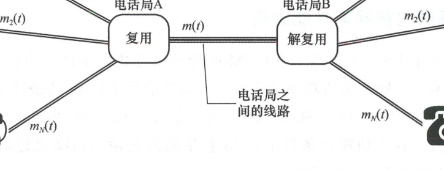
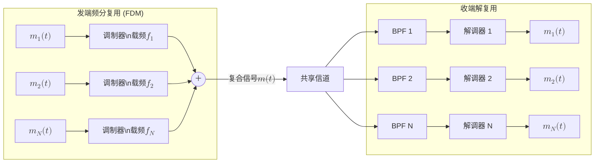
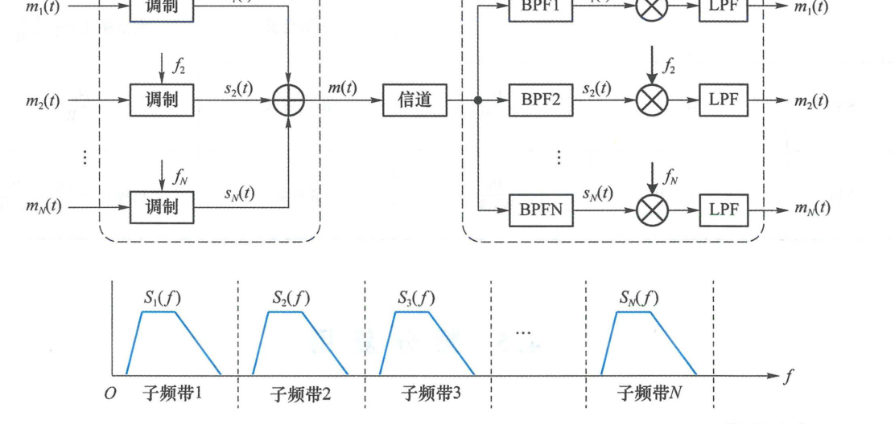
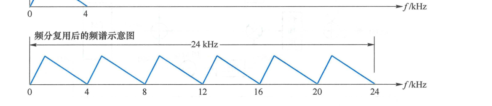
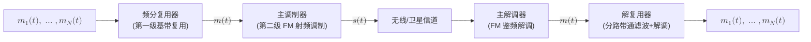
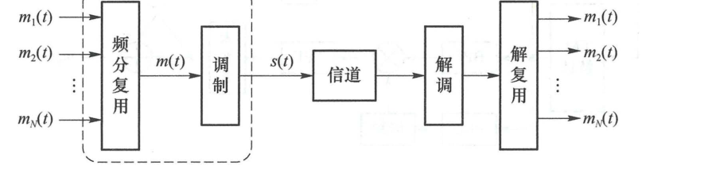
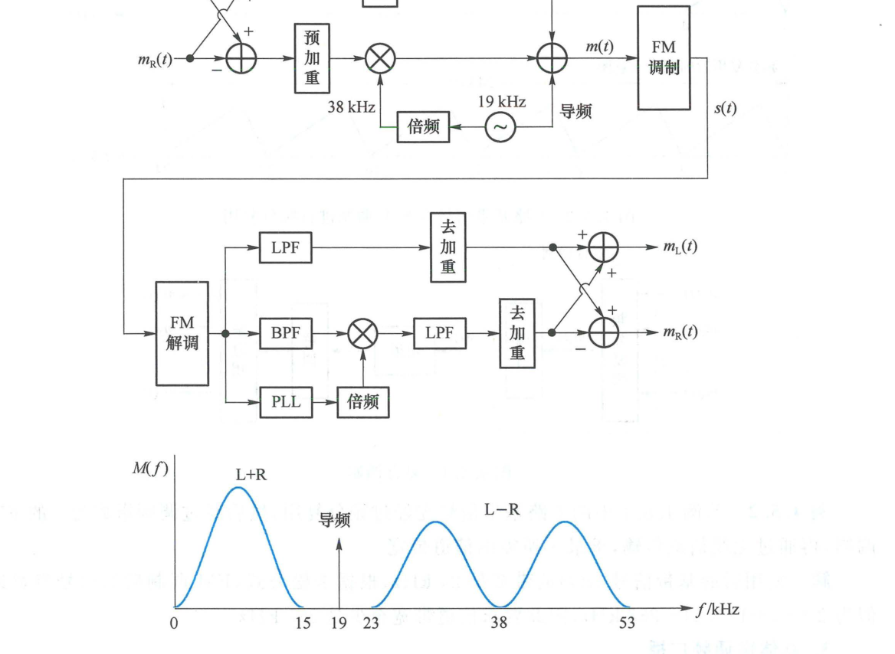

import Knowledge from '@/components/Knowledge.astro';
import Example from '@/components/Example.astro';
import Solution from '@/components/Solution.astro';
import ExerciseTrigger from '@/components/exercises/ExerciseTrigger.astro';

信道所拥有的物理传输带宽通常远大于单路基带信号所需的带宽。为了充分利用通信线路的传输能力、降低建网成本，通常采用**复用（Multiplexing）**技术，使多路互不相关的信号同时共享同一条物理信道。

---

## 4.5.1 频分复用（FDM）原理

复用的本质是多路信号的共享传输。例如在图 4.5.1 中，电话局 A 与电话局 B 各自连接 $N$ 个电话用户。如果两个电话局之间为每一对用户专门架设一条物理线路，成本将极其高昂。采用复用技术后，电话局 A 利用复用器将 $N$ 路话音信号 $m_1(t), m_2(t), \dots, m_N(t)$ 合并为一路复合信号 $m(t)$，通过单条干线电缆传输至电话局 B，电话局 B 收到后通过解复用器将各路话音无失真分离，分别送至对应用户。

<figure class="vp-figure">

  

  <figcaption>图 4.5.1 复用概念（原书影印参考）</figcaption>
</figure>

注意，将 $N$ 个频带相同的模拟基带信号合并，**绝对不能直接线性叠加**（即 $m(t) \neq \sum m_i(t)$）。因为各路信号的频谱严重重叠，接收端在数学上无法将它们重新分开。

**频分复用（Frequency Division Multiplexing, FDM）**利用调制的频谱搬移功能，将传输信道的总频带划分为 $N$ 个互不重叠的子频带，如图 4.5.2 所示：
1. 每一路基带信号 $m_i(t)$ 分别调制到不同的载频 $f_{c,i}$ 上（通常采用单边带 SSB 调制以最大化节省带宽，也可采用 DSB 调制）；
2. 各路已调信号的频谱在频域互不交叠，并保留一定的**保护频带（Guard Band）**以防止邻道干扰；
3. 接收端利用一组中心频率各异的带通滤波器（BPF）将各子频带信号分离，再经各自的解调器复原出各路原始基带信号。

<figure class="vp-figure">

  

  <figcaption>图 4.5.2 频分复用（原书影印参考）</figcaption>
</figure>

<Example id="4.5.1" title="6 路基带信号的 SSB 频分复用带宽规划">
将 6 路带宽均为 $4\text{ kHz}$ 的模拟基带信号以单边带（SSB）调制方式频分复用为一路复合基带信号 $m(t)$，通过基带电缆信道传输。求该系统所需的最小信道带宽。
</Example>

<Solution title="解">
各路子频带频谱安排如图 4.5.3 所示：
- 第 1 路不进行调制，直接安排在基础子频带 $0 \sim 4\text{ kHz}$；
- 第 2 至第 6 路分别采用上边带（USB）调制，载波频率依次选为 $4\text{ kHz}, 8\text{ kHz}, 12\text{ kHz}, 16\text{ kHz}, 20\text{ kHz}$；
- 频分复用后的复合信号 $m(t)$ 是一个连续覆盖 $0 \sim 24\text{ kHz}$ 的基带信号。

因此，基带传输所需的最小信道带宽为：

$$
B_{\min} = 6 \times 4\text{ kHz} = 24\text{ kHz}
$$
</Solution>

<figure class="vp-figure">

  

  <figcaption>图 4.5.3 6路基带信号以 SSB 调制进行频分复用（原书影印参考）</figcaption>
</figure>

---

## 4.5.2 复合调制（FDM/FM）

频分复用合成的复合信号 $m(t)$ 依然是一个基带信号（带宽比单路更宽）。如果要通过无线电磁波进行空间传输，还需要进一步将复合信号 $m(t)$ 加载到射频主载波上，如图 4.5.4 所示，这种系统体制称为**复合调制（Composite Modulation）**。

在模拟微波中继与卫星通信中，从 $m(t)$ 到高频带通信号 $s(t)$ 的第二级调制通常采用宽带调频 FM，以利用调频的高抗噪声增益，该体制称为 **FDM/FM 系统**。

<figure class="vp-figure">

  

  <figcaption>图 4.5.4 复合调制（原书影印参考）</figcaption>
</figure>

<Example id="4.5.2" title="FDM/FM 系统的射频传输带宽计算">
若例 4.5.1 中合成的 6 路复合基带信号 $m(t)$（带宽 $24\text{ kHz}$）送入调频指数 $\beta_f = 5$ 的 FM 调制器，通过无线信道发射。求该系统无线信道所需的最小传输带宽。
</Example>

<Solution title="解">
复合基带信号的最高截止频率为 $W = 24\text{ kHz}$。根据调频带宽卡松公式：

$$
B_{\text{RF}} \approx 2(\beta_f + 1)W = 2 \times (5 + 1) \times 24\text{ kHz} = 288\text{ kHz}
$$

因此无线信道所需的最小射频传输带宽至少为 $288\text{ kHz}$。
</Solution>

---

## 4.5.3 立体声调频广播系统

调频立体声（FM Stereo）广播是频分复用与复合调制的经典工程杰作，其系统框图与频谱规划如图 4.5.5 所示。

立体声广播需同时传输左声道 $m_L(t)$ 和右声道 $m_R(t)$ 两路高质量音频（音频带宽 $30\text{ Hz} \sim 15\text{ kHz}$）。为了兼顾老式单声道收音机，发端不直接传输 $m_L(t)$ 和 $m_R(t)$，而是采用**和差编码矩阵**：
- **和信号**：$m_L(t) + m_R(t)$
- **差信号**：$m_L(t) - m_R(t)$

<Knowledge title="FM 立体声广播的频谱规划与兼容性设计">

1. **兼容单声道基带（$0 \sim 15\text{ kHz}$）**：
   直接放置和信号 $m_L(t) + m_R(t)$。老式单声道收音机解出该频段，扬声器播放的是左右声道的混合单声道声响，完全保持兼容。
2. **立体声差信号频带（$23 \sim 53\text{ kHz}$）**：
   以 $38\text{ kHz}$ 为副载波，对差信号 $m_L(t) - m_R(t)$ 进行 DSB-SC 抑制载波调制，占用双边带带宽 $30\text{ kHz}$。
3. **插入立体声导频（$19\text{ kHz}$）**：
   接收机恢复 $38\text{ kHz}$ 载波需要同步参考。将导频精确置于 $19\text{ kHz}$（$38\text{ kHz}$ 的半频点），因为 $15 \sim 23\text{ kHz}$ 区域为空白保护频带，导频不受调制边带能量污染。收端只需经 $19\text{ kHz}$ 窄带滤波后作**二倍频**即可获得极纯净的 $38\text{ kHz}$ 同步相干载波。
4. **预加重与去加重**：
   为对抗 FM 解调输出在高频段急剧抬升的抛物线噪声，发端在两个声道支路分别串入预加重网络，收端在和差矩阵输出端分别串入去加重网络。
5. **收端矩阵解码**：
   立体声收音机同时解出和信号与差信号后，送入和差矩阵网络：
   - $[(m_L + m_R) + (m_L - m_R)] / 2 = m_L(t)$
   - $[(m_L + m_R) - (m_L - m_R)] / 2 = m_R(t)$
   完美分离并还原左右双声道立体声音效。

</Knowledge>

<figure class="vp-figure">

  

  <figcaption>图 4.5.5 立体声调频广播系统（原书影印参考）</figcaption>
</figure>

---

<ExerciseTrigger chapter={4} section="4.5" title="第4章 模拟通信系统 课后习题与自测" />
