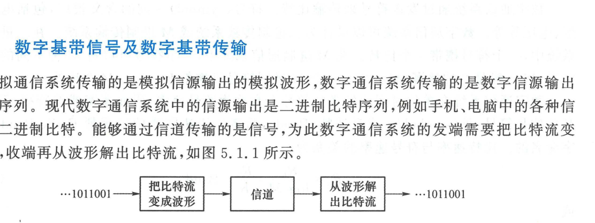

import Knowledge from '@/components/Knowledge.astro';
import Example from '@/components/Example.astro';
import Solution from '@/components/Solution.astro';

模拟通信系统传输的是模拟信源输出的连续波形，而现代数字通信系统传输的是数字信源输出的离散数字序列（二进制比特流）。能够通过物理信道传输的是电磁波信号，因此数字通信系统的发端必须将离散的比特流转换为连续的信号波形，收端再从接收波形中逆向判决复原出原始比特流，如图 5.1.1 所示。

<figure class="vp-figure">

  

  <figcaption>图 5.1.1 数字通信系统（原书影印参考）</figcaption>
</figure>

---

## 5.1.1 数字基带信号及数字基带传输

数字调制有二进制调制及 $M$ 进制（$M > 2$）调制之分：
- **二进制数字调制**：将二进制符号“0”映射为信号波形 $s_1(t)$，将“1”映射为波形 $s_2(t)$；
- **$M$ 进制数字调制**：将每 $K$ 个二进制比特组合成一个符号，映射为 $M = 2^K$ 个不同信号波形之一 $s_i(t), i = 1, 2, \dots, M$。

若数字调制是将数字序列映射为适合于基带信道传输的电脉冲波形，称为**数字脉冲调制**或**基带调制**。其输出信号的功率谱密度是低通型的，频带从直流或近直流的低频开始，带宽有限，这种信号称为**数字基带信号**。

若通信信道的传递函数是低通型的（例如双绞线、同轴电缆、高速背板等有线信道），称为**基带信道**。将数字基带信号直接送入基带信道传输的系统称为**数字基带传输系统**。

若通信信道是带通型的（例如无线电磁波信道与光纤信道），信道可用频带远离 $f = 0$。此时必须借助正弦载波将基带信号搬移到高频载波上，称为**频带调制**与**数字频带传输系统**（第 6 章）。根据第 2.4 节的等效基带理论，**一切带通信号与带通系统均可等效为基带系统**，因此数字基带传输的基本理论是整个数字通信科学的核心基石。

---

## 5.1.2 数字通信中的基本速率

在信息科学中，1 比特（bit）表示一个二进制数位（0 或 1），是度量信息量的基本单位。

<Knowledge title="数字通信系统核心速率与性能指标">

1. **比特速率（信息速率 / 数据速率）$R_b$**：
   系统单位时间内传输的二进制比特数，单位为 $\text{bit/s}$（或 $\text{bps}$）。传输一个比特所需的时间称为**比特周期**：

   $$
   T_b = \frac{1}{R_b}
   $$

2. **符号速率（码元速率 / 波特率）$R_s$**：
   系统单位时间内发送的调制符号（波形）个数，单位为**波特（Baud）**或 $\text{symbol/s}$。传输一个符号所需的时间称为**符号周期**：

   $$
   T_s = \frac{1}{R_s}
   $$

3. **速率转换关系**：
   对于 $M$ 进制系统，每个符号携带 $K = \log_2 M$ 个比特：

   $$
   R_s = \frac{R_b}{\log_2 M} = \frac{R_b}{K} \quad (\text{Baud}) \tag{5.1.1}
   $$

   $$
   R_b = R_s \log_2 M = K R_s \quad (\text{bit/s}) \tag{5.1.2}
   $$

4. **误码率度量**：
   - **误比特率（Bit Error Rate, BER）$P_b$**：传输发生错误的比特数占总传输比特数的比率；
   - **误符号率（Symbol Error Rate, SER）$P_s$**：判决错误的符号数占总传输符号数的比率。两者满足：

   $$
   \frac{P_s}{\log_2 M} \leqslant P_b \leqslant P_s \tag{5.1.3}
   $$

5. **频带利用率（频谱效率, Spectral Efficiency, SE）**：
   单位带宽内能传输的速率，度量系统的传输有效性：

   $$
   \eta = \frac{R_b}{B} \quad (\text{bit}/(\text{s}\cdot\text{Hz})) \quad \text{或} \quad \eta_s = \frac{R_s}{B} \quad (\text{Baud/Hz})
   $$

</Knowledge>

<Example id="5.1.1" title="4 进制系统的基本速率与误码率分析">
某 4 进制（$M = 4$）数字通信系统在 $10\text{ s}$ 时间内连续传输了 $40\,000$ 个比特。接收端在解调判决后发现收到的符号中有 2 个符号发生判决错误。试求：
(1) 系统的比特速率 $R_b$ 与符号速率 $R_s$；
(2) 接收端的误符号率 $P_s$ 以及误比特率 $P_b$ 的可能取值范围。
</Example>

<Solution title="解">
(1) 系统的比特速率为：

$$
R_b = \frac{40\,000\text{ bit}}{10\text{ s}} = 4\,000\text{ bit/s} = 4\text{ kbps}
$$

每个 4 进制符号携带 $K = \log_2 4 = 2\text{ bit}$，总符号数为 $N_s = 40\,000 / 2 = 20\,000$ 个符号。符号速率为：

$$
R_s = \frac{R_b}{\log_2 4} = \frac{4\,000}{2} = 2\,000\text{ Baud} = 2\text{ kBaud}
$$

(2) 误符号率为错误符号数除以总符号数：

$$
P_s = \frac{2}{20\,000} = 10^{-4}
$$

每个错误符号携带 2 个比特，其中可能错 1 个比特，也可能 2 个比特全错。因此 2 个错误符号中：
- 最好情况：各错 1 个比特，共错 2 个比特，此时误比特率为 $P_{b,\min} = \frac{2}{40\,000} = 5 \times 10^{-5}$；
- 最坏情况：每个错误符号的 2 个比特全错，共错 4 个比特，此时误比特率为 $P_{b,\max} = \frac{4}{40\,000} = 10^{-4}$。

因此误比特率范围为：

$$
5 \times 10^{-5} \leqslant P_b \leqslant 10^{-4}
$$

完全符合式 (5.1.3) 给出的理论界限 $\frac{P_s}{2} \leqslant P_b \leqslant P_s$。
</Solution>
