import Knowledge from '@/components/Knowledge.astro';
import Example from '@/components/Example.astro';
import Solution from '@/components/Solution.astro';

将数字比特流转换成基带信号波形的技术称为**脉冲幅度调制（Pulse Amplitude Modulation, PAM）**。基带信号的码型结构直接决定了信号的功率谱分布、直流分量、定时时钟分量以及误码检测能力。

---

## 5.2.1 脉冲幅度调制（PAM）原理

图 5.2.1 给出了产生多进制脉冲幅度调制（$M\text{PAM}$）信号的通用原理框图。

```mermaid
flowchart LR
    src["二进制序列 $$\{b_k\}$$\n间隔 $$T_b$$"] --> sp["串/并变换\n每 $$K = \\log_2 M$$ 比特一组"]
    sp --> map["符号电平映射\n产生离散幅度序列 $$\{a_n\}$$"]
    map --> filter["发送滤波器 $$g_T(t)$$\n(脉冲成形网络)"]
    filter --> out["数字基带信号 $$s(t)$$"]
```

<figure class="vp-figure">

  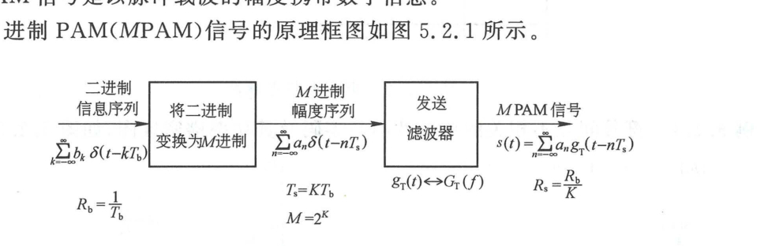

  <figcaption>图 5.2.1 产生 MPAM 信号的原理框图（原书影印参考）</figcaption>
</figure>

数字基带信号 $s(t)$ 的通用时域数学表达式为：

$$
s(t) = \sum_{n=-\infty}^\infty a_n g_T(t - n T_s) \tag{5.2.1}
$$

其中：
- $T_s$ 为符号间隔（$T_s = K T_b$）；
- $\{a_n\}$ 为映射后的离散幅度序列（取自 $M$ 个离散电平之一）；
- $g_T(t)$ 为发送滤波器的基本脉冲冲激响应（脉冲形状）。

---

## 5.2.2 常用数字基带信号波形

### 1. 单极性不归零码（NRZ）

二进制“0”映射为电平 $0$，“1”映射为正电平 $+A$。脉冲波形持续整个符号周期 $T_b$，如图 5.2.2 所示。

<figure class="vp-figure">

  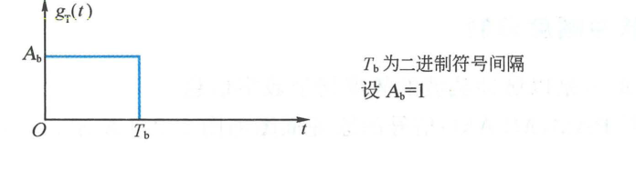

  <figcaption>图 5.2.2 矩形不归零脉冲（原书影印参考）</figcaption>
</figure>

单极性 NRZ 码的波形与单边功率谱如图 5.2.3 所示。其突出特点是：含有强大的离散直流分量；在时钟频率 $f = R_b = 1/T_b$ 处功率谱值为 0，**不含离散的时钟线谱**，无法直接从波形中滤波提取位同步时钟。

<figure class="vp-figure">

  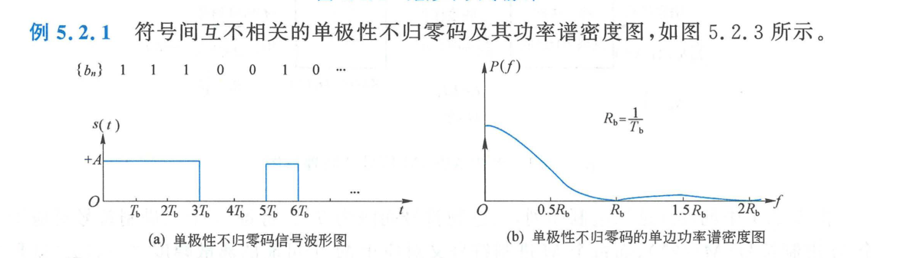

  <figcaption>图 5.2.3 单极性不归零码信号波形及单边功率谱密度图（原书影印参考）</figcaption>
</figure>

### 2. 双极性不归零码（BNRZ）

二进制“0”映射为负电平 $-A$，“1”映射为正电平 $+A$。如图 5.2.4 所示，在等概率传输（$P(0) = P(1) = 1/2$）时：
- 符号序列均值为零，**完全不含离散直流分量与时钟线谱**；
- 判决门限位于 $0$ 电平，抗噪声性能比单极性码提升 $3\text{ dB}$，信道适应能力强。

<figure class="vp-figure">

  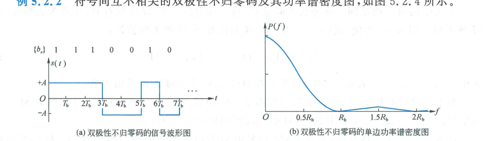

  <figcaption>图 5.2.4 双极性不归零码的信号波形及单边功率谱密度图（原书影印参考）</figcaption>
</figure>

### 3. 单极性归零码（RZ）

脉冲的高电平仅持续半个码元周期（$\tau = T_b / 2$），后半个码元迅速回到零电平（占空比 50%），如图 5.2.5 所示。

<figure class="vp-figure">

  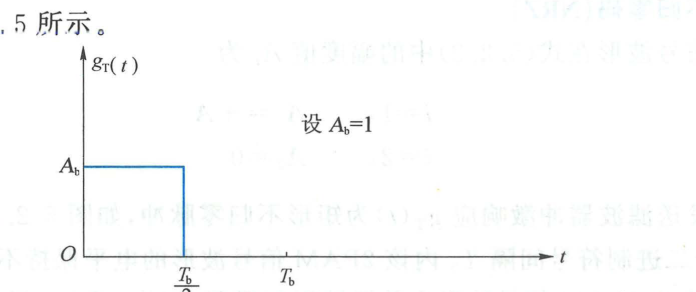

  <figcaption>图 5.2.5 发送滤波器的冲激响应 g_T(t)（原书影印参考）</figcaption>
</figure>

单极性 RZ 码波形与单边功率谱如图 5.2.6 所示。由于脉冲宽度变窄，其第一零点带宽扩展至 $2R_b$。最为关键的特性是：**在时钟频率 $f = R_b$ 处存在显著的离散时钟线谱**，接收端只需通过中心频率为 $R_b$ 的窄带带通滤波器，即可直接提取出位同步时钟信号！

<figure class="vp-figure">

  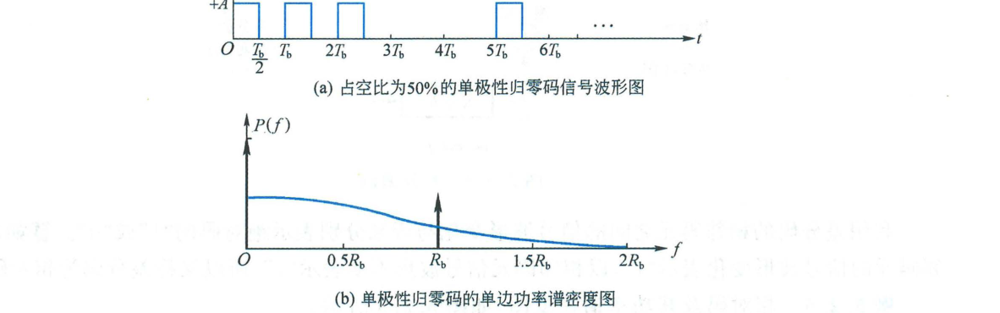

  <figcaption>图 5.2.6 单极性归零码信号波形及单边功率谱密度图（原书影印参考）</figcaption>
</figure>

### 4. 双极性归零码（BRZ）

“1”映射为正半占空脉冲，“0”映射为负半占空脉冲，如图 5.2.7 所示。兼具归零码提取时钟的特性与双极性码无直流、判决抗干扰性好的优点。

<figure class="vp-figure">

  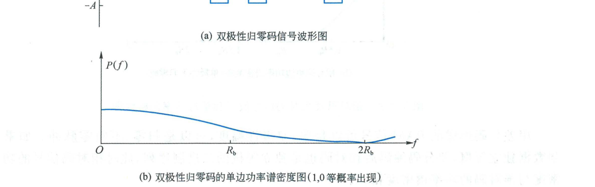

  <figcaption>图 5.2.7 双极性归零码的信号波形及单边功率谱密度图（原书影印参考）</figcaption>
</figure>

### 5. 差分码（相对码）

常规码（绝对码）用脉冲的绝对极性代表二进制信息。在传输中若发生载波反相或电平倒置，绝对码将全部译反。差分码用**相邻码元电平是否发生跳变**来表示信息。其编码规则为模二加递推：

$$
d_k = b_k \oplus d_{k-1} \tag{5.2.5}
$$

如图 5.2.8 和图 5.2.9 所示，即使接收端信号极性整体反转，相邻电平变化关系保持不变，能彻底解决相位模糊问题。

<figure class="vp-figure">

  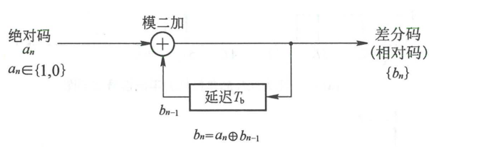

  <figcaption>图 5.2.8 差分编码（原书影印参考）</figcaption>
</figure>

<figure class="vp-figure">

  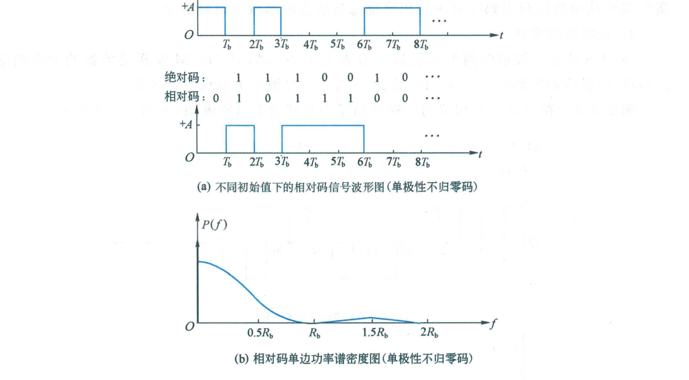

  <figcaption>图 5.2.9 相对码及相对码信号波形和单边功率谱密度图（原书影印参考）</figcaption>
</figure>

### 6. 多进制 PAM（MPAM）

一个符号携带 $K = \log_2 M$ 个比特，脉冲幅度取 $M$ 种不同电平（例如 8PAM 具有 8 种对称电平，图 5.2.10）。在相同的符号速率下传输速率成倍提高，显著提升信道频带利用率。

<figure class="vp-figure">

  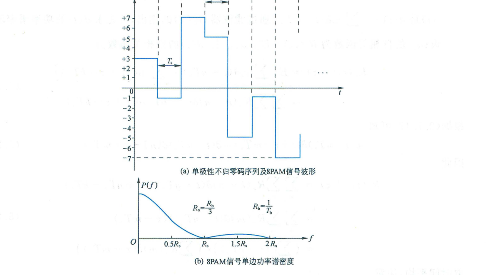

  <figcaption>图 5.2.10 8PAM 信号波形及其功率谱密度图（原书影印参考）</figcaption>
</figure>

---

## 5.2.3 数字 PAM 信号的功率谱密度计算

设基带序列 $\{a_n\}$ 是广义平稳独立同分布（i.i.d.）随机序列，数学期望为 $m_a = \mathbb{E}[a_n]$，方差为 $\sigma_a^2 = \mathbb{E}[a_n^2] - m_a^2$。

<Knowledge title="数字 PAM 随机脉冲序列功率谱密度通用定理">

数字基带 PAM 信号 $s(t) = \sum_n a_n g_T(t - n T_s)$ 的功率谱密度由**连续谱 $P_c(f)$** 与**离散线谱 $P_d(f)$** 两部分构成：

$$
P_s(f) = P_c(f) + P_d(f) \tag{5.2.12}
$$

1. **连续谱（Continuous Spectrum）**：由符号的随机交替起伏产生，与序列方差 $\sigma_a^2$ 及成形脉冲能量谱 $|G_T(f)|^2$ 成正比：

$$
P_c(f) = \frac{\sigma_a^2}{T_s}|G_T(f)|^2 \tag{5.2.13}
$$

2. **离散谱（Discrete Line Spectrum）**：由符号均值 $m_a$（直流分量）产生，表现为以符号速率 $R_s = 1/T_s$ 为基频的离散冲激线谱：

$$
P_d(f) = \frac{m_a^2}{T_s^2}\sum_{k=-\infty}^\infty \left|G_T\left(\frac{k}{T_s}\right)\right|^2 \delta\left(f - \frac{k}{T_s}\right) \tag{5.2.14}
$$

</Knowledge>

<figure class="vp-figure">

  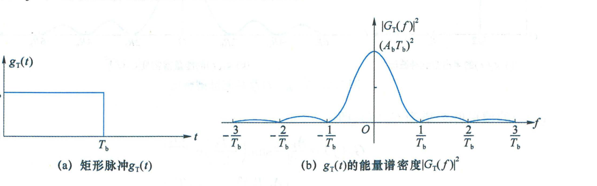

  <figcaption>图 5.2.11 矩形脉冲 g_T(t) 及其能量谱密度 |G_T(f)|^2（原书影印参考）</figcaption>
</figure>

根据定理，基带信号频谱具有以下关键物理推论：
1. **直流分量**：若序列均值 $m_a = 0$（例如等概率双极性码），则离散谱 $P_d(f) \equiv 0$，信号功率谱为纯连续谱，不含任何直流线谱；
2. **时钟提取线谱**：在时钟频率 $f = 1/T_s$ 处，离散线谱的冲激强度取决于 $\left|G_T(1/T_s)\right|^2$：
   - 矩形不归零脉冲（脉宽 $T_s$）的能量谱零点恰好落在 $f = 1/T_s$ 处（$\operatorname{sinc}(1) = 0$），故不归零码在 $f = R_s$ 处绝无时钟线谱（图 5.2.12）；
   - 50% 占空比归零脉冲（脉宽 $T_s/2$）的能量谱零点在 $f = 2/T_s$ 处，在 $f = 1/T_s$ 处 $|G_T(1/T_s)|^2 \neq 0$。因此**单极性归零码必然包含 $f = R_s$ 的离散时钟分量**（图 5.2.13 与图 5.2.14）。

<figure class="vp-figure">

  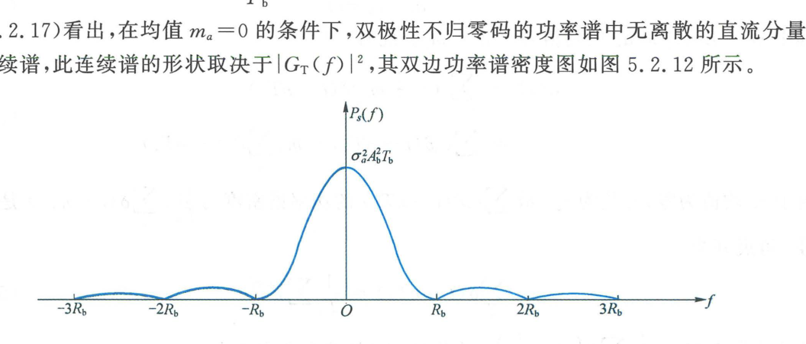

  <figcaption>图 5.2.12 双极性不归零码的双边功率谱密度图（原书影印参考）</figcaption>
</figure>

<figure class="vp-figure">

  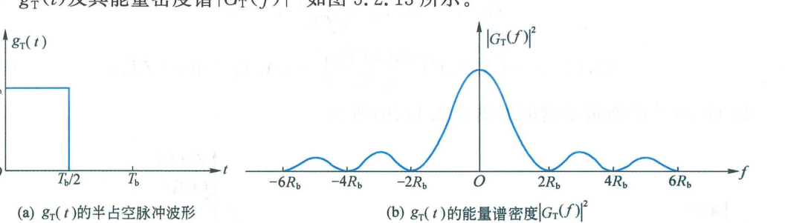

  <figcaption>图 5.2.13 g_T(t) 及其能量谱密度（原书影印参考）</figcaption>
</figure>

<figure class="vp-figure">

  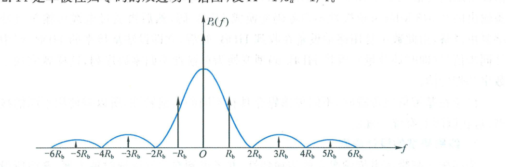

  <figcaption>图 5.2.14 单极性归零码的双边功率谱图（原书影印参考）</figcaption>
</figure>

---

## 5.2.4 基带传输的线路码型

实际基带传输信道（如电缆传输线）通常含有隔直电容和交流耦合变压器，不能通过直流，且高频衰减剧烈。必须将信源输出的二进制码转换成适合信道特性的**传输线路码型（Line Codes）**。

### 1. 线路码型的设计原则
- **无直流分量**，低频分量尽量小，高频分量衰减快以节省信道频带；
- **定时信息丰富**，即使出现长串连“0”或连“1”，也能可靠提取位同步时钟；
- **具有固有检错能力**，便于在线误码监测；
- **无误码扩散**，编码效率高。

### 2. 传号交替反转码（AMI 码）

将二进制“0”（空号）编码为电平 $0$；将二进制“1”（传号）交替编码为极性相反的 $+A$ 与 $-A$ 半占空归零脉冲，如图 5.2.15 所示。

<figure class="vp-figure">

  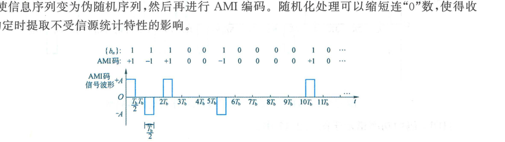

  <figcaption>图 5.2.15 AMI(RZ) 码信号波形（原书影印参考）</figcaption>
</figure>

- **优点**：传号交替反转彻底消除了直流分量；若出现破坏极性交替的脉冲，即可判定产生误码，具备内建检错能力；
- **缺点**：若信源出现长串连“0”，信号长时间处于零电平，接收端锁相环将因缺乏跳变而丢失时钟同步。

### 3. 三阶高密度双极性码（HDB3 码）

HDB3 码是 ITU-T（CCITT）推荐的欧洲制式 PCM 一次群（$2.048\text{ Mbit/s}$）至三次群标准接口码型。它在保持 AMI 码优良特性的同时，**将连续“0”的个数严格限制在 3 个以内**。

<Knowledge title="HDB3 码编码法则">

1. **基本规则**：信息码元“1”交替变换为 $+1$ 与 $-1$，“0”保持为 $0$；
2. **取代节机制**：当出现 4 个连“0”时，用特定的 4 符号节取代：
   - 若前一个破坏符号 $V$ 到当前取代节之间包含**奇数个**非零传号，采用 **$000V$** 取代；
   - 若包含**偶数个**（含 0 个）非零传号，采用 **$B00V$** 取代；
3. **极性约束**：
   - 破坏符号 $V$ 的极性与前一个非零符号同极性（故意破坏极性交替规律，以便收端识别）；
   - 调节符号 $B$ 的极性与前一个非零符号相反（充当合法传号）；
   - 相邻 $V$ 符号之间必须保持极性正负交替，以确保整个序列**绝对无直流分量**。

</Knowledge>

<figure class="vp-figure">

  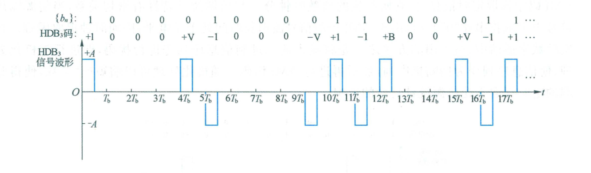

  <figcaption>图 5.2.16 HDB3 码及其信号波形图（半占空归零码型）（原书影印参考）</figcaption>
</figure>

<figure class="vp-figure">

  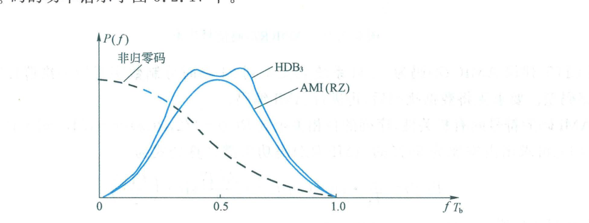

  <figcaption>图 5.2.17 HDB3 码及 AMI 码单边功率谱图（原书影印参考）</figcaption>
</figure>

### 4. 传号反转码（CMI 码）

ITU-T 推荐的 PCM 四次群（$139.264\text{ Mbit/s}$）标准接口码型。编码规则如图 5.2.18 所示：
- “0”编为一对固定比特“$01$”；
- “1”交替编码为“$11$”或“$00$”。

CMI 码完全没有直流分量，高频时钟丰富，结构极其简单稳定，如图 5.2.19 所示。

<figure class="vp-figure">

  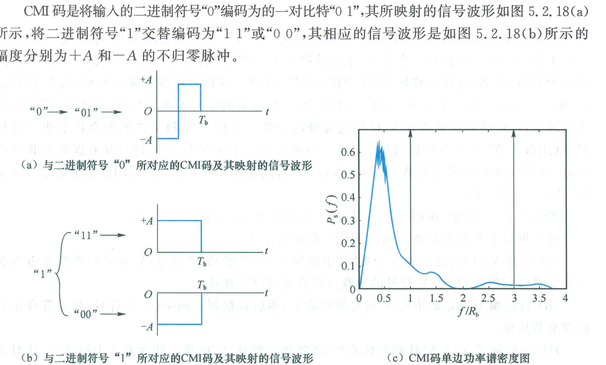

  <figcaption>图 5.2.18 CMI 码及其映射的信号波形、单边功率谱密度图（原书影印参考）</figcaption>
</figure>

<figure class="vp-figure">

  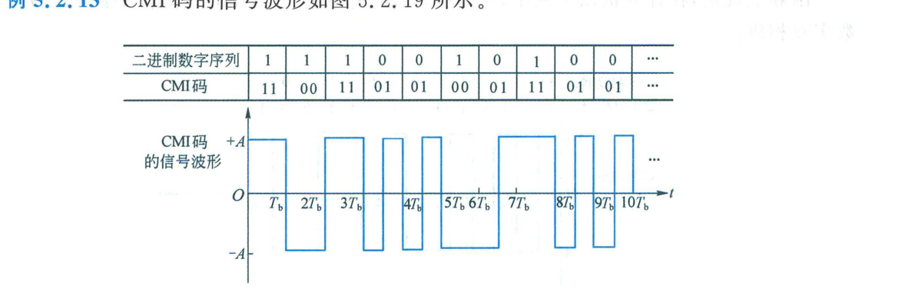

  <figcaption>图 5.2.19 CMI 码及其信号波形（原书影印参考）</figcaption>
</figure>

### 5. 数字分相码（曼彻斯特码 Manchester Code）

又称数字双相码，是以太网（IEEE 802.3）的基础编码规范：
- “0”编码为“$01$”（码元中心产生上升沿正跳变）；
- “1”编码为“$10$”（码元中心产生下降沿负跳变）。

波形与功率谱如图 5.2.20 与图 5.2.21 所示。每个码元中心必然存在一次电平跳变，因此**具有极强的自同步能力和零直流特性**；其代价是信号频带扩展为原来的 2 倍。

<figure class="vp-figure">

  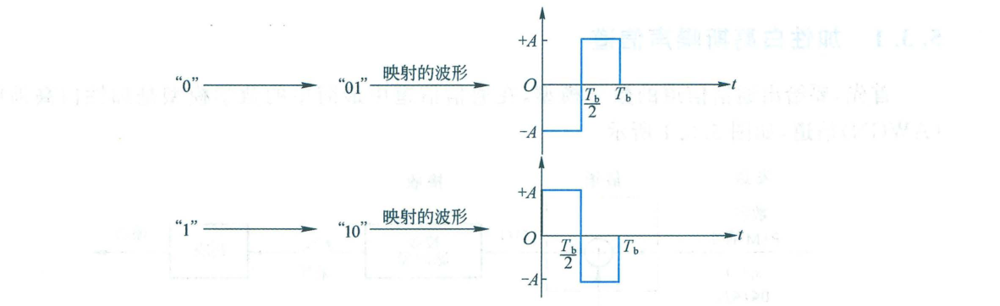

  <figcaption>图 5.2.20 数字分相码的编码及其映射的信号波形（原书影印参考）</figcaption>
</figure>

<figure class="vp-figure">

  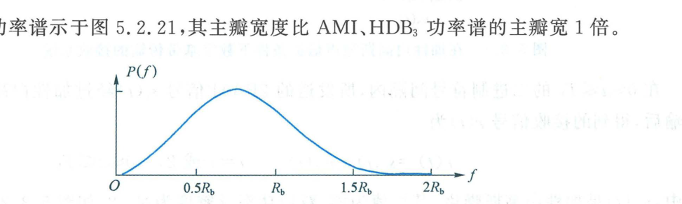

  <figcaption>图 5.2.21 数字分相码的单边功率谱密度（原书影印参考）</figcaption>
</figure>

<figure class="vp-figure">

  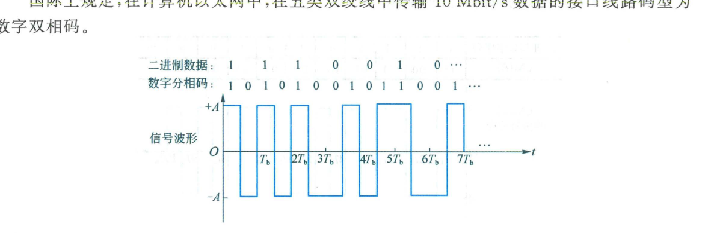

  <figcaption>图 5.2.22 数字分相码及其信号波形（原书影印参考）</figcaption>
</figure>
