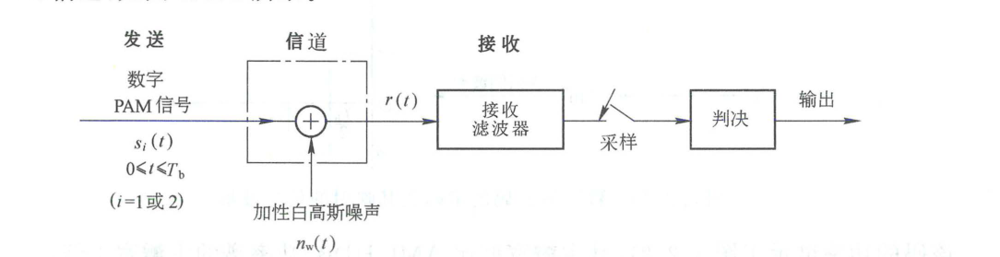
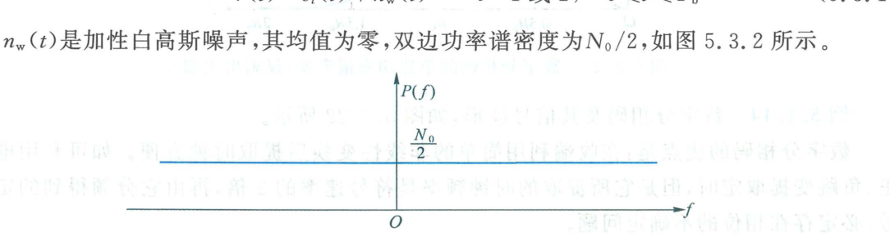
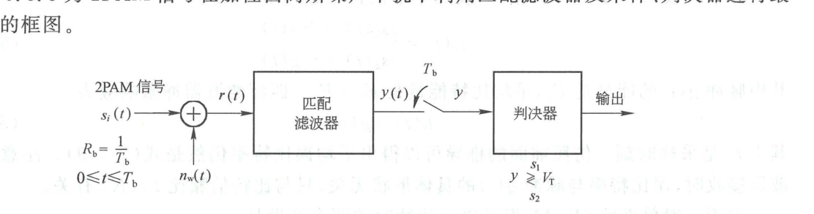
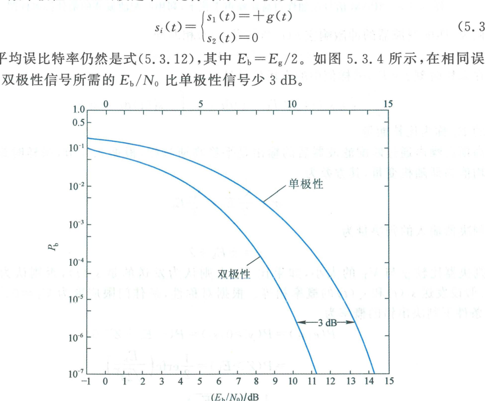

import Knowledge from '@/components/Knowledge.astro';
import Example from '@/components/Example.astro';
import Solution from '@/components/Solution.astro';

在数字通信系统的接收端，信号不可避免地受到信道噪声的污染。本节讨论在理想信道（信道带宽无限制）且仅受**加性高斯白噪声（AWGN）**干扰条件下，数字基带信号的**最佳接收（Optimum Reception）**结构及其误比特率理论极限。

---

## 5.3.1 加性高斯白噪声信道

加性高斯白噪声信道（AWGN）是通信系统中最基础、最重要的理想数学信道模型，如图 5.3.1 所示。

```mermaid
flowchart LR
    s["数字 PAM 信号 $$s_i(t)$$\n$$0 \\leqslant t \\leqslant T_b$$"] --> add(("＋"))
    nw["高斯白噪声 $$n_w(t)$$\n谱密度 $$N_0/2$$"] --> add
    add --> r["接收信号 $$r(t) = s_i(t) + n_w(t)$$"]
```

<figure class="vp-figure">

  

  <figcaption>图 5.3.1 在加性白高斯噪声信道条件下数字基带传输的接收系统（原书影印参考）</figcaption>
</figure>

在二进制符号间隔 $0 \leqslant t \leqslant T_b$ 内，接收信号表示为：

$$
r(t) = s_i(t) + n_w(t), \quad i \in \{1, 2\} \tag{5.3.1}
$$

其中 $n_w(t)$ 是均值为零、双边功率谱密度为 $N_0/2$ 的加性白高斯噪声，如图 5.3.2 所示。

<figure class="vp-figure">

  

  <figcaption>图 5.3.2 宽带白噪声的双边功率谱密度（原书影印参考）</figcaption>
</figure>

---

## 5.3.2 利用匹配滤波器的最佳接收

根据第 3.6 节的结论，在加性白高斯噪声背景下，使采样时刻输出信噪比达到理论极大值的线性滤波器是**匹配滤波器（Matched Filter）**。在匹配滤波器输出端配合以最佳判决门限，可使系统的平均误比特率达到最小。

### 1. 双极性 2PAM 信号最佳接收

设发送的 2PAM 信号为双极性不归零码：

$$
s_i(t) = \begin{cases}
s_1(t) = +A, & \text{发 “1”} \\
s_2(t) = -A, & \text{发 “0”}
\end{cases}, \quad 0 \leqslant t \leqslant T_b \tag{5.3.2}
$$

其最佳接收机原理框图如图 5.3.3 所示。

```mermaid
flowchart LR
    r["接收信号 $$r(t)$$"] --> mf["匹配滤波器 $$h(t)$$\n$$h(t) = s_1(T_b - t)$$"]
    mf --> sampler["采样开关\n$$t = T_b$$"]
    sampler -->|"样值 $$y$$"| dec{"门限判决器\n$$y \\gtrless V_T = 0$$"}
    dec -->|"大于 0"| d1["判发 “1” ($$s_1$$)"]
    dec -->|"小于 0"| d0["判发 “0” ($$s_2$$)"]
```

<figure class="vp-figure">

  

  <figcaption>图 5.3.3 2PAM 信号在加性白高斯噪声干扰下，利用匹配滤波器的最佳接收框图（原书影印参考）</figcaption>
</figure>

匹配滤波器的冲激响应与信号 $s_1(t)$ 匹配：

$$
h(t) = s_1(T_b - t), \quad 0 \leqslant t \leqslant T_b \tag{5.3.4}
$$

在最佳抽样时刻 $t = T_b$，抽样值中的有用信号成分为：

$$
s_o(T_b) = \int_0^{T_b} [\pm s_1(\tau)] h(T_b - \tau)\,\mathrm{d}\tau = \pm \int_0^{T_b} s_1^2(\tau)\,\mathrm{d}\tau = \pm E_b \tag{5.3.5}
$$

其中 $E_b = A^2 T_b$ 是单个比特的信号能量。抽样点噪声 $Z$ 是零均值高斯变量，其方差为：

$$
\sigma_Z^2 = \frac{N_0}{2}E_h = \frac{N_0}{2}E_b \tag{5.3.6}
$$

判决器的输入判决量为：

$$
y = \pm E_b + Z \tag{5.3.7}
$$

在先验等概率假设下，由对称性可知**最佳判决门限为 $V_T = 0$**。发“0”时的条件误码概率为：

$$
P(e|s_2) = P(y > 0 | s_2) = P(-E_b + Z > 0) = P(Z > E_b) = \frac{1}{2}\operatorname{erfc}\left(\sqrt{\frac{E_b}{N_0}}\right) \tag{5.3.8}
$$

由对称性，$P(e|s_1) = P(e|s_2)$。因此**双极性 2PAM 最佳接收的平均误比特率**为：

<Knowledge title="双极性 2PAM 最佳接收误比特率公式">

$$
P_b = \frac{1}{2}\operatorname{erfc}\left(\sqrt{\frac{E_b}{N_0}}\right) = Q\left(\sqrt{\frac{2E_b}{N_0}}\right) \tag{5.3.9}
$$

其中高斯 $Q$ 函数与互补误差函数 $\operatorname{erfc}(x)$ 的换算关系为 $Q(x) = \frac{1}{2}\operatorname{erfc}(x/\sqrt{2})$。

**核心结论**：误比特率仅取决于**比特信噪比 $E_b/N_0$**，而与发送脉冲的具体波形形状（矩形脉冲、升余弦脉冲等）完全无关！

</Knowledge>

### 2. 单极性 2PAM 信号最佳接收

若发送单极性不归零码：$s_1(t) = +A$（发“1”），$s_2(t) = 0$（发“0”）。

此时 $s_1(t)$ 的能量为 $E_1 = A^2 T_b$，$s_2(t)$ 的能量为 $0$，**平均比特能量**为 $E_b = E_1 / 2$。

抽样值判决量为 $y \in \{E_1 + Z, Z\}$。最佳判决门限位于两点的中点：

$$
V_T = \frac{E_1}{2} = E_b
$$

此时平均误比特率为：

$$
P_b = \frac{1}{2}\operatorname{erfc}\left(\sqrt{\frac{E_1}{4N_0}}\right) = \frac{1}{2}\operatorname{erfc}\left(\sqrt{\frac{E_b}{2N_0}}\right) = Q\left(\sqrt{\frac{E_b}{N_0}}\right) \tag{5.3.12}
$$

### 3. 性能综合对比

图 5.3.4 给出了单极性与双极性 2PAM 信号在 AWGN 信道下的平均误比特率曲线对比。

<figure class="vp-figure">

  

  <figcaption>图 5.3.4 利用匹配滤波器作最佳接收的平均误比特率曲线（原书影印参考）</figcaption>
</figure>

对比式 (5.3.9) 与式 (5.3.12) 可以看到：
- 在相同的平均比特信噪比 $E_b/N_0$ 条件下，双极性信号参数项比单极性大一倍（差 $3\text{ dB}$）；
- **在相同误比特率要求下，双极性信号所需的发射功率（$E_b$）比单极性信号少 $3\text{ dB}$（节省一半发射功率）**。
- 双极性信号不仅功率效率高，且最佳判决门限始终为固定的零电平，完全不受接收端信号电平起伏的影响，因此在工程实践中被普遍采用。
