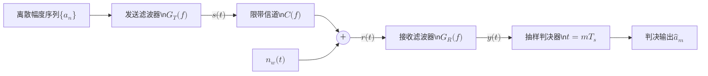
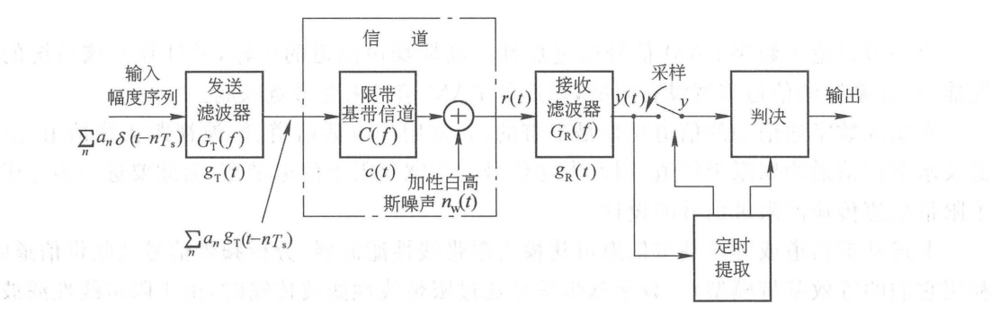
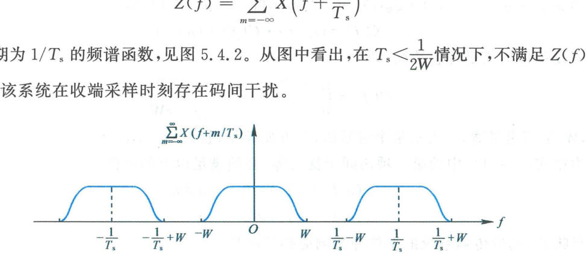
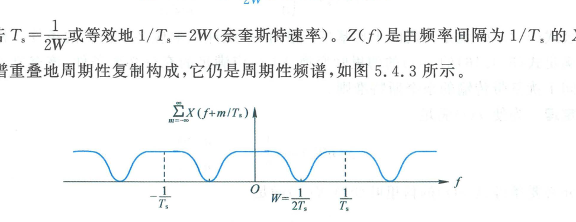
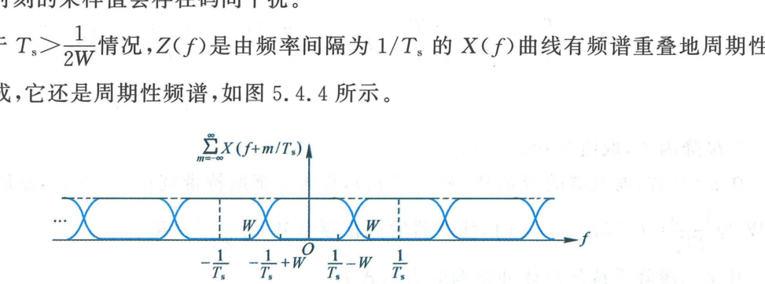
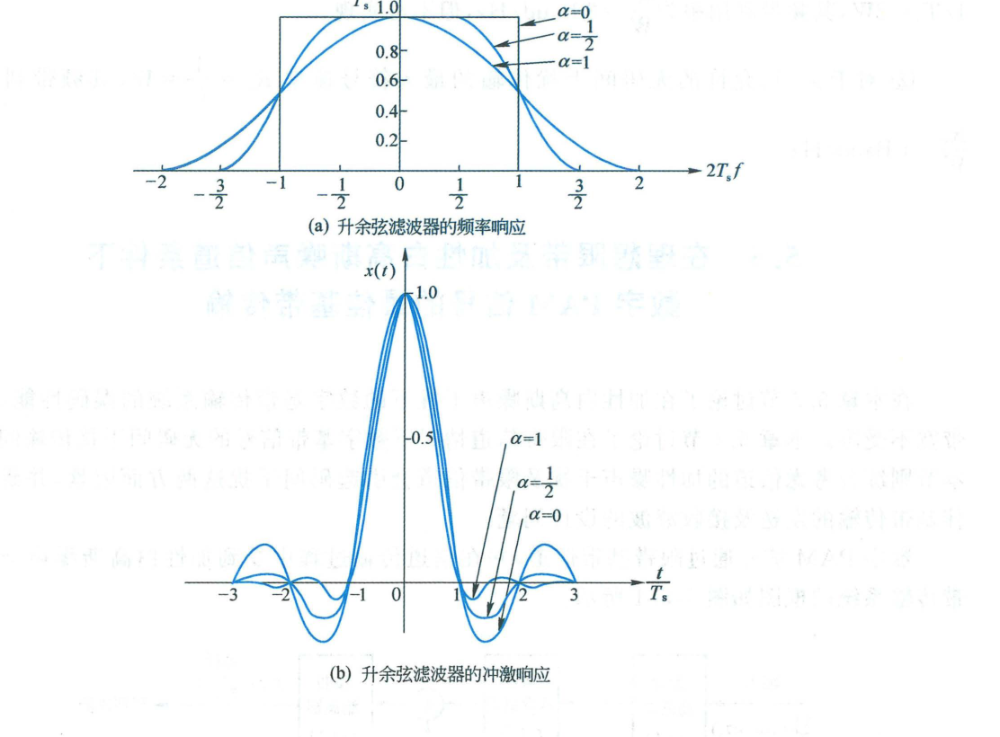

import Knowledge from '@/components/Knowledge.astro';
import Example from '@/components/Example.astro';
import Solution from '@/components/Solution.astro';

实际通信信道（如电话线双绞线、微波接力信道、卫星信道及光纤信道）均为**带宽受限信道（Band-Limited Channels）**。当数字基带信号通过限带系统时，由于有限带宽滤波器的冲激响应在时域具有无限延伸的拖尾振荡，前后期符号的脉冲波形会在时间上彼此重叠交织，在抽样判决时刻产生严重的**码间干扰（Inter-Symbol Interference, ISI）**。

---

## 5.4.1 符号间干扰（ISI）

图 5.4.1 给出了数字 PAM 基带传输系统的通用数学模型。

<figure class="vp-figure">

  

  <figcaption>图 5.4.1 数字 PAM 基带传输系统框图（原书影印参考）</figcaption>
</figure>

系统的整体等效基带冲激响应 $x(t)$ 为发送滤波器、信道及接收滤波器的级联卷积：

$$
x(t) = g_T(t) * c(t) * g_R(t) \tag{5.4.8}
$$

其总频域传递函数为：

$$
X(f) = G_T(f) C(f) G_R(f) \tag{5.4.13}
$$

接收低通滤波器的输出信号为：

$$
y(t) = \sum_{n=-\infty}^\infty a_n x(t - n T_s) + Y(t) \tag{5.4.7}
$$

其中 $Y(t) = n_w(t) * g_R(t)$ 为滤波后的加性高斯噪声。在抽样时刻 $t = m T_s$ 进行采样，瞬时采样值为：

$$
y_m = y(m T_s) = x_0 a_m + \sum_{n \neq m} a_n x_{m-n} + Y_m \tag{5.4.11}
$$

其中 $x_k = x(k T_s)$，$Y_m = Y(m T_s)$。式 (5.4.11) 明确将采样值分解为三项：
1. **$x_0 a_m$**：第 $m$ 个当前符号的有用信号成分；
2. **$\sum_{n \neq m} a_n x_{m-n}$**：除当前符号外，其余所有前后符号脉冲在 $t = m T_s$ 产生的拖尾响应之和，即**码间干扰（ISI）**；
3. **$Y_m$**：抽样时刻的加性高斯噪声。

---

## 5.4.2 无 ISI 传输的奈奎斯特第一准则

为完全消除码间干扰（使第二项恒等于 0），总冲激响应 $x(t)$ 必须在当前符号抽样时刻取得峰值，而在所有其他符号抽样时刻严格过零：

$$
x(n T_s) = \begin{cases}
1, & n = 0 \\
0, & n \neq 0
\end{cases} \tag{5.4.16}
$$

<Knowledge title="奈奎斯特第一准则（时域无 ISI 的频域充要条件）">

基带传输系统总冲激响应满足时域无码间干扰条件式 (5.4.16) 的**充分必要条件**是其总传递函数 $X(f)$ 满足：

$$
\sum_{m=-\infty}^\infty X\left(f + \frac{m}{T_s}\right) = T_s \tag{5.4.17}
$$

**物理意义**：将总传输特性 $X(f)$ 在频率轴上按符号速率 $R_s = 1/T_s$ 间隔进行周期延拓叠加后，必须恒等于常数 $T_s$（平坦无起伏响应）。

</Knowledge>

**数学证明**：
对式 (5.4.17) 两端做傅里叶反变换：

$$
\sum_{m=-\infty}^\infty \mathcal{F}^{-1}\left\{X\left(f + \frac{m}{T_s}\right)\right\} = x(t)\sum_{m=-\infty}^\infty \mathrm{e}^{-\mathrm{j}2\pi m t / T_s}
$$

利用泊松求和公式 $\frac{1}{T_s}\sum_{m=-\infty}^\infty \mathrm{e}^{-\mathrm{j}2\pi m t / T_s} = \sum_{n=-\infty}^\infty \delta(t - n T_s)$，上式等价于：

$$
x(t) \cdot T_s \sum_{n=-\infty}^\infty \delta(t - n T_s) = T_s \sum_{n=-\infty}^\infty x(n T_s)\delta(t - n T_s) = T_s \delta(t)
$$

比较两端冲激加权系数，当且仅当 $x(0) = 1$ 且 $n \neq 0$ 时 $x(n T_s) = 0$ 时等式恒成立。证毕。

---

## 5.4.3 三种传输速率与滤波设计

设系统的物理截止频率为 $W$，根据符号间隔 $T_s$ 与信道带宽 $W$ 的关系，分为三种情况：

### 1. $T_s < \frac{1}{2W}$（符号速率 $R_s > 2W$）

频谱搬移间隔 $1/T_s > 2W$。由于 $X(f)$ 的单边带宽仅为 $W$，相邻搬移谱之间存在空白间隙，周期叠加函数 $Z(f)$ 无法填满为常数 $T_s$，如图 5.4.2 所示。因此**在该速率下物理上不可能实现无码间干扰传输**。

<figure class="vp-figure">

  

  <figcaption>图 5.4.2 T_s < 1/(2W) 情况下的 Z(f) 曲线（原书影印参考）</figcaption>
</figure>

### 2. $T_s = \frac{1}{2W}$（奈奎斯特速率 $R_s = 2W$）

周期延拓刚好严丝合缝紧密拼接，如图 5.4.3 所示。满足准则的唯一解是**理想低通滤波器（Brick-wall Lowpass Filter）**：

$$
X(f) = \begin{cases}
T_s, & |f| \leqslant W \\
0, & |f| > W
\end{cases} \tag{5.4.23}
$$

对应的时域冲激响应为：

$$
x(t) = \operatorname{sinc}(2Wt) = \frac{\sin(2\pi W t)}{2\pi W t} \tag{5.4.24}
$$

<figure class="vp-figure">

  

  <figcaption>图 5.4.3 T_s = 1/(2W) 情况下的 Z(f) 曲线（原书影印参考）</figcaption>
</figure>

- **奈奎斯特速率**：系统无 ISI 传输的最大理论符号速率为 $R_{s,\max} = 2W$；
- **奈奎斯特带宽**：传输速率为 $R_s$ 时所需的最小无 ISI 理论带宽为 $W_{\min} = R_s / 2$；
- **极限频带利用率**：$\eta_{s,\max} = R_s / W = 2\text{ Baud/Hz}$。

**工程致命缺陷**：
1. 理想矩形特性具有无限陡峭的垂直边缘，在物理上绝对不可实现；
2. $\operatorname{sinc}(t)$ 脉冲尾部的振荡拖尾衰减极其缓慢（按 $1/t$ 衰减）。当接收端抽样定时存在微小抖动误差时，各符号尾波叠加可能发散，造成极其严重的码间串扰。

### 3. $T_s > \frac{1}{2W}$（符号速率 $R_s < 2W$ 与升余弦滚降）

周期延拓产生重叠区域，如图 5.4.4 所示。只要重叠过渡带满足奇对称互补条件，即可实现无 ISI。工程中最著名、应用最广的实现是**升余弦滚降滤波器（Raised Cosine Filter）**。

<figure class="vp-figure">

  

  <figcaption>图 5.4.4 T_s > 1/(2W) 时的 Z(f) 曲线（原书影印参考）</figcaption>
</figure>

<Knowledge title="升余弦滚降滤波器传输特性与时域脉冲">

升余弦滤波器的频域传递函数为：

$$
X(f) = \begin{cases}
T_s, & 0 \leqslant |f| \leqslant \frac{1 - \alpha}{2T_s} \\
\frac{T_s}{2}\left\{1 + \cos\left[\frac{\pi T_s}{\alpha}\left(|f| - \frac{1 - \alpha}{2T_s}\right)\right]\right\}, & \frac{1 - \alpha}{2T_s} < |f| \leqslant \frac{1 + \alpha}{2T_s} \\
0, & |f| > \frac{1 + \alpha}{2T_s}
\end{cases} \tag{5.4.25}
$$

其中 $\alpha \in [0, 1]$ 称为**滚降因子（Roll-off Factor）**。系统总绝对截止带宽为：

$$
W = \frac{1 + \alpha}{2T_s} = \frac{1 + \alpha}{2}R_s
$$

对应的时域总冲激响应为：

$$
x(t) = \operatorname{sinc}\left(\frac{t}{T_s}\right) \frac{\cos\left(\frac{\pi\alpha t}{T_s}\right)}{1 - \frac{4\alpha^2 t^2}{T_s^2}} \tag{5.4.26}
$$

</Knowledge>

<figure class="vp-figure">

  

  <figcaption>图 5.4.5 升余弦滤波器的特性（alpha 为滚降因子）（原书影印参考）</figcaption>
</figure>

从图 5.4.5 可以看出升余弦滚降滤波器的巨大工程优势：
- 时域拖尾按 **$1/t^3$ 快速衰减**（比 $\operatorname{sinc}$ 快两个数量级），极大地减轻了抽样定时抖动引起的码间串扰敏感性；
- 当 $\alpha = 0$ 时，退化为理想低通滤波器（带宽 $W = R_s/2$，利用率 $2\text{ Baud/Hz}$）；
- 当 $\alpha = 1$ 时（全升余弦滚降），绝对带宽为 $W = R_s$，频带利用率为 $1\text{ Baud/Hz}$。
