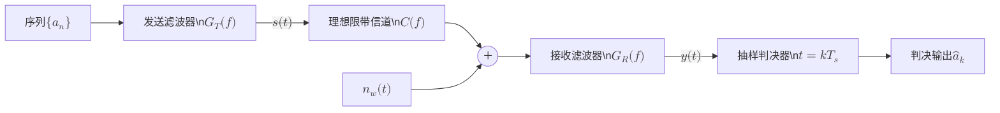
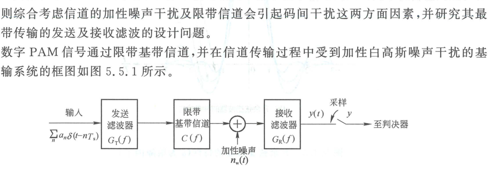

import Knowledge from '@/components/Knowledge.astro';

在实际数字通信系统的基带设计中，工程上面临着一对根本矛盾：
1. **抗码间干扰要求**：信道是带宽受限的，系统总传递函数 $X(f)$ 必须严格满足奈奎斯特第一准则，以消除时域采样时刻的码间干扰（ISI）；
2. **抗白噪声干扰要求**：信道存在加性高斯白噪声，接收滤波器必须与输入信号匹配（匹配滤波准则），以最大化采样时刻的信噪比、最小化误符号率。

本节研究在**理想限带信道**与 **AWGN 信道**共同约束下，发送滤波器与接收滤波器的联合最佳分配设计。

---

## 5.5.1 系统联合优化准则

数字 PAM 基带传输系统模型如图 5.5.1 所示。

<figure class="vp-figure">

  

  <figcaption>图 5.5.1 数字 PAM 基带传输系统框图（原书影印参考）</figcaption>
</figure>

理想限带信道的传递函数为：

$$
C(f) = \begin{cases}
1, & |f| \leqslant W \\
0, & |f| > W
\end{cases} \tag{5.5.1}
$$

为使系统达到全局最优，发送滤波器 $G_T(f)$ 与接收滤波器 $G_R(f)$ 的联合设计必须同时满足两项铁律：
1. **无 ISI 条件**：总系统传输特性 $X(f) = G_T(f) C(f) G_R(f)$ 必须满足奈奎斯特第一准则，通常选择升余弦滚降函数 $X_{\text{rcos}}(f)$；
2. **匹配滤波条件**：接收滤波器 $G_R(f)$ 必须与进入接收端的脉冲形状相匹配。

在理想信道通带内 $C(f) = 1$，接收滤波器冲激响应应与发送成形脉冲相匹配（取时延 $t_0 = 0$、系数 $K = 1$）：

$$
g_R(t) = g_T(-t) \iff G_R(f) = G_T^*(f) \tag{5.5.5}
$$

此时总系统传递函数为：

$$
X(f) = G_T(f) G_R(f) = |G_T(f)|^2 = |G_R(f)|^2 \tag{5.5.6}
$$

---

## 5.5.2 根升余弦滤波分配设计

将式 (5.5.6) 代入升余弦滚降特性 $X(f) = X_{\text{rcos}}(f)$，立即导出具有里程碑意义的**根升余弦滤波器（Square Root Raised Cosine, SRRC / RRC）**设计准则：

<Knowledge title="收发匹配根升余弦（RRC）最佳基带传输架构">

为了同时消除码间干扰并使接收端信噪比最大，**发送滤波器与接收滤波器必须各自分担总升余弦特性的一半**：

$$
G_T(f) = G_R(f) = \sqrt{X_{\text{rcos}}(f)} \tag{5.5.7}
$$

采用该联合最佳设计后：
1. **发射端频谱约束**：发送信号 $s(t)$ 的功率谱密度为平滑的升余弦谱：

$$
P_s(f) = \frac{\sigma_a^2}{T_s}|G_T(f)|^2 = \frac{\sigma_a^2}{T_s}X_{\text{rcos}}(f) \tag{5.5.8}
$$

严格受限于信道带宽 $W = \frac{1 + \alpha}{2}R_s$，无带外杂散泄漏；
2. **接收端信噪比最大**：接收滤波器正好与发送脉冲完全匹配，抽样点瞬时信噪比达到理论极限；
3. **整体系统无码间干扰**：$G_T(f) \cdot G_R(f) = X_{\text{rcos}}(f)$，在抽样判决时刻各符号脉冲严格正交无串扰；
4. **达到理论误码率下界**：对于双极性序列，系统的平均误比特率直接达到无带宽限制下的理论极值：

$$
P_b = \frac{1}{2}\operatorname{erfc}\left(\sqrt{\frac{E_b}{N_0}}\right) = Q\left(\sqrt{\frac{2E_b}{N_0}}\right) \tag{5.5.9}
$$

</Knowledge>

收发根升余弦成形滤波已成为现代数字通信（4G/5G、Wi-Fi、卫星通信与高速有线网络）公认的物理层标准基带成形规范。
