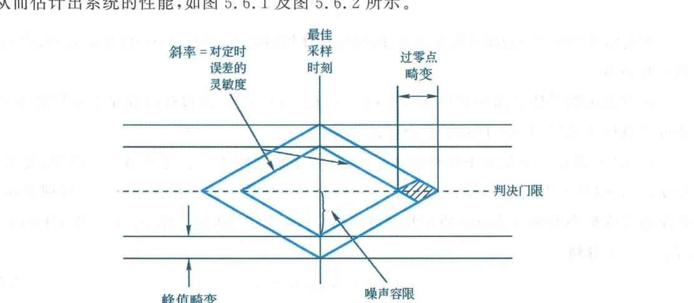

import Knowledge from '@/components/Knowledge.astro';

前面章节从理论上分析了基带传输系统的无码间干扰条件与误码性能。在实际基带通信设备的研发、调试与运维中，工程师常用示波器直观观察接收滤波器的输出波形，来实验评估码间干扰和信道噪声对传输质量的综合影响，这种直观有效的波形分析方法称为**眼图（Eye Pattern / Eye Diagram）**。

---

## 5.6.1 眼图的形成原理

眼图是通过示波器的余辉效应，将连续的接收脉冲波形按照符号周期进行周期性重叠显示而形成的视觉图形：
1. 将接收滤波器输出的连续模拟基带信号送入示波器的垂直偏转放大器（Y 轴）；
2. 将示波器的水平扫描周期调整为接收符号周期的整数倍（通常为 $1 \sim 2$ 个符号周期 $T_s$），并使扫描触发与接收端的位同步时钟严格保持同步；
3. 由于示波器屏幕荧光粉的余辉以及人眼的视觉残留，各种可能出现的二进制或多进制脉冲响应曲线重叠在一起，构成宛如人类眼睛的网状图案。

对于二进制传输系统，在一个符号周期内只能观察到**一只“眼睛”**；对于三电平系统（如 AMI 码、部分响应码），在一个周期内可观察到**两只“眼睛”**；对于一般 $M$ 进制 PAM 系统，在一个符号周期内垂直排列着 **$M - 1$ 只“眼睛”**。

```mermaid
flowchart LR
    rx["接收滤波输出 $$y(t)$$"] --> scopeY["示波器垂直输入 (Y 轴)"]
    clk["位同步时钟信号\n周期 $$T_s$$ 或 $$2T_s$$"] --> scopeX["示波器水平扫描触发 (X 轴)"]
    scopeY & scopeX --> display["示波器荧光屏余辉重叠显示\n形成眼图 (Eye Diagram)"]
```

<figure class="vp-figure">

  

  <figcaption>图 5.6.1 眼图的特征参数与性能映射（原书影印参考）</figcaption>
</figure>

---

## 5.6.2 从眼图读取系统核心性能参数

眼图的张开程度与几何外形浓缩了数字通信系统极为丰富的传输健康度信息，如图 5.6.1 所示：

<Knowledge title="眼图核心几何参量与物理性能映射">

1. **最佳抽样判决时刻**：
   对应于“眼睛”**垂直张开度最大**的瞬时时刻。此时有用信号电平最强，受码间串扰和噪声的影响最小，为最佳抽样点。
2. **噪声容限（Noise Margin）**：
   在最佳抽样时刻，“眼睛”上下眼皮之间的净张开高度对应于系统的噪声容限。若加性噪声幅度未超出此间隙，就不会发生判决误码。眼睛张开度越大，抗噪声能力越强。
3. **判决门限电平**：
   位于眼图中央的对称水平横轴位置。
4. **对定时误差的灵敏度**：
   由眼图两侧斜边的倾斜斜率决定。**斜边越陡峭，斜率越大，系统对定时抖动越敏感**；微小的抽样时刻偏移就会导致眼高迅速收缩，增加误码风险。
5. **过零点畸变（定时抖动）**：
   波形轨迹穿过零电平时间的弥散发散范围，反映了系统时钟提取电路中存在的时间抖动（Jitter）大小。
6. **码间干扰（ISI）程度**：
   图线交叉处的眼皮厚度反映了不同前后码元组合引起的残余码间干扰。**当信道失真与码间干扰极严重时，“眼睛”将完全闭合**，此时即便没有噪声也会产生判决错误，系统无法正常工作。

</Knowledge>
