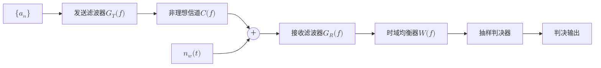
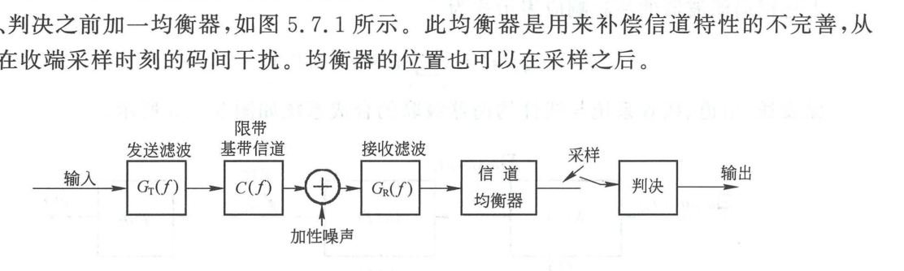
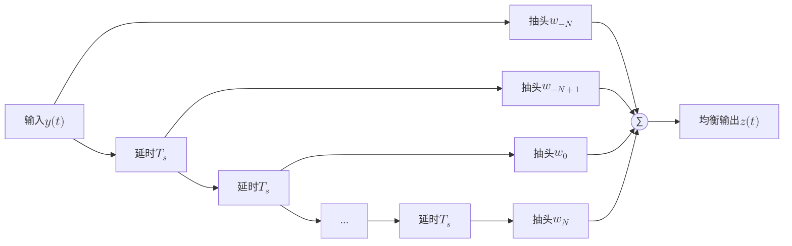
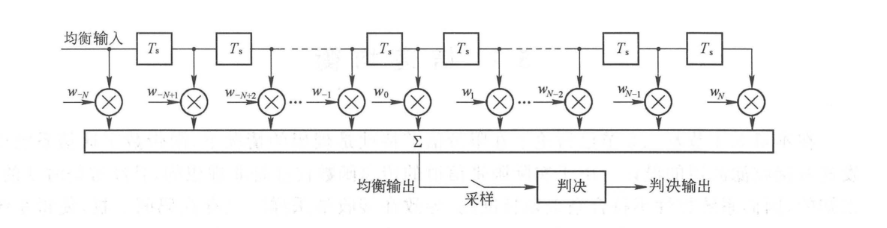
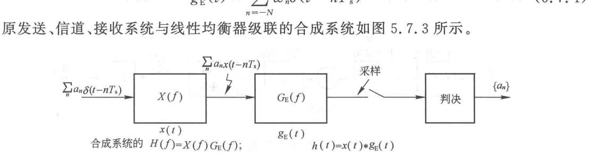
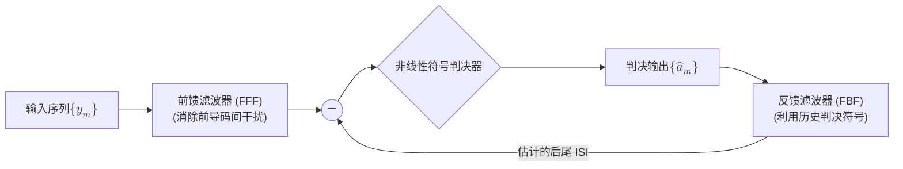
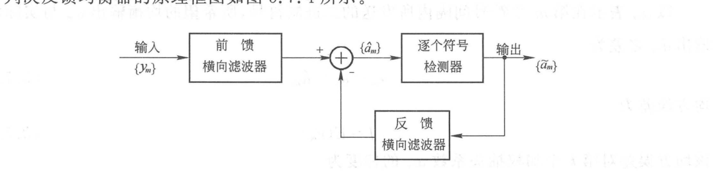

import Knowledge from '@/components/Knowledge.astro';
import Example from '@/components/Example.astro';
import Solution from '@/components/Solution.astro';

前面章节假设通信信道具有理想平坦的幅频特性和线性相位特性。而在实际通信环境中，物理信道的频率响应往往是非理想的、随时间动态变化的，且在通信前通常未知。这导致系统总传递函数偏离奈奎斯特准则，在接收端抽样时刻产生严重的残余码间干扰（ISI）。

为了补偿实际信道畸变、抑制码间干扰，通常在接收滤波器之后引入**信道均衡器（Channel Equalizer）**。

---

## 5.7.1 时域横向滤波器结构

图 5.7.1 给出了包含均衡器的数字基带传输系统框图。

<figure class="vp-figure">

  

  <figcaption>图 5.7.1 具有均衡器的数字基带传输系统（原书影印参考）</figcaption>
</figure>

线性均衡器最典型的物理实现是**横向滤波器（Transversal Filter / FIR 抽头延迟线）**，如图 5.7.2 所示。

<figure class="vp-figure">

  

  <figcaption>图 5.7.2 用横向滤波器作线性均衡器（原书影印参考）</figcaption>
</figure>

横向滤波器由 $2N$ 个延迟为符号间隔 $T_s$ 的延迟单元、$(2N + 1)$ 个抽头可调加权系数 $\{w_k\}_{k=-N}^N$ 以及一个加法求和器构成。其离散抽样冲激响应为：

$$
w(t) = \sum_{k=-N}^N w_k \delta(t - k T_s) \tag{5.7.5}
$$

原信道等效脉冲 $x(t)$ 与均衡器级联后的总冲激响应如图 5.7.3 所示，其在抽样时刻的离散响应为离散卷积：

$$
h_k = h(k T_s) = \sum_{n=-N}^N w_n x_{k-n} \tag{5.7.7}
$$

<figure class="vp-figure">

  

  <figcaption>图 5.7.3 原基带传输系统与线性均衡器相级联（原书影印参考）</figcaption>
</figure>

---

## 5.7.2 核心均衡设计算法

### 1. 迫零算法（Zero-Forcing, ZF）

迫零算法的目标是：**在抽样时刻严格强迫消除 $(2N + 1)$ 个离散抽样点上的码间干扰**。

$$
h_k = \begin{cases}
1, & k = 0 \\
0, & k = \pm 1, \pm 2, \dots, \pm N
\end{cases} \tag{5.7.8}
$$

代入式 (5.7.7) 可建立包含 $(2N + 1)$ 个未知数 $\{w_k\}$ 的线性方程组：

$$
\sum_{n=-N}^N w_n x_{k-n} = \delta_k, \quad k = 0, \pm 1, \dots, \pm N \tag{5.7.9}
$$

写成矩阵形式：

$$
\mathbf{X} \mathbf{w} = \mathbf{h} \implies \mathbf{w} = \mathbf{X}^{-1} \mathbf{h}
$$

- **迫零算法的致命缺陷**：
  ZF 均衡器的本质是构造信道传递函数的频域倒数（$W(f) \approx 1/C(f)$）。在设计时**完全忽略了加性白噪声**。当物理信道在某些频点存在严重衰落或传输零点（$|C(f)| \to 0$）时，ZF 均衡器在该频点具有巨大的幅度放大增益，**导致信道加性噪声被急剧放大（Noise Enhancement）**，严重恶化接收信噪比。

### 2. 最小均方误差算法（MMSE）

为了克服迫零算法放大噪声的缺陷，最小均方误差（MMSE）算法综合考虑了残余码间干扰与加性噪声功率，以**均衡输出误差的均方值最小**为优化准则：

$$
J = \mathbb{E}[e_m^2] = \mathbb{E}\left[\left(a_m - \sum_{k=-N}^N w_k y_{m-k}\right)^2\right] \tag{5.7.20}
$$

<Knowledge title="MMSE 均衡正交原理与维纳-霍夫方程">

令均方误差对各抽头加权系数的偏导数为零：$\frac{\partial J}{\partial w_k} = 0$，导出**正交原理（Orthogonality Principle）**：

$$
\mathbb{E}[e_m y_{m-k}] = 0, \quad k = 0, \pm 1, \dots, \pm N \tag{5.7.25}
$$

**物理意义**：当均方误差达到极小值时，抽样判决误差 $e_m$ 与输入数据序列 $y_{m-k}$ 统计正交（互不相关）。

由此导出求解最佳抽头系数的**维纳-霍夫方程（Wiener-Hopf Equations）**：

$$
\sum_{n=-N}^N w_n R_y(k - n) = R_{ay}(k), \quad k = 0, \pm 1, \dots, \pm N \tag{5.7.27}
$$

其中 $R_y$ 为输入序列的自相关矩阵，$R_{ay}$ 为期望信号与输入序列的互相关矢量。MMSE 在残余码间干扰与噪声放大之间取得了理论最优折中。

</Knowledge>

---

## 5.7.3 判决反馈均衡器（DFE）

线性均衡器受限于线性滤波结构，对具有深度频谱零点的严重失真信道无法同时兼顾消除 ISI 与抑制噪声。**判决反馈均衡器（Decision Feedback Equalizer, DFE）**是一种非线性均衡结构，如图 5.7.4 所示。

<figure class="vp-figure">

  

  <figcaption>图 5.7.4 判决反馈均衡器的结构（原书影印参考）</figcaption>
</figure>

DFE 由两部分构成：
1. **前馈滤波器（FFF）**：线性横向滤波器，消除尚未判决的未来符号引起的先导码间干扰；
2. **反馈滤波器（FBF）**：输入为已完成正确判决的历史无噪符号序列 $\hat{a}_{m-1}, \hat{a}_{m-2}, \dots$。由于历史符号已无噪声，FBF 精确重构出历史符号对当前符号产生的后尾 ISI，并在减法器中直接扣除。

**核心优势**：反馈回路在完全消除后尾码间干扰的同时，**不会引入任何噪声放大**，特别适合多径衰落信道。

---

## 5.7.4 自适应均衡器（LMS 算法）

在移动通信和宽带无线信道中，信道传输特性随时变化。均衡器必须能够自动跟踪信道特性的漂移，实时动态调整抽头系数，称为**自适应均衡器（Adaptive Equalizer）**。

由于均方误差 $J$ 是抽头权矢量的凸二次函数（多维碗状抛物面，存在全局唯一下凹极小点），广泛采用**最陡下降法（Steepest Descent）**沿负梯度方向自适应迭代更新权值。

工程上最著名的实现是 Widrow-Hoff **最小均方误差算法（Least Mean Squares, LMS）**：

$$
w_k(j + 1) = w_k(j) + \mu \, e_m \, y_{m-k}, \quad k = 0, \pm 1, \dots, \pm N \tag{5.7.33}
$$

其中：
- $\mu > 0$ 为**迭代步长因子（Step-size Parameter）**，决定算法的收敛速度与稳态误差；
- $e_m = a_m - \hat{a}_m$ 为瞬时抽样误差；
- $y_{m-k}$ 为对应抽头处的瞬时输入样值。

自适应均衡器的工作过程分为两个阶段：
1. **训练模式（Training Mode）**：发射端周期性发送接收端已知的**训练序列（Training Sequence / 导频序列）**，均衡器快速迭代收敛至最佳权值附近；
2. **跟踪模式 / 判决导向模式（Decision-Directed Mode）**：发射端传输真实信息数据，均衡器以自身可靠的判决输出 $\hat{a}_m$ 代替已知符号，微调跟踪信道缓慢漂移。
