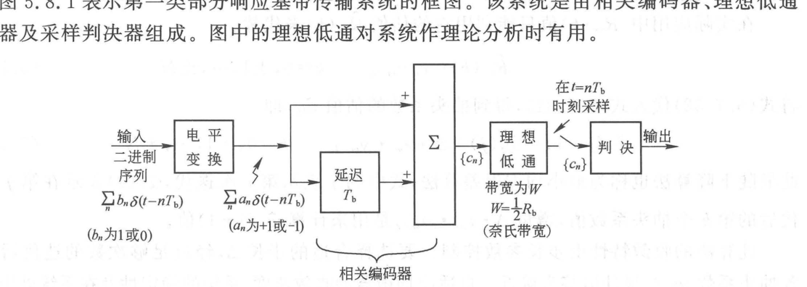
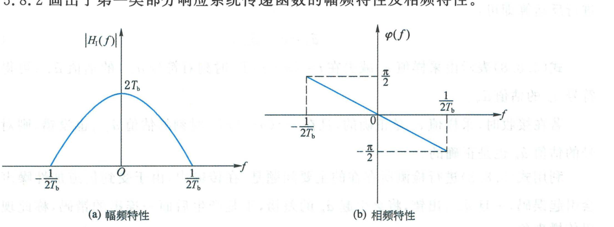
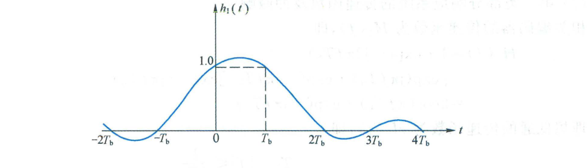
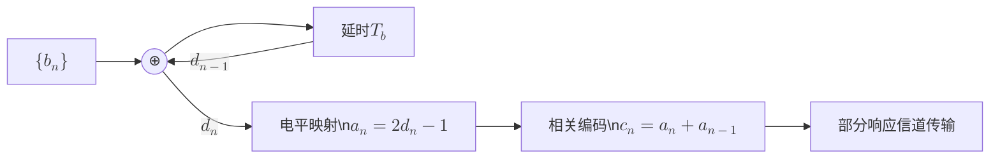
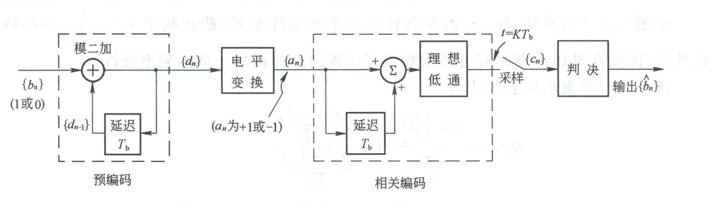

import Knowledge from '@/components/Knowledge.astro';
import Example from '@/components/Example.astro';
import Solution from '@/components/Solution.astro';

前面指出，为了消除码间干扰并达到极限频带利用率 $2\text{ Baud/Hz}$，奈奎斯特第一准则要求系统传递函数为理想矩形低通滤波。但理想矩形滤波器在物理上无法实现，且时域脉冲拖尾按 $1/t$ 衰减，对定时抖动极度敏感；而升余弦滚降滤波器虽然物理可实现且拖尾衰减快，但必须以牺牲频带利用率为代价（$\eta_s = \frac{2}{1 + \alpha} < 2\text{ Baud/Hz}$）。

为了化解这一对尖锐矛盾，提出了**部分响应系统（Partial Response System）**：
- **核心思想**：不再追求抽样点码间干扰处处为零，而是**有意识地在某些确定抽样点人为引入幅度已知的受控码间干扰（Controlled ISI）**；
- **核心收益**：在频域将垂直陡峭的截止边缘改造为平滑滚降的余弦过渡带（物理极易实现），同时在奈奎斯特带宽 $W = 1/(2T_b)$ 内完整实现最高理论频带利用率 **$2\text{ Baud/Hz}$**。

---

## 5.8.1 第一类部分响应系统的构成

图 5.8.1 给出了第一类部分响应系统（双二进制系统, Duobinary System）的系统框图。系统由**相关编码器**、**理想低通滤波器**及**抽样判决器**级联而成。

```mermaid
flowchart LR
    src["二进制序列 $$\{b_n\}$$"] --> map["电平映射\n$$a_n \\in \\{\\pm 1\\}$$"]
    map --> cor["相关编码器\n$$c_n = a_n + a_{n-1}$$"]
    cor --> lpf["理想低通 $$H_2(f)$$\n截止带宽 $$W = 1/(2T_b)$$"]
    lpf --> chan["信道传输"]
    chan --> rx["接收滤波与抽样\n$$t = n T_b$$"]
    rx --> dec["三电平判决器"] --> out["恢复数据"]
```

<figure class="vp-figure">

  

  <figcaption>图 5.8.1 第一类部分响应基带传输系统框图（原书影印参考）</figcaption>
</figure>

设输入二进制比特流为 $\{b_n\}$，经电平变换后得到极性序列 $a_n \in \{-1, +1\}$。相关编码器将当前输入符号与延迟一个周期的前导符号进行**代数相加**：

$$
c_n = a_n + a_{n-1} \tag{5.8.2}
$$

将二电平独立序列转换为具有时域相关性的三电平序列 $c_n \in \{-2, 0, +2\}$。

<Example id="5.8.1" title="第一类部分响应相关编码序列计算">
已知输入二进制序列为 $\{b_n\} = (1, 1, 1, 0, 0, 1, 0, 1, 1, 1, 0, 0, 1, 0)$，试求双极性序列 $\{a_n\}$ 及相关编码输出序列 $\{c_n\}$（设初态 $a_0 = -1$）。
</Example>

<Solution title="解">
根据映射规则（$1 \to +1, 0 \to -1$）与代数相加 $c_n = a_n + a_{n-1}$：

| 序号 $n$ | 0 | 1 | 2 | 3 | 4 | 5 | 6 | 7 | 8 | 9 | 10 | 11 | 12 | 13 | 14 |
| :--- | :---: | :---: | :---: | :---: | :---: | :---: | :---: | :---: | :---: | :---: | :---: | :---: | :---: | :---: | :---: |
| 输入 $\{b_n\}$ | - | 1 | 1 | 1 | 0 | 0 | 1 | 0 | 1 | 1 | 1 | 0 | 0 | 1 | 0 |
| 极性 $\{a_n\}$ | -1 | +1 | +1 | +1 | -1 | -1 | +1 | -1 | +1 | +1 | +1 | -1 | -1 | +1 | -1 |
| 编码 $\{c_n\}$ | - | 0 | +2 | +2 | 0 | -2 | 0 | 0 | 0 | +2 | +2 | 0 | -2 | 0 | 0 |

相关编码输出取值为 $\{-2, 0, +2\}$ 三种离散电平，在相邻码元之间成功建立了确定性的代数相关。
</Solution>

---

## 5.8.2 传递函数与冲激响应

相关编码器的频域传输特性为：

$$
H_1(f) = 1 + \mathrm{e}^{-\mathrm{j}2\pi f T_b} = 2\cos(\pi f T_b)\mathrm{e}^{-\mathrm{j}\pi f T_b} \tag{5.8.3}
$$

截止带宽为 $W = \frac{1}{2T_b}$ 的理想低通滤波器特性为 $H_2(f) = T_b \, \operatorname{rect}(f / 2W)$。两者级联后的系统总传递函数为：

<Knowledge title="第一类部分响应系统的频域与时域解析特性">

系统总传递函数为：

$$
H_I(f) = H_1(f) H_2(f) = \begin{cases}
2T_b\cos(\pi f T_b)\mathrm{e}^{-\mathrm{j}\pi f T_b}, & |f| \leqslant \frac{1}{2T_b} \\
0, & |f| > \frac{1}{2T_b}
\end{cases} \tag{5.8.5}
$$

对应的时域总冲激响应（双二进制脉冲）为两个相距 $T_b$ 的 $\operatorname{sinc}$ 脉冲叠加：

$$
h_I(t) = \operatorname{sinc}\left(\frac{t}{T_b}\right) + \operatorname{sinc}\left(\frac{t - T_b}{T_b}\right) = \frac{T_b^2 \sin(\pi t / T_b)}{\pi t(T_b - t)} \tag{5.8.6}
$$

其在离散抽样时刻 $t = n T_b$ 的响应为：

$$
h_I(n T_b) = \begin{cases}
1, & n = 0, 1 \\
0, & n = \text{其他整数}
\end{cases} \tag{5.8.7}
$$

</Knowledge>

<figure class="vp-figure">

  

  <figcaption>图 5.8.2 第一类部分响应系统传递函数（原书影印参考）</figcaption>
</figure>

<figure class="vp-figure">

  

  <figcaption>图 5.8.3 第一类部分响应系统的冲激响应（原书影印参考）</figcaption>
</figure>

如图 5.8.2 所示，$H_I(f)$ 的幅频特性在截止频率 $W = \frac{1}{2T_b}$ 处**以半个余弦波形平滑落至零**，相频特性严格线性。物理上可用结构极其简单的低阶模拟滤波器高精度逼近，彻底消除了阶跃突变；同时系统带宽仍为严格的奈奎斯特带宽 $W = R_b/2$，频带利用率达到理论天花板 $2\text{ Baud/Hz}$。

---

## 5.8.3 误码传播与预编码机制

若直接根据 $c_n = a_n + a_{n-1}$ 在接收端进行逐符号递推判决：

$$
\hat{a}_n = c_n - \hat{a}_{n-1} \tag{5.8.8}
$$

其致命隐患是：**若前一符号 $\hat{a}_{n-1}$ 受到噪声干扰发生判决错误，由于递推依赖关系，将导致后续一系列符号连续错判**，产生严重的**误码传播（Error Propagation）**现象。

为彻底根除误码传播，在发送端相关编码之前引入**模二加预编码（Precoding）**，系统结构如图 5.8.4 所示。



<figure class="vp-figure">

  

  <figcaption>图 5.8.4 加有预编码的第一类部分响应系统（原书影印参考）</figcaption>
</figure>

<Knowledge title="加有预编码的第一类部分响应无差错传播判决法则">

1. **预编码规则**：
   输入数据 $\{b_n\}$ 与前一预编码符号进行模二加运算：

   $$
   d_n = b_n \oplus d_{n-1} \tag{5.8.9}
   $$

2. **电平变换与相关编码**：
   $a_n = 2d_n - 1 \in \{-1, +1\}$。抽样值相关编码结果为：

   $$
   c_n = a_n + a_{n-1} = (2d_n - 1) + (2d_{n-1} - 1) = 2(d_n + d_{n-1} - 1) \tag{5.8.11}
   $$

3. **接收端独立非递推判决规则**：
   对上式两端作模二运算，由于 $b_n = d_n \oplus d_{n-1}$，直接得到：

   $$
   b_n = \left[\frac{c_n}{2} + 1\right] \pmod 2 \tag{5.8.13}
   $$

   即接收端只需根据当前抽样值 $c_n$ 独立判决，**与历史符号无任何关联**：
   - 当 $c_n = \pm 2$ 时，判决 $\hat{b}_n = 0$；
   - 当 $c_n = 0$ 时，判决 $\hat{b}_n = 1$。

4. **加性噪声干扰下的双门限判决准则**：
   在接收抽样值 $y_n = c_n + n_n$ 条件下，设置双判决门限 $\pm 1$：

   $$
   \hat{b}_n = \begin{cases}
   1, & |y_n| < 1 \\
   0, & |y_n| \geqslant 1
   \end{cases} \tag{5.8.16}
   $$

</Knowledge>

<Example id="5.8.2" title="加有预编码的第一类部分响应系统编解码全过程">
设输入序列为 $\{b_n\} = (1, 1, 1, 0, 0, 1, 0, 1, 1, 1, 0, 0)$，初态取 $d_0 = 0$。试计算预编码序列 $\{d_n\}$、电平序列 $\{a_n\}$、采样序列 $\{c_n\}$ 以及接收端判决恢复序列 $\{\hat{b}_n\}$。
</Example>

<Solution title="解">
根据预编码 $d_n = b_n \oplus d_{n-1}$、映射 $a_n = 2d_n - 1$、编码 $c_n = a_n + a_{n-1}$ 及判决法则：

| 序号 $n$ | 0 | 1 | 2 | 3 | 4 | 5 | 6 | 7 | 8 | 9 | 10 | 11 | 12 |
| :--- | :---: | :---: | :---: | :---: | :---: | :---: | :---: | :---: | :---: | :---: | :---: | :---: | :---: |
| 输入 $\{b_n\}$ | - | 1 | 1 | 1 | 0 | 0 | 1 | 0 | 1 | 1 | 1 | 0 | 0 |
| 预编码 $\{d_n\}$ | 0 | 1 | 0 | 1 | 1 | 1 | 0 | 0 | 1 | 0 | 1 | 1 | 1 |
| 极性 $\{a_n\}$ | -1 | +1 | -1 | +1 | +1 | +1 | -1 | -1 | +1 | -1 | +1 | +1 | +1 |
| 抽样值 $\{c_n\}$ | - | 0 | 0 | 0 | +2 | +2 | 0 | -2 | 0 | 0 | 0 | +2 | +2 |
| 判决输出 $\{\hat{b}_n\}$ | - | 1 | 1 | 1 | 0 | 0 | 1 | 0 | 1 | 1 | 1 | 0 | 0 |

恢复数据 $\{\hat{b}_n\}$ 与原始输入 $\{b_n\}$ 严格一致。接收端每个符号完全独立判决，即便单个抽样值由于噪声瞬时抖动发生错判，也不会扩散传递给后续符号，彻底消除了误码传播。
</Solution>
