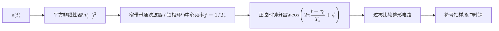
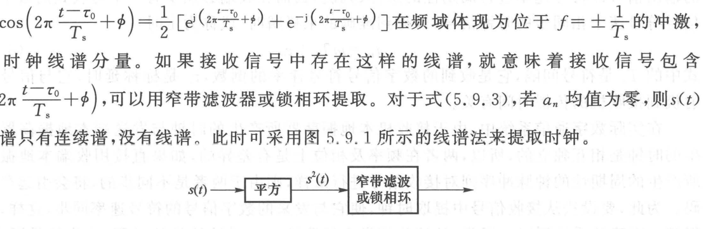
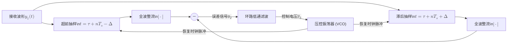
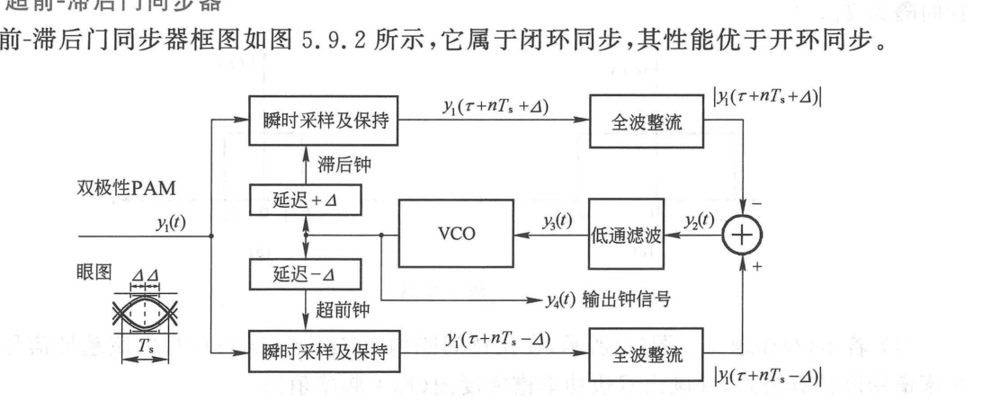

import Knowledge from '@/components/Knowledge.astro';
import ExerciseTrigger from '@/components/exercises/ExerciseTrigger.astro';

在数字通信系统中，接收端为了从接收基带波形中准确判决出原始数据，必须对接收滤波器的输出信号以符号速率 $R_s$ 进行周期性的抽样判决。因此，接收端必须提供一个与接收符号序列同频、同相的位同步脉冲信号，以锁定最佳抽样时刻：

$$
t_m = m T_s + \tau_0 \tag{5.9.1}
$$

其中 $T_s$ 为符号间隔，$\tau_0$ 为信号在信道传输中产生的随机传播时延。

由于接收机本地晶振与发射端晶振是彼此独立的物理振荡器，必然存在固有频差与相位漂移。直接使用本地未同步的时钟采样将导致抽样点逐渐滑出眼图中心，引起严重的误码。从接收信号中提取出精准符号时钟的过程称为**符号同步（Symbol Synchronization）**、**定时恢复（Timing Recovery）**或**位同步（Bit Synchronization）**。

---

## 5.9.1 同步方法分类

符号同步技术主要分为两类：
1. **外同步法（插入导频法）**：
   发送端在信息数据之外，专门在频带零点或频带边缘插入一个微弱的离散正弦时钟导频。接收端用窄带滤波器直接滤出导频并整形为抽样脉冲。该方法电路简单，但需要额外占用发射功率与信道带宽。
2. **自同步法（直接提取法）**：
   发送端不发送任何额外导频，接收端直接从携带信息的已调信号波形中利用非线性运算或闭环反馈提取定时时钟。

设接收滤波器的输出信号为：

$$
y(t) = \sum_{n=-\infty}^\infty a_n x(t - n T_s - \tau_0) + Y(t) \tag{5.9.2}
$$

其中 $\{a_n\}$ 为零均值独立同分布随机序列，$Y(t)$ 为加性滤波噪声。接收机的核心任务是实时估计出定时相位 $\tau_0$。

---

## 5.9.2 线谱法（平方非线性提取法）

对于零均值双极性随机 PAM 信号，其频谱中只有连续谱，在符号速率 $f = 1/T_s$ 处没有任何离散线谱。线谱法利用非线性变换（如平方器或全波整流器）从连续随机波形中激发出时钟线谱，其原理如图 5.9.1 所示。

<figure class="vp-figure">

  

  <figcaption>图 5.9.1 线谱法提取时钟（原书影印参考）</figcaption>
</figure>

设 $s(t) = \sum_n a_n x(t - n T_s - \tau_0)$，信号平方后的统计期望为：

$$
u(t) = \mathbb{E}[s^2(t)] = \sigma_a^2 \sum_{n=-\infty}^\infty g(t - n T_s - \tau_0) \tag{5.9.4}
$$

其中 $g(t) = x^2(t)$。上式表明 $u(t)$ 是一个以 $T_s$ 为周期的确定性周期函数，可展开为傅里叶级数：

$$
u(t) = \frac{\sigma_a^2}{T_s}\sum_{m=-\infty}^\infty G\left(\frac{m}{T_s}\right)\mathrm{e}^{\mathrm{j}2\pi m (t - \tau_0)/T_s} \tag{5.9.5}
$$

其中 $G(f) = X(f) * X(f)$ 为脉冲的自卷积谱。

<Knowledge title="线谱法提取时钟的充要条件">

当基频分量 $G(1/T_s) \neq 0$ 时，展开式中必然包含基波正弦分量：

$$
A_1 \cos\left(2\pi \frac{t - \tau_0}{T_s} + \phi\right)
$$

其频率严格等于符号速率 $R_s = 1/T_s$，相位严格锁定接收时延 $\tau_0$。

**频带约束**：由于 $g(t) = x^2(t)$ 的频谱宽度是原信号脉冲 $x(t)$ 带宽的 2 倍。若 $x(t)$ 的截止带宽 $W < \frac{1}{2T_s}$，则自卷积谱 $G(f)$ 在 $f = \pm 1/T_s$ 处恒为 0。因此，**应用线谱法成功提取时钟的前提是信号带宽必须大于奈奎斯特带宽（即系统必须具有滚降特性 $\alpha > 0$）**。

</Knowledge>

---

## 5.9.3 超前-滞后门同步器（早迟门同步器）

超前-滞后门同步器（Early-Late Gate Synchronizer）是一种基于闭环负反馈的自同步提取电路，抗噪能力和时钟跟踪精度显著优于开环滤波，其原理框图如图 5.9.2 所示。

<figure class="vp-figure">

  

  <figcaption>图 5.9.2 双极性不归零码的超前－滞后比特同步（原书影印参考）</figcaption>
</figure>

该同步器利用了基带对称脉冲在眼图最佳抽样时刻两侧的**镜像对称性**：
1. 设最佳抽样定时为 $\tau_0$。在距当前估计定时相位 $\tau$ 两侧各偏离一个小时间差 $\Delta$ 处设置两个抽样门：
   - **超前抽样（Early Gate）**：$y_1(\tau + n T_s - \Delta)$；
   - **滞后抽样（Late Gate）**：$y_1(\tau + n T_s + \Delta)$；
2. 分别取绝对值（全波整流）后在减法器中求差，得到误差检相信号：

$$
y_2(\tau + n T_s) = |y_1(\tau + n T_s - \Delta)| - |y_1(\tau + n T_s + \Delta)| \tag{5.9.7}
$$

3. 闭环控制逻辑：
   - **理想锁定状态（$\tau = \tau_0$）**：波形严格对称，$|y_1(\tau_0 - \Delta)| = |y_1(\tau_0 + \Delta)|$，误差电压 $y_3(t) = 0$，VCO 保持当前频率与相位稳定；
   - **定时超前状态（$\tau < \tau_0$）**：误差电压 $y_3(t) < 0$，负控制电压压低 VCO 频率，使时钟相位向后微调；
   - **定时滞后状态（$\tau > \tau_0$）**：误差电压 $y_3(t) > 0$，正控制电压提升 VCO 频率，使时钟相位向前微调。

闭环负反馈控制使 VCO 产生的时钟脉冲上升沿自动且稳健地收敛并锁定在眼图中央的最佳抽样时刻。

---

<ExerciseTrigger chapter={5} section="5.9" title="第5章 数字基带传输 课后习题与自测" />
