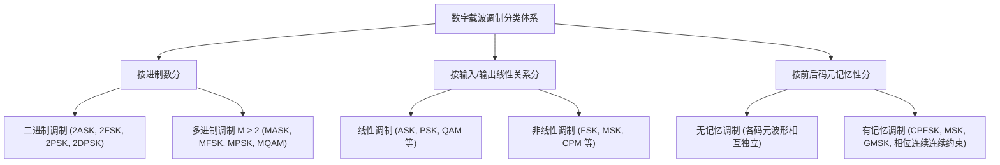

import Knowledge from '@/components/Knowledge.astro';
import Example from '@/components/Example.astro';
import Solution from '@/components/Solution.astro';

第 5 章讨论的是数字基带信号通过基带信道的传输，而在实际通信中的多数信道是带通型的（如卫星通信、移动通信、微波接力与光纤通信等），均是在所规定信道频带内传输频带信号。数字信号的正弦型载波调制基本理论是现代数字通信系统的核心支柱之一。

第 5 章有关数字基带传输的基本概念（如奈奎斯特准则、匹配滤波、码间串扰消除与统计判决）同样适用于频带传输。根据第 2.4 节建立的带通信号与带通系统理论，**任何实带通传输系统均可等效为其复低通基带模型**。本章重点阐述数字基带信号通过正弦载波调制转换为带通频带信号、通过频带信道传输并在接收端进行解调判决的基本工作原理，并围绕数字调制系统的**频带利用率（传输有效性）**与**误码率（传输可靠性）**两大核心指标展开定量分析。

---

## 6.1.1 数字信号的正弦型载波调制及其分类

数字基带信号通过正弦型载波调制成为带通型的频带信号。数字调制的基本原理是用输入的数字基带信号去控制高频正弦载波的某个或某几个参量：

1. **控制载波幅度**：振幅键控（Amplitude Shift Keying, ASK）；
2. **控制载波频率**：频移键控（Frequency Shift Keying, FSK）；
3. **控制载波相位**：相移键控（Phase Shift Keying, PSK）；
4. **联合控制载波幅度与相位**：正交振幅调制（Quadrature Amplitude Modulation, QAM）。

<Knowledge title="数字载波调制的维度分类体系">

- **按进制规模分类**：
  - **二进制数字调制**：每个二进制符号独立映射为一个信号波形。如将二进制“1”映射为 $s_1(t)$，将“0”映射为 $s_2(t)$。根据两波形差异体现为振幅、频率还是相位不同，分别对应 2ASK、2FSK 与 2PSK（BPSK）；
  - **$M$ 进制数字调制（$M > 2$）**：将输入的二进制序列按每 $K$ 个比特编为一组，对应于 $M = 2^K$ 个符号之一。每个符号映射为集合 $\{s_i(t), i=1, 2, \dots, M\}$ 中的一个波形。例如 8PSK 中每 3 个比特对应一个八进制符号，映射为 8 个离散初始相位之一的正弦波形。

- **按线性叠加性分类**：
  - **线性调制**：调制器将数字序列映射为相继发射波形的过程满足线性叠加原理（如 ASK、QAM、BPSK、QPSK 等），已调信号的频谱结构本质上是基带信号频谱在频域的线性搬移；
  - **非线性调制**：波形映射不满足叠加原理（如 FSK 等），频带信号频谱并非基带信号频谱的简单线性平移。

- **按前后码元记忆性分类**：
  - **无记忆调制**：当前码元间隔内发射的信号波形完全独立于此前各码元，彼此无约束关系（如标准 MASK、MPSK、MQAM、MFSK）；
  - **有记忆调制**：当前码元间隔发射的信号波形受到此前一个或多个码元的约束。例如连续相位调制（CPM，如 MSK、GMSK），通过强制载波相位在符号跳变沿保持严格连续，消除相位突跳带来的高频旁瓣泄漏。

</Knowledge>

---

## 6.1.2 本章主要内容与知识脉络

本章的内容组织与分析逻辑构建在现代信号空间理论与统计通信基础之上：

1. **二进制正弦载波调制（第 6.2 节）**：
   详尽剖析 2ASK、2FSK、2PSK 与 2DPSK 的时域表达、功率谱密度、相干解调与非相干解调抗噪声性能，推导加性高斯白噪声（AWGN）信道下的理论误比特率（BER），揭示相干接收与包络检波的性能阶跃。
2. **四相移相键控（第 6.3 节）**：
   深入研究 QPSK、DQPSK 的正交两路并串解耦结构，分析相位模糊及其差分编码解决方案；介绍交错四相移相键控（OQPSK）在限带非线性信道中抑制包络跌落的物理机制。
3. **$M$ 进制数字调制与信号空间理论（第 6.4 节）**：
   将几何信号空间理论（Gram-Schmidt 正交化、欧几里得距离度量、最大后验概率 MAP 准则、最小距离判决）与统计通信紧密结合；系统导出 MASK、MFSK、MPSK 与 MQAM 的星座图拓扑、最优接收机结构及误符号率（SER）闭式解与紧密并集界。
4. **恒包络连续相位调制（第 6.5 节）**：
   聚焦功率受限与非线性放大信道（如卫星与移动通信），剖析最小频移键控（MSK）与高斯最小频移键控（GMSK）的相位轨迹树图、恒包络特性与极度紧凑的带外功率滚降特性。
