import Knowledge from '@/components/Knowledge.astro';
import Example from '@/components/Example.astro';
import Solution from '@/components/Solution.astro';
import ExerciseTrigger from '@/components/ExerciseTrigger.astro';

二进制数字调制是将每个二进制码元（0 或 1）映射为两个不同的正弦载波频带波形。根据两个波形在振幅、频率或相位上的差异，分别构成**二进制振幅键控（2ASK / OOK）**、**二进制频移键控（2FSK）**、**二进制相移键控（2PSK / BPSK）**与**二进制差分相移键控（2DPSK）**。本节系统推导四种调制方式的时域表达、功率谱结构、相干与非相干接收机拓扑及加性高斯白噪声（AWGN）信道下的理论误比特率。

---

## 6.2.1 通断键控（OOK / 2ASK）

通断键控（On-Off Keying, OOK）又称二进制振幅键控（2ASK），以单极性不归零码去控制高频正弦载波的通断。该调制方式出现最早（如莫尔斯电码的有线电与无线电传输），虽然抗噪声性能不及相移键控，但解调架构简易，在光纤通信强度调制/直接检测（IM/DD）系统与低功耗物联网中应用广泛。

### 1. OOK 信号的产生

图 6.2.1 给出了 OOK 信号的调制产生框图。

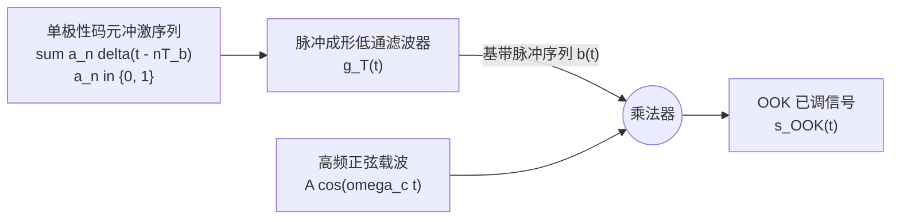

<figure class="vp-figure">

  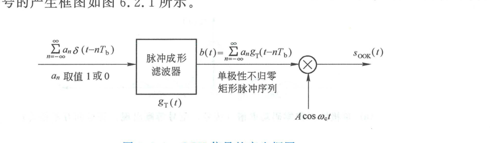

  <figcaption>图 6.2.1 OOK 信号的产生框图（原书影印参考）</figcaption>
</figure>

设二进制序列 $\{a_n\}$ 满足 $a_n \in \{0, 1\}$，码元间隔为 $T_b$。经发送低通滤波器 $g_T(t)$ 成形后的单极性基带脉冲序列为：

$$
b(t) = \sum_{n=-\infty}^{\infty} a_n g_T(t - nT_b) \tag{6.2.1}
$$

将 $b(t)$ 与载波相乘，得到 OOK 已调信号（载频 $f_c \gg R_b$）：

$$
s_{\text{OOK}}(t) = b(t) A\cos\omega_c t = A \left[ \sum_{n=-\infty}^{\infty} a_n g_T(t - nT_b) \right] \cos\omega_c t \tag{6.2.2}
$$

若 $g_T(t)$ 为宽度为 $T_b$ 的理想不归零矩形脉冲，则在单个码元周期 $0 \leqslant t \leqslant T_b$ 内，OOK 信号可表达为两个离散状态：

$$
s_{\text{OOK}}(t) = \begin{cases} s_1(t) = A\cos\omega_c t, & \text{“传号 (1)”} \\ s_2(t) = 0, & \text{“空号 (0)”} \end{cases} \quad 0 \leqslant t \leqslant T_b \tag{6.2.3}
$$

<Example id="6.2.1" title="例 6.2.1 OOK 信号时域波形">
设输入二进制序列为 $\{a_n\} = \{0, 1, 1, 0, 1, 0, 0, 1\}$，画出对应的 OOK 已调信号波形。
</Example>

<Solution title="解">
根据式 (6.2.3)，当输入码元为“1”时输出载波包络 $A\cos\omega_c t$；当输入码元为“0”时输出零电平。波形如图 6.2.2 所示。

<figure class="vp-figure">

  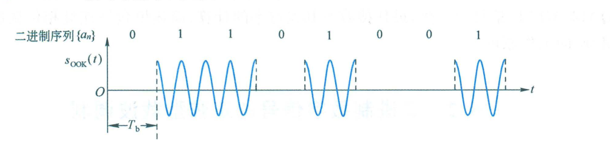

  <figcaption>图 6.2.2 OOK 信号波形图（原书影印参考）</figcaption>
</figure>

</Solution>

### 2. OOK 信号的功率谱密度

由式 (6.2.2) 可知，OOK 信号本质上是单极性基带信号 $b(t)$ 对载波的双边带调制（DSB）。因此其双边功率谱密度为基带功率谱的频域对称搬移：

$$
P_s(f) = \frac{A^2}{4} \left[ P_b(f - f_c) + P_b(f + f_c) \right] \tag{6.2.4}
$$

单极性不归零矩形脉冲序列的基带功率谱包含离散直流谱分量与连续谱分量。经载波搬移后，OOK 功率谱中在载频 $\pm f_c$ 处包含**离散载频冲激谱分量**，如图 6.2.3 所示。其主瓣频带宽度为：

$$
B_{\text{OOK}} = 2 R_b = \frac{2}{T_b}
$$

离散载频分量的存在使得接收端可直接利用窄带带通滤波器或锁相环提取相干载波。

<figure class="vp-figure">

  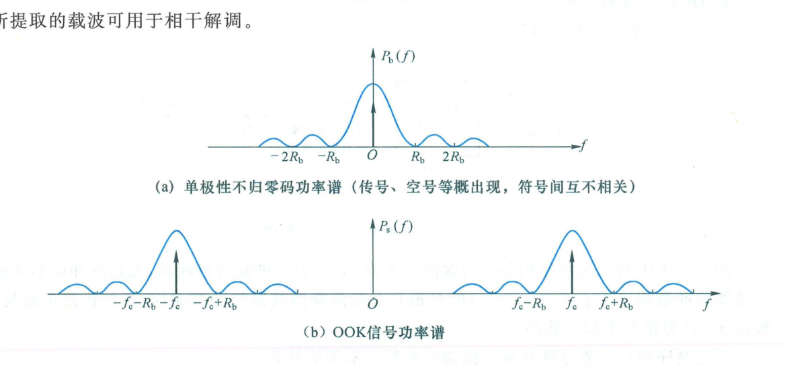

  <figcaption>图 6.2.3 单极性不归零码及 OOK 信号的双边功率谱密度（原书影印参考）</figcaption>
</figure>

### 3. OOK 信号的接收及其误比特率

#### (1) 相干解调（最佳带通匹配滤波与相关接收）

将 OOK 信号视为单极性 PAM 信号在带通域的特例。针对发射波形 $s_1(t) = A\cos(2\pi f_c t), 0 \leqslant t \leqslant T_b$，接收端带通匹配滤波器的冲激响应设计为：

$$
h(t) = s_1(T_b - t) = \begin{cases} A\cos(2\pi f_c t - 2\pi f_c T_b), & 0 \leqslant t \leqslant T_b \\ 0, & \text{其他 } t \end{cases} \tag{6.2.5}
$$

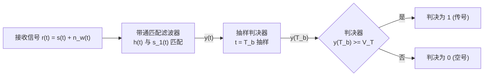

<figure class="vp-figure">

  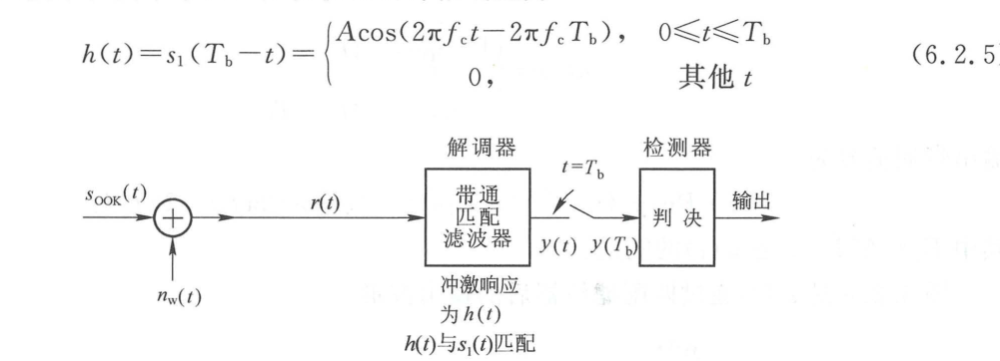

  <figcaption>图 6.2.4 利用带通型匹配滤波器进行解调的最佳接收（原书影印参考）</figcaption>
</figure>

<figure class="vp-figure">

  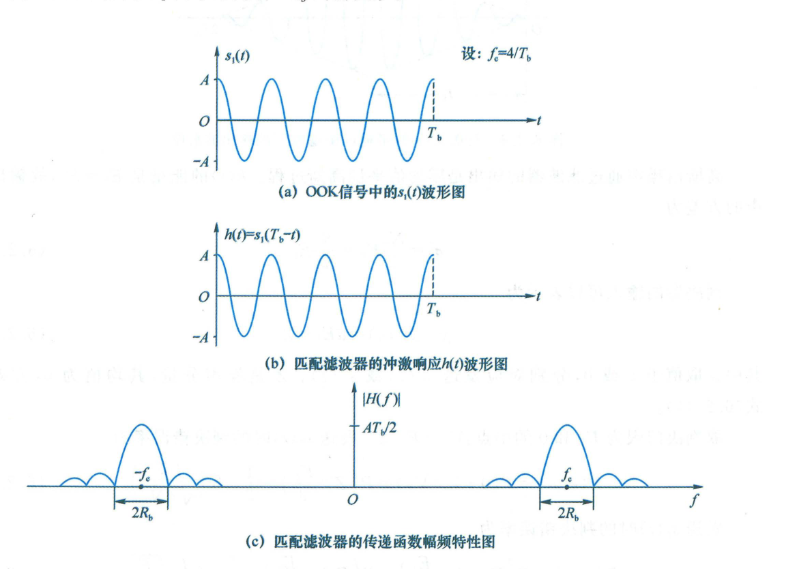

  <figcaption>图 6.2.5 带通型匹配滤波器的 h(t) 及 |H(f)| 图（原书影印参考）</figcaption>
</figure>

利用带通信号的等效低通分析法，发送信号复包络与带通滤波器等效低通冲激响应分别为：

$$
s_{1,L}(t) = A \cdot \operatorname{rect}\left(\frac{t}{T_b} - \frac{1}{2}\right) \tag{6.2.6}
$$

$$
h_e(t) = \frac{1}{2}h_L(t) = \frac{A}{2}e^{-\mathrm{j}2\pi f_c T_b} \cdot \operatorname{rect}\left(\frac{t}{T_b} - \frac{1}{2}\right) \tag{6.2.7}
$$

无噪声时发送 $s_1(t)$，滤波器输出复包络为两矩形脉冲的卷积（形成底宽为 $2T_b$ 的三角脉冲）：

$$
y_L(t) = \frac{A^2 T_b}{2} e^{-\mathrm{j}2\pi f_c T_b} q(t - T_b) \tag{6.2.8}
$$

其中归一化三角脉冲为：

$$
q(t) = \begin{cases} 1 - \frac{|t|}{T_b}, & |t| \leqslant T_b \\ 0, & |t| > T_b \end{cases} \tag{6.2.9}
$$

输出实带通信号为：

$$
y(t) = \operatorname{Re}\{y_L(t)e^{\mathrm{j}2\pi f_c t}\} = E_1 q(t - T_b)\cos(2\pi f_c t - 2\pi f_c T_b) \tag{6.2.10}
$$

其中 $E_1 = \int_0^{T_b} s_1^2(t)\,\mathrm{d}t = \frac{1}{2}A^2 T_b$ 为“传号”波形的能量，在抽样时刻 $t = T_b$ 达到峰值 $y(T_b) = E_1$（如图 6.2.6 所示）。

<figure class="vp-figure">

  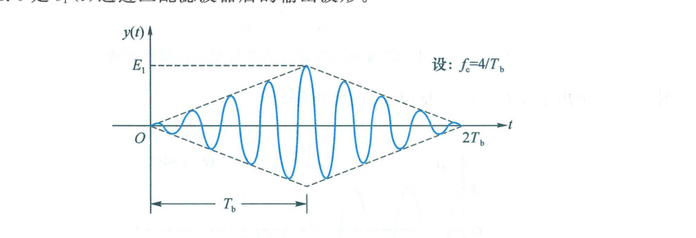

  <figcaption>图 6.2.6 发送 s1(t) 时带通匹配滤波器的输出波形图（原书影印参考）</figcaption>
</figure>

双边功率谱密度为 $N_0/2$ 的白高斯噪声通过滤波器后，抽样时刻输出高斯噪声的方差为：

$$
\sigma^2 = \frac{N_0}{2} E_h = \frac{N_0}{2} E_1 \tag{6.2.11}
$$

抽样判决变量表达为：

$$
y = y(T_b) = a E_1 + Z \tag{6.2.12}
$$

式中 $a \in \{0, 1\}$；$Z \sim \mathcal{N}(0, \sigma^2)$。当先验等概时，最优判决门限位于两信号中点：

$$
V_T = \frac{E_1}{2}
$$

此时“发 0 错判为 1”与“发 1 错判为 0”的条件错误概率对称相等：

$$
P(e|s_2) = P\left(0 + Z > \frac{E_1}{2}\right) = Q\left(\frac{E_1/2}{\sigma}\right) = \frac{1}{2}\operatorname{erfc}\left(\sqrt{\frac{E_1}{4N_0}}\right) \tag{6.2.13}
$$

$$
P(e|s_1) = P\left(E_1 + Z < \frac{E_1}{2}\right) = \frac{1}{2}\operatorname{erfc}\left(\sqrt{\frac{E_1}{4N_0}}\right) \tag{6.2.14}
$$

注意每个符号传输 1 比特，且 $s_2(t)=0$ 不消耗能量，平均比特能量为 $E_b = \frac{1}{2}(E_1 + 0) = \frac{E_1}{2}$。代入可得 **OOK 相干解调平均误比特率**：

$$
P_b = \frac{1}{2}\operatorname{erfc}\left(\sqrt{\frac{E_b}{2N_0}}\right) = Q\left(\sqrt{\frac{E_b}{N_0}}\right) \tag{6.2.15}
$$

带通匹配滤波器的抽样值满足积分内积 $y(T_b) = \int_0^{T_b} r(t)s_1(t)\,\mathrm{d}t$，因此可严格等价转换为**相关解调器**（图 6.2.7）或**先相干下变频至基带再滤波检测**（图 6.2.8）。

<figure class="vp-figure">

  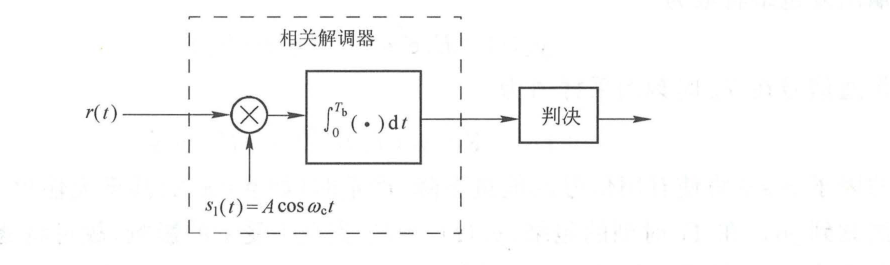

  <figcaption>图 6.2.7 利用相关解调器的最佳接收（原书影印参考）</figcaption>
</figure>

<figure class="vp-figure">

  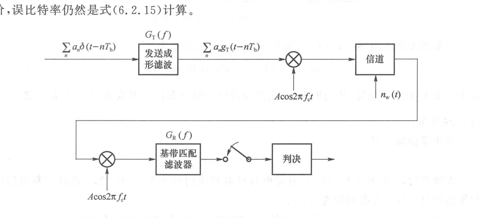

  <figcaption>图 6.2.8 解调至基带后进行检测（原书影印参考）</figcaption>
</figure>

#### (2) 非相干解调（包络检波）

当接收端无法获取载波精确相位 $\phi$ 时（$s_1(t) = A\cos(2\pi f_c t + \phi)$），相干解调输出幅度会受到衰减因子 $\cos\phi$ 劣化（当 $\phi = \pi/2$ 时输出降为 0）。此时采用非相干包络解调架构（图 6.2.9）。

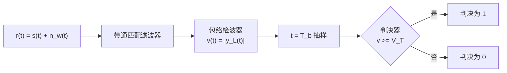

<figure class="vp-figure">

  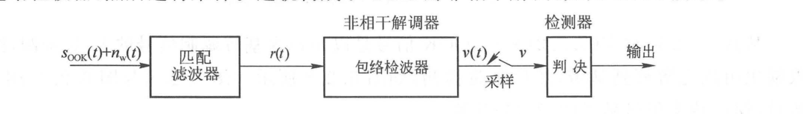

  <figcaption>图 6.2.9 OOK 信号的非相干解调（原书影印参考）</figcaption>
</figure>

抽样时刻判决输入为包络模值 $v = |y(T_b)| = |aE_1 + Z'|$：
- 发送 $s_2(t)$（空号，$a=0$）时，输入仅有窄带高斯噪声，包络 $v = |Z'|$ 服从**瑞利分布（Rayleigh）**：

  $$
  p(v|s_2) = \frac{v}{\sigma^2}\exp\left(-\frac{v^2}{2\sigma^2}\right), \quad v \geqslant 0 \tag{6.2.24}
  $$

  判决门限取 $V_T = E_1 / 2$ 时的错误概率为：

  $$
  P(e|s_2) = \int_{E_1/2}^{\infty} \frac{v}{\sigma^2}e^{-\frac{v^2}{2\sigma^2}}\,\mathrm{d}v = \exp\left(-\frac{E_1^2}{8\sigma^2}\right) = \exp\left(-\frac{E_1}{4N_0}\right) \tag{6.2.25}
  $$

- 发送 $s_1(t)$（传号，$a=1$）时，包络服从**莱斯分布（Rician）**。高信噪比条件下近似为高斯分布：

  $$
  P(e|s_1) \approx \frac{1}{2}\operatorname{erfc}\left(\sqrt{\frac{E_1}{4N_0}}\right) \tag{6.2.27}
  $$

高信噪比下非相干解调平均误比特率主要由瑞利尾部主导，代入 $E_1 = 2E_b$ 得到：

$$
P_b \approx \frac{1}{2}\exp\left(-\frac{E_b}{2N_0}\right) \tag{6.2.29}
$$

图 6.2.10 展示了相干与非相干解调性能曲线的对比。

<figure class="vp-figure">

  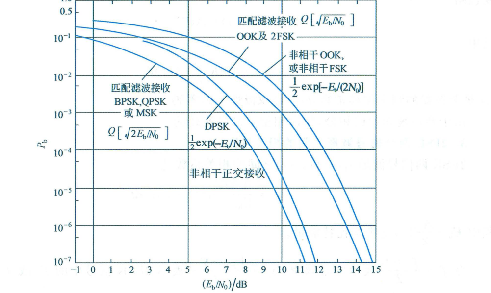

  <figcaption>图 6.2.10 不同数字调制方式的平均误比特率 Pb 与 Eb/N0 的关系曲线（原书影印参考）</figcaption>
</figure>

---

## 6.2.2 二进制移频键控（2FSK）

二进制移频键控（2FSK）利用二进制基带信号去控制载波的瞬时频率，传号与空号分别调制在两个不同的载频 $f_1$ 与 $f_2$ 上。根据码元交界处载波相位是否连续，分为**相位不连续 2FSK** 与**连续相位 2FSK（CPFSK）**。

### 1. 相位不连续 2FSK 信号

采用两个独立的载频振荡器通过单刀双掷电子开关交替切换产生（图 6.2.11），数学表达式为：

$$
s_{\text{FSK}}(t) = \begin{cases} s_1(t) = A\cos(2\pi f_1 t + \theta_1), & \text{“传号 (1)”} \\ s_2(t) = A\cos(2\pi f_2 t + \theta_2), & \text{“空号 (0)”} \end{cases} \quad 0 \leqslant t \leqslant T_b \tag{6.2.30}
$$

由于两振荡器独立起振，初相 $\theta_1, \theta_2$ 互不相关，波形在符号转换边界存在随机相位突变，导致频带较宽且高频滚降缓慢（旁瓣衰减仅为 $1/f^2$）。

<figure class="vp-figure">

  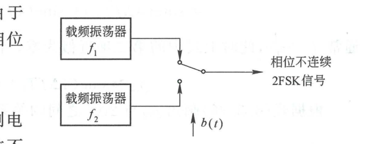

  <figcaption>图 6.2.11 相位不连续 2FSK 信号的产生（原书影印参考）</figcaption>
</figure>

### 2. 相位连续的 2FSK 信号（CPFSK）

采用输入的双极性不归零脉冲序列直接驱动单一压控振荡器（VCO）调频产生（图 6.2.12）：

$$
s_{\text{FSK}}(t) = A\cos\left[\omega_c t + 2\pi K_f \int_{-\infty}^{t} b(\tau)\,\mathrm{d}\tau\right] = \operatorname{Re}\left[ v(t) e^{\mathrm{j}\omega_c t} \right] \tag{6.2.31}
$$

式中复包络为 $v(t) = A e^{\mathrm{j}\theta(t)}$，瞬时相位为积分量：

$$
\theta(t) = 2\pi K_f \int_{-\infty}^{t} b(\tau)\,\mathrm{d}\tau \tag{6.2.33}
$$

积分平滑作用确保了 $\theta(t)$ 在符号边界严格连续，**消除相位跳变，旁瓣衰减速率大幅提高至 $1/f^4$**。

<figure class="vp-figure">

  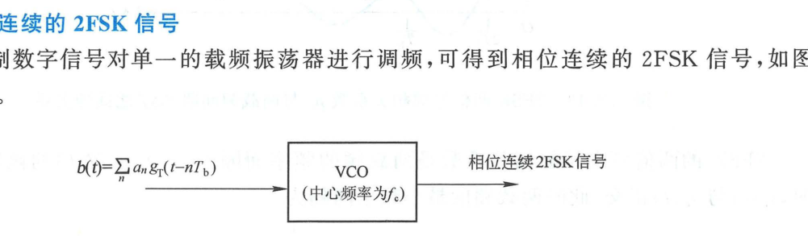

  <figcaption>图 6.2.12 利用 VCO 作调频器产生连续相位 2FSK 信号（原书影印参考）</figcaption>
</figure>

### 3. 2FSK 两个信号波形之间的相关系数与正交条件

两波形间的相关系数直接决定了接收机的解调隔离度与抗噪极限：

$$
\rho_{12} = \frac{1}{E_b} \int_{0}^{T_b} s_1(t) s_2(t)\,\mathrm{d}t \tag{6.2.34}
$$

令中心频率 $f_c = \frac{f_1 + f_2}{2}$，频偏 $\Delta f = \frac{|f_1 - f_2|}{2}$。当 $f_c \gg 1/T_b$ 时积分化简为：

$$
\rho_{12} \approx \operatorname{sinc}(4\Delta f T_b) = \operatorname{sinc}(2\Delta f \cdot 2T_b) \tag{6.2.36}
$$

关系曲线如图 6.2.13 所示。

<figure class="vp-figure">

  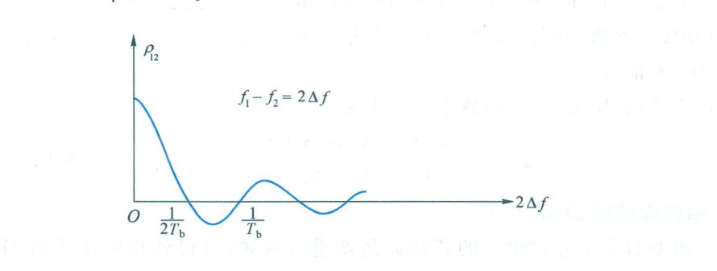

  <figcaption>图 6.2.13 2FSK 两信号的相关系数 rho12 与两载频间隔 2Delta f 之间的关系（原书影印参考）</figcaption>
</figure>

<Knowledge title="2FSK 相干正交与非相干正交频偏准则">

- **相干解调正交最小频偏**：
  若要求两信号相互正交（$\rho_{12} = 0$），由 $\operatorname{sinc}(4\Delta f T_b) = 0$ 要求 $4\Delta f T_b = 1$：

  $$
  f_1 - f_2 = 2\Delta f = \frac{1}{2T_b} = \frac{R_b}{2} \tag{6.2.37}
  $$

  这是相干检测下的**最小频差**（MSK 调制的理论基础）。

- **非相干解调正交最小频偏**：
  在初相未知条件下，两路必须在任意相位差下均保持正交，要求频率间隔为波特率的整数倍：

  $$
  f_1 - f_2 = \frac{1}{T_b} = R_b
  $$

</Knowledge>

### 4. 2FSK 信号带宽（卡松公式）

根据卡松公式（Carson's Rule），2FSK 信号传输带宽估算为两倍频偏与基带带宽之和：

$$
B_{\text{FSK}} \approx 2\Delta f + 2B \approx 2\Delta f + 2R_b \tag{6.2.39}
$$

### 5. 2FSK 接收机与误比特率

#### (1) 相干解调

相干解调器由两个与各自频率 $f_1, f_2$ 匹配的滤波器（或相关器）组成，判决量取两路输出之差（图 6.2.14）：

$$
l = y_1 - y_2 = d E_b + Z \tag{6.2.41}
$$

式中 $d = +1$ 对应发送 $s_1$，$d = -1$ 对应发送 $s_2$；合成噪声方差为 $\sigma^2 = \sigma_1^2 + \sigma_2^2 = N_0 E_b$。由于判决门限为 0，平均误比特率为：

$$
P_b = \frac{1}{2}\operatorname{erfc}\left(\sqrt{\frac{E_b}{2N_0}}\right) = Q\left(\sqrt{\frac{E_b}{N_0}}\right) \tag{6.2.43}
$$

<figure class="vp-figure">

  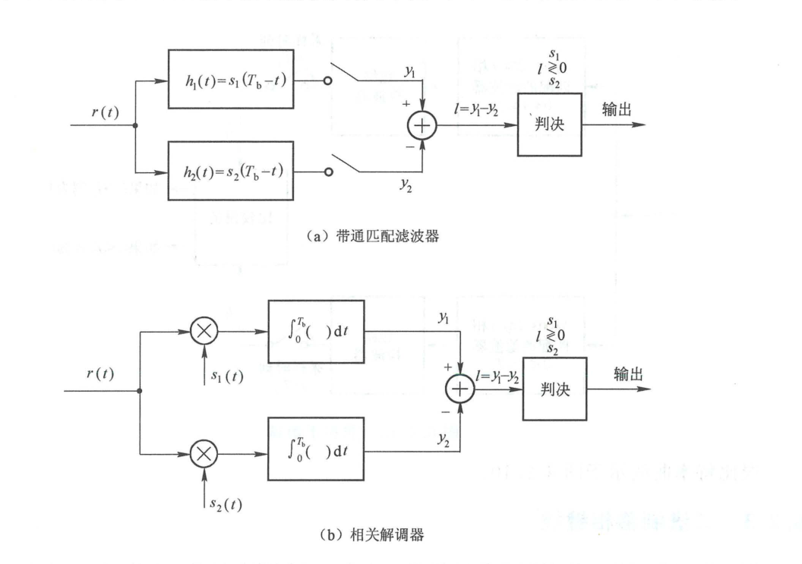

  <figcaption>图 6.2.14 2FSK 相干解调框图（原书影印参考）</figcaption>
</figure>

#### (2) 非相干解调

非相干解调由两个带通滤波器后接包络检波器，抽样后比较两支路包络 $l_1, l_2$ 大小判决（图 6.2.15），理论误比特率为：

$$
P_b = \frac{1}{2}\exp\left(-\frac{E_b}{2N_0}\right) \tag{6.2.44}
$$

<figure class="vp-figure">

  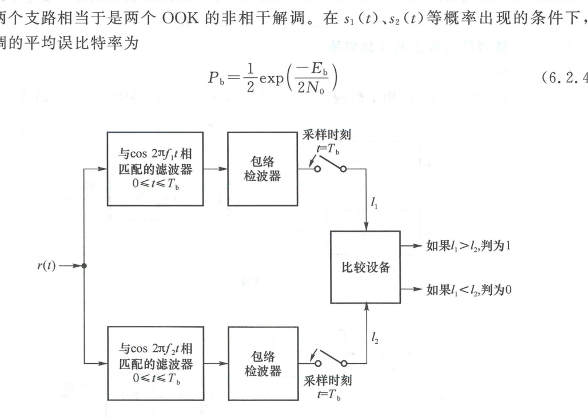

  <figcaption>图 6.2.15 2FSK 非相干解调（原书影印参考）</figcaption>
</figure>

---

## 6.2.3 二进制移相键控（2PSK / BPSK）

二进制相移键控（Binary PSK, BPSK）利用二进制数字信息控制载波的相位取值 0 或 $\pi$。由于载波反相时振幅恒定、能量最大化，BPSK 是所有二进制线性调制中抗加性高斯白噪声性能最强的方式。

### 1. 2PSK 信号产生及功率谱密度

调制原理如图 6.2.16 所示。输入双极性不归零脉冲序列 $a_n \in \{+1, -1\}$（“0”映射为 $-1$，“1”映射为 $+1$）：

$$
s_{2\text{PSK}}(t) = A \left[ \sum_{n=-\infty}^{\infty} a_n g_T(t - nT_b) \right] \cos\omega_c t \tag{6.2.45}
$$

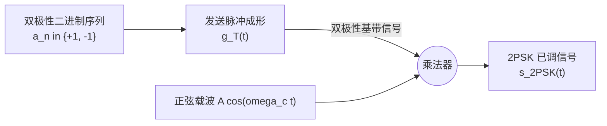

<figure class="vp-figure">

  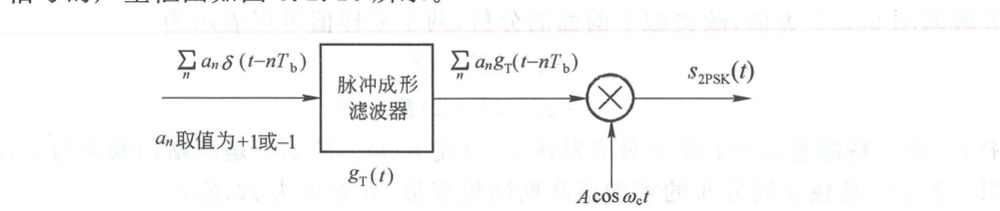

  <figcaption>图 6.2.16 2PSK 信号产生框图（原书影印参考）</figcaption>
</figure>

当传号与空号等概出现时，双极性序列数学期望为零，基带谱**无离散直流分量**。因此 2PSK 功率谱仅包含连续谱，**在载频 $f_c$ 处无离散载频分量**（图 6.2.17）：

$$
P_{2\text{PSK}}(f) = \frac{A^2}{4}\left[ P_b(f - f_c) + P_b(f + f_c) \right] = \frac{A^2 T_b}{4}\left[ \operatorname{sinc}^2(f - f_c)T_b + \operatorname{sinc}^2(f + f_c)T_b \right] \tag{6.2.46}
$$

<figure class="vp-figure">

  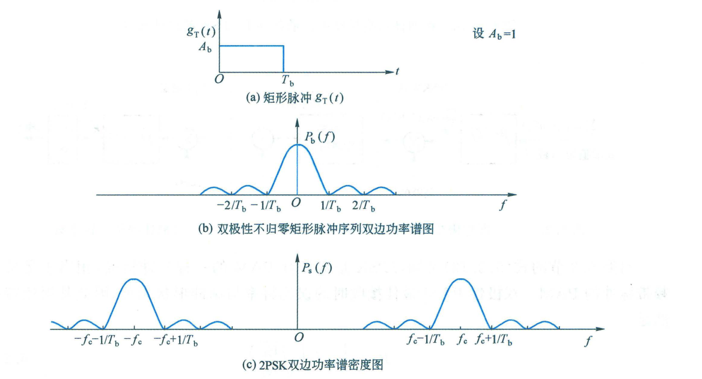

  <figcaption>图 6.2.17 2PSK 信号功率谱密度图（原书影印参考）</figcaption>
</figure>

### 2. 2PSK 信号的最佳接收与误比特率

在符号周期 $0 \leqslant t \leqslant T_b$ 内，两发射波形为严格的**对跖信号（Antipodal Signals）**：

$$
s_1(t) = A\cos 2\pi f_c t, \quad s_2(t) = -A\cos 2\pi f_c t = -s_1(t) \tag{6.2.48}
$$

两信号能量相等 $E_1 = E_2 = E_b = \frac{1}{2}A^2 T_b$，互相关系数达到极限负值 $\rho_{12} = -1$。

接收机可采用带通匹配滤波或相干相关器（图 6.2.18 与图 6.2.19）。判决变量为 $y = a_n E_b + Z$，最优判决门限为 0。

<figure class="vp-figure">

  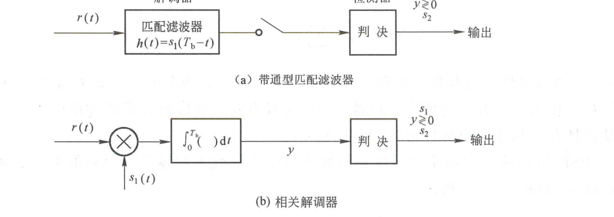

  <figcaption>图 6.2.18 加性白高斯噪声信道条件下 2PSK 的最佳接收（原书影印参考）</figcaption>
</figure>

<figure class="vp-figure">

  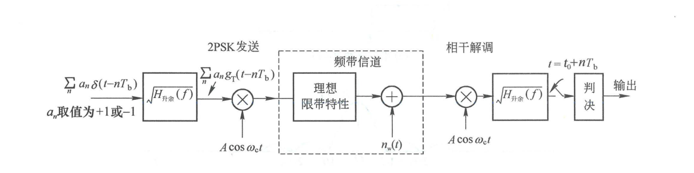

  <figcaption>图 6.2.19 理想限带及 AWGN 信道下 2PSK 的最佳频带传输系统（原书影印参考）</figcaption>
</figure>

**2PSK 相干最佳接收的误比特率**为：

$$
P_b = \frac{1}{2}\operatorname{erfc}\left(\sqrt{\frac{E_b}{N_0}}\right) = Q\left(\sqrt{\frac{2E_b}{N_0}}\right) \tag{6.2.49}
$$

<Knowledge title="二进制三种基本调制抗噪性能对比">

- 在获得相同误比特率 $P_b$ 的条件下：
  - **2PSK 比 2ASK（OOK 相干）节省 3 dB 功率**（$\sqrt{E_b/N_0}$ 对比 $\sqrt{E_b/(2N_0)}$）；
  - **2PSK 比 2FSK（相干正交）节省 3 dB 功率**；
  - 2ASK 与 2FSK 在相干解调下的误比特率公式形式完全相同，具有相同的信噪比需求。

</Knowledge>

---

## 6.2.4 差分移相键控（2DPSK）

BPSK 属于抑制载波的双边带信号，接收端提取同步载波必须采用非线性运算（如平方环或科斯塔斯环 Costas Loop）。此类载波恢复电路必然存在** $180^\circ$（$\pi$）相位模糊度**，即恢复出来的本地载波可能与发端同相，也可能反相。一旦反相，解调出的所有二进制比特将全部发生 $0 \leftrightarrow 1$ 倒相错误，称为“反向工作”。差分移相键控（Differential PSK, DPSK）是彻底克服相位模糊的经典解决方案。

### 1. DPSK 信号的差分编码产生原理

DPSK 利用相邻码元之间的**相对相位变化**来传递信息，而非载波的绝对相位。发端首先对输入的绝对二进制码序列 $\{b_n\}$ 进行差分编码，生成相对码序列 $\{d_n\}$（图 6.2.20）：

$$
d_n = b_n \oplus d_{n-1} \tag{6.2.50}
$$

式中 $\oplus$ 表示模二加（异或运算）。随后将相对码序列 $\{d_n\}$ 送入普通 2PSK 调制器。

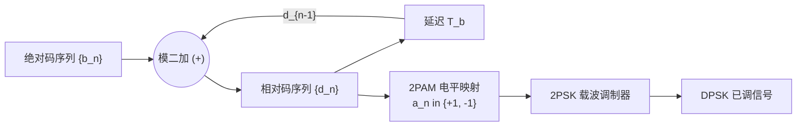

<figure class="vp-figure">

  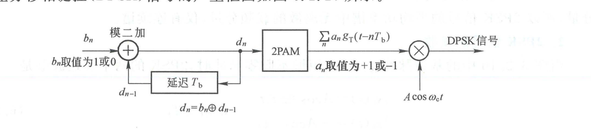

  <figcaption>图 6.2.20 DPSK 信号的产生（原书影印参考）</figcaption>
</figure>

<Example id="6.2.2" title="例 6.2.2 DPSK 差分编码与调制波形状态推导">
设输入绝对码序列为 $\{b_n\} = 1, 0, 0, 1, 0, 0, 1, 1$，参考初始相对码位设为 $d_0 = 1$。求相对码序列 $\{d_n\}$、电平变换序列 $\{a_n\}$ 及相邻比特载波相位差。
</Example>

<Solution title="解">
根据差分编码规则 $d_n = b_n \oplus d_{n-1}$，逐步计算：
- $d_1 = b_1 \oplus d_0 = 1 \oplus 1 = 0$；
- $d_2 = b_2 \oplus d_1 = 0 \oplus 0 = 0$；
- $d_3 = b_3 \oplus d_2 = 0 \oplus 0 = 0$；
- $d_4 = b_4 \oplus d_3 = 1 \oplus 0 = 1$；
- $d_5 = b_5 \oplus d_4 = 0 \oplus 1 = 1$；
- $d_6 = b_6 \oplus d_5 = 0 \oplus 1 = 1$；
- $d_7 = b_7 \oplus d_6 = 1 \oplus 1 = 0$；
- $d_8 = b_8 \oplus d_7 = 1 \oplus 0 = 1$。

整理得真值对应表如下：

| 变量序列 | $n=0$ | $n=1$ | $n=2$ | $n=3$ | $n=4$ | $n=5$ | $n=6$ | $n=7$ | $n=8$ |
| :--- | :---: | :---: | :---: | :---: | :---: | :---: | :---: | :---: | :---: |
| **绝对码** $\{b_n\}$ | — | 1 | 0 | 0 | 1 | 0 | 0 | 1 | 1 |
| **相对码** $\{d_n\}$ | 1 | 0 | 0 | 0 | 1 | 1 | 1 | 0 | 1 |
| **电平变换** $\{a_n\}$ | $+1$ | $-1$ | $-1$ | $-1$ | $+1$ | $+1$ | $+1$ | $-1$ | $+1$ |
| **载波相位** $\{\theta_n\}$ | 0 | $\pi$ | $\pi$ | $\pi$ | 0 | 0 | 0 | $\pi$ | 0 |
| **相位差** $(\theta_n - \theta_{n-1})$ | — | $\pi$ | 0 | 0 | $-\pi$ | 0 | 0 | $\pi$ | $-\pi$ |

由上表可见：输入“1”时，当前载波相位相对于前一码元翻转 $\pm \pi$；输入“0”时，当前载波相位与前一码元保持不变。
</Solution>

### 2. DPSK 信号的解调方式与误比特率

DPSK 具有两种解调架构，如图 6.2.21 所示。

<figure class="vp-figure">

  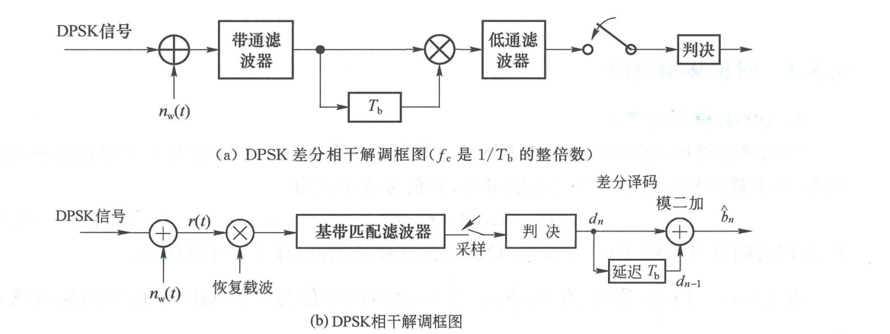

  <figcaption>图 6.2.21 DPSK 解调的两种方案（原书影印参考）</figcaption>
</figure>

#### (1) 相干解调 + 差分译码（图 6.2.21b）

接收机利用本地恢复载波先对 DPSK 进行 2PSK 相干解调恢复出相对码序列 $\{\hat{d}_n\}$，再经差分译码器 $\hat{b}_n = \hat{d}_n \oplus \hat{d}_{n-1}$ 还原出绝对码。即使本地载波发生 $180^\circ$ 倒相使得相对码全部反转为 $\overline{d}_n$，其差分译码输出 $\overline{d}_n \oplus \overline{d}_{n-1} = d_n \oplus d_{n-1} = b_n$ 完全不受影响，**彻底规避了相位模糊**。

设 2PSK 相干解调误码率为 $P_b$，正确判决率为 $P_c = 1 - P_b$。差分译码正确输出要求相邻两个相对码判决同时正确或同时错误：

$$
P_{cd} = P_c^2 + P_b^2 = (1 - P_b)^2 + P_b^2 = 1 - 2P_b + 2P_b^2 \tag{6.2.51}
$$

因此 DPSK 相干解调的误比特率为：

$$
P_{ed} = 1 - P_{cd} = 2P_b - 2P_b^2 = 2P_b(1 - P_b) \tag{6.2.52}
$$

在通常的高信噪比条件下（$P_b \ll 1$）：

$$
P_{ed} \approx 2P_b = \operatorname{erfc}\left(\sqrt{\frac{E_b}{N_0}}\right) \tag{6.2.53}
$$

此即**差错倍增效应（Error Propagation）**：由于差分译码依赖于前后两个符号，一个相对码判决错误通常会导致两个相继的绝对码产生判决错误。在对数误码率曲线上，相当于损失不到 $0.5\text{ dB}$ 的信噪比。

#### (2) 差分相干解调（非相干延迟相乘检波，图 6.2.21a）

利用延迟一个码元周期的前一接收信号作为当前码元的相干解调参考载波，经带通滤波、相乘与低通滤波后直接采样判决，**完全无需复杂的本地载波提取电路**。当带通滤波器设计为包络匹配时，其误比特率为闭式解析解：

$$
P_b = \frac{1}{2}\exp\left(-\frac{E_b}{N_0}\right) \tag{6.2.54}
$$

其抗噪性能介于相干解调与包络检波之间，硬件实现极其简便，是无线测控与工业传感网中最受欢迎的相移调制方案。

---

## 6.2.5 二进制调制系统性能综合对比

下表归纳了四种典型二进制频带调制系统的核心性能与物理指标（设基带采用矩形脉冲，码元速率为 $R_b$，平均比特能量为 $E_b$）：

| 调制方式 | 解调类型 | 频带利用率 $\eta$ ($\text{bit}/(\text{s}\cdot\text{Hz})$) | 误比特率闭式计算公式 $P_b$ | 误码率 $P_b = 10^{-5}$ 时的 $E_b/N_0$ 需求 | 载波提取与相位模糊敏感度 |
| :--- | :--- | :---: | :--- | :---: | :--- |
| **2ASK (OOK)** | 相干解调 | 0.5 | $\frac{1}{2}\operatorname{erfc}\left(\sqrt{\frac{E_b}{2N_0}}\right)$ | $\approx 12.6\text{ dB}$ | 需载波同步，无模糊 |
| **2ASK (OOK)** | 包络检波（非相干） | 0.5 | $\approx \frac{1}{2}\exp\left(-\frac{E_b}{2N_0}\right)$ | $\approx 13.4\text{ dB}$ | 无需载波同步，门限与信噪比相关 |
| **2FSK** | 相干解调 | $\frac{R_b}{2(\Delta f + R_b)} \leqslant 0.5$ | $\frac{1}{2}\operatorname{erfc}\left(\sqrt{\frac{E_b}{2N_0}}\right)$ | $\approx 12.6\text{ dB}$ | 需双路载波同步 |
| **2FSK** | 包络检波（非相干） | $\frac{R_b}{2(\Delta f + R_b)} \leqslant 0.5$ | $\frac{1}{2}\exp\left(-\frac{E_b}{2N_0}\right)$ | $\approx 13.4\text{ dB}$ | 无需载波，比较两路包络大小 |
| **2PSK (BPSK)** | 相干解调 | 0.5 | $\frac{1}{2}\operatorname{erfc}\left(\sqrt{\frac{E_b}{N_0}}\right)$ | $\approx 9.6\text{ dB}$ | **抗噪性能最佳**，但存在 $\pi$ 相位模糊 |
| **2DPSK** | 相干解调+差分译码 | 0.5 | $\approx \operatorname{erfc}\left(\sqrt{\frac{E_b}{N_0}}\right)$ | $\approx 9.9\text{ dB}$ | 规避相位模糊，代价差错倍增 |
| **2DPSK** | 差分相干（非相干） | 0.5 | $\frac{1}{2}\exp\left(-\frac{E_b}{N_0}\right)$ | $\approx 10.3\text{ dB}$ | **无需载波同步**，性能逼近相干解调 |

<ExerciseTrigger chapter={6} section="6.2" title="6.2 二进制数字信号的正弦型载波调制 课后习题与自测" />
