import Knowledge from '@/components/Knowledge.astro';
import Example from '@/components/Example.astro';
import Solution from '@/components/Solution.astro';
import ExerciseTrigger from '@/components/exercises/ExerciseTrigger.astro';

四相移相键控（Quadrature Phase Shift Keying, QPSK）又称四进制移相键控（4PSK）。它是现代高速无线通信（如 4G/5G 蜂窝网络、卫星通信广播 DVB-S、Wi-Fi 局域网）中应用最广泛、最核心的经典调制体制。QPSK 巧妙利用两个正交正弦载波同时传输两个独立的二进制比特，**在误比特率完全不劣化的前提下，将系统的频带利用率提高了一倍**。

---

## 6.3.1 四相移相键控（QPSK）

### 1. QPSK 信号的产生

QPSK 信号的正弦型载波具有 4 个离散相位状态，每个符号周期 $T_s$ 携带 2 个二进制比特（$T_s = 2T_b$）。其数学表达式为：

$$
s_i(t) = A\cos(\omega_c t + \theta_i), \quad i = 1, 2, 3, 4, \quad 0 \leqslant t \leqslant T_s \tag{6.3.1}
$$

式中 4 个离散相位通常采用两种体制：
- **体制 A（轴对齐矢量）**：$\theta_i = (i-1)\frac{\pi}{2} \in \left\{0, \frac{\pi}{2}, \pi, \frac{3\pi}{2}\right\}$，如图 6.3.1(a) 所示；
- **体制 B（象限对角矢量，最常用）**：$\theta_i = (2i-1)\frac{\pi}{4} \in \left\{\frac{\pi}{4}, \frac{3\pi}{4}, \frac{5\pi}{4}, \frac{7\pi}{4}\right\}$，如图 6.3.1(b) 所示。

<figure class="vp-figure">

  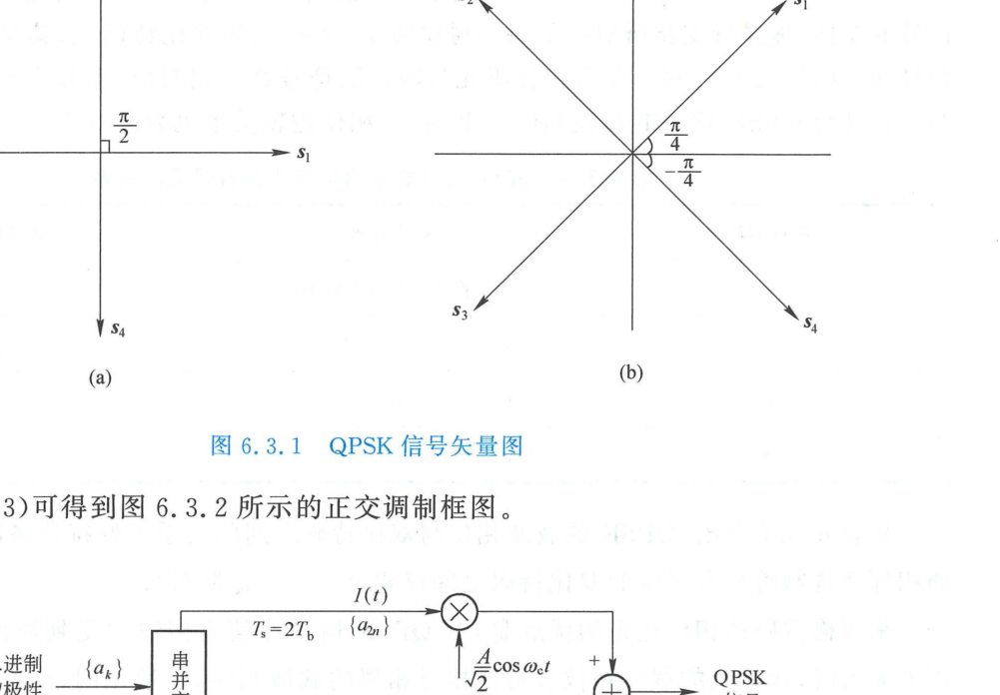

  <figcaption>图 6.3.1 QPSK 信号矢量图（原书影印参考）</figcaption>
</figure>

对体制 B，利用三角恒等式展开式 (6.3.1)：

$$
s_i(t) = A(\cos\theta_i \cos\omega_c t - \sin\theta_i \sin\omega_c t) \tag{6.3.2}
$$

由于 $\cos\theta_i = \pm \frac{1}{\sqrt{2}}$，$\sin\theta_i = \pm \frac{1}{\sqrt{2}}$，式 (6.3.2) 可严格分解为两路相互正交的 2PSK 信号之和：

$$
s_i(t) = \frac{A}{\sqrt{2}}\left[ I(t)\cos\omega_c t - Q(t)\sin\omega_c t \right], \quad 0 \leqslant t \leqslant T_s \tag{6.3.3}
$$

其中 $I(t) \in \{+1, -1\}$ 称为**同相分量（In-phase）**，$Q(t) \in \{+1, -1\}$ 称为**正交分量（Quadrature）**。正交调制原理如图 6.3.2 所示。

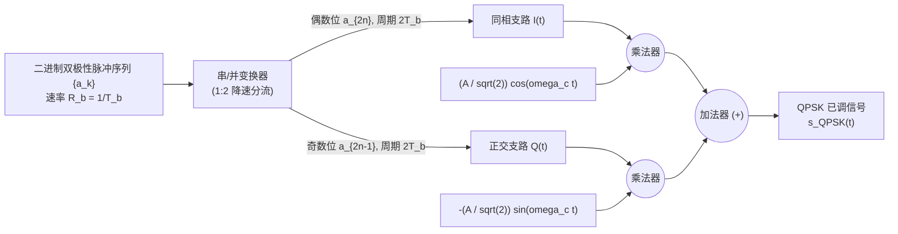

<figure class="vp-figure">

  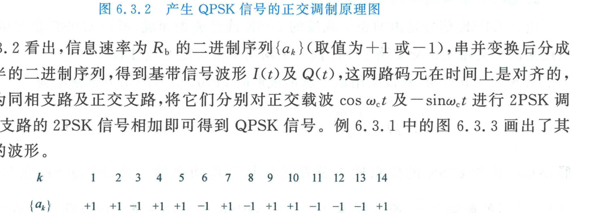

  <figcaption>图 6.3.2 产生 QPSK 信号的正交调制原理图（原书影印参考）</figcaption>
</figure>

<Example id="6.3.1" title="例 6.3.1 QPSK 串并变换与格雷码映射波形">
设输入二进制序列为 $\{a_k\} = \{+1, +1, -1, +1, +1, -1, +1, -1, +1, +1, -1, -1, -1, +1\}$。分析串并变换输出的双比特序列，绘制 $I(t)$ 与 $Q(t)$ 的基带波形。
</Example>

<Solution title="解">
将 $\{a_k\}$ 按奇偶位拆分：
- 偶数位分配给同相支路：$\{a_{k,\text{even}}\} = \{+1, +1, -1, -1, +1, -1, +1\}$；
- 奇数位分配给正交支路：$\{a_{k,\text{odd}}\} = \{+1, -1, +1, +1, +1, -1, -1\}$。

两支路码元周期均由 $T_b$ 展宽为符号周期 $T_s = 2T_b$。波形如图 6.3.3 所示。

<figure class="vp-figure">

  

  <figcaption>图 6.3.3 QPSK 串并变换及 I(t), Q(t) 波形图（原书影印参考）</figcaption>
</figure>

每个双比特符号 $(a_{k,\text{even}}, a_{k,\text{odd}})$ 与载波相位 $\theta_i$ 采用**格雷码（Gray Code）**映射：

| 四进制码 | 双比特码 $(b_1 b_2)$ | 电平映射 $(I, Q)$ | 载波相位 $\theta_i$ |
| :---: | :---: | :---: | :---: |
| **0** | $00$ | $(+1, +1)$ | $\pi/4$ |
| **1** | $10$ | $(-1, +1)$ | $3\pi/4$ |
| **2** | $11$ | $(-1, -1)$ | $5\pi/4$ |
| **3** | $01$ | $(+1, -1)$ | $7\pi/4$ |

格雷码的黄金法则在于：**相邻两个相位状态对应的双比特码之间仅有 1 位发生变化**。在信道噪声导致判决发生临近偏转时，绝大多数错判仅带来 1 个错误比特，显著压低了误比特率。
</Solution>

### 2. QPSK 信号的功率谱密度与频带利用率

由于 QPSK 是同相与正交两路载波正交的 2PSK 信号的线性叠加，其总功率谱等于两支路功率谱之和。

当输入二进制信息速率为 $R_b = 1/T_b$、总发射功率为 $P = \frac{A^2}{2}$ 时，各支路的码元持续时间为 $T_s = 2T_b$，支路幅度为 $A/\sqrt{2}$。因此 QPSK 信号的双边功率谱密度为：

$$
P_{\text{QPSK}}(f) = \frac{A^2 T_b}{2}\left\{ \operatorname{sinc}^2[2(f - f_c)T_b] + \operatorname{sinc}^2[2(f + f_c)T_b] \right\} \tag{6.3.5}
$$

对比 2PSK 功率谱式 (6.2.46)：

$$
P_{\text{2PSK}}(f) = \frac{A^2 T_b}{4}\left\{ \operatorname{sinc}^2[(f - f_c)T_b] + \operatorname{sinc}^2[(f + f_c)T_b] \right\}
$$

两者的频谱对比曲线如图 6.3.4 所示。

<figure class="vp-figure">

  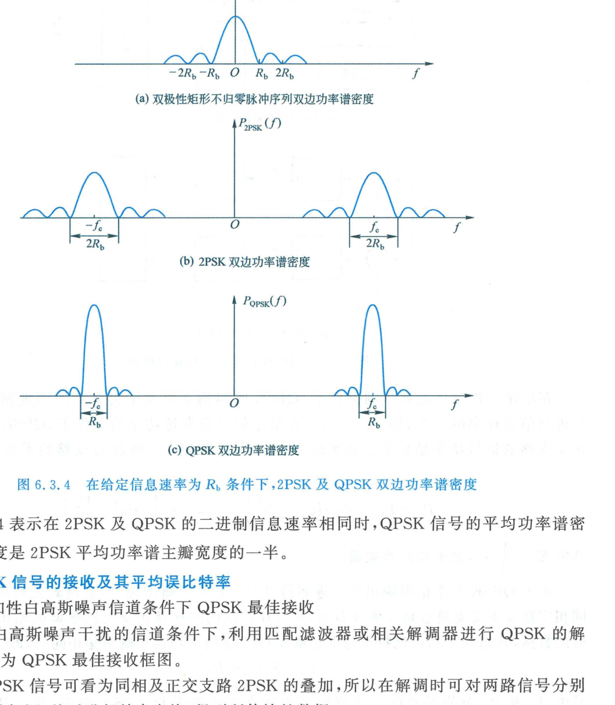

  <figcaption>图 6.3.4 在给定信息速率为 Rb 条件下，2PSK 及 QPSK 双边功率谱密度（原书影印参考）</figcaption>
</figure>

<Knowledge title="QPSK 频谱收敛性与频带利用率">

- **谱主瓣带宽**：
  在相同信息速率 $R_b$ 下，QPSK 功率谱主瓣宽度为：

  $$
  B_{\text{QPSK}} = \frac{2}{T_s} = \frac{1}{T_b} = R_b
  $$

  而 2PSK 的主瓣宽度为 $B_{\text{2PSK}} = 2R_b$。**QPSK 所需频带宽度严格仅为 2PSK 的一半**！

- **频带利用率（频谱效率）**：
  QPSK 的频带利用率提高为原来的 2 倍：

  $$
  \eta = \frac{R_b}{B_{\text{QPSK}}} = 1.0\text{ bit}/(\text{s}\cdot\text{Hz})
  $$

</Knowledge>

### 3. QPSK 最佳接收机与误比特率（BER）

在加性高斯白噪声（AWGN）信道下，接收信号为：

$$
r(t) = s_{\text{QPSK}}(t) + n_w(t)
$$

QPSK 最佳相干接收机利用两路本地正交载波 $\frac{A}{\sqrt{2}}\cos\omega_c t$ 与 $-\frac{A}{\sqrt{2}}\sin\omega_c t$ 分别进行匹配滤波或相干相关积分（积分时间为符号周期 $T_s = 2T_b$），再经并串变换合并恢复出原始比特流，如图 6.3.5 所示。

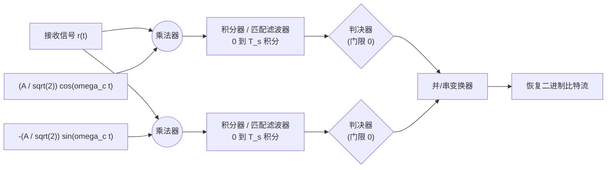

<figure class="vp-figure">

  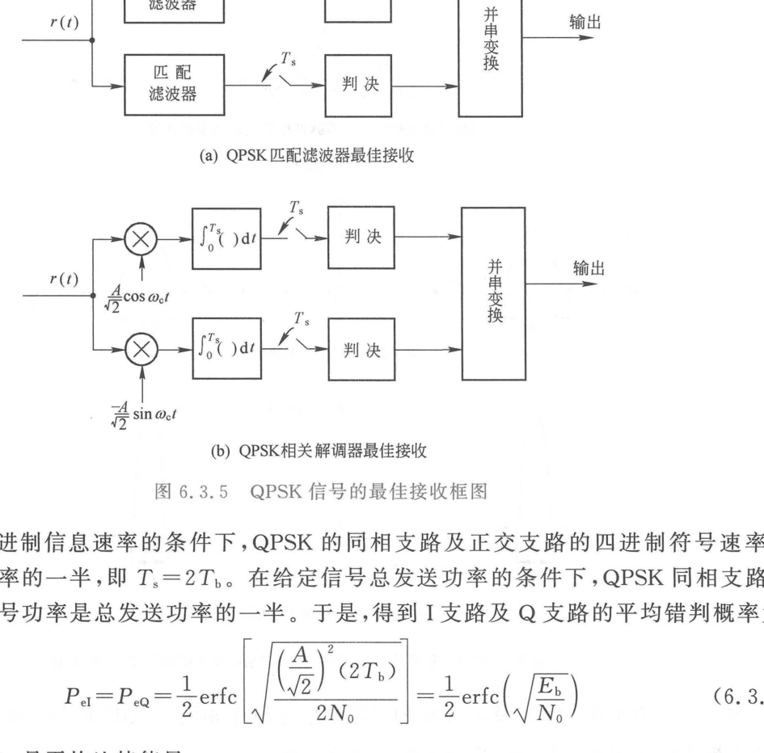

  <figcaption>图 6.3.5 QPSK 信号的最佳接收框图（原书影印参考）</figcaption>
</figure>

由于两载波在时间区间 $[0, T_s]$ 上严格正交：

$$
\int_0^{T_s} \cos(\omega_c t)\sin(\omega_c t)\,\mathrm{d}t \approx 0
$$

两支路之间完全无相互干扰。每支路接收机等价于一个独立的 2PSK 解调器，其符号能量为 $E_s/2 = E_b$。因此 I 支路与 Q 支路的平均判决错误概率为：

$$
P_{eI} = P_{eQ} = \frac{1}{2}\operatorname{erfc}\left( \sqrt{\frac{(A/\sqrt{2})^2 (2T_b)}{2N_0}} \right) = \frac{1}{2}\operatorname{erfc}\left(\sqrt{\frac{E_b}{N_0}}\right) \tag{6.3.7}
$$

总二进制码元出现于 I 支路与 Q 支路的概率均为 $1/2$：

$$
P_b = \frac{1}{2}P_{eI} + \frac{1}{2}P_{eQ} = \frac{1}{2}\operatorname{erfc}\left(\sqrt{\frac{E_b}{N_0}}\right) = Q\left(\sqrt{\frac{2E_b}{N_0}}\right) \tag{6.3.9}
$$

图 6.3.6 展示了在理想限带信道下的完整 QPSK 最佳频带传输系统。

<figure class="vp-figure">

  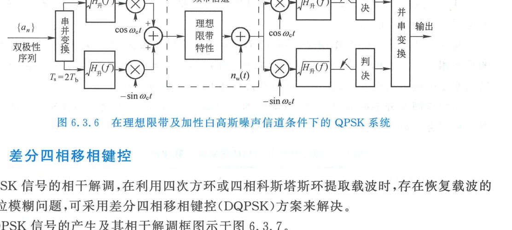

  <figcaption>图 6.3.6 在理想限带及加性白高斯噪声信道条件下的 QPSK 系统（原书影印参考）</figcaption>
</figure>

<Knowledge title="通信原理核心定理：QPSK 零代价频带加倍特性">

将 QPSK 与 2PSK 严密对比：
在**信息速率相同、总发射功率相同、信道白噪声谱密度相同**的条件下：
- **误比特率完全相同**：$P_{b,\text{QPSK}} = P_{b,\text{2PSK}} = Q\left(\sqrt{\frac{2E_b}{N_0}}\right)$；
- **频带占用减少一半**：$B_{\text{QPSK}} = \frac{1}{2}B_{\text{2PSK}}$。

这表明：**正交二维调制在不付出任何能量代价（信噪比代价）的条件下，使系统频带利用率翻倍**。这是通信调制领域最具美感的物理定理之一。

</Knowledge>

---

## 6.3.2 差分四相移相键控（DQPSK）

与 2PSK 的双重相位模糊类似，QPSK 接收机在利用四次方环或四相科斯塔斯环提取载波时，会不可避免地产生 **四重相位模糊（$0, \pi/2, \pi, 3\pi/2$）**。一旦本地载波出现 $90^\circ$ 或 $180^\circ$ 旋转，解调输出将严重瘫痪。差分四相移相键控（DQPSK）通过对双比特数据执行差分编码彻底消除该隐患。

### 1. DQPSK 调制与解调架构

原理框图如图 6.3.7 所示。

<figure class="vp-figure">

  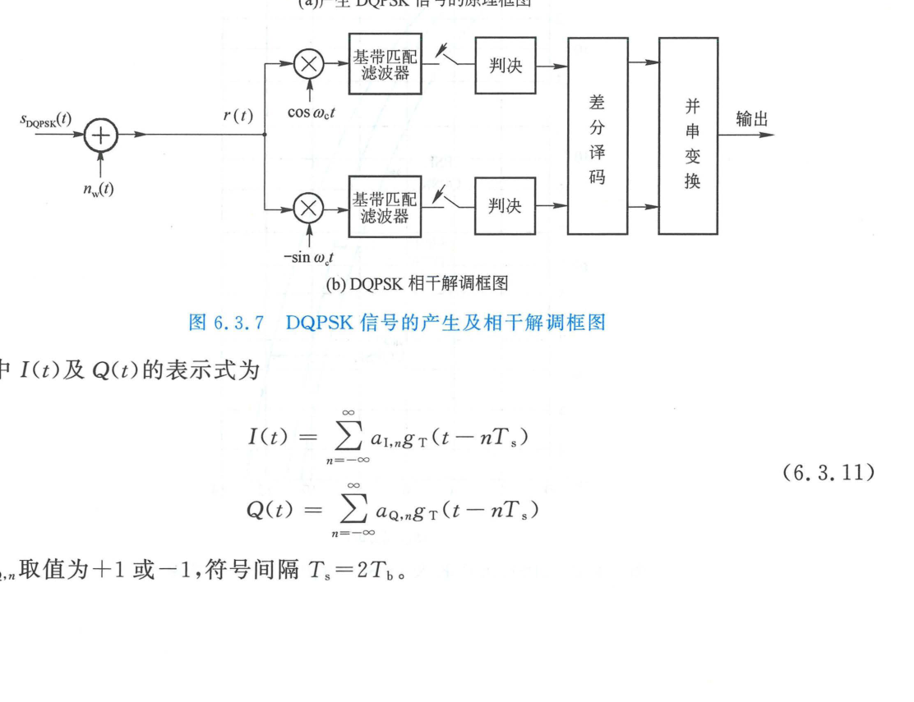

  <figcaption>图 6.3.7 DQPSK 信号的产生及相干解调框图（原书影印参考）</figcaption>
</figure>

输入的双比特绝对码 $(b_{I,n}, b_{Q,n})$ 首先在差分编码器中转化为相对码 $(a_{I,n}, a_{Q,n})$。调制载波的当前相位 $\theta_n$ 与前一符号载波相位 $\theta_{n-1}$ 之差 $\Delta \theta_n = \theta_n - \theta_{n-1}$ 遵循格雷差分映射准则（表 6.3.2）：

| 四进制码 | 绝对双比特码 $(b_{I,n}, b_{Q,n})$ | 相位增量 $\Delta \theta_n = \theta_n - \theta_{n-1}$ |
| :---: | :---: | :---: |
| **0** | $(+1, +1)$ | $0$ |
| **1** | $(-1, +1)$ | $+\frac{\pi}{2}$（或 $-\frac{3\pi}{2}$） |
| **2** | $(-1, -1)$ | $+\pi$（或 $-\pi$） |
| **3** | $(+1, -1)$ | $+\frac{3\pi}{2}$（或 $-\frac{\pi}{2}$） |

接收端解调出的双比特数据经差分译码恢复出原始绝对码。差分译码仅与相邻相位的差值相关，完全免疫于载波恢复中的整度转角模糊。各系统的误比特率曲线对比见图 6.3.8。

<figure class="vp-figure">

  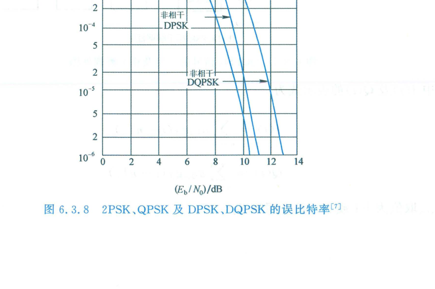

  <figcaption>图 6.3.8 2PSK, QPSK 及 DPSK, DQPSK 的误比特率（原书影印参考）</figcaption>
</figure>

---

## 6.3.3 偏移四相移相键控（OQPSK）

在无线数字通信发端，已调频带信号必须送入高功率放大器（HPA）进行功率放大。然而实际功率放大器均存在饱和非线性区。如果输入信号包络剧烈起伏，功放的 AM/AM 与 AM/PM 非线性失真将导致：
1. 信号星座图产生非线性畸变与压缩，误码率急剧升高；
2. 已经滤波成形的频带外功率发生严重**频谱再生（Spectral Regrowth）**，旁瓣剧烈抬升，严重干扰邻近信道。

### 1. 传统 QPSK 的包络陷落危机

在传统 QPSK 中，同相支路 $a_I(t)$ 与正交支路 $a_Q(t)$ 在符号时钟边界上完全对齐。当两个支路的数据同时发生电平翻转时（例如从 $(+1, +1)$ 跃迁至 $(-1, -1)$）：
- 信号相位发生 **$180^\circ$ 的突变**；
- 经过脉冲成形低通滤波后，信号合成包络 $A(t) = \sqrt{a_I^2(t) + a_Q^2(t)}$ 会**瞬时穿越零点（$A(t) \to 0$）**，如图 6.3.9(a) 所示。
- 此时包络峰均功率比（PAPR）极大，包络最大值与最小值之比趋近于无穷大。

<figure class="vp-figure">

  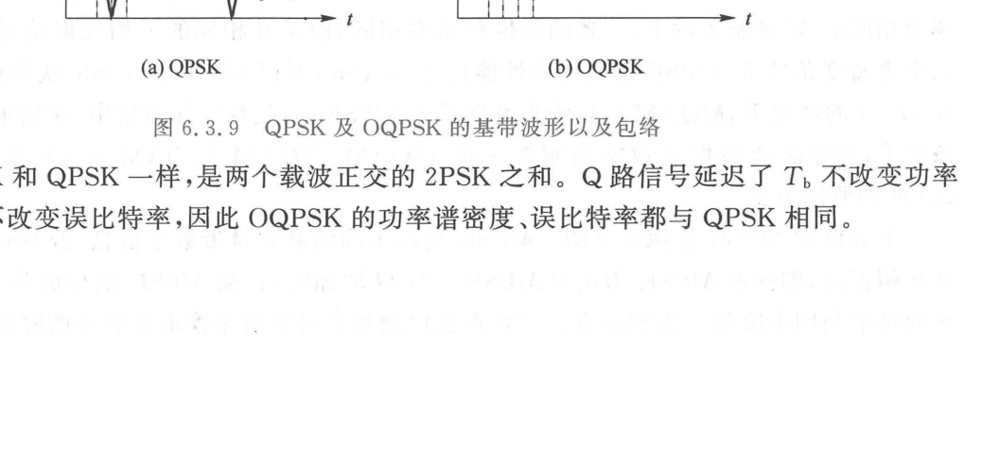

  <figcaption>图 6.3.9 QPSK 及 OQPSK 的基带波形以及包络（原书影印参考）</figcaption>
</figure>

### 2. OQPSK 的正交时移解耦机制

偏移四相移相键控（Offset QPSK, OQPSK，又称参差 QPSK）的核心改进非常优雅：
**在调制发端将 $Q$ 支路的基带脉冲序列在时间轴上强制错开半个符号周期（即 1 个比特间隔 $T_b = T_s/2$）**：

$$
s_{\text{OQPSK}}(t) = a_I(t)\cos\omega_c t - a_Q(t - T_b)\sin\omega_c t
$$

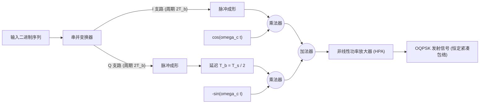

<figure class="vp-figure">

  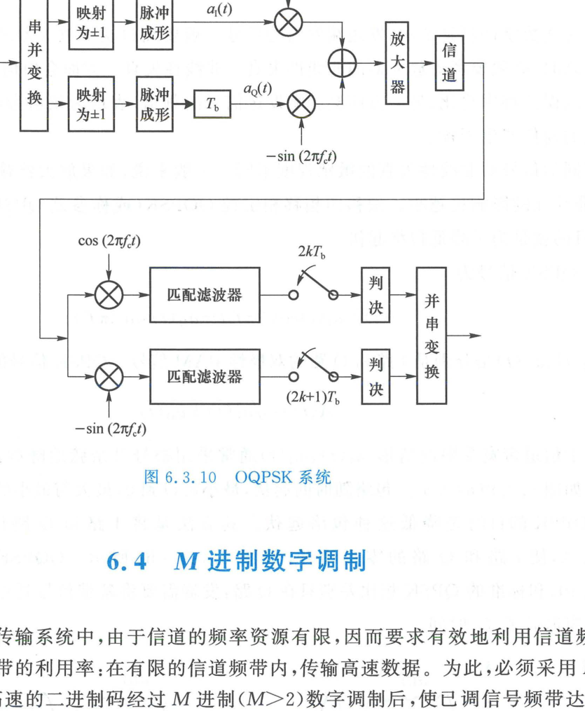

  <figcaption>图 6.3.10 OQPSK 系统（原书影印参考）</figcaption>
</figure>

### 3. OQPSK 性能物理特性

1. **彻底杜绝 $180^\circ$ 相位跃变**：
   由于两路跳变时刻交替错开 $T_b$，在任何单一跳变时刻只有一路电平发生变化。载波相位在单次状态转换中**最大仅能改变 $\pm 90^\circ$ 或 $0^\circ$**，绝对不会穿过原点，如图 6.3.9(b) 所示。
2. **极度平滑的包络特性**：
   限带后包络波动范围大大缩小（包络谷值仅降至峰值的 $1/\sqrt{2} \approx 0.707$），极大放宽了对射频高功率放大器线性动态范围的要求，功放可在接近饱和点的高效率区工作。
3. **频谱与误码率完全不变**：
   由于 $Q$ 支路延迟 $T_b$ 仅是时间平移，两路载波依然保持严密正交。在 AWGN 线性信道中，**OQPSK 的理论功率谱密度和误比特率与标准 QPSK 完全一致**；但在带限非线性信道中，OQPSK 的抗旁瓣扩展性能具有压倒性优势。

<ExerciseTrigger chapter={6} section="6.3" title="6.3 四相移相键控 课后习题与自测" />
