import Knowledge from '@/components/Knowledge.astro';
import Example from '@/components/Example.astro';
import Solution from '@/components/Solution.astro';
import ExerciseTrigger from '@/components/ExerciseTrigger.astro';

在实际通信系统中，频带资源极其宝贵。为了在有限的信道带宽内容纳高速数据，必须采用 $M$ 进制（$M > 2$）数字调制技术，将每 $K = \log_2 M$ 个二进制比特组合为一个多进制符号。本节将几何信号空间理论（Signal Space Theory）与统计判决理论相结合，系统建立多进制确定信号在加性高斯白噪声（AWGN）信道下的最佳接收模型，并深入剖析 **MASK、MPSK、MQAM 与 MFSK** 的星座图几何特性、最优接收机拓扑与误符率闭式推导。

---

## 6.4.1 数字调制信号的矢量几何表示

信号波形在时域的内积运算与多维欧几里得矢量空间在数学结构上高度同构。利用归一化正交基函数系，可将复杂的时域信号波形严格映射为几何空间中的离散点——**星座点（Constellation Points）**。

### 1. 正交信号空间与信号矢量

设集合 $\{f_1(t), f_2(t), \dots, f_N(t)\}$ 是在符号区间 $[0, T_s]$ 上的一组**归一化正交基函数（Orthonormal Basis Functions）**，满足：

$$
\int_0^{T_s} f_n(t) f_m(t)\,\mathrm{d}t = \delta_{nm} = \begin{cases} 1, & n = m \\ 0, & n \neq m \end{cases} \tag{6.4.5}
$$

任意具有有限能量的确定实信号波形 $s_i(t)$（$i = 1, 2, \dots, M$）均可精确展开为该基函数系的线性组合：

$$
s_i(t) = \sum_{j=1}^{N} s_{ij} f_j(t), \quad 0 \leqslant t \leqslant T_s \tag{6.4.6}
$$

展开系数 $s_{ij}$ 是信号 $s_i(t)$ 在基函数 $f_j(t)$ 上的投影（内积）：

$$
s_{ij} = \langle s_i(t), f_j(t) \rangle = \int_0^{T_s} s_i(t) f_j(t)\,\mathrm{d}t \tag{6.4.7}
$$

因此，时域信号波形 $s_i(t)$ 唯一对应于 $N$ 维欧氏空间中的一个**信号矢量** $\boldsymbol{s}_i$：

$$
\boldsymbol{s}_i = [s_{i1}, s_{i2}, \dots, s_{iN}]^T \in \mathbb{R}^N
$$

基函数的数量 $N$ 称为**信号空间的维数（Dimension）**，必满足 $N \leqslant M$。波形产生与系数恢复原理如图 6.4.4 所示。

<figure class="vp-figure">

  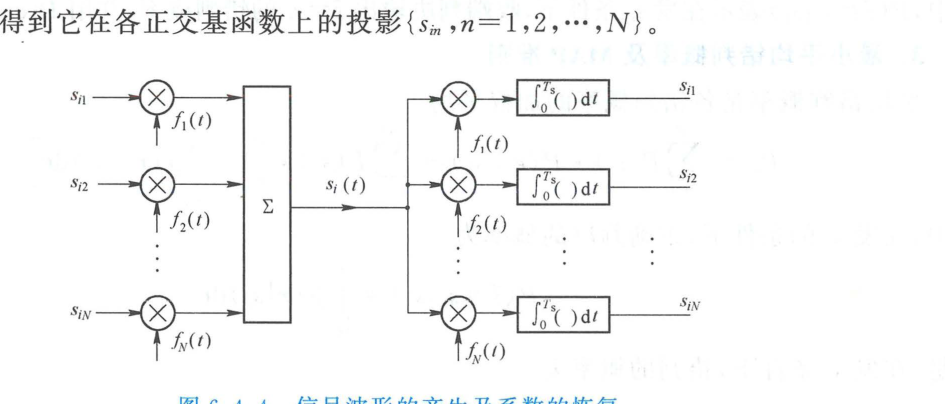

  <figcaption>图 6.4.4 信号波形的产生及系数的恢复（原书影印参考）</figcaption>
</figure>

### 2. 信号能量与欧几里得距离

在正交信号空间中，信号的物理能量即为信号矢量的模长平方：

$$
E_i = \int_0^{T_s} s_i^2(t)\,\mathrm{d}t = \sum_{j=1}^{N} s_{ij}^2 = \|\boldsymbol{s}_i\|^2 \tag{6.4.11}
$$

两信号波形 $s_i(t)$ 与 $s_k(t)$ 之间的**欧几里得距离（Euclidean Distance）**为：

$$
d_{ik} = \|\boldsymbol{s}_i - \boldsymbol{s}_k\| = \sqrt{\sum_{j=1}^{N} (s_{ij} - s_{kj})^2} = \sqrt{\int_0^{T_s} [s_i(t) - s_k(t)]^2\,\mathrm{d}t} \tag{6.4.14}
$$

展开后建立欧几里得距离与相关系数的内在等式：

$$
d_{ik}^2 = \|\boldsymbol{s}_i\|^2 + \|\boldsymbol{s}_k\|^2 - 2\langle \boldsymbol{s}_i, \boldsymbol{s}_k \rangle = E_i + E_k - 2\sqrt{E_i E_k}\rho_{ik} \tag{6.4.15}
$$

<Example id="6.4.1" title="例 6.4.1 2PSK 信号空间的几何表示">
写出 2PSK 信号集 $s_1(t) = A\cos\omega_c t$ 与 $s_2(t) = -A\cos\omega_c t$（$0 \leqslant t \leqslant T_b$）的归一化基函数、信号矢量、星座图及欧氏距离。
</Example>

<Solution title="解">
定义单一归一化基函数（$N = 1$ 维空间）：

$$
f_1(t) = \sqrt{\frac{2}{T_b}}\cos\omega_c t, \quad 0 \leqslant t \leqslant T_b
$$

此时信号投影为：
- $s_1(t) = \sqrt{\frac{A^2 T_b}{2}} f_1(t) = \sqrt{E_b} f_1(t) \implies \boldsymbol{s}_1 = [+\sqrt{E_b}]$；
- $s_2(t) = -\sqrt{\frac{A^2 T_b}{2}} f_1(t) = -\sqrt{E_b} f_1(t) \implies \boldsymbol{s}_2 = [-\sqrt{E_b}]$。

两信号在 1 维坐标轴上对称分布（图 6.4.3），欧氏距离达到最大可能值：

$$
d_{12} = \sqrt{E_b} - (-\sqrt{E_b}) = 2\sqrt{E_b}
$$

代入相关系数公式验证：$\rho_{12} = \frac{E_b + E_b - (2\sqrt{E_b})^2}{2E_b} = -1$，完全符合对跖信号特性。

<figure class="vp-figure">

  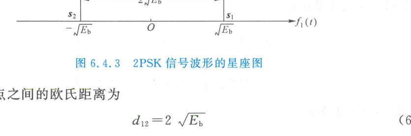

  <figcaption>图 6.4.3 2PSK 信号波形的星座图（原书影印参考）</figcaption>
</figure>

</Solution>

---

## 6.4.2 统计判决理论与最佳接收准则

### 1. 信号接收的统计假设模型

在 AWGN 信道中，接收信号波形为：

$$
r(t) = s_i(t) + n_w(t), \quad 0 \leqslant t \leqslant T_s, \quad i = 1, 2, \dots, M \tag{6.4.50}
$$

发端发射 $s_i(t)$ 的先验概率记为 $P(s_i)$。将连续波形 $r(t)$ 投影到基函数系 $\{f_j(t)\}_{j=1}^N$ 上，得到 $N$ 维观测矢量 $\boldsymbol{r} = [r_1, r_2, \dots, r_N]^T$（图 6.4.5）：

$$
r_k = \int_0^{T_s} r(t) f_k(t)\,\mathrm{d}t = s_{ik} + n_k, \quad k = 1, 2, \dots, N \tag{6.4.59}
$$

式中噪声投影分量 $n_k = \int_0^{T_s} n_w(t) f_k(t)\,\mathrm{d}t$ 均为零均值、方差为 $\sigma^2 = N_0/2$ 且相互统计独立的实高斯随机变量。

<figure class="vp-figure">

  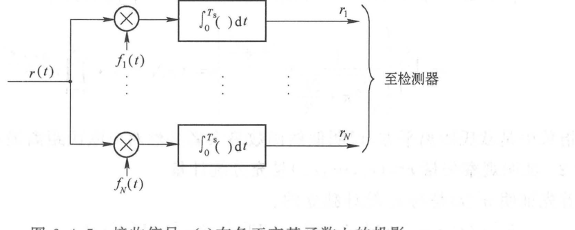

  <figcaption>图 6.4.5 接收信号波形在正交基函数上的投影（原书影印参考）</figcaption>
</figure>

### 2. 极大后验概率准则（MAP）与极大似然准则（ML）

统计判决的目标是根据观测向量 $\boldsymbol{r}$ 做出判决 $\hat{s}$，使全系统的平均判决错误概率最小化。根据贝叶斯准则，最优准则是**最大后验概率准则（Maximum A Posteriori, MAP）**：

$$
\hat{s} = \arg\max_{s_i} P(s_i | \boldsymbol{r}) = \arg\max_{s_i} P(s_i) p(\boldsymbol{r} | s_i) \tag{6.4.57}
$$

当各符号发射先验等概（$P(s_i) = 1/M$）时，MAP 准则退化为**最大似然准则（Maximum Likelihood, ML）**：

$$
\hat{s} = \arg\max_{s_i} p(\boldsymbol{r} | s_i)
$$

### 3. 最小欧几里得距离判决准则

在 AWGN 信道下，条件似然概率密度函数为多元高斯分布：

$$
p(\boldsymbol{r} | s_i) = \frac{1}{(\pi N_0)^{N/2}} \exp\left( -\frac{\|\boldsymbol{r} - \boldsymbol{s}_i\|^2}{N_0} \right) \tag{6.4.67}
$$

取自然对数后，最大化似然函数等价于**最小化接收矢量与候选信号矢量之间的欧氏几何距离**：

$$
\hat{s} = \arg\min_{s_i} \|\boldsymbol{r} - \boldsymbol{s}_i\|^2 \tag{6.4.68}
$$

展开欧氏距离：

$$
\|\boldsymbol{r} - \boldsymbol{s}_i\|^2 = \|\boldsymbol{r}\|^2 - 2\langle \boldsymbol{r}, \boldsymbol{s}_i \rangle + \|\boldsymbol{s}_i\|^2
$$

由于 $\|\boldsymbol{r}\|^2$ 对所有假设均相同，判决度量等价于最大化相关量减去偏置能耗：

$$
\hat{s} = \arg\max_{s_i} \left[ \langle \boldsymbol{r}, \boldsymbol{s}_i \rangle - \frac{1}{2} E_i \right] \tag{6.4.69}
$$

这奠定了由 $N$ 个相关器或匹配滤波器组成的最佳接收机结构（图 6.4.6 与图 6.4.7）。

<figure class="vp-figure">

  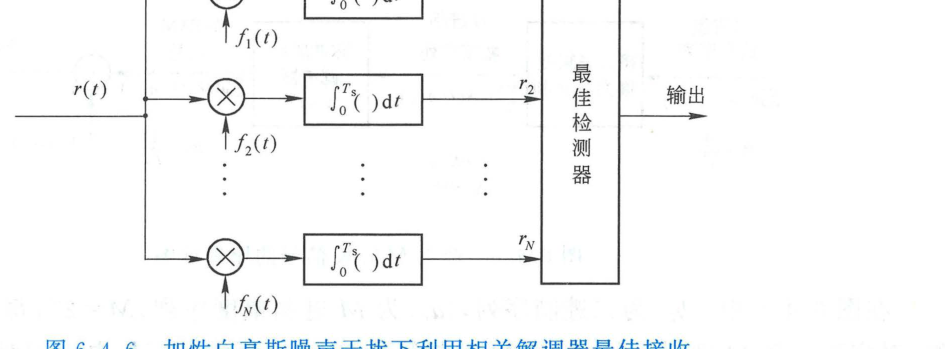

  <figcaption>图 6.4.6 加性白高斯噪声干扰下利用相关解调器最佳接收（原书影印参考）</figcaption>
</figure>

<figure class="vp-figure">

  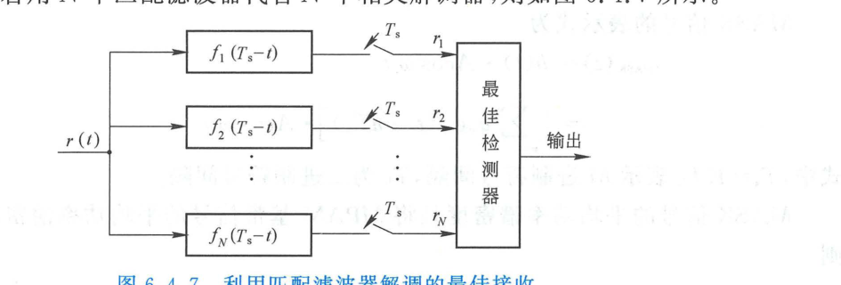

  <figcaption>图 6.4.7 利用匹配滤波器解调的最佳接收（原书影印参考）</figcaption>
</figure>

---

## 6.4.3 M 进制振幅键控（MASK）

$M$ 进制振幅键控（MASK）又称多电平振幅键控，载波幅度在 $M$ 个离散电平之间受控变换。

### 1. MASK 信号模型与功率谱

信号产生框图如图 6.4.8 所示。

<figure class="vp-figure">

  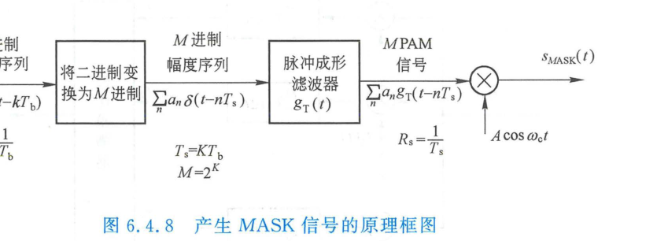

  <figcaption>图 6.4.8 产生 MASK 信号的原理框图（原书影印参考）</figcaption>
</figure>

对称双极性 MASK 信号时域表达为：

$$
s_i(t) = A_i g_T(t)\cos\omega_c t, \quad 0 \leqslant t \leqslant T_s, \quad i = 1, 2, \dots, M
$$

幅度电平对称分布于一维直线上：$A_i = (2i - 1 - M)d$。相邻电平间距为 $2d$。信号维数为 $N = 1$（图 6.4.10 为 8ASK 星座图）。功率谱如图 6.4.9 所示，主瓣带宽为 $B = 2/T_s = 2R_s = \frac{2R_b}{\log_2 M}$。

<figure class="vp-figure">

  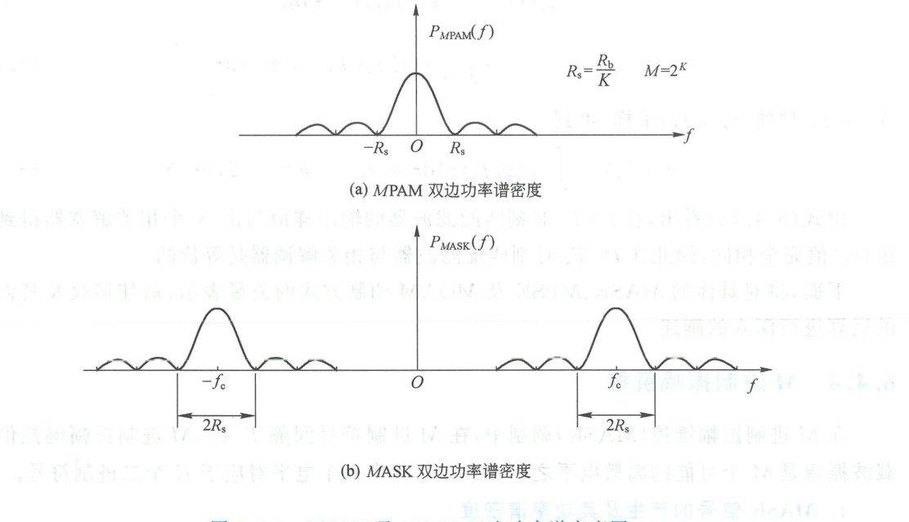

  <figcaption>图 6.4.9 MPAM 与 MASK 信号的功率谱密度图（原书影印参考）</figcaption>
</figure>

<figure class="vp-figure">

  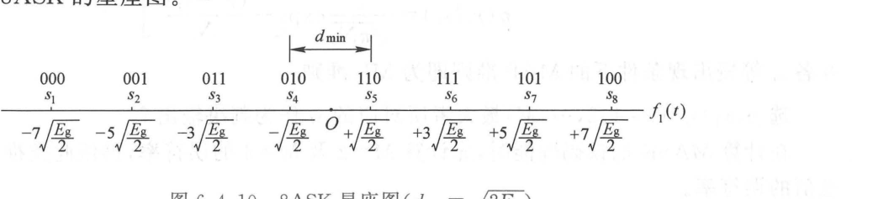

  <figcaption>图 6.4.10 8ASK 信号的星座图（原书影印参考）</figcaption>
</figure>

### 2. MASK 最佳接收与误符号率（SER）

MASK 最佳接收机采用单路相关或匹配滤波结构（图 6.4.11），判决区域分布如图 6.4.12 与图 6.4.13 所示。

<figure class="vp-figure">

  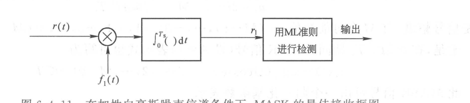

  <figcaption>图 6.4.11 MASK 最佳接收机框图（原书影印参考）</figcaption>
</figure>

<figure class="vp-figure">

  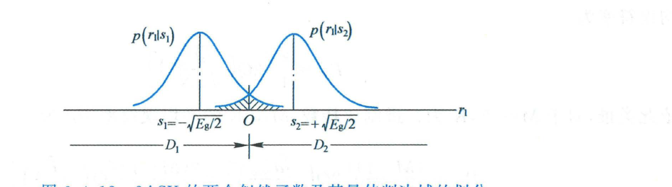

  <figcaption>图 6.4.12 2ASK 最佳判决区域与概率密度（原书影印参考）</figcaption>
</figure>

<figure class="vp-figure">

  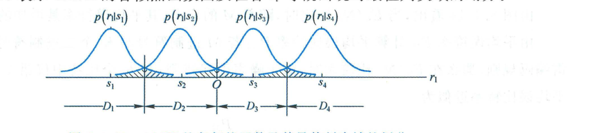

  <figcaption>图 6.4.13 4ASK 最佳判决区域与概率密度（原书影印参考）</figcaption>
</figure>

一维点阵中，内侧 $M - 2$ 个点具有双侧判决错误边界，外侧 2 个极值点仅有单侧错误边界。每个电平间距为 $d_{\min} = 2d$。平均符号能量为：

$$
E_s = \frac{1}{M}\sum_{i=1}^M A_i^2 \frac{E_g}{2} = \frac{M^2 - 1}{3} d^2 \frac{E_g}{2}
$$

推导得到 **MASK 平均误符号率（SER）闭式解**：

$$
P_M = \frac{2(M - 1)}{M} Q\left(\sqrt{\frac{6\log_2 M}{M^2 - 1}\frac{E_b}{N_0}}\right) = \frac{M - 1}{M}\operatorname{erfc}\left(\sqrt{\frac{3\log_2 M}{M^2 - 1}\frac{E_b}{N_0}}\right) \tag{6.4.103}
$$

误符号率曲线如图 6.4.14 所示。可见 $M$ 增加时，一维直线上的星座点密集度急剧上升，抗噪性能严重劣化。

<figure class="vp-figure">

  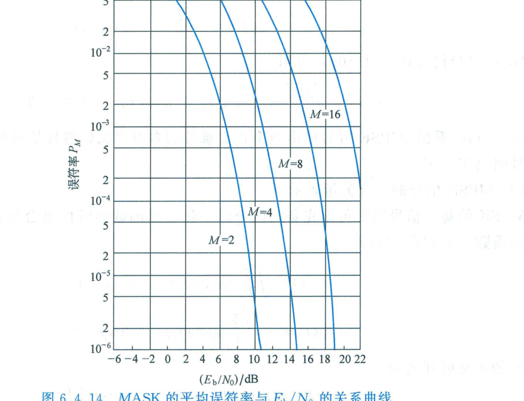

  <figcaption>图 6.4.14 MASK 的平均误符率与 Eb/N0 的关系曲线（原书影印参考）</figcaption>
</figure>

---

## 6.4.4 M 进制移相键控（MPSK）

$M$ 进制移相键控（MPSK）将信息调制在载波的 $M$ 个等间隔相位角上。

### 1. MPSK 矢量模型与星座图

时域表达式展开为正交基：

$$
s_i(t) = g_T(t)\cos\left[ \omega_c t + \frac{2\pi(i - 1)}{M} \right] = a_{ic} g_T(t)\cos\omega_c t - a_{is} g_T(t)\sin\omega_c t \tag{6.4.108}
$$

式中 $a_{ic} = \cos\frac{2\pi(i-1)}{M}$，$a_{is} = \sin\frac{2\pi(i-1)}{M}$。所有星座点均匀分布在半径为 $\sqrt{E_s}$ 的二维圆周上（$N = 2$ 维空间），具有**严格的恒包络特性**（图 6.4.15 为 8PSK 星座图）。

<figure class="vp-figure">

  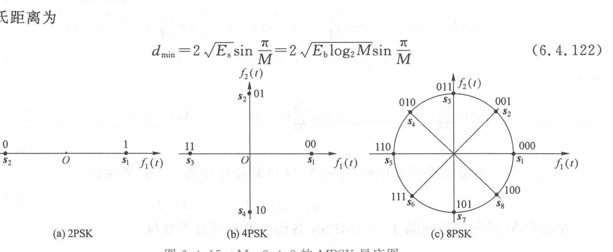

  <figcaption>图 6.4.15 MPSK 信号矢量星座图（原书影印参考）</figcaption>
</figure>

8PSK 发射调制框图与电平变换如图 6.4.16 与图 6.4.17 所示，功率谱与接收机见图 6.4.18 与图 6.4.19。

<figure class="vp-figure">

  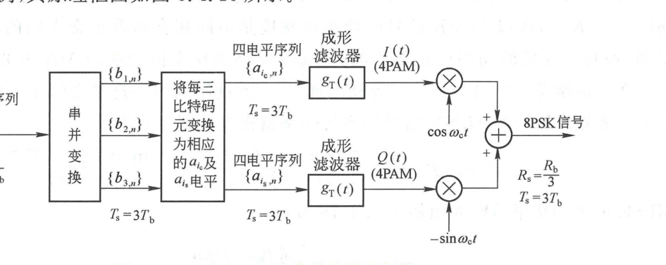

  <figcaption>图 6.4.16 产生 8PSK 信号原理框图（原书影印参考）</figcaption>
</figure>

<figure class="vp-figure">

  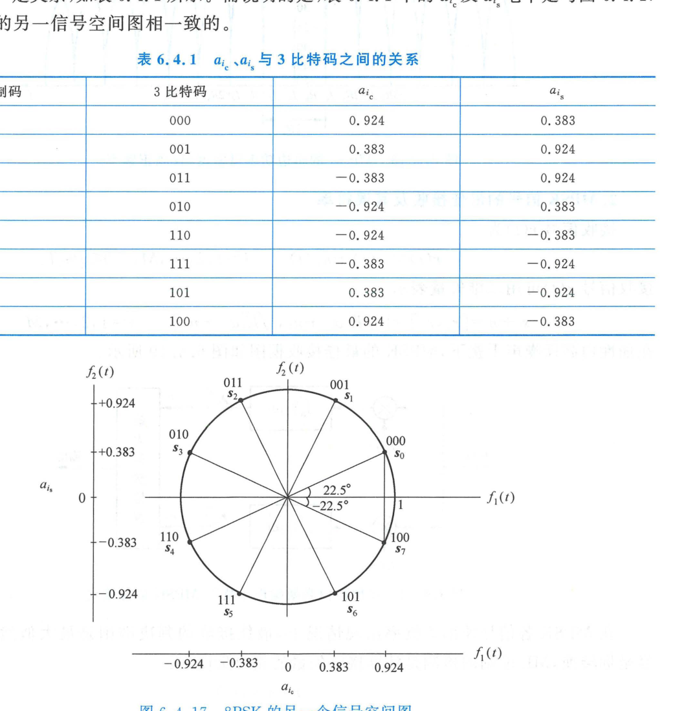

  <figcaption>图 6.4.17 8PSK 的 a_ic 与 a_is 电平（原书影印参考）</figcaption>
</figure>

<figure class="vp-figure">

  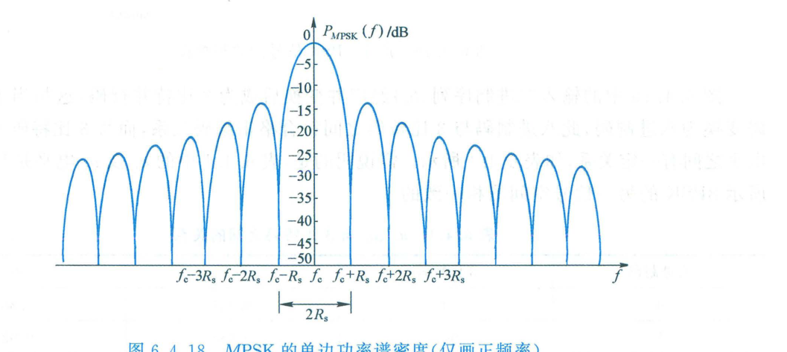

  <figcaption>图 6.4.18 MPSK 信号功率谱密度图（原书影印参考）</figcaption>
</figure>

<figure class="vp-figure">

  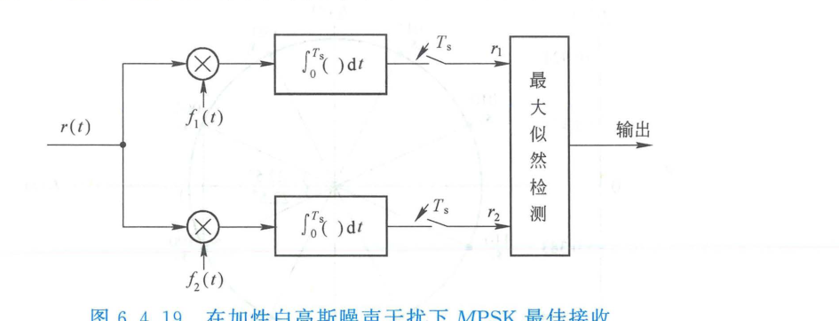

  <figcaption>图 6.4.19 MPSK 最佳接收机框图（原书影印参考）</figcaption>
</figure>

### 2. MPSK 最小欧氏距离与误符号率界

相邻两星座点之间的欧氏几何距离为：

$$
d_{\min} = 2\sqrt{E_s}\sin\frac{\pi}{M} = 2\sqrt{E_b \log_2 M}\sin\frac{\pi}{M} \tag{6.4.123}
$$

判决区域为圆周上的扇形锲体（图 6.4.20）。根据几何并集界（Union Bound），在高信噪比下 MPSK 误符号率具有极其紧密的上界近似：

$$
P_M \approx 2 Q\left( \sqrt{\frac{2E_s}{N_0}}\sin\frac{\pi}{M} \right) = \operatorname{erfc}\left( \sqrt{\frac{E_b \log_2 M}{N_0}}\sin\frac{\pi}{M} \right) \tag{6.4.137}
$$

误符号率曲线如图 6.4.21 所示。当 $M > 4$ 时，圆周上的相位点越发拥挤，$d_{\min}$ 随 $M$ 呈反比例急剧衰减，导致大进制 MPSK（如 16PSK、32PSK）的功率利用率显著劣于 MQAM。

<figure class="vp-figure">

  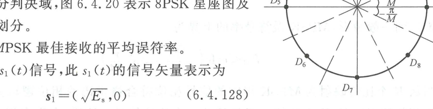

  <figcaption>图 6.4.20 8PSK 的判决区域与信号矢量（原书影印参考）</figcaption>
</figure>

<figure class="vp-figure">

  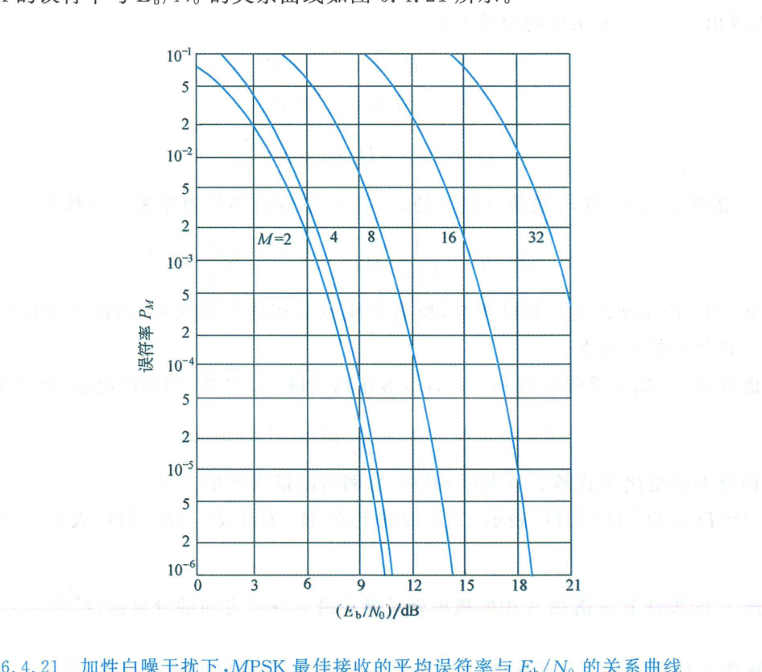

  <figcaption>图 6.4.21 MPSK 的平均误符率与 Eb/N0 关系曲线（原书影印参考）</figcaption>
</figure>

---

## 6.4.5 正交幅度调制（MQAM）

为了突破 MPSK 星座点仅能局限在二维一维圆周上的几何瓶颈，正交幅度调制（QAM）联合控制载波的幅度和相位，将星座点铺满整个二维欧几里得平面，**是在带限信道下实现高阶频谱效率的最优方案**。

### 1. MQAM 信号表达与矩形网格星座

矩形 MQAM（$M = 2^K$，$K$ 为偶数，如 16QAM、64QAM、256QAM）可完全解耦为两个独立的 $\sqrt{M}\text{PAM}$ 正交调制之和：

$$
s_{\text{QAM}}(t) = a_{ic} g_T(t)\cos\omega_c t - a_{is} g_T(t)\sin\omega_c t \tag{6.4.141}
$$

式中 $a_{ic}, a_{is} \in \{\pm d, \pm 3d, \dots, \pm (\sqrt{M} - 1)d\}$。图 6.4.22 与图 6.4.24 展示了 16QAM 的矩形网格星座图与格雷码映射。

<figure class="vp-figure">

  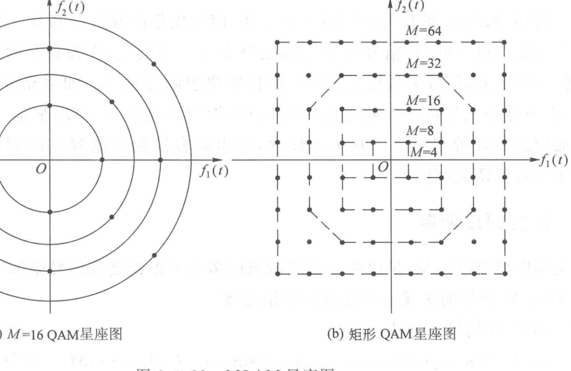

  <figcaption>图 6.4.22 MQAM 信号星座图（原书影印参考）</figcaption>
</figure>

<figure class="vp-figure">

  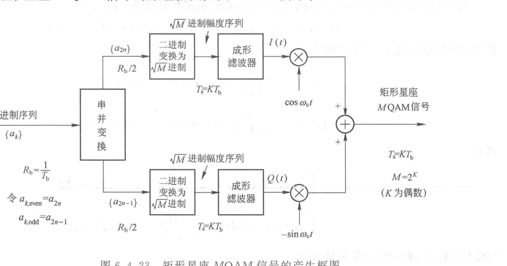

  <figcaption>图 6.4.23 产生 MQAM 信号原理框图（原书影印参考）</figcaption>
</figure>

<figure class="vp-figure">

  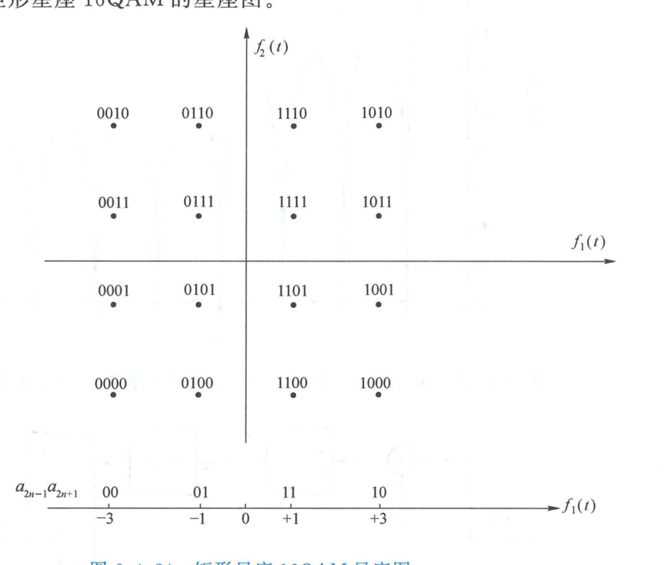

  <figcaption>图 6.4.24 16QAM 星座图与格雷码映射（原书影印参考）</figcaption>
</figure>

功率谱与最佳接收架构如图 6.4.25 与图 6.4.26 所示。

<figure class="vp-figure">

  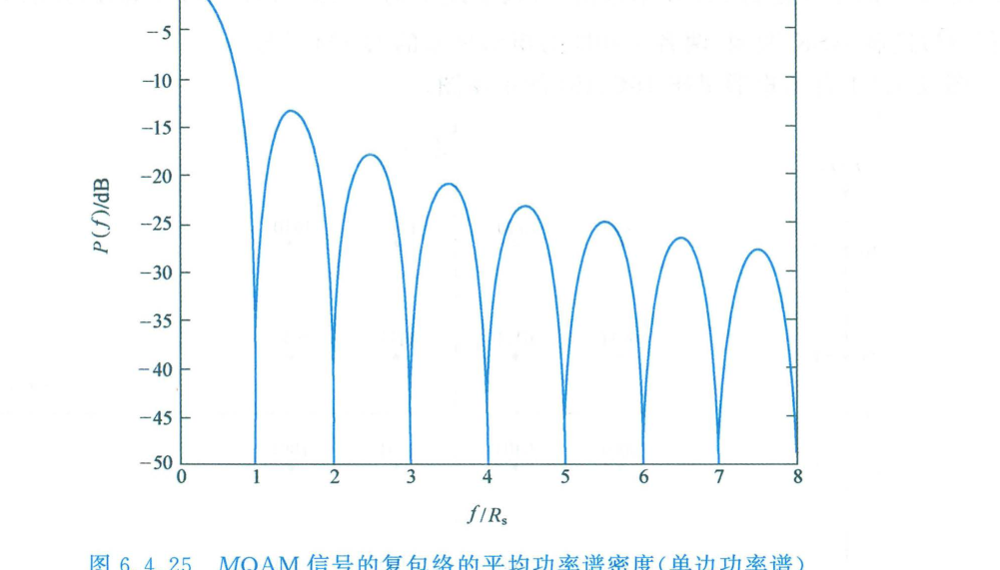

  <figcaption>图 6.4.25 矩形脉冲成形 MQAM 信号功率谱密度（原书影印参考）</figcaption>
</figure>

<figure class="vp-figure">

  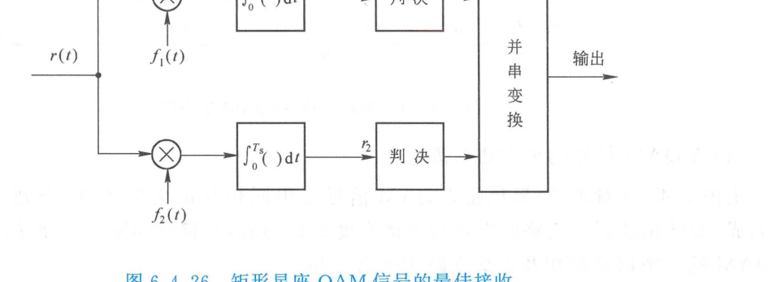

  <figcaption>图 6.4.26 MQAM 最佳接收机框图（原书影印参考）</figcaption>
</figure>

### 2. MQAM 误符号率与相对 MPSK 的增益优势

由于同相与正交两路统计独立，QAM 符号正确判决概率等于两路 $\sqrt{M}\text{PAM}$ 正确判决概率的乘积：

$$
P_c = (1 - P_{\sqrt{M}})^2 \implies P_M = 1 - (1 - P_{\sqrt{M}})^2 \tag{6.4.153}
$$

在高信噪比下，展开近似得到 **MQAM 误符号率精确表达式**：

$$
P_M \approx 2 P_{\sqrt{M}} = 4\left(1 - \frac{1}{\sqrt{M}}\right) Q\left(\sqrt{\frac{3\log_2 M}{M - 1}\frac{E_b}{N_0}}\right) \tag{6.4.155}
$$

误码率关系曲线如图 6.4.27 所示。

<figure class="vp-figure">

  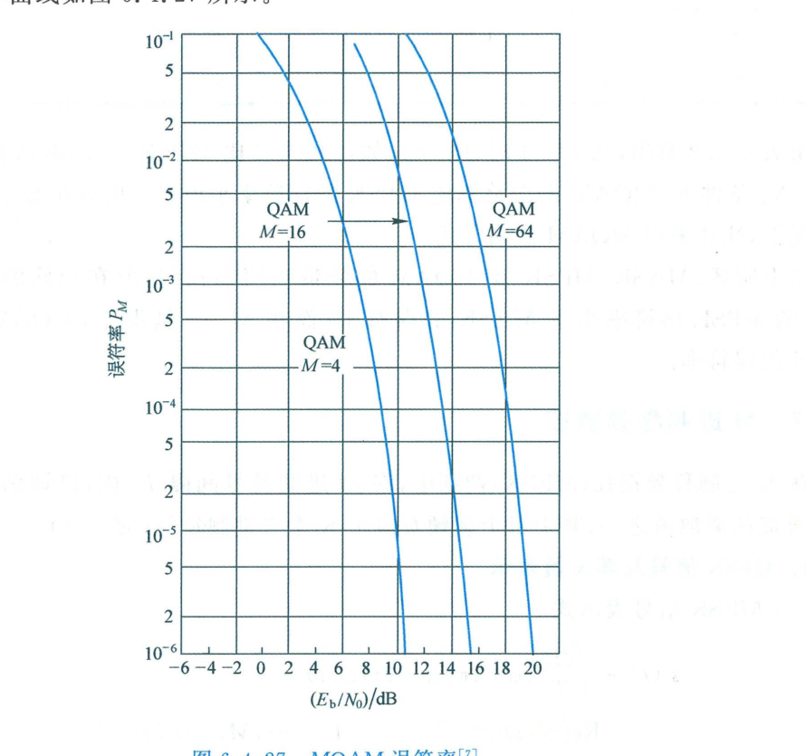

  <figcaption>图 6.4.27 MQAM 平均误符率与 Eb/N0 关系曲线（原书影印参考）</figcaption>
</figure>

<Knowledge title="MQAM 相对 MPSK 的能量效率改善量">

在保持相同误符号率 $P_M$ 与相同调制阶数 $M$ 的条件下，MQAM 相对 MPSK 所需平均发射功率的比值为：

$$
R_M \approx \frac{\frac{2(M-1)}{3}}{\frac{1}{2\sin^2(\pi/M)}} = \frac{4(M-1)}{3}\sin^2\left(\frac{\pi}{M}\right)
$$

下表列出各阶调制下的信噪比改善增益：

| 调制阶数 $M$ | 10 $\log_{10} R_M$ 改善增益 (dB) | 工程结论 |
| :---: | :---: | :--- |
| **$M = 4$** | $0\text{ dB}$ | 4QAM 与 QPSK 在几何拓扑上严格等价 |
| **$M = 8$** | $1.65\text{ dB}$ | 8QAM 性能优于 8PSK |
| **$M = 16$** | **$4.20\text{ dB}$** | 16QAM 具有压倒性优势，已全面取代 16PSK |
| **$M = 32$** | $7.02\text{ dB}$ | 节省发射功率达 5 倍以上 |
| **$M = 64$** | **$9.95\text{ dB}$** | 节省发射功率近 10 倍（1 个数量级） |

</Knowledge>

---

## 6.4.6 M 进制移频键控（MFSK）

MFSK 采用 $M$ 个不同频率的正弦载波携带数字信息，各信号能量相等：

$$
s_i(t) = \sqrt{\frac{2E_s}{T_s}}\cos(2\pi f_c t + 2\pi i \Delta f t), \quad 0 \leqslant t \leqslant T_s, \quad i = 1, 2, \dots, M \tag{6.4.160}
$$

相邻载频间隔满足相干正交条件：$\Delta f = \frac{1}{2T_s}$。图 6.4.28 给出互相关系数与频偏曲线。

<figure class="vp-figure">

  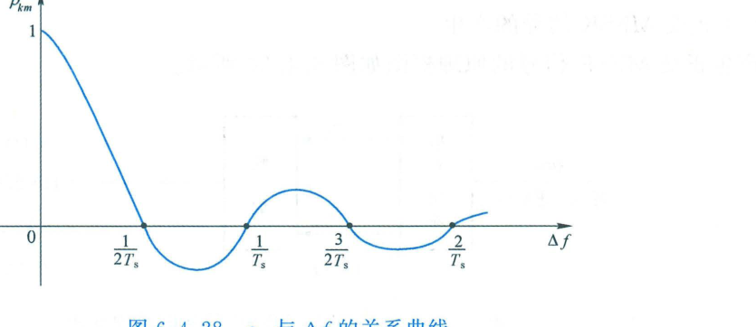

  <figcaption>图 6.4.28 MFSK 信号相关系数 rho_km 与 Delta f 关系曲线（原书影印参考）</figcaption>
</figure>

### 1. 正交超空间几何星座与维数

正交 MFSK 各信号两两正交（$\rho_{ik} = 0, i \neq k$），信号空间维数达到最大可能值 $N = M$。信号空间星座图位于 $M$ 维超坐标系的正交基坐标轴上（图 6.4.29）。任意两信号之间的欧氏几何距离均为恒定值：

$$
d_{ik} = \sqrt{\|\boldsymbol{s}_i\|^2 + \|\boldsymbol{s}_k\|^2 - 0} = \sqrt{2E_s} = \sqrt{2E_b \log_2 M}
$$

<figure class="vp-figure">

  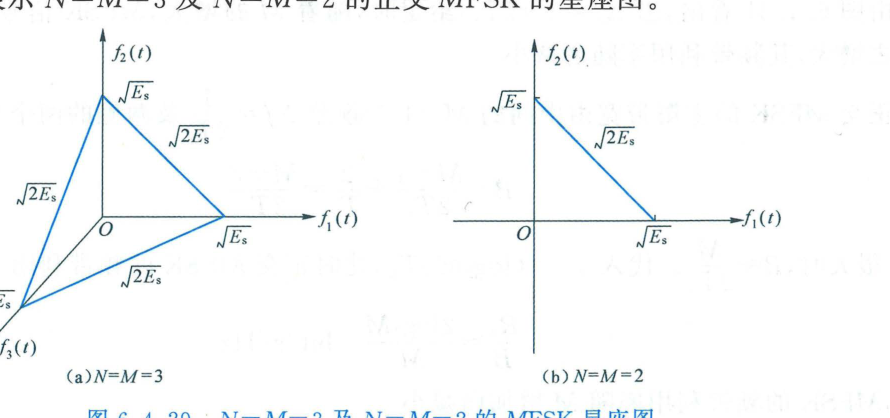

  <figcaption>图 6.4.29 N=M=3 及 N=M=2 的 MFSK 星座图（原书影印参考）</figcaption>
</figure>

信号产生、功率谱及最佳接收机（相关接收与匹配滤波组）如图 6.4.30 至图 6.4.33 所示。

<figure class="vp-figure">

  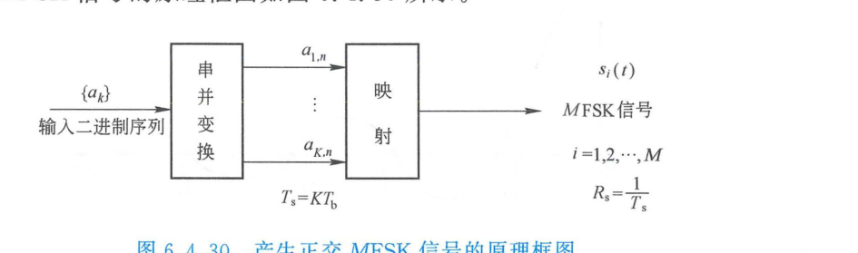

  <figcaption>图 6.4.30 MFSK 信号产生原理框图（原书影印参考）</figcaption>
</figure>

<figure class="vp-figure">

  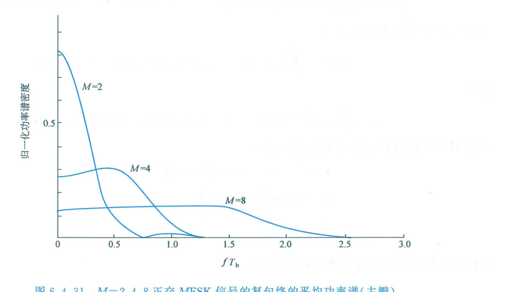

  <figcaption>图 6.4.31 MFSK 信号功率谱密度图（原书影印参考）</figcaption>
</figure>

<figure class="vp-figure">

  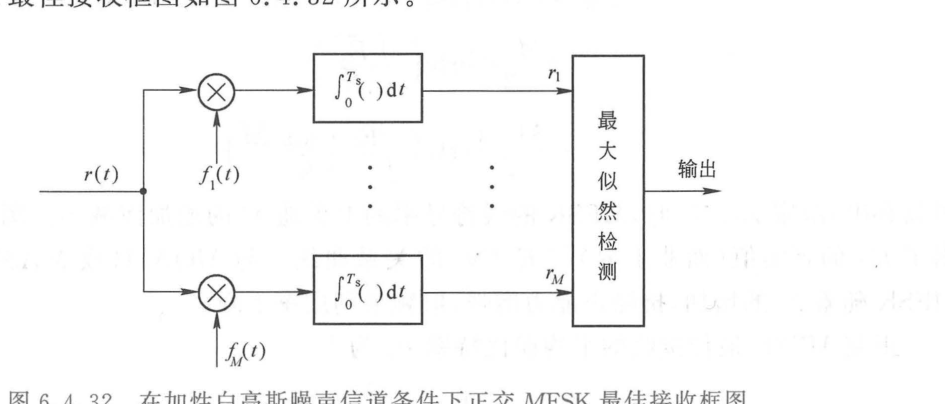

  <figcaption>图 6.4.32 正交 MFSK 最佳相关接收机框图（原书影印参考）</figcaption>
</figure>

<figure class="vp-figure">

  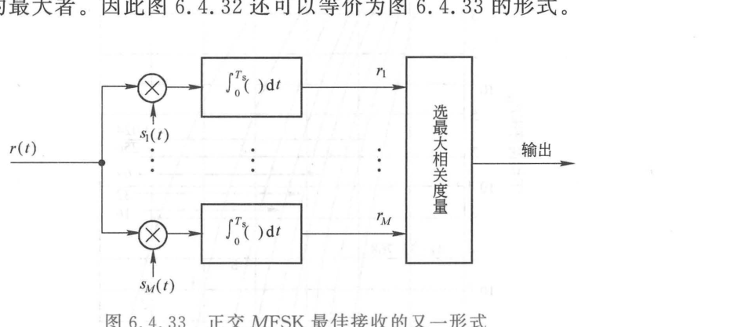

  <figcaption>图 6.4.33 正交 MFSK 匹配滤波器接收机框图（原书影印参考）</figcaption>
</figure>

### 2. MFSK 误码率性能与“以带宽换功率”定理

利用并集界（Union Bound），正交 MFSK 误符号率上界为：

$$
P_M \leqslant \sum_{k \neq 1} P(A_k) = \frac{M - 1}{2}\operatorname{erfc}\left(\sqrt{\frac{E_s}{2N_0}}\right) = \frac{M - 1}{2}\operatorname{erfc}\left(\sqrt{\frac{E_b \log_2 M}{2N_0}}\right) \tag{6.4.176}
$$

误比特率为 $P_b = \frac{M}{2(M-1)}P_M \approx \frac{1}{2}P_M$。图 6.4.34 绘出了误符率曲线族。

<figure class="vp-figure">

  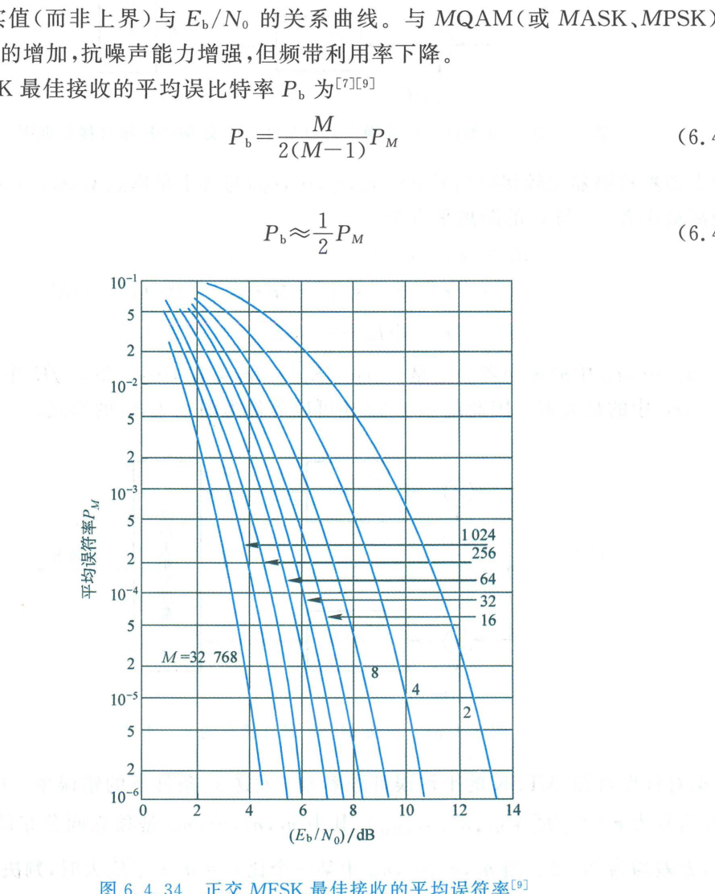

  <figcaption>图 6.4.34 正交 MFSK 最佳接收平均误符率与 Eb/N0 关系曲线（原书影印参考）</figcaption>
</figure>

<Knowledge title="香农容量与正交调制的物理极限定理">

- **功率效率与带宽代价的对偶关系**：
  - 在 MASK、MPSK 与 MQAM 中，随着阶数 $M$ 增加，频带利用率提高，但**误码率性能恶化（需要更高信噪比）**，体现为“以功率换带宽”；
  - 在正交 MFSK 中，随着阶数 $M$ 增加，任意两星座点距离随 $\sqrt{\log_2 M}$ 增大，**误码率性能单调提升（所需 $E_b/N_0$ 持续下降）**！但代价是信号频带 $B \approx M \Delta f$ 随 $M$ 呈指数膨胀，体现为**“以带宽换功率”**。

- **香农绝热下界**：
  当 $M \to \infty$（带宽无限扩张）时，由式 (6.4.176) 可严密推导出：只要比特信噪比满足：

  $$
  \frac{E_b}{N_0} > \ln 2 \approx 0.693 \quad (-1.59\text{ dB})
  $$

  误符号率将指数逼近于零：$\lim_{M \to \infty} P_M = 0$。$-1.59\text{ dB}$ 正是信息论中高斯信道无限带宽下的**香农极限（Shannon Limit）**。

</Knowledge>

<ExerciseTrigger chapter={6} section="6.4" title="6.4 M 进制数字调制 课后习题与自测" />
