import Card from '@/components/Card.astro';
import ExerciseTrigger from '@/components/exercises/ExerciseTrigger.astro';

恒包络连续相位调制（Continuous Phase Modulation, CPM）是现代数字移动通信、卫星通信和遥测遥控系统中极其重要的一类调制技术。在非线性信道（如行波管放大器、各类饱和非线性功率放大器）中，普通调制信号（如 QPSK、QAM）剧烈的包络起伏会引发严重的 **AM-AM（幅度-幅度失真）** 与 **AM-PM（幅度-相位失真）**，导致带外频谱急剧旁瓣再生（Spectral Regrowth），严重干扰相邻信道。

CPM 信号通过强制信号具有 **严格恒定的物理包络** 与 **平滑连续的相位轨迹**，彻底根除了包络波动，允许发射机射频功率放大器工作于最高效率的非线性饱和状态（如 C 类功率放大器），同时带来高阶滚降（如 $f^{-4}$ 乃至指数衰减）的高阻带衰减特性。

本节系统剖析两类最具代表性的恒包络连续相位调制体制：**最小移频键控（MSK）** 与 **高斯最小移频键控（GMSK）**。

---

## 6.5.1 最小移频键控（MSK）

### 1. MSK 的物理起源与参数约束

在 6.2 节中讨论连续相位 2FSK（CPFSK）时已知，两正弦载频信号在符号周期 $T_b$ 内保持相干正交的最小频率间隔为：
$$
\Delta f = |f_1 - f_2| = \frac{1}{2T_b}
$$

  

  
图 6.5.1 2FSK 信号在相干解调下的最小正交频差 $\Delta f = 1/(2T_b)$

在此临界正交频差下，调制指数定义为：
$$
h = \frac{\Delta f}{R_b} = \Delta f \cdot T_b = \frac{1}{2}
$$
由于 $h = 0.5$ 是实现两相干载频正交的**数学下限**，且同时保证了相位轨迹的时间连续性，故称为**最小移频键控（Minimum Shift Keying, MSK）**。

MSK 的两个离散振荡频率关于中心载频 $f_c$ 对称分布：
$$
\begin{cases}
f_1 = f_c + \Delta f / 2 = f_c + \frac{1}{4T_b} \\
f_2 = f_c - \Delta f / 2 = f_c - \frac{1}{4T_b}
\end{cases}
$$
峰值频偏为：
$$
\Delta F = \frac{\Delta f}{2} = \frac{1}{4T_b}
$$

  

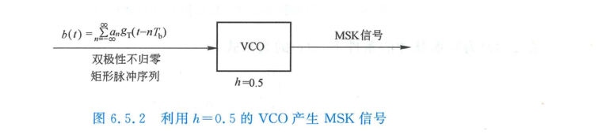

  
图 6.5.2 利用压控振荡器（VCO, 调制指数 $h=0.5$）调频产生 MSK 信号原理

---

### 2. MSK 时域表达式与相位轨迹

将输入的双极性基带数据序列记为 $a_n \in \{+1, -1\}$，基带信号为：
$$
b(t) = \sum_{n=-\infty}^{\infty} a_n g_T(t - nT_b)
$$
其中 $g_T(t)$ 为宽度为 $T_b$ 的矩形不归零脉冲：
$$
g_T(t) = \begin{cases} 1, & 0 \le t < T_b \\ 0, & \text{其它} \end{cases}
$$

将 $b(t)$ 馈入灵敏度为 $K_f = \frac{1}{4T_b}$ 的压控振荡器（VCO），其瞬间角频率与输出信号为：
$$
\omega(t) = 2\pi f_c + 2\pi K_f b(t) = 2\pi f_c + \frac{\pi}{2T_b} b(t)
$$
$$
s_{\text{MSK}}(t) = A \cos\left(2\pi f_c t + \theta(t)\right)
$$
其中总附加相位 $\theta(t)$ 为输入频偏在历史时间上的积分：
$$
\theta(t) = 2\pi K_f \int_{-\infty}^{t} b(\tau) \mathrm{d}\tau = \frac{\pi}{2T_b} \int_{-\infty}^{t} b(\tau) \mathrm{d}\tau
$$

定义单元相位跃迁阶跃响应函数 $q(t) = \int_{-\infty}^{t} g_T(\tau)\mathrm{d}\tau$：
$$
q(t) = \begin{cases}
0, & t < 0 \\
\frac{t}{2T_b}, & 0 \le t < T_b \\
\frac{1}{2}, & t \ge T_b
\end{cases}
$$

  

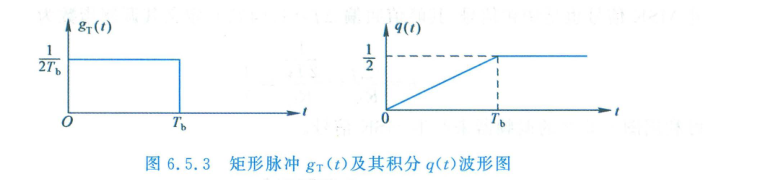

  
图 6.5.3 矩形频移脉冲 $g_T(t)$ 与其相位积分响应 $q(t)$

在任意第 $n$ 个比特区间 $n T_b \le t < (n+1)T_b$ 内，相位可精确分解为历史稳态累积项与当前码元的线性斜坡项：
$$
\theta(t) = \theta_n + a_n \frac{\pi}{2T_b}(t - nT_b), \quad nT_b \le t < (n+1)T_b
$$
其中历史累积初始相位 $\theta_n$ 为：
$$
\theta_n = \theta(nT_b) = \theta_0 + \frac{\pi}{2} \sum_{k=-\infty}^{n-1} a_k
$$
这表明：在每一个符号周期 $T_b$ 内，MSK 信号的附加相位 $\theta(t)$ 呈**斜率固定为 $\pm \frac{\pi}{2T_b}$ 的严格直线段变化**，单码元内总相位增量恰好为 $\pm \frac{\pi}{2}$。

#### 相位树与相位网格（Phase Trellis）
由于每一个码元贡献 $\pm \frac{\pi}{2}$ 的相位偏移，各码元边界时刻 $t = nT_b$ 处的相位具有强烈的状态记忆性：
- 当 $n$ 为偶数时：$\sum_{k} a_k$ 的奇偶性使得 $\theta(nT_b) \equiv 0$ 或 $\pi \pmod{2\pi}$；
- 当 $n$ 为奇数时：$\theta(nT_b) \equiv \pm \frac{\pi}{2} \pmod{2\pi}$。

  

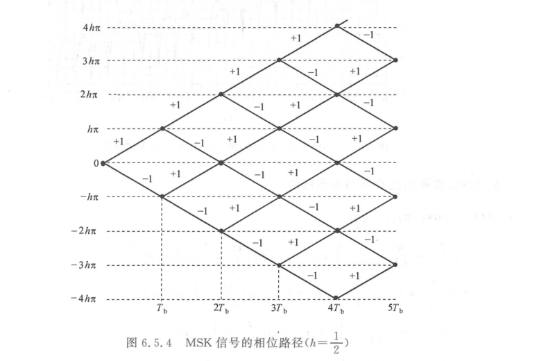

  
图 6.5.4 MSK 随输入码元演化的相位树（Phase Tree）与模 $2\pi$ 约束相位网格图（Phase Trellis）

  

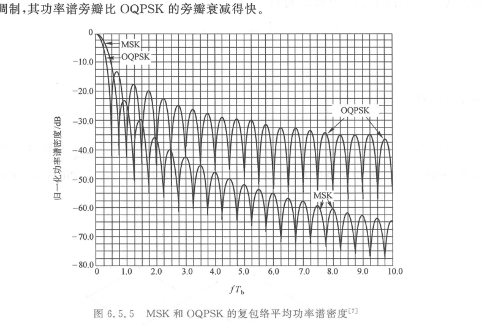

  
图 6.5.5 MSK 相位路径：相位轨迹平滑连续，杜绝瞬时相位突跳

---

### 3. MSK 的正交分解表示与恒包络机理

利用三角恒等式将 $s_{\text{MSK}}(t)$ 展开为同相（In-phase）与正交（Quadrature）分量：
$$
s_{\text{MSK}}(t) = A \cos\theta(t) \cos(2\pi f_c t) - A \sin\theta(t) \sin(2\pi f_c t)
$$
通过严密代数推导，在区间 $n T_b \le t < (n+1)T_b$ 内，将 $t$ 坐标系拆分为偶数周期与奇数周期，MSK 信号可等价表示为带有**半正弦脉冲成形**的正交错位调制：
$$
s_{\text{MSK}}(t) = A \left[ a_I(t) \cos\left(\frac{\pi t}{2T_b}\right) \cos(2\pi f_c t) - a_Q(t) \sin\left(\frac{\pi t}{2T_b}\right) \sin(2\pi f_c t) \right]
$$
式中：
1. $a_I(t)$ 为由输入比特序列抽取的同相支路码元，符号宽度为 $T_s = 2T_b$，在时钟点 $2k T_b$ 处发生电平翻转；
2. $a_Q(t)$ 为正交支路码元，符号宽度同为 $T_s = 2T_b$，但发生电平翻转的时钟点错开 $T_b$（位于 $(2k+1)T_b$ 处）；
3. $a_I(t), a_Q(t) \in \{+1, -1\}$。

#### 严格恒包络性质的证明
考察合成基带复包络的幅度：
$$
R(t) = A \sqrt{\left[a_I(t) \cos\left(\frac{\pi t}{2T_b}\right)\right]^2 + \left[a_Q(t) \sin\left(\frac{\pi t}{2T_b}\right)\right]^2}
$$
由于 $a_I^2(t) \equiv 1$ 且 $a_Q^2(t) \equiv 1$，得：
$$
R(t) = A \sqrt{\cos^2\left(\frac{\pi t}{2T_b}\right) + \sin^2\left(\frac{\pi t}{2T_b}\right)} \equiv A = \text{常数}
$$
**结论**：MSK 信号在任意时刻的瞬时包络恒定为 $A$，完全无任何幅度起伏，彻底免疫功放非线性导致的互调失真。

  

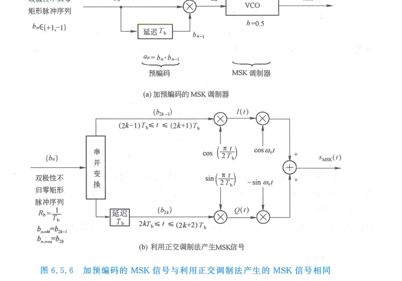

  
图 6.5.6 MSK 信号产生的两类经典架构：(a) 差分预编码正交调制法；(b) 交叉乘积直接合成法

---

### 4. MSK 的功率谱密度与高滚降特性

在正交分解形式下，MSK 的等效基带成形脉冲为宽度为 $2T_b$ 的半周期余弦波：
$$
g(t) = \begin{cases}
\cos\left(\frac{\pi t}{2T_b}\right), & -T_b \le t < T_b \\
0, & \text{其它}
\end{cases}
$$
其傅里叶变换频谱为：
$$
G(f) = \int_{-T_b}^{T_b} \cos\left(\frac{\pi t}{2T_b}\right) e^{-j 2\pi f t} \mathrm{d}t = \frac{4T_b}{\pi} \frac{\cos(2\pi f T_b)}{1 - (4f T_b)^2}
$$

由于同相与正交两支路数据在统计上相互独立且等概零均值，代入随机脉冲序列功率谱公式可得 MSK 带通功率谱密度：
$$
P_{\text{MSK}}(f) = \frac{16 A^2 T_b}{\pi^2} \left[ \frac{\cos(2\pi (f - f_c) T_b)}{1 - 16(f - f_c)^2 T_b^2} \right]^2
$$

  

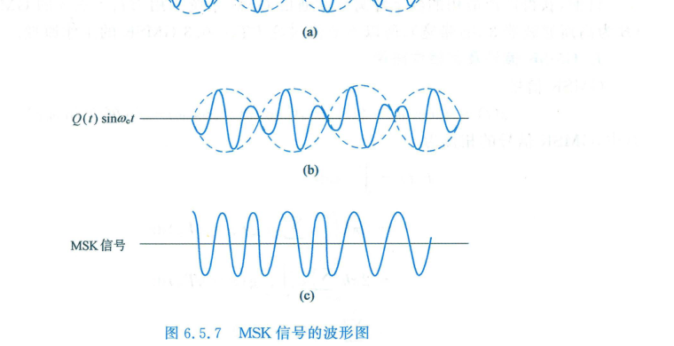

  
图 6.5.7 MSK 与 QPSK / OQPSK 的归一化单边带功率谱密度对比

#### MSK 与 QPSK 的频域特性深度剖析
1. **主瓣宽度**：
   - MSK 的第一谱零点出现在 $f - f_c = \frac{3}{4T_b} = 0.75 R_b$，主瓣双边带宽为 $B_{\text{main}} = 1.5 R_b$；
   - QPSK / 2PSK 的第一谱零点位于 $f - f_c = 0.5 R_b$，主瓣带宽为 $1.0 R_b$。MSK 的主瓣宽度比 QPSK 宽 $50\%$。
2. **高频旁瓣滚降速率（渐进阻带衰减）**：
   - 当 $|f - f_c| \gg R_b$ 时，QPSK 的 sinc 谱包络以 $f^{-1}$ 衰减，功率谱密度以 **$f^{-2}$（$-20\text{ dB/十倍频}$ 或 $-6\text{ dB/倍频程}$）** 缓慢衰减；
   - MSK 的分母包含 $f^2$ 项，其功率谱密度以 **$f^{-4}$（$-40\text{ dB/十倍频}$ 或 $-12\text{ dB/倍频程}$）** 极其迅速地衰减！
3. **带外能量辐射限制**：
   - 包含 $99\%$ 辐射功率的带宽限制：QPSK 为 $8.0 R_b$，而 MSK 仅为 **$1.2 R_b$**！
   - MSK 绝大部分能量极端紧凑地汇聚于中心主瓣周围，大幅削减了对相邻信道的邻频干扰（ACI）。

---

### 5. MSK 最佳相干接收机与误码率性能

MSK 信号由两个相差 $T_b$ 的正交载波分量构成，在加性高斯白噪声信道（AWGN）中，可采用由两个独立匹配滤波器构成的并联解调器进行最佳接收。

  

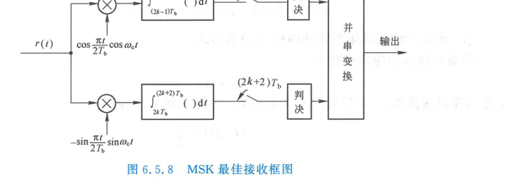

  
图 6.5.8 MSK 最佳相干解调接收机原理结构

两正交支路的相干本地参考信号分别为：
$$
\begin{cases}
r_I(t) = \cos\left(\frac{\pi t}{2T_b}\right) \cos(2\pi f_c t) \\
r_Q(t) = \sin\left(\frac{\pi t}{2T_b}\right) \sin(2\pi f_c t)
\end{cases}
$$
由于每个支路的积分判决时间跨度为 $2T_b$，每个支路接收到的单符号能量为 $E_s = 2E_b$。对同相支路与正交支路分别在各自的最佳抽样判决时刻独立判决，单路误符号率为：
$$
P_e = Q\left(\sqrt{\frac{2E_s}{N_0}}\right) = Q\left(\sqrt{\frac{2(2E_b)}{2N_0}}\right) = Q\left(\sqrt{\frac{2E_b}{N_0}}\right)
$$
因为两支路信号在时间上交替交错 $T_b$，输出解调合成后的总误比特率（BER）恰好等于单支路误码率：
$$
P_b = Q\left(\sqrt{\frac{2E_b}{N_0}}\right) = \frac{1}{2} \operatorname{erfc}\left(\sqrt{\frac{E_b}{N_0}}\right)
$$

<Card title="核心结论：MSK 的性能巅峰" type="star">
**MSK 在物理层实现了三大极致特性的完美兼备**：
1. **恒定包络**：包络波动严格为 0 dB，完全适应高能效非线性饱和功放；
2. **频谱洁净**：带外功率谱以 $f^{-4}$ 滚降，99% 能量集中在 $1.2 R_b$ 内；
3. **抗噪性能无损**：其误比特率公式与理想双极性 2PSK 和四相 QPSK **完全数学等价**，无需付出额外的信噪比代价！
</Card>

---

## 6.5.2 高斯最小移频键控（GMSK）

### 1. GMSK 的工程动因与预滤波机制

尽管 MSK 的旁瓣衰减速率达 $f^{-4}$，但在信道间隔极其狭窄的蜂窝蜂窝移动通信制式（如 GSM、DECT）中，为了达到严格的相邻信道泄漏比（ACLR $\le -60\text{ dB}$）指标，MSK 的第一旁瓣（约为 $-23\text{ dB}$）仍然过高。

1981年，日本学者室田和昭（K. Murota）与平出贤吉（K. Hirade）提出了 **高斯最小移频键控（Gaussian Minimum Shift Keying, GMSK）**：在 MSK 调制器前置串入一个**高斯低通预滤波器（GLPF）**。

  

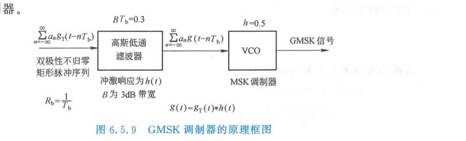

  
图 6.5.9 GMSK 信号产生的基本物理架构：高斯低通预滤波 + 连续相位调制

---

### 2. 高斯滤波器的冲激响应与成形脉冲

理想高斯低通滤波器的传输特性函数具有高斯钟形分布：
$$
H(f) = \exp\left(-\alpha^2 f^2\right) = \exp\left(-\frac{\ln 2}{2}\left(\frac{f}{B}\right)^2\right)
$$
式中 $B$ 为滤波器的 $3\text{ dB}$ 截止带宽，此时 $H(B) = \exp(-\frac{\ln 2}{2}) = \frac{1}{\sqrt{2}}$。

对其求傅里叶逆变换，得到高斯滤波器的单位冲激响应：
$$
h(t) = \frac{\sqrt{2\pi}}{\alpha} \exp\left(-\frac{2\pi^2 t^2}{\alpha^2}\right) = \frac{1}{\sqrt{2\pi}\sigma} \exp\left(-\frac{t^2}{2\sigma^2}\right)
$$
参数常量为：
$$
\alpha = \frac{\sqrt{\ln 2}}{\sqrt{2} B}, \quad \sigma = \frac{\sqrt{\ln 2}}{2\pi B}
$$

单个宽度为 $T_b$、幅度为 $1$ 的矩形脉冲 $g_T(t)$ 经高斯低通滤波器激励后，输出的频率成形脉冲 $g(t) = g_T(t) * h(t)$ 可解析表示为误差函数：
$$
g(t) = \frac{1}{2T_b} \left[ Q\left(2\pi B \frac{t - T_b/2}{\sqrt{\ln 2}}\right) - Q\left(2\pi B \frac{t + T_b/2}{\sqrt{\ln 2}}\right) \right]
$$
工程上常用无量纲的**归一化带宽参数 $B T_b$** 来表征该滤波器的特性。例如 GSM 标准中严格指定：
$$
B T_b = 0.3
$$

  

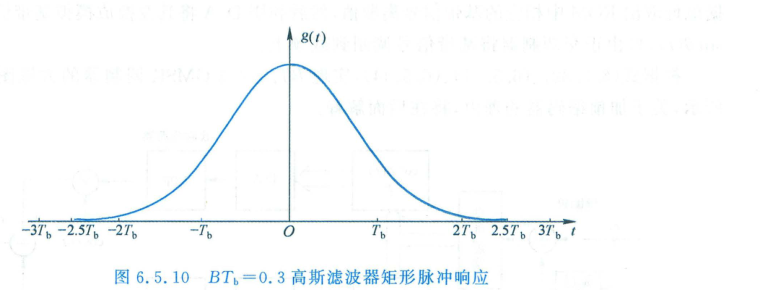

  
图 6.5.10 $B T_b = 0.3$ 时成形脉冲 $g(t)$ 的时间扩展特性

  

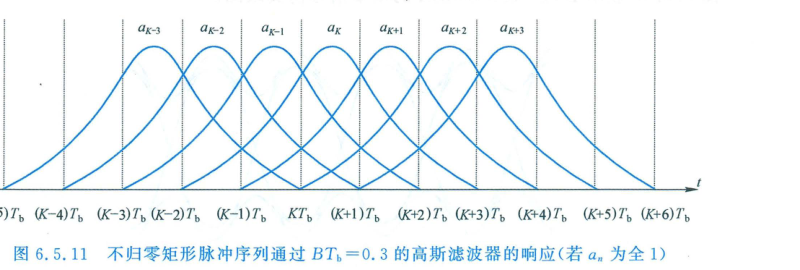

  
图 6.5.11 频率成形脉冲 $g(t)$ 及其连续相位响应 $q(t) = \int_{-\infty}^t g(\tau)\mathrm{d}\tau$

---

### 3. GMSK 的眼图、相位路径与受控码间串扰（Controlled ISI）

由图 6.5.10 可见：当 $B T_b = 0.3$ 时，脉冲 $g(t)$ 的有效时域宽度从原来的 $1 T_b$ 展宽至约 $3 \sim 4 T_b$。
这意味着当前码元的脉冲响应会越界扩散至前后的邻近码元区间内，从而**人为引入了受控的码间串扰（Controlled Inter-Symbol Interference, ISI）**。

  

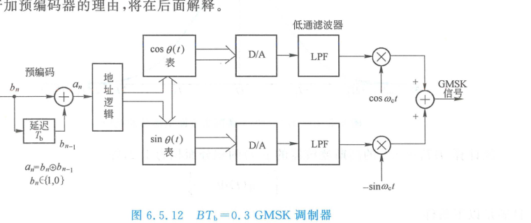

  
图 6.5.12 $B T_b = 0.3$ 时 GMSK 信号眼图：受控码间串扰导致眼图张开度局部收缩

  

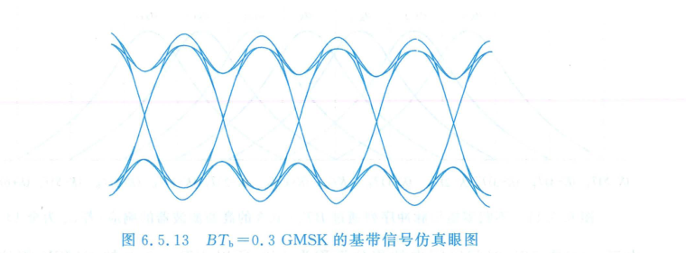

  
图 6.5.13 GMSK 信号的连续光滑相位路径：转折角被高斯阻尼圆滑消除

受控码间串扰消除了 MSK 相位网格在节点处的尖锐折角，使得相位的导数（即瞬时频偏）连续且无限阶可导，这为频域阻带的超深衰减奠定了数理基础。

---

### 4. GMSK 功率谱密度的极限制导

通过高斯预滤波，GMSK 信号的功率谱旁瓣以惊人的速率向下坍塌：

  

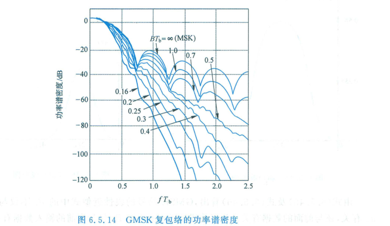

  
图 6.5.14 不同 $B T_b$ 参数下 GMSK 与 MSK、TFM 的功率谱密度对比

从图 6.5.14 可以观察到明显的工程规律：
1. **$B T_b = \infty$** 即为常规 MSK，在偏移载频 $2 R_b$ 处的旁瓣电平约为 $-32\text{ dB}$；
2. 当 **$B T_b = 0.5$** 时，在 $2 R_b$ 处旁瓣已压低至 $-50\text{ dB}$；
3. 当 **$B T_b = 0.3$**（GSM 标准）时，在 $2 R_b$ 处旁瓣深陷至 **$-70\text{ dB}$** 以下！其阻带能量衰减速率接近高斯函数的指数衰减，彻底解决了移动通信大容量密集组网下的同频/邻频干扰瓶颈。

---

### 5. 洛朗（Laurent）线性分解与调制发射机实现

在数学上，GMSK 本质上是非线性调制体制。然而，1986年 Pierre A. Laurent 在其奠基性论文中证明：**任何二进制单极性/双极性连续相位调制（CPM）信号，均可精确展开为有限项幅度调制脉冲（PAM）序列的线性叠加**。

对于关联截断长度为 $L = 3$（$B T_b = 0.3$）的 GMSK 信号，洛朗分解可表示为 $2^{L-1} = 4$ 个成形分量的叠加：
$$
s_{\text{GMSK}}(t) = \sum_{k=0}^{2^{L-1}-1} \sum_{n=-\infty}^{\infty} C_{k,n} h_k(t - nT_b)
$$
其中 $h_0(t)$ 称为**主脉冲（Principal Component）**，其余 $h_1(t), h_2(t), h_3(t)$ 称为次级脉冲。

  

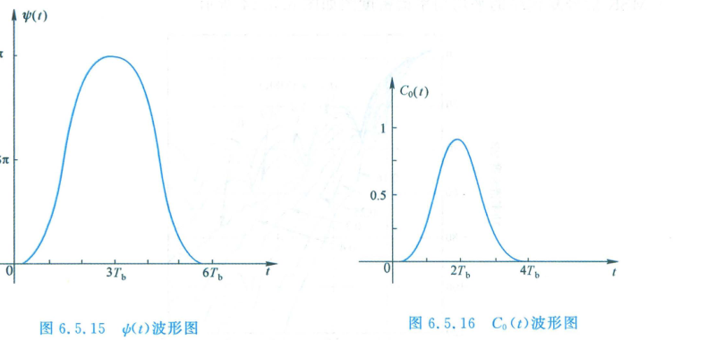

  
图 6.5.15 洛朗分解的主成形脉冲 $c_0(t)$ 与次级脉冲 $c_1(t)$ 的时域波形

#### 主脉冲能量压倒性优势
数值积分表明：在 $B T_b = 0.3$ 时，主脉冲 $c_0(t)$ 集中了 GMSK **超过 $99.9\%$ 的总辐射能量**！次级脉冲的能量占比低于 $0.1\%$。
因此在工程实现中，完全可以略去所有高阶次级脉冲，将 GMSK 高度精确地**近似为等效的线性偏置正交相移键控（OQPSK）信号**：
$$
s_{\text{GMSK}}(t) \approx \sum_{n} j^n d_n c_0(t - nT_b) e^{j 2\pi f_c t}
$$

为消除解调时的符号记忆并适应直接相干接收，通常在发射端前置差分预编码器（Differential Precoding）：

  

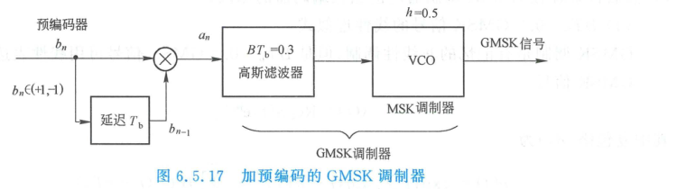

  
图 6.5.17 GMSK 差分预编码逻辑框图

基于此线性分解与相位累加查找机制，现代全数字 GMSK 调制器普遍采用 **ROM 查表法** 或 **数字正交调制法**：

  

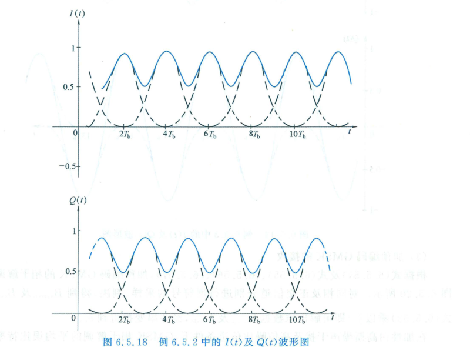

  
图 6.5.18 基于 ROM 查找表与直接数字合成（DDS）的 GMSK 正交调制架构

  

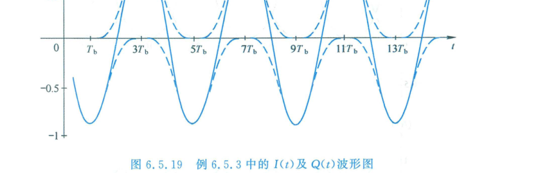

  
图 6.5.19 GMSK 正交模拟/数字上变频发射架构

---

### 6. GMSK 接收解调与误码率性能

  

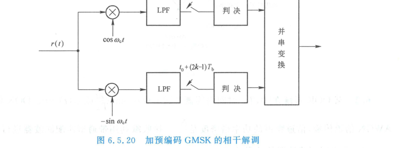

  
图 6.5.20 GMSK 同相支路与正交支路的基带波形与最佳抽样判决时刻

由于洛朗主脉冲 $c_0(t)$ 的主导地位，GMSK 的接收机可采用与 MSK / OQPSK 完全兼容的低复杂度正交相关解调结构：

  

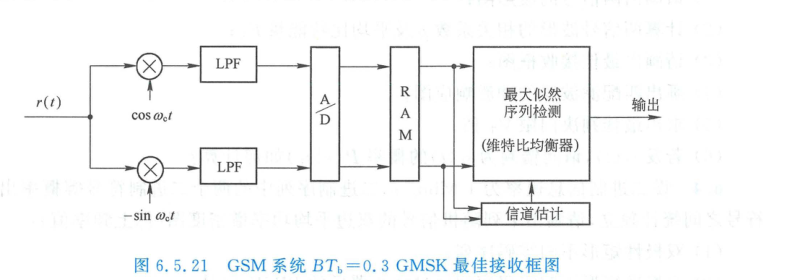

  
图 6.5.21 GMSK 正交相干接收机方框图与判决再生

#### 抗噪性能代价评估
由于高斯滤波器引入了受控的码间串扰（眼图张开度减小），相干解调时抗加性高斯白噪声的等效信噪比会有微小恶化：
$$
P_b \approx Q\left(\sqrt{2 \gamma \frac{E_b}{N_0}}\right)
$$
其中 $\gamma < 1$ 称为码间串扰衰落因子（Degradation Factor）：
- 当 $B T_b = \infty$（MSK）时：$\gamma = 1.0$（$0\text{ dB}$ 损耗）；
- 当 $B T_b = 0.5$ 时：$\gamma \approx 0.95$（损耗仅约 $0.2\text{ dB}$）；
- 当 $B T_b = 0.3$ 时：$\gamma \approx 0.79 \sim 0.85$（解调损耗约为 **$0.7 \sim 1.0\text{ dB}$**）；若采用基于维特比算法的最大似然序列估计（MLSE）均衡器消除受控 ISI，损耗可进一步收窄至 $0.2\text{ dB}$ 以内。

<Card title="总结：MSK 与 GMSK 特征指标对比" type="star">
| 特性指标 | 2PSK / QPSK | MSK ($h=0.5$) | GMSK ($B T_b = 0.3$) |
| :--- | :--- | :--- | :--- |
| **包络特征** | 存在零点下陷与剧烈起伏 | **严格恒定包络（0 dB）** | **严格恒定包络（0 dB）** |
| **相位连续性** | 存在 $180^\circ / 90^\circ$ 突跳 | 严格连续，导数分段常数 | 严格连续且无限阶平滑 |
| **主瓣宽度** | $1.0 R_b$ | $1.5 R_b$ | 约 $1.2 \sim 1.4 R_b$ |
| **阻带滚降速率** | $f^{-2}$ ($-20\text{ dB/dec}$) | $f^{-4}$ ($-40\text{ dB/dec}$) | **指数级快速滚降（$< -70\text{ dB}$）** |
| **99% 能量带宽** | $8.0 R_b$ | $1.2 R_b$ | **$0.86 R_b$** |
| **码间串扰（ISI）** | 理想无 ISI | 无 ISI | **受控 ISI（扩散至 $3 \sim 4 T_b$）** |
| **相干误码率 (AWGN)** | $Q(\sqrt{2E_b/N_0})$ | $Q(\sqrt{2E_b/N_0})$ | 仅损耗约 $0.7 \sim 1.0\text{ dB}$（可均衡弥补） |
| **功率放大器适用** | 必须高度线性化（A/AB 类） | **高能效饱和功放（C 类）** | **高能效饱和功放（C 类）** |
</Card>

---

<ExerciseTrigger chapter={6} section="6.5" title="6.5 恒包络连续相位调制 课后习题与自测" />
