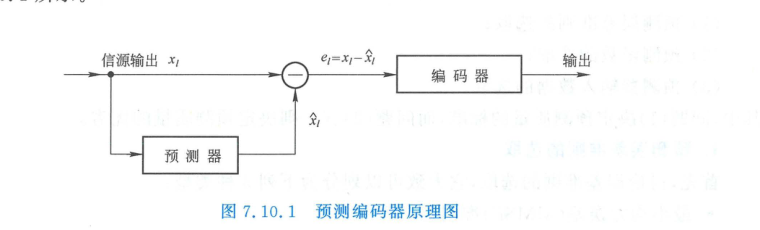
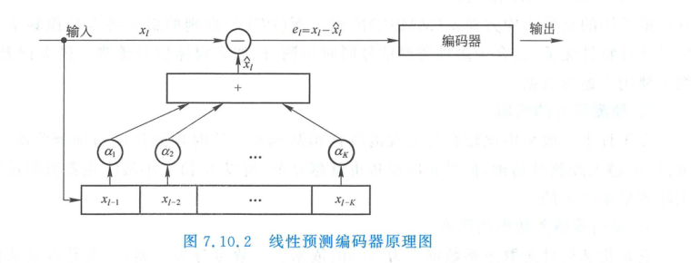
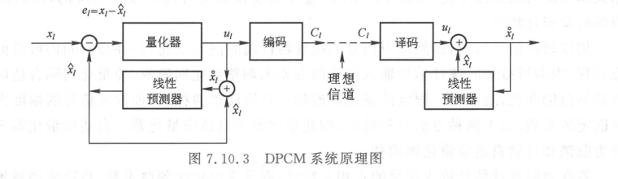
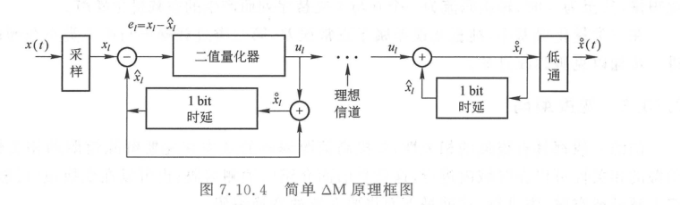
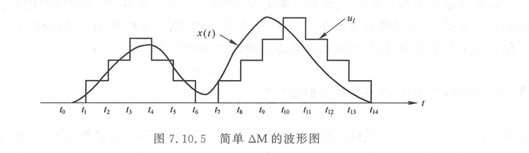

import Card from '@/components/Card.astro';
import Example from '@/components/Example.astro';
import Solution from '@/components/Solution.astro';
import ExerciseTrigger from '@/components/exercises/ExerciseTrigger.astro';

在自然界的实际物理信源中，如人类连续发声的语音、自然风景图像以及视频帧序列，其时间上相邻的抽样点之间或空间上相邻的像素之间，通常具有极高的统计关联性（相邻样点间的自相关系数 $\rho$ 往往高达 $0.85 \sim 0.98$）。

若直接采用 7.9 节的标量 PCM 编码，对每个样值独立量化，将导致传输数据中包含大量的**统计相关冗余**。解除样点之间的相关性，是现代高效率数字压缩编码（如语音编码 ADPCM/AMR、静态图像 JPEG、数字视频 H.264/HEVC/AV1）的核心思想。

本节系统讨论两大经典去相关限失真编码技术：**预测编码（Predictive Coding）** 与 **正交变换编码（Transform Coding）**。

---

## 7.10.1 预测编码（Predictive Coding）

### 1. 预测编码的基本思想与数学原理

由于信源前后样值之间高度相关，当前时刻出现的样值 $x_l$ 在很大程度上可以由其紧邻的历史样值预测出来。
设根据已知的历史样值序列由预测器计算出的预测值为 $\hat{x}_l$，当前样值与预测值之差称为**预测误差（残差）**：
$$
e_l = x_l - \hat{x}_l
$$

  

  
图 7.10.1 预测编码器开环工作原理概念模型

**压缩增益机制**：残差信号 $e_l$ 的动态范围与方差 $\sigma_e^2$ 远远小于原始输入信号的方差 $\sigma_x^2$（常可压低一个数量级以上）。因此，**对残差信号 $e_l$ 进行量化编码**，只需较少的比特数（例如 4 bit 乃至更少）即可达到与原始信号高比特量化相同的信噪比。

### 2. 最佳线性预测器（LPC）

最常用的预测器为**线性预测器（Linear Predictive Coder, LPC）**：
$$
\hat{x}_l = \sum_{k=1}^{K} a_k x_{l-k}
$$
式中 $K$ 为预测阶数，$\{a_k\}$ 为线性预测加权系数。

  

  
图 7.10.2 基于延迟单元与抽头加权的线性预测器内部结构

根据均方误差最小化准则（正交性原理，Orthogonality Principle），残差 $e_l$ 必须正交于所有历史观测基底：
$$
E\left[ \left( x_l - \sum_{k=1}^K a_k x_{l-k} \right) x_{l-j} \right] = 0, \quad j = 1, 2, \dots, K
$$
展开整理可得著名的 **尤尔-沃克方程（Yule-Walker Equations）**：
$$
\sum_{k=1}^{K} a_k R_x(j - k) = R_x(j), \quad j = 1, 2, \dots, K
$$
式中 $R_x(m) = E[x_l x_{l+m}]$ 为信源输入自相关序列。解此托普利茨（Toeplitz）对称矩阵方程即可求得理论最优预测加权系数 $\{a_k\}$。

---

### 3. 差分脉冲编码调制（DPCM）

若直接按照开环模式对残差 $e_l = x_l - \hat{x}_l$ 量化，量化噪声将在解码重建端随时间线性积分积累发散。
为了消除量化误差积累，必须采用**闭环反馈架构**，这便是**差分脉冲编码调制（Differential PCM, DPCM）**。

  

  
图 7.10.3 具有量化误差内闭环跟踪特性的 DPCM 发射端与接收端系统架构

#### DPCM 误差免疫机制的数学证明
在发射端环路中，量化器输出为 $\tilde{e}_l = e_l + q_l$，预测器输入的本地重构信号为：
$$
\tilde{x}_l = \hat{x}_l + \tilde{e}_l = \hat{x}_l + (e_l + q_l) = \hat{x}_l + (x_l - \hat{x}_l + q_l) = x_l + q_l
$$
在接收端，接收到的码流经逆量化恢复出 $\tilde{e}_l$，接收端重构输出为：
$$
x'_l = \hat{x}_l + \tilde{e}_l = \hat{x}_l + e_l + q_l = x_l + q_l
$$
总重构误差为：
$$
e_{\text{total}} = x_l - x'_l = x_l - (x_l + q_l) = -q_l
$$
**核心结论**：**DPCM 系统的总端到端重构误差恰好等于当前单步量化误差 $q_l$**，历史量化噪声被闭环负反馈完全抵消，彻底根除了误差发散风险！

**工业标准**：**ADPCM（自适应差分 PCM, ITU-T G.721 / G.726）** 将量化阶长和预测系数自适应实时动态调整，仅需 $32\text{ kbit/s}$（4 bit/抽样点）即可达到传统 64 kbit/s PCM 的高保真语音广播级音质。

---

### 4. 增量调制（Delta Modulation, $\Delta$M）

增量调制是 DPCM 的极限简化形态 —— **量化器采用最简的 1 比特硬判决器**。

  

  
图 7.10.4 1 比特增量调制器（$\Delta$M）发端判决积分与收端解调结构

在每一个抽样时钟 $T_s$：
- 若输入信号高于预测积分值（$x_l > \hat{x}_l$），输出码元 `1`，本地重构值递增固定步长 $\Delta$；
- 若输入信号低于预测积分值（$x_l < \hat{x}_l$），输出码元 `0`，本地重构值递减固定步长 $\Delta$。

  

  
图 7.10.5 $\Delta$M 的阶梯追踪波形：斜率过载噪声与空载颗粒噪声

#### $\Delta$M 的三大量化噪声分类
1. **正常颗粒量化噪声（Granular Noise）**：阶梯波形在平缓信号上下交替追踪，误差在 $[-\Delta, +\Delta]$ 内；
2. **斜率过载失真（Slope Overload Distortion）**：
   阶梯所能跟踪的最大物理斜率为 $\frac{\Delta}{T_s} = \Delta \cdot f_s$。
   若输入模拟信号的上升或下降变化率超过此极限：
   $$
   \left|\frac{\mathrm{d}x(t)}{\mathrm{d}t}\right| > \Delta \cdot f_s
   $$
   积分器阶梯将无法跟上信号陡峭前沿，产生严重的斜率过载失真。对于正弦信号 $x(t) = A \sin(\omega t)$，不发生斜率过载的临界充要条件为：
   $$
   A \omega \le \Delta \cdot f_s \implies A \le \frac{\Delta \cdot f_s}{2\pi f}
   $$
3. **空载颗粒噪声（Idle Noise）**：当输入信号为零或近似恒定直流时，输出产生 `...101010...` 持续翻转的方波，在解调低通滤波后表现为高频微弱啸叫。

---

## 7.10.2 正交变换编码（Transform Coding）

预测编码在时域利用递归消减局部相关性。对于二维矩阵分布的自然图像信源，最彻底的全局去相关方法是**正交变换编码（Transform Coding）**。

### 1. 变换去相关的物理机制与能量高度集中性

设二维图像被切分为 $N \times N$（如 $8 \times 8$）的像素小块，展成 $L$ 维空间矢量 $\boldsymbol{x}$。由于相邻像素灰度极度相似，其空间域自协方差矩阵 $\boldsymbol{\Phi}_x = E[(\boldsymbol{x} - \bar{\boldsymbol{x}})(\boldsymbol{x} - \bar{\boldsymbol{x}})^T]$ 的非对角线互相关元素极大。

引入正交酉变换矩阵 $\boldsymbol{A}$（满足 $\boldsymbol{A}^T \boldsymbol{A} = \boldsymbol{I}$），将样点映射至变换域：
$$
\boldsymbol{s} = \boldsymbol{A} \boldsymbol{x}
$$
变换后系数矢量的协方差矩阵变为：
$$
\boldsymbol{\Phi}_s = E[(\boldsymbol{s} - \bar{\boldsymbol{s}})(\boldsymbol{s} - \bar{\boldsymbol{s}})^T] = \boldsymbol{A} \boldsymbol{\Phi}_x \boldsymbol{A}^T
$$

<Card title="正交变换编码的两大核心优势" type="star">
1. **强力去相关（Decorrelation）**：精心设计的正交变换使得非对角线元素趋于零，各变换系数之间在统计上相互独立；
2. **能量极端浓缩（Energy Compaction）**：原始空间域中均匀分散在所有样点上的总能量，在变换域中高度富集于极少数低频与直流（DC）系数上。其余绝大多数高频交流（AC）系数幅值微弱且方差接近于零。
</Card>

**压缩策略**：对富集了 $95\% \sim 99\%$ 能量的少数低频系数分配精细量化比特；对大量高频微弱系数粗量化或直接置零截断舍弃，实现极高压缩比。

---

### 2. 卡洛南-洛埃变换（K-L 变换，KLT）

根据主成分分析（PCA）线性代数理论，若选取正交矩阵 $\boldsymbol{A}$ 的各行向量为信源协方差矩阵 $\boldsymbol{\Phi}_x$ 的归一化特征向量：
$$
\boldsymbol{\Phi}_x \boldsymbol{u}_i = \lambda_i \boldsymbol{u}_i, \quad \boldsymbol{A} = [\boldsymbol{u}_1, \boldsymbol{u}_2, \dots, \boldsymbol{u}_L]^T
$$
则变换域协方差矩阵将完全对角化：
$$
\boldsymbol{\Phi}_s = \operatorname{diag}(\lambda_1, \lambda_2, \dots, \lambda_L)
$$
此时变换域各分量互协方差严格为零（完全统计正交去相关）。**K-L 变换在理论上被证明是能量集中性最佳的绝对最优线性变换**。

**工程局限**：KLT 的变换矩阵严格依赖于输入图像具体的协方差矩阵 $\boldsymbol{\Phi}_x$。信源统计特性一旦改变，就必须重新计算特征值并传输变换矩阵，且缺乏快速算法（乘法复杂度为 $O(N^2)$），难以在实时高速硬件中商用。

---

### 3. 离散余弦变换（Discrete Cosine Transform, DCT）

1974 年 Nasir Ahmed 等人证明：**对于具有一阶马尔可夫平稳相关性的实际图像信源（相关系数 $\rho \to 1$），离散余弦变换（DCT）在数学上渐近等价于最优的 K-L 变换，具有极其接近 KLT 的优异能量集中性能**。

一维 $N$ 点正交 DCT 变换核定义为：
$$
S(u) = C(u) \sum_{x=0}^{N-1} f(x) \cos\left[ \frac{(2x + 1)u\pi}{2N} \right], \quad u = 0, 1, \dots, N-1
$$
式中归一化正交系数为：
$$
C(u) = \begin{cases}
\sqrt{\frac{1}{N}}, & u = 0 \\
\sqrt{\frac{2}{N}}, & u = 1, 2, \dots, N-1
\end{cases}
$$

二维 $8 \times 8$ 图像子块的 DCT 正反变换为：
$$
S(u, v) = C(u) C(v) \sum_{x=0}^{7} \sum_{y=0}^{7} f(x, y) \cos\left[ \frac{(2x + 1)u\pi}{16} \right] \cos\left[ \frac{(2y + 1)v\pi}{16} \right]
$$

#### DCT 统治现代图像视频标准的工程优势
1. **完全独立于输入信源数据**：变换基矩阵固定不变，无需预先统计信源协方差；
2. **纯实数正交对称基**：无需处理解析复数运算；
3. **超高速快速算法**：存在类 FFT 的快速多项式分解算法，计算复杂度降至 $O(N \log_2 N)$，极利于 FPGA/ASIC 高速硬件流水线实现；
4. 成为工业标准 **JPEG（静态图像）、MPEG-1/2/4、H.264/AVC 及 HEVC** 帧内预测残差变换的绝对核心引擎。

---

<ExerciseTrigger chapter={7} section="7.10" title="7.10 有记忆信源解除相关性的限失真信源编码 课后习题与自测" />
