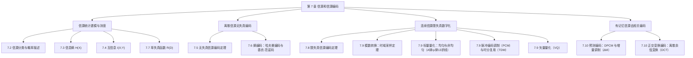

import Card from '../../../../../../components/Card.astro';
import ExerciseTrigger from '../../../../../../components/ExerciseTrigger.astro';

在现代通信理论与系统架构中，**信源（Source）** 与 **信道（Channel）** 是构成通信系统最不可分割的两大基石。信源是产生并输出原始消息与信息的源头，信道则是传送载荷信息电信号的物理媒质。信源与信宿之间的全部信息交互，必须依托信道这一桥梁方能最终达成。

度量通信系统技术性能的核心指标主要涵盖两个维度：
1. **数量指标 —— 有效性（Effectiveness）**：表征单位时间内传输信息量的多少（传输速率、频带利用率），主要由**信源的统计特性及其编码压缩效率**决定；
2. **质量指标 —— 可靠性（Reliability）**：表征接收端恢复消息的准确程度（误码率、信噪比），主要取决于**信道的传输衰落、噪声干扰与信道编码检错纠错能力**。

通信系统的综合优化，绝非孤立地提高某单一指标，而是寻求**信源统计特性与信道传输能力之间的最佳统计匹配**，实现有效性与可靠性的辩证统一。

---

## 7.1.1 信源编码的物理本质与必要性

从香农信息论（Information Theory）的视角审视，未经处理的自然实际信源（如人类日常语言、文字报文、自然图像与音视频信号）在统计结构上存在着极其庞大的**统计多余度（Statistical Redundancy）**。

例如：
- 在汉语与英语书面文本中，各字符、词汇的出现概率极度不均衡，且前后字符之间存在深度的上下文关联约束；
- 在连续的声音与图像信号中，时间上相邻的抽样点之间、空间上相邻的像素之间，具有高达 $0.8 \sim 0.98$ 的极高自相关系数。

这些统计多余成分本质上并不承载全新的独立信息量。如果将未经提炼的原始信源直接送入信道，将无谓地吞噬昂贵的信道频带与发射功率。

<Card title="信源编码的核心使命" type="star">
**信源编码（Source Coding）的核心任务**：
深入剖析信源的统计特征与概率分布规律，通过紧凑的高效映射与冗余压缩算法，**最大限度地剔除信源的统计多余成分**，使编码后输出的数字码流以最少的离散符号（比特）承载尽可能多的独立信息，实现信源输出率与信道容量的高效匹配。
</Card>

---

## 7.1.2 本章总体知识体系架构

本章将系统、严谨地建立信源统计描述与信源编码的完备理论框架，内容脉络涵盖：

1. **信源分类与信息度量（7.2 ~ 7.4, 7.7）**：
   - 建立单符号离散/连续信源、平稳无记忆与有记忆序列信源的数学模型；
   - 严格定义自信息、**信息熵 $H(X)$**、条件熵、联合熵及信道传递**互信息 $I(X;Y)$**；
   - 引入率失真理论核心工具：**信息率失真函数 $R(D)$**，界定在允许平均失真 $D$ 下传输信源信息所需的绝对最小信息传输速率。

2. **无失真离散信源编码（7.5 ~ 7.6）**：
   - 剖析香农第一信息论定理（无失真信源编码定理）；
   - 阐释定长编码与变长唯一可译码的克拉夫特（Kraft）不等式；
   - 掌握构造渐进达到信源熵极限的最优前缀码算法 —— **哈夫曼（Huffman）编码**。

3. **连续模拟信源限失真编码与脉冲编码调制（7.8 ~ 7.9）**：
   - 阐释模拟信号数字化三大步骤：**采样（Sampling）**、**量化（Quantization）**、**编码（Coding）**；
   - 低通与带通采样定理的时频域严密推导；
   - 最佳量化器（Lloyd-Max）设计准则，对数压扩特性（$A$ 律与 $\mu$ 律）及其国际标准 **A 律 13 折线** 近似折线量化编解码规则；
   - 脉冲编码调制（PCM）时分复用（TDM）帧结构体系与矢量量化（VQ）。

4. **解除相关性的现代高效信源编码（7.10）**：
   - 差分脉冲编码调制（DPCM）与一阶增量调制（$\Delta$M），过载失真与空载颗粒噪声抑制；
   - 基于正交变换的正交基分解去相关原理与离散余弦变换（DCT）。

---

<ExerciseTrigger chapter={7} section="7.1" title="7.1 引言 思考题与自测" />
