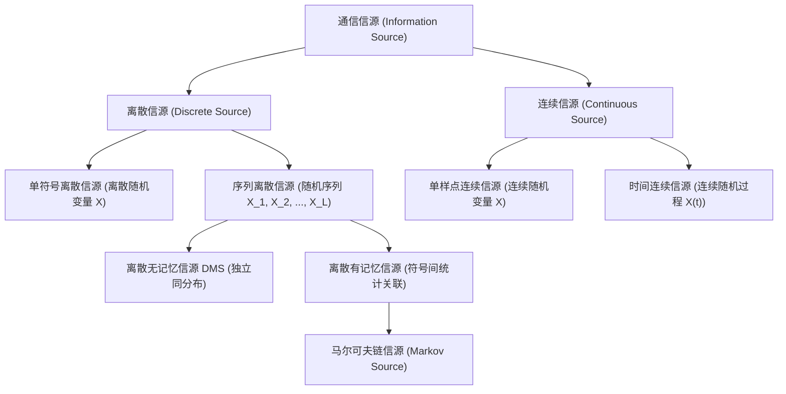

import Card from '../../../../../../components/Card.astro';
import ExerciseTrigger from '../../../../../../components/ExerciseTrigger.astro';

信源是产生并输出信息的物理源头。在自然界与人类社会中，原始信源呈现出高度多样化的形态，例如人类语言声波、印刷文字、自然图像、遥测传感数据及计算机数据流。为了进行严密的信息度量与编码优化，必须将这些物理实体抽象为统一的数学概率模型。

---

## 7.2.1 信源的分类维度

根据输出消息在时间维度和取值维度的连续性，信源首先可划分为两大基本形态：

1. **离散（数字）信源**：信源输出的消息在时间轴上是离散时刻出现，且符号的取值集合是离散有限或可数的。例如印刷文字报文、计算机文件、ASCII 码流及各类遥控指令；
2. **连续（模拟）信源**：信源输出的消息在时间轴上是连续流淌的，且信号幅度在一定连续区间内任意取值。例如未经数字化的语音模拟电信号、麦克风拾音信号、传感器采集的模拟温度或压力波形。

---

## 7.2.2 单消息（符号）信源模型

为了简化分析并抓住物理本质，首先考察信源仅输出**单一离散符号或单一样值**的情形。

### 1. 单符号离散信源

单符号离散信源的数学描述由**符号取值集合**与**先验概率分布**共同界定：
$$
\begin{bmatrix}
\mathcal{X} \\
P(x)
\end{bmatrix} =
\begin{bmatrix}
x_1 & x_2 & \dots & x_n \\
P(x_1) & P(x_2) & \dots & P(x_n)
\end{bmatrix}
$$
满足概率空间完备性公理：
$$
0 \le P(x_i) \le 1, \quad \sum_{i=1}^{n} P(x_i) = 1
$$

**典型范例**：二进制对称信源（BSS），符号集 $\mathcal{X} = \{0, 1\}$，等概分布：
$$
\begin{bmatrix}
\mathcal{X} \\
P(x)
\end{bmatrix} =
\begin{bmatrix}
0 & 1 \\
\frac{1}{2} & \frac{1}{2}
\end{bmatrix}
$$

### 2. 单符号连续信源

若信源输出单一取值连续的实数符号，其取值落在区间 $(a, b)$ 内，其统计特性由一维概率密度函数 $p(x)$ 严格界定：
$$
\begin{bmatrix}
\mathcal{X} \\
p(x)
\end{bmatrix} =
\begin{bmatrix}
x \in (a, b) \\
p(x)
\end{bmatrix}
$$
满足归一化条件：
$$
p(x) \ge 0, \quad \int_{a}^{b} p(x) \mathrm{d}x = 1
$$

---

## 7.2.3 消息（符号）序列信源模型

实际信源通常按时间次序持续输出符号流：
- 离散信源输出随机序列 $\boldsymbol{X} = (X_1, X_2, \dots, X_L)$；
- 连续信源输出连续时间随机过程 $X(t)$，在任意离散时刻 $t_k$ 处的抽样即为一连续随机变量 $X(t_k)$。

### 1. 离散消息序列信源的联合概率描述

设消息序列长度为 $L$，序列中每个符号的可能取值集合均为字母表 $\mathcal{X} = \{a_1, a_2, \dots, a_n\}$（基数为 $n$）。
则长度为 $L$ 的符号序列构成的样值空间为笛卡儿积集合 $\mathcal{X}^L$：
$$
\mathcal{X}^L = \underbrace{\mathcal{X} \times \mathcal{X} \times \dots \times \mathcal{X}}_{L \text{ 个}}
$$
样值空间中包含的所有可能序列状态总数为：
$$
N_{\text{total}} = n^L
$$

整个长度为 $L$ 的随机矢量 $\boldsymbol{X} = (X_1, X_2, \dots, X_L)$，其样值记为 $\boldsymbol{x} = (x_1, x_2, \dots, x_L)$。各符号间普遍存在统计关联时的 $L$ 维联合概率为：
$$
P(\boldsymbol{x}) = P(x_1, x_2, \dots, x_L) = P(x_1) P(x_2 | x_1) P(x_3 | x_1, x_2) \dots P(x_L | x_1, x_2, \dots, x_{L-1})
$$

离散消息序列信源的整体概率空间可展开为：
$$
\begin{bmatrix}
\mathcal{X}^L \\
P(\boldsymbol{x})
\end{bmatrix} =
\begin{bmatrix}
\boldsymbol{\alpha}_1 & \boldsymbol{\alpha}_2 & \dots & \boldsymbol{\alpha}_{n^L} \\
P(\boldsymbol{\alpha}_1) & P(\boldsymbol{\alpha}_2) & \dots & P(\boldsymbol{\alpha}_{n^L})
\end{bmatrix}
$$

---

## 7.2.4 离散无记忆信源（DMS）与离散有记忆信源

根据前后符号之间是否存在统计依赖性，离散序列信源分为两大范畴：

### 1. 离散无记忆信源（Discrete Memoryless Source, DMS）

<Card title="定义：离散无记忆信源 (DMS)" type="star">
若离散信源输出序列中任意时刻出现的符号，在统计上**完全独立于**此前与此后出现的任何符号，则称该信源为**离散无记忆信源（DMS）**。
</Card>

在无记忆条件下，任何由 $L$ 个符号组成的序列样值 $\boldsymbol{x} = (x_1, x_2, \dots, x_L)$ 的联合概率等于各符号边缘概率的连乘积：
$$
P(x_1, x_2, \dots, x_L) = \prod_{l=1}^{L} P(x_l)
$$

**实例推演**：考察一个二进制独立等概 DMS 信源，输出码字长度 $L = 3$（$P(0) = P(1) = \frac{1}{2}$）：
序列样值空间共有 $2^3 = 8$ 种状态：
$$
\mathcal{X}^3 = \{000, 001, 010, 011, 100, 101, 110, 111\}
$$
由于统计独立，每一个三比特消息块的联合概率均相等：
$$
P(x_1, x_2, x_3) = P(x_1) P(x_2) P(x_3) = \left(\frac{1}{2}\right)^3 = \frac{1}{8}
$$

### 2. 离散有记忆信源与马尔可夫链信源

真实自然信源（如汉语拼音、英文文本、自然语音抽样、视频帧序列）在前后符号之间均具有极强的上下文约束，属于**有记忆信源**。

在序列长度 $L$ 极大时，直接处理 $L$ 维全联合概率 $P(x_1, x_2, \dots, x_L)$ 将面临计算维数灾难。工程上最广泛采用的解析模型是**一阶马尔可夫链信源（First-order Markov Source）**：
$$
P(x_n \mid x_{n-1}, x_{n-2}, \dots, x_1) = P(x_n \mid x_{n-1})
$$
即信源在当前时刻输出符号的条件概率，**仅仅取决于其紧邻的前一个符号状态**，而与更早的历史状态条件独立（“无后效性”）。

若该信源进一步满足：
1. **齐次性（Homogeneity）**：条件状态转移概率不随绝对时间原点的推移而改变：
   $$
   P(X_n = j \mid X_{n-1} = i) = p_{ij} = \text{常数}
   $$
2. **遍历性（Ergodicity）**：信源系统经历足够多步的状态转移后，各状态出现的极限边缘概率与起始状态无关，收敛于全局唯一的平稳稳态分布矢量 $\boldsymbol{\pi} = [\pi_1, \pi_2, \dots, \pi_n]$：
   $$
   \boldsymbol{\pi} = \boldsymbol{\pi} \boldsymbol{P}, \quad \sum_{i=1}^{n} \pi_i = 1
   $$
   其中 $\boldsymbol{P} = [p_{ij}]_{n \times n}$ 为状态转移概率矩阵。

马尔可夫模型构成了现代语音线性预测编码（LPC）、数字图像预测编码（DPCM）及高效熵编码算法的核心理论基石。

---

<ExerciseTrigger chapter={7} section="7.2" title="7.2 信源的分类及其统计特性描述 思考题与自测" />
