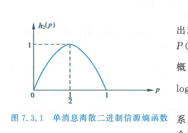

import Card from '@/components/Card.astro';
import Example from '@/components/Example.astro';
import Solution from '@/components/Solution.astro';
import ExerciseTrigger from '@/components/exercises/ExerciseTrigger.astro';

信息是一个具有深刻哲学与工程内涵的概念。在通信工程中，信息的本质是**对事物运动状态与存在方式不确定性（Uncertainty）的消除**。如何对这种抽象的“不确定性消除量”进行客观、定量的数理度量，是香农信息论（Shannon Information Theory）的核心基石。

---

## 7.3.1 信号、消息与信息的辩证层级关系

在通信系统中，描述信息存在三个层次：

1. **物理表达层 —— 信号（Signal）**：具体可测量的物理电磁波形，信息以振幅、角频率、瞬时相位或脉冲有无等参量载荷其上；
2. **数学表达层 —— 消息（Message / Symbol）**：对具体符号的数学抽象，表现为离散随机变量 $X$、随机序列 $\boldsymbol{X}$ 或连续随机过程 $X(t)$；
3. **深层内涵 —— 信息（Information）**：信号与消息所表达的内在语义与不确定性消除量。同一信息可用不同语言消息表达，亦可用不同调制电信号载荷。

---

## 7.3.2 自信息与度量单位

直观经验表明：一个事件发生的概率越小，该事件发生所带来的意外感越强烈，消除的不确定性越大，所包含的信息量就越多；反之，若某事件是必然发生的（概率为 $1$），则该事件发生不会带来任何新信息。

### 1. 自信息的数学定义

设离散信源输出符号 $x_i$ 的先验发生概率为 $P(x_i)$，则定义该符号的**自信息（Self-Information）** 为：
$$
I(x_i) = \log_b \frac{1}{P(x_i)} = -\log_b P(x_i)
$$

### 2. 信息量的单位体系

自信息的对数底数 $b$ 决定了度量单位：
- 当底数 $b = 2$ 时，信息量单位为 **比特（bit，或称香农 Shannon, Sh）**；
- 当底数 $b = e$ 时，信息量单位为 **奈特（nat）**；
- 当底数 $b = 10$ 时，信息量单位为 **哈特（Hartley, Hart）**。

在现代数字通信与计算机工程中，**默认统一采用以 2 为底的比特单位（$\text{bit}$）**：
$$
I(x_i) = -\log_2 P(x_i) \quad (\text{bit})
$$

---

## 7.3.3 信息熵 $H(X)$ 的定义与性质

自信息 $I(x_i)$ 仅度量了某一**特定独立符号**发生时所含的信息量。然而，信源在长时间运行中输出的是一个随机分布集，为了表征信源从**整体统计意义上的平均不确定性**，必须求解自信息的统计数学期望。

### 1. 信息熵的定义式

设离散无记忆信源的符号概率空间为 $\mathcal{X} = \{x_1, x_2, \dots, x_n\}$，先验概率为 $P(x_i)$，定义信源的**信息熵（Information Entropy）** 为：
$$
H(X) = E[I(X)] = \sum_{i=1}^{n} P(x_i) I(x_i) = -\sum_{i=1}^{n} P(x_i) \log_2 P(x_i) \quad (\text{bit/symbol})
$$

信息熵 $H(X)$ 在物理上度量了信源每输出一个符号所提供的**平均信息量**，也是接收端在收到符号前对信源状态的**先验平均不确定度**。

### 2. 信息熵的核心基本性质

1. **非负性**：
   $$
   H(X) \ge 0
   $$
   由于 $0 \le P(x_i) \le 1$，项 $-P(x_i)\log_2 P(x_i) \ge 0$。当且仅当某一符号以概率 $1$ 必然发生（其余符号概率为 $0$）时，取等号 $H(X) = 0$（确定性系统无信息）。约定 $0 \log_2 0 = 0$。
2. **对称性**：
   信息熵仅取决于各个概率取值的集合，与符号本身的物理排布次序无关：
   $$
   H(p_1, p_2, \dots, p_n) = H(p_{\pi(1)}, p_{\pi(2)}, \dots, p_{\pi(n)})
   $$
3. **极大值定理（最大熵定理）**：
   对于具有 $M$ 个离散可能状态的信源，利用延森不等式（Jensen's Inequality）或拉格朗日乘子法可证明：
   $$
   0 \le H(X) \le \log_2 M
   $$
   **充要条件**：当且仅当信源输出各符号**等概率分布**（$P(x_1) = P(x_2) = \dots = P(x_M) = \frac{1}{M}$）时，信源信息熵达到全局唯一最大值：
   $$
   H_{\max}(X) = \log_2 M \quad (\text{bit/symbol})
   $$

---

## 7.3.4 二元信源熵函数

考察最简单的二进制单符号信源 $\mathcal{X} = \{0, 1\}$，设 $P(X=1) = p$，则 $P(X=0) = 1-p$。其信息熵化简为仅含标量参数 $p$ 的**二元熵函数（Binary Entropy Function）**：
$$
h_2(p) = -p \log_2 p - (1-p) \log_2(1-p)
$$

  

  
图 7.3.1 二元信源信息熵函数 $h_2(p)$ 随概率 $p$ 变化的钟形曲线

**曲线特征解析**：
- 当 $p = 0$ 或 $p = 1$ 时，$h_2(p) = 0$：信源处于确定状态，无任何不确定性，信息熵为零；
- 曲线关于 $p = 0.5$ 严格对称；
- 当且仅当 $p = 0.5$（符号 $0$ 与 $1$ 严格等概）时，熵达到峰值最大值：
  $$
  h_2(0.5) = -\frac{1}{2}\log_2\frac{1}{2} - \frac{1}{2}\log_2\frac{1}{2} = 1.0 \quad (\text{bit/symbol})
  $$

---

## 7.3.5 联合熵、条件熵与香农不等式

在多元信息系统及通信信道分析中，常需考察两个相关的离散随机变量 $X \in \{x_1, \dots, x_n\}$ 与 $Y \in \{y_1, \dots, y_m\}$。

### 1. 联合熵（Joint Entropy）

表征由二元随机对 $(X, Y)$ 构成的合成系统的不确定度：
$$
H(X, Y) = -\sum_{i=1}^{n} \sum_{j=1}^{m} P(x_i, y_j) \log_2 P(x_i, y_j) \quad (\text{bit/每对符号})
$$

### 2. 条件熵（Conditional Entropy）

表征在已知随机变量 $X$ 的条件下，随机变量 $Y$ 尚存的平均不确定度（或反之）：
$$
H(Y \mid X) = -\sum_{i=1}^{n} \sum_{j=1}^{m} P(x_i, y_j) \log_2 P(y_j \mid x_i)
$$
$$
H(X \mid Y) = -\sum_{i=1}^{n} \sum_{j=1}^{m} P(x_i, y_j) \log_2 P(x_i \mid y_j)
$$

### 3. 链式法则与香农不等式

联合熵与各边缘熵、条件熵之间严格满足**链式法则（Chain Rule）**：
$$
H(X, Y) = H(X) + H(Y \mid X) = H(Y) + H(X \mid Y)
$$

同时满足著名的**香农不等式（Shannon's Information Inequality）**：
$$
H(X \mid Y) \le H(X), \quad H(Y \mid X) \le H(Y)
$$
**物理本质（条件不增加熵）**：获取了关于 $Y$ 的任何知识，绝不会增加关于 $X$ 的不确定度；当且仅当 $X$ 与 $Y$ 在统计上完全独立时，等号成立（$H(X \mid Y) = H(X)$）。

---

<Example title="例 7.3.1 联合熵与条件熵的综合求解">
有两个同时输出符号的离散信源 $X$ 与 $Y$：
- 信源 $X$ 输出三个可能符号之一：$\mathcal{X} = \{x_1, x_2, x_3\}$；
- 信源 $Y$ 输出四个可能符号之一：$\mathcal{Y} = \{y_1, y_2, y_3, y_4\}$。

已知信源 $X$ 的先验概率及在给定 $X$ 条件下 $Y$ 的转移概率矩阵如表 7.3.1 所示：

| $X$ 取值 | $P(x_i)$ | $P(y_1 \mid x_i)$ | $P(y_2 \mid x_i)$ | $P(y_3 \mid x_i)$ | $P(y_4 \mid x_i)$ |
| :---: | :---: | :---: | :---: | :---: | :---: |
| $x_1$ | $1/2$ | $1/4$ | $1/4$ | $1/4$ | $1/4$ |
| $x_2$ | $1/3$ | $3/10$ | $1/5$ | $1/5$ | $3/10$ |
| $x_3$ | $1/6$ | $1/6$ | $1/2$ | $1/6$ | $1/6$ |

试求解：
1. 信源边缘熵 $H(X)$ 与 $H(Y)$；
2. 联合熵 $H(X, Y)$；
3. 条件熵 $H(Y \mid X)$ 与 $H(X \mid Y)$。
</Example>

<Solution title="解">
**(1) 求解边缘熵 $H(X)$ 与 $H(Y)$**：
代入边缘熵公式：
$$
H(X) = -\left[ \frac{1}{2}\log_2\frac{1}{2} + \frac{1}{3}\log_2\frac{1}{3} + \frac{1}{6}\log_2\frac{1}{6} \right] \approx 1.4592 \text{ bit/symbol}
$$

利用全概率公式计算 $Y$ 的边缘分布 $P(y_j) = \sum_{i=1}^{3} P(x_i) P(y_j \mid x_i)$：
$$
\begin{cases}
P(y_1) = \frac{1}{2} \cdot \frac{1}{4} + \frac{1}{3} \cdot \frac{3}{10} + \frac{1}{6} \cdot \frac{1}{6} = \frac{1}{8} + \frac{1}{10} + \frac{1}{36} = \frac{91}{360} \\
P(y_2) = \frac{1}{2} \cdot \frac{1}{4} + \frac{1}{3} \cdot \frac{1}{5} + \frac{1}{6} \cdot \frac{1}{2} = \frac{1}{8} + \frac{1}{15} + \frac{1}{12} = \frac{99}{360} \\
P(y_3) = \frac{1}{2} \cdot \frac{1}{4} + \frac{1}{3} \cdot \frac{1}{5} + \frac{1}{6} \cdot \frac{1}{6} = \frac{1}{8} + \frac{1}{15} + \frac{1}{36} = \frac{79}{360} \\
P(y_4) = \frac{1}{2} \cdot \frac{1}{4} + \frac{1}{3} \cdot \frac{3}{10} + \frac{1}{6} \cdot \frac{1}{6} = \frac{1}{8} + \frac{1}{10} + \frac{1}{36} = \frac{91}{360}
\end{cases}
$$
求得边缘熵：
$$
H(Y) = -\sum_{j=1}^{4} P(y_j) \log_2 P(y_j) \approx 1.9956 \text{ bit/symbol}
$$

**(2) 求解联合熵 $H(X, Y)$**：
先求解联合概率矩阵 $P(x_i, y_j) = P(x_i) P(y_j \mid x_i)$：

| $P(x_i, y_j)$ | $x_1$ | $x_2$ | $x_3$ |
| :---: | :---: | :---: | :---: |
| $y_1$ | $1/8$ | $1/10$ | $1/36$ |
| $y_2$ | $1/8$ | $1/15$ | $1/12$ |
| $y_3$ | $1/8$ | $1/15$ | $1/36$ |
| $y_4$ | $1/8$ | $1/10$ | $1/36$ |

代入联合熵公式：
$$
H(X, Y) = -\sum_{i=1}^{3}\sum_{j=1}^{4} P(x_i, y_j) \log_2 P(x_i, y_j) \approx 3.4151 \text{ bit/对}
$$

**(3) 求解条件熵 $H(Y \mid X)$ 与 $H(X \mid Y)$**：
利用链式法则：
$$
H(Y \mid X) = H(X, Y) - H(X) = 3.4151 - 1.4592 = 1.9559 \text{ bit/symbol}
$$
$$
H(X \mid Y) = H(X, Y) - H(Y) = 3.4151 - 1.9956 = 1.4195 \text{ bit/symbol}
$$
可以看到：
$$
H(X \mid Y) = 1.4195 < H(X) = 1.4592, \quad H(Y \mid X) = 1.9559 < H(Y) = 1.9956
$$
严格验证了香农不等式（条件熵必然小于等于无条件边缘熵）。
</Solution>

---

<ExerciseTrigger chapter={7} section="7.3" title="7.3 信息熵 H(X) 思考题与自测" />
