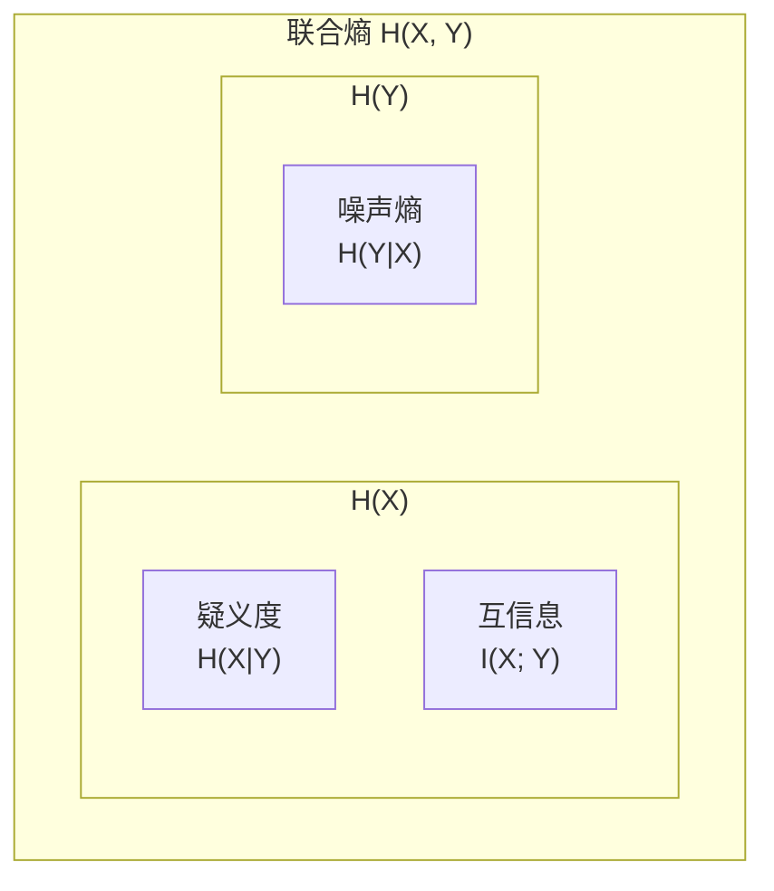

import Card from '@/components/Card.astro';
import ExerciseTrigger from '@/components/exercises/ExerciseTrigger.astro';

在 7.3 节中，信息熵 $H(X)$ 被严格定义为信源发送端输出符号的**先验平均不确定度**。然而，当信号穿过实际存在噪声或干扰的物理信道后，接收端（信宿）所接收到的观测符号 $Y$ 并不一定能够百分之百准确还原发射符号 $X$。

接收端在观察到信宿符号 $Y$ 后，**究竟真正获取了多少关于信源 $X$ 的信息量**？这一度量发送端与接收端之间所传递信息的核心物理量，即为**互信息（Mutual Information, $I(X;Y)$）**。

---

## 7.4.1 互信息的数学定义与物理内涵

### 1. 从不确定度减少量推导互信息

设信源输入为离散随机变量 $X$，信宿输出为离散随机变量 $Y$：
- $H(X)$ 为接收端未收到 $Y$ 之前，对信源 $X$ 所具有的**先验平均不确定度**；
- $H(X \mid Y)$ 为接收端在完整观测到输出 $Y$ 后，对输入 $X$ 依然残存的**后验平均不确定度**（在通信工程中称为**疑义度（Equivocation）** 或损失熵）。

由香农不等式已知：$H(X \mid Y) \le H(X)$。二者之差：
$$
I(X; Y) = H(X) - H(X \mid Y) \quad (\text{bit/symbol})
$$
在物理上严格代表：**由于观测到信宿输出 $Y$，使得关于信源输入 $X$ 的不确定度得以消除（减少）的净数量**。因此，$I(X; Y)$ 就是信宿真正获取的关于信源的信息量。

### 2. 对称性与信宿视角

同理，若从信宿 $Y$ 的角度考察，信源 $X$ 的出现消除了关于 $Y$ 的不确定度：
$$
I(Y; X) = H(Y) - H(Y \mid X)
$$
式中 $H(Y \mid X)$ 称为**噪声熵（Noise Entropy）**，代表信道噪声所引入的不确定度。

通过展开为概率分布期望：
$$
\begin{aligned}
I(X; Y) &= \sum_{i=1}^{n} \sum_{j=1}^{m} P(x_i, y_j) \log_2 \frac{P(x_i \mid y_j)}{P(x_i)} \\
&= \sum_{i=1}^{n} \sum_{j=1}^{m} P(x_i, y_j) \log_2 \frac{P(x_i, y_j)}{P(x_i) P(y_j)}
\end{aligned}
$$
由于上式中 $x_i$ 与 $y_j$ 具有完全对称的形式，立即得到：
$$
I(X; Y) \equiv I(Y; X)
$$
**结论**：互信息具有绝对的**对称互易性**。信源 $X$ 传送给信宿 $Y$ 的信息量，与信宿 $Y$ 获得关于信源 $X$ 的信息量在数理上完全等价。

---

## 7.4.2 互信息与各熵之间的信息拓扑解构（维恩图）

利用链式法则 $H(X, Y) = H(X) + H(Y \mid X) = H(Y) + H(X \mid Y)$，互信息可等价表述为边缘熵与联合熵的代数组合：
$$
I(X; Y) = H(X) + H(Y) - H(X, Y)
$$

这些基础测度之间的集合包含与重叠关系可用清晰的信息维恩图（Venn Diagram）直观刻画：

从几何覆盖关系中可清晰得出四大基本恒等式：
1. $H(X) = I(X; Y) + H(X \mid Y)$（发送熵 = 互信息 + 损失熵）
2. $H(Y) = I(X; Y) + H(Y \mid X)$（接收熵 = 互信息 + 噪声熵）
3. $H(X, Y) = H(X \mid Y) + I(X; Y) + H(Y \mid X)$
4. $I(X; Y) = H(X) - H(X \mid Y) = H(Y) - H(Y \mid X) = H(X) + H(Y) - H(X, Y)$

---

## 7.4.3 互信息的核心数学性质

### 1. 非负性与极值下限
$$
I(X; Y) \ge 0
$$
利用对数不等式 $\ln z \le z - 1$ 可证明，当且仅当信源输入 $X$ 与信宿输出 $Y$ 在统计上**完全独立**（即 $P(x_i, y_j) = P(x_i)P(y_j)$，信道处于全乱码断开状态）时，互信息取得全局最小值：
$$
I(X; Y) = 0
$$

### 2. 极值上限与无失真信道
$$
I(X; Y) \le \min\{H(X), H(Y)\}
$$
- 若信道为**理想无失真信道**（无噪声且无多义映射），给定 $Y$ 能百分之百准确判定 $X$，此时疑义度 $H(X \mid Y) = 0$，互信息达到最大值：
  $$
  I(X; Y) = H(X)
  $$
  接收端完全获取了信源输出的全部信息，此时信息传输效率达到 $100\%$。

### 3. 极值凸性（Convexity）—— 贯穿全书的两大极限定理基石

将互信息显式表达为输入先验分布 $P(x_i)$ 与信道转移概率矩阵 $P(y_j \mid x_i)$ 的函数：
$$
I(X; Y) = \sum_{i=1}^{n} \sum_{j=1}^{m} P(x_i) P(y_j \mid x_i) \log_2 \frac{P(y_j \mid x_i)}{\sum_{k=1}^{n} P(x_k) P(y_j \mid x_k)}
$$

数学分析表明，互信息函数具有极为关键的**双重凸性特征**：

<Card title="互信息的双重凸性特征" type="star">
1. **关于输入先验概率分布 $P(x_i)$ 的上凸性（$\cap$ 凹函数）**：
   在信道转移矩阵 $P(y_j \mid x_i)$ 固定的条件下，$I(X; Y)$ 是关于信源先验分布 $P(x_i)$ 的严格上凸函数。这保证了**存在唯一的信源概率分布使互信息达到全局极大值**，这一极大值被香农定义为**信道容量（Channel Capacity, $C$）**：
   $$
   C = \max_{P(x)} I(X; Y) \quad (\text{bit/channel use})
   $$
2. **关于转移概率条件分布 $P(y_j \mid x_i)$ 的下凸性（$\cup$ 凸函数）**：
   在信源先验分布 $P(x_i)$ 固定的条件下，$I(X; Y)$ 是关于信道条件转移分布 $P(y_j \mid x_i)$ 的严格下凸函数。这保证了在满足给定的平均失真容限 $D$ 约束下，**存在唯一的信道测试转移概率使互信息达到全局极小值**，这一极小值被定义为**信息率失真函数（Rate-Distortion Function, $R(D)$）**：
   $$
   R(D) = \min_{P(y|x): \bar{d} \le D} I(X; Y) \quad (\text{bit/symbol})
   $$
</Card>

上凸性为第 8 章推导信道编码定理与香农容量奠定了数学基础；而下凸性则直接引出本章后续第 7.7 节与第 7.8 节关于限失真信源压缩编码的终极理论极限。

---

<ExerciseTrigger chapter={7} section="7.4" title="7.4 互信息 I(X;Y) 思考题与自测" />
