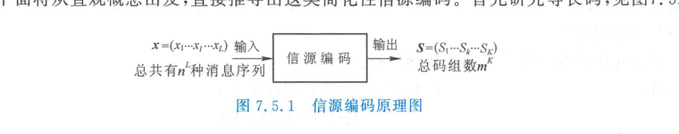
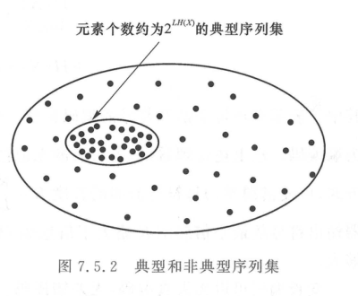

import Card from '../../../../../../components/Card.astro';
import ExerciseTrigger from '../../../../../../components/ExerciseTrigger.astro';

在建立了离散信源的信息度量（信息熵 $H(X)$）之后，通信理论面临的关键问题是：**如何将信源输出的符号序列最紧凑、最高效地转换为数字二进制（或 $m$ 进制）代码序列，并在接收端能够百分之百无失真地唯一恢复？**

信源编码的本质就是数据压缩。香农（Claude E. Shannon）在 1948 年发表的奠基性论文中提出了著名的**香农第一定理（无失真离散信源编码定理）**，它在数学上严格界定了无失真压缩编码的理论物理极限。

---

## 7.5.1 信源编码的数学模型与核心矛盾

信源编码器的基本架构如图 7.5.1 所示：

  

  
图 7.5.1 信源编码器模型：将信源序列 $X$ 映射为紧凑码字序列 $S$

输入信源序列 $\boldsymbol{X} = (X_1, X_2, \dots, X_L)$ 长度为 $L$，每个符号来自基数为 $n$ 的字母表，可能出现的序列总数为 $n^L$。
编码器输出的码字序列 $\boldsymbol{S} = (S_1, S_2, \dots, S_K)$ 长度为 $K$，每个码元取值来自基数为 $m$ 的代码字母表（如二进制 $m=2$），总码组数为 $m^K$。

### 无失真与压缩的数学矛盾
- **绝对无失真（单射映射）**：为确保接收端能够无差错逆变换译码，输出码组总数必须不少于输入序列总数：
  $$
  m^K \ge n^L \implies \frac{K}{L} \ge \frac{\log_2 n}{\log_2 m}
  $$
- **压缩有效性**：若要实现数据压缩，输出码字长度必须尽可能短（$\frac{K}{L} < \frac{\log_2 n}{\log_2 m}$）。

若信源是**完全独立等概率**的，则 $H(X) = \log_2 n$，此时所有序列发生概率均等，在保持无差错的前提下**无法实现任何数据压缩**。
然而，自然实际信源输出符号具有强烈的**不等概率性**与**统计相关性**，正是这种概率的不均衡性，为无失真数据压缩创造了核心契机。

---

## 7.5.2 等长信源编码定理与典型序列集

### 1. 大数定律与典型序列（Typical Sequences）

根据概率论弱大数定律与渐近均分割性（Asymptotic Equipartition Property, AEP）：
当信源序列长度 $L$ 充分大（$L \to \infty$）时，序列中各符号出现的相对频数将严格依概率收敛于其先验概率 $P(x_i)$。

在全部 $n^L$ 个可能序列中，可严格划分为两大互补子集：

  

  
图 7.5.2 序列空间划分：占主导极大概率的典型序列集 $A_\epsilon^{(L)}$ 与概率趋于零的非典型集

<Card title="典型序列集 A_ε^(L) 的三大核心特征" type="star">
1. **各序列概率均匀近似**：集内每一个典型序列出现的联合概率均几乎相等：
   $$
   P(\boldsymbol{x}) \approx 2^{-L H(X)}
   $$
2. **总发生概率趋近于 1**：随着分组长度 $L$ 增大，所有典型序列的概率之和逼近于 $1$：
   $$
   P\left(\boldsymbol{X} \in A_\epsilon^{(L)}\right) > 1 - \delta, \quad \forall \delta > 0
   $$
3. **典型序列总数极度稀疏**：典型序列的总状态数 $N_{\text{typical}}$ 仅仅约为：
   $$
   N_{\text{typical}} \approx 2^{L H(X)} \ll n^L = 2^{L \log_2 n}
   $$
</Card>

### 2. 香农第一等长编码定理（Shannon's First Theorem for Fixed-Length Codes）

既然非典型序列出现的总概率小于任意小的 $\delta$，那么在工程实现中，**只需对全部 $2^{L H(X)}$ 个典型序列进行编码分配码字，对概率几乎为零的非典型序列放弃编码**。

由此得到无失真等长编码的数学极限定理：

<Card title="香农第一等长编码定理" type="star">
设离散无记忆信源的符号信息熵为 $H(X)$，采用 $m$ 进制等长码对长度为 $L$ 的信源序列进行编码。对于任意给定的极小正数 $\epsilon > 0$ 和 $\delta > 0$，只要每个信源符号分配的平均码长满足：
$$
\frac{K}{L} \log_2 m \ge H(X) + \epsilon
$$
则当分组长度 $L$ 充分大时，必可实现译码差错率 $P_e < \delta$（近似无失真编码）；

反之，若：
$$
\frac{K}{L} \log_2 m \le H(X) - 2\epsilon
$$
则当 $L \to \infty$ 时，译码差错率必收敛于 $1$（几乎必然出错）。
</Card>

**物理结论**：传送每一个信源符号所需的最小等长编码位数（信息率 $R = \frac{K}{L}\log_2 m$），其**绝对数理下界就是信源信息熵 $H(X)$**。

---

## 7.5.3 变长信源编码定理（熵编码）

等长编码实现近乎无失真压缩的前提是序列分组长度 $L$ 极大，这在实际通信系统中会引入巨大的编解码时延与缓存硬件开销。为了在较小甚至单个符号的条件下实现完全无失真压缩，必须采用**变长编码（Variable-Length Coding）**。

### 1. 变长编码的统计思想
变长编码的核心直觉是：
- 为**高概率出现**的频繁符号分配**较短**的码长；
- 为**低概率出现**的罕见符号分配**较长**的码长；
- 从而使平均码字长度 $\bar{K} = \sum_{i=1}^n P(x_i) K_i$ 达到最小。

### 2. 香农第一变长编码定理

<Card title="香农第一变长编码定理" type="star">
对离散无记忆信源的序列进行 $m$ 进制变长无失真编码，其平均每信源符号的码长 $\frac{\bar{K}}{L}$ 严格满足上下界：
$$
\frac{H(X)}{\log_2 m} \le \frac{\bar{K}}{L} < \frac{H(X)}{\log_2 m} + \frac{1}{L}
$$

特别地，对于最常用的**二进制编码（$m = 2$）**，每个信源符号的平均码长 $\bar{R} = \frac{\bar{K}}{L}$ 满足：
$$
H(X) \le \bar{R} < H(X) + \frac{1}{L} \quad (\text{bit/symbol})
$$
</Card>

**定理推论**：
1. **下界不可逾越**：无失真编码的平均码长 $\bar{R}$ 绝不可能低于信源自身的信息熵 $H(X)$；
2. **渐近可达性**：只要适度增大联合编码符号数 $L$，平均码长 $\bar{R}$ 可无限逼近信源信息熵 $H(X)$，且**译码差错率严格为零（完全无失真）**。由于此类编码与信源熵精准匹配，故统称为**熵编码（Entropy Coding）**。

---

## 7.5.4 编码效率与冗余度度量

为了定量评价具体信源编码方案对理论香农极限的逼近程度，定义以下指标：

1. **编码效率（Coding Efficiency, $\eta$）**：
   $$
   \eta = \frac{H(X)}{\bar{R}} = \frac{H(X)}{\bar{K} \log_2 m / L} \times 100\% \le 100\%
   $$
2. **信源冗余度（Redundancy, $\gamma$）**：
   $$
   \gamma = 1 - \eta = 1 - \frac{H(X)}{\bar{R}}
   $$

当 $\eta \to 100\%$（$\gamma \to 0$）时，信源编码器完全消除了信源的全部统计多余度，输出的代码序列在统计上呈现完全等概且相互独立的白噪声特征，达到了香农信息论所允许的数据压缩极致。

---

<ExerciseTrigger chapter={7} section="7.5" title="7.5 无失真离散信源编码定理 思考题与自测" />
