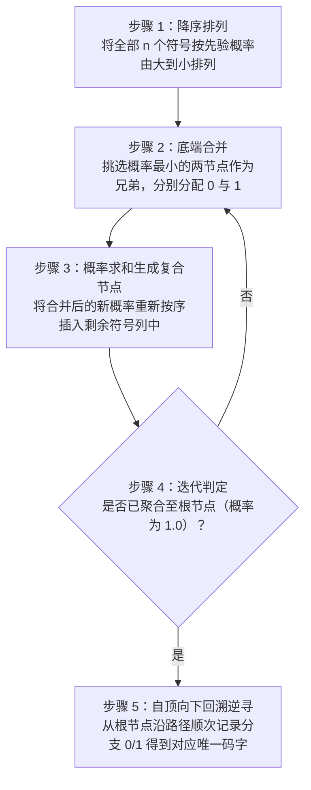
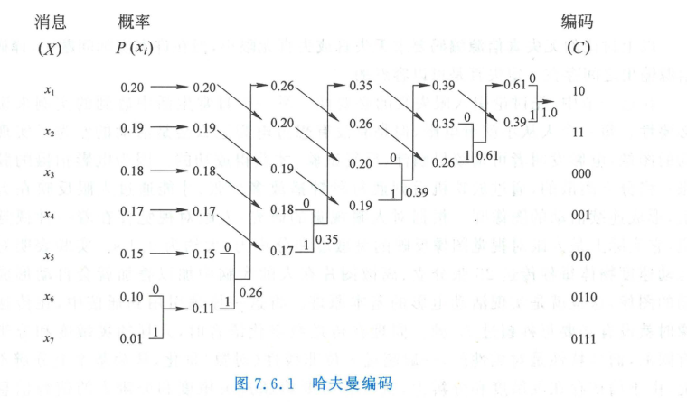

import Card from '@/components/Card.astro';
import Example from '@/components/Example.astro';
import Solution from '@/components/Solution.astro';
import ExerciseTrigger from '@/components/exercises/ExerciseTrigger.astro';

7.5 节的香农第一定理指出了无失真数据压缩的理论极限 —— 平均码长可以无限逼近信源信息熵 $H(X)$。本节重点探讨如何通过具体的**构造性算法**实现这种极致的压缩，核心代表即为**哈夫曼（Huffman）编码**。

---

## 7.6.1 变长码与前缀码原理

在变长信源编码中，不同信源符号被赋予不同长度的代码。为了确保在接收端接收到连续不断的比特流时，无需在符号之间插入专门的“逗号”或分隔符就能**即时、唯一、无歧义地划分出每个码字**，所设计的变长码必须是**唯一可译码（Uniquely Decodable Code）**。

### 1. 前缀码（瞬时码）定义

<Card title="定义：前缀码 (Prefix-Free Code / Instantaneous Code)" type="star">
在一个变长码集中，如果**没有任何一个码字是其他任何长码字的前缀（即开头部分）**，则称该码为**前缀码**或**无前缀码（Prefix-Free Code）**。
</Card>

前缀码具有即时可译性（Instantaneous）：解码器从左至右扫描接收比特流，一旦识别出某一段比特与码本中某一码字完全吻合，便可立即断定该符号结束并完成译码，绝不需要等待后续比特。

### 2. 克拉夫特不等式（Kraft Inequality）

设代码字母表基数为 $m$（二进制时 $m = 2$），信源包含 $n$ 个离散符号，各码字的长度分别为 $K_1, K_2, \dots, K_n$。
**前缀码存在的充要条件**是各码长满足著名的克拉夫特不等式：
$$
\sum_{i=1}^{n} m^{-K_i} \le 1
$$

---

<Example title="例 7.6.1 变长前缀码达到 100% 编码效率">
设有一离散无记忆信源 $\mathcal{X} = \{x_1, x_2, x_3, x_4\}$，各符号概率分别为：
$$
\begin{bmatrix}
\mathcal{X} \\
P(x)
\end{bmatrix} =
\begin{bmatrix}
x_1 & x_2 & x_3 & x_4 \\
\frac{1}{2} & \frac{1}{4} & \frac{1}{8} & \frac{1}{8}
\end{bmatrix}
$$
采用如下单符号变长码：
- $x_1 \to 0$（码长 $K_1 = 1$）
- $x_2 \to 10$（码长 $K_2 = 2$）
- $x_3 \to 110$（码长 $K_3 = 3$）
- $x_4 \to 111$（码长 $K_4 = 3$）

试验证其前缀特性并求解编码效率。
</Example>

<Solution title="解">
**(1) 前缀特性验证**：
码字集为 $\{0, 10, 110, 111\}$。码字 $0$ 不是其余任何码字的前缀；码字 $10$ 亦不是 $110$ 或 $111$ 的前缀。各码长满足克拉夫特不等式：
$$
2^{-1} + 2^{-2} + 2^{-3} + 2^{-3} = \frac{1}{2} + \frac{1}{4} + \frac{1}{8} + \frac{1}{8} = 1.0 \le 1
$$
故为完全前缀瞬时码。

**(2) 求解信息熵与平均码长**：
信源符号信息熵为：
$$
H(X) = -\left[ \frac{1}{2}\log_2\frac{1}{2} + \frac{1}{4}\log_2\frac{1}{4} + 2 \times \frac{1}{8}\log_2\frac{1}{8} \right] = \frac{1}{2}(1) + \frac{1}{4}(2) + \frac{1}{4}(3) = \frac{7}{4} = 1.75 \text{ bit/symbol}
$$

单符号逐个编码（$L=1$）时的平均码长为：
$$
\bar{K} = \sum_{i=1}^{4} P(x_i) K_i = \frac{1}{2}(1) + \frac{1}{4}(2) + \frac{1}{8}(3) + \frac{1}{8}(3) = \frac{7}{4} = 1.75 \text{ bit/symbol}
$$

**(3) 求解编码效率**：
$$
\eta = \frac{H(X)}{\bar{K}} = \frac{1.75}{1.75} = 100\%
$$
**结论**：当信源符号的先验概率恰好均为 2 的负整数次幂（即 $P(x_i) = 2^{-K_i}$）时，变长前缀码对单个符号编码即可达到 $100\%$ 的理论香农熵极限！
</Solution>

---

## 7.6.2 哈夫曼（Huffman）最优前缀编码

1952 年，麻省理工学院博士生大卫·哈夫曼（David A. Huffman）提出了一种自底向上的最优前缀二叉树构造算法。数学已严格证明：**在所有针对离散无记忆信源的符号级唯一可译前缀码中，哈夫曼编码具有最小的平均码长**。

### 1. 哈夫曼编码标准五步法

---

<Example title="例 7.6.2 7符号信源的哈夫曼二叉树编码全流程">
设有一离散单符号信源包含 7 个独立符号：
$$
\begin{bmatrix}
\mathcal{X} \\
P(x)
\end{bmatrix} =
\begin{bmatrix}
x_1 & x_2 & x_3 & x_4 & x_5 & x_6 & x_7 \\
0.20 & 0.19 & 0.18 & 0.17 & 0.15 & 0.10 & 0.01
\end{bmatrix}
$$
试对其进行二进制哈夫曼编码，并求解其平均码长与编码效率。
</Example>

<Solution title="解">
根据哈夫曼编码规则，自底向上合并最小概率节点：

  

  
图 7.6.1 7 个信源符号的哈夫曼二叉树缩减与分支代码分配过程

**缩减合并演化步骤**：
1. 初始概率降序排布：$0.20, 0.19, 0.18, 0.17, 0.15, 0.10, 0.01$；
2. 最小两项为 $x_6(0.10)$ 与 $x_7(0.01)$，合并为 $0.11$（赋分支 $0, 1$）；
3. 剩余序列重排：$0.20, 0.19, 0.18, 0.17, 0.15, 0.11$；
4. 最小两项为 $0.15$ 与 $0.11$，合并为 $0.26$；
5. 剩余序列重排：$0.26, 0.20, 0.19, 0.18, 0.17$；
6. 最小两项为 $0.18$ 与 $0.17$，合并为 $0.35$；
7. 剩余序列重排：$0.35, 0.26, 0.20, 0.19$；
8. 最小两项为 $0.20$ 与 $0.19$，合并为 $0.39$；
9. 剩余序列重排：$0.39, 0.35, 0.26$；
10. 最小两项为 $0.35$ 与 $0.26$，合并为 $0.61$；
11. 最终两项为 $0.39$ 与 $0.61$，合并为 $1.00$（根节点）。

从根节点沿路径自顶向下回溯，得到各符号的码字分配：

| 符号 | 概率 $P(x_i)$ | 哈夫曼码字 | 码长 $K_i$ |
| :---: | :---: | :---: | :---: |
| $x_1$ | 0.20 | `10` | 2 |
| $x_2$ | 0.19 | `11` | 2 |
| $x_3$ | 0.18 | `000` | 3 |
| $x_4$ | 0.17 | `001` | 3 |
| $x_5$ | 0.15 | `010` | 3 |
| $x_6$ | 0.10 | `0110` | 4 |
| $x_7$ | 0.01 | `0111` | 4 |

**(1) 求解信源信息熵**：
$$
H(X) = -\sum_{i=1}^{7} P(x_i) \log_2 P(x_i) \approx 2.61 \text{ bit/symbol}
$$

**(2) 求解平均码长**：
$$
\begin{aligned}
\bar{K} &= \sum_{i=1}^{7} P(x_i) K_i \\
&= 0.20(2) + 0.19(2) + 0.18(3) + 0.17(3) + 0.15(3) + 0.10(4) + 0.01(4) \\
&= 0.40 + 0.38 + 0.54 + 0.51 + 0.45 + 0.40 + 0.04 = 2.72 \text{ bit/symbol}
\end{aligned}
$$

**(3) 求解编码效率与冗余度**：
$$
\eta = \frac{H(X)}{\bar{K}} = \frac{2.61}{2.72} \approx 95.96\%
$$
$$
\gamma = 1 - \eta \approx 4.04\%
$$
若采用等长编码，7 个符号至少需要 $K = \lceil \log_2 7 \rceil = 3 \text{ bit}$。哈夫曼编码使平均码长缩短至 $2.72 \text{ bit}$，显著提高了传输有效性。
</Solution>

---

## 7.6.3 哈夫曼编码的工程特性与现代衍生

1. **码字分配的非唯一性**：
   - 兄弟分支分配 `0` 或 `1` 是任意对偶的；
   - 当多个中间复合节点具有相同概率时，重排次序的选择不唯一。
   - **数学结论**：不同的分配树会产生形式不同的码本，但**最终计算所得的平均码长 $\bar{K}$ 是唯一确定的，且绝对达到理论最小值**。
2. **对先验概率的强依赖性**：
   - 哈夫曼编码的最佳性完全建立在“信源概率统计特性精准已知且长期平稳”的严苛假设下；
   - 若实际信源概率漂移或未知，哈夫曼码将失去匹配性，压缩效率急剧恶化。
3. **工程扩展与实用无失真编码演进**：
   - **游程编码（Run-Length Encoding, RLE）**：传真与二值图文编码的工业标准。将连续重复的相同比特串（如“白游程”与“黑游程”长度）作为扩展消息，再对其运行哈夫曼统计编码；
   - **算术编码（Arithmetic Coding）**：摆脱了哈夫曼编码必须为每个符号分配整数比特的结构约束，将整个消息序列映射为 $[0, 1)$ 实数区间中的一个子区间，特别适用于自适应动态信源压缩；
   - **字典编码（Lempel-Ziv / LZ77 / LZ78 / LZW）**：无需预先获知任何先验概率模型，自适应建立字符串滑动窗口字典。奠定了现代计算机网络通用压缩算法（Gzip, PNG, ZIP, 7z）的核心基础。

---

<ExerciseTrigger chapter={7} section="7.6" title="7.6 无失真离散信源编码 课后习题与自测" />
