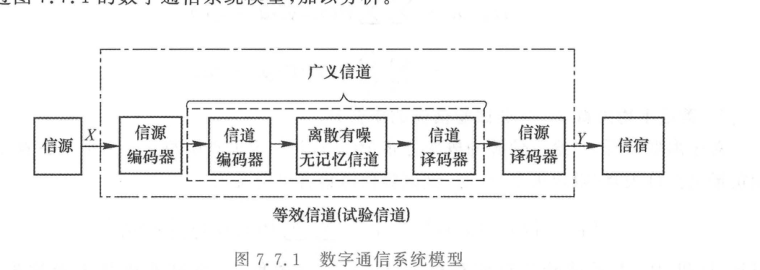
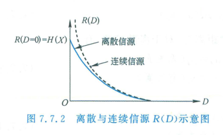
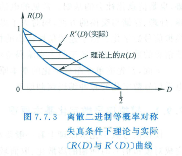

import Card from '../../../../../../components/Card.astro';
import Example from '../../../../../../components/Example.astro';
import Solution from '../../../../../../components/Solution.astro';
import ExerciseTrigger from '../../../../../../components/ExerciseTrigger.astro';

前面几节探讨的无失真信源编码要求译码输出与信源输出严格一致（或差错率任意逼近于零）。然而在实际工程应用中，**完全无失真既不经济，在许多物理场景下也绝无可能**。

本节系统讨论香农信息论中指导现代有损数据压缩（音频 MP3/AAC、图像 JPEG、视频 H.264/AV1）的最高理论准绳 —— **信息率失真理论（Rate-Distortion Theory）** 与 **$R(D)$ 函数**。

---

## 7.7.1 引入限失真编码的工程与生理必然性

### 1. 人类感官的生理极限与分辨率截断
人类接收端（眼、耳等中枢神经系统）的生理感知灵敏度与分辨率均是有限的：
- **视觉暂留效应**：人眼的视觉暂留时间约为 $0.1\text{ s}$。在电影与电视传输中，每秒只需播放 $25 \sim 30$ 帧分立离散的静态图像，人脑即可完全感知为平滑连续的活动画面，传输超出眼力分辨范围的高时间采样率纯属无效开销；
- **听觉非线性与对数压扩**：人耳对声音响度的感知符合韦伯-费希纳对数定律，当数字化语音达到 8 位对数量化（如电话 PCM 64 kbit/s）后，听觉器官已根本无法辨识更微小的量化阶梯噪声。

### 2. 连续模拟信源的数学本质
连续模拟信源的样值在连续实数区间内任意取值，其可能状态数是不可数的连续无穷大。在信息论上，**连续信源的绝对信息量为无穷大（$H(X) = \infty$）**。
若执意要求连续物理量在传输后毫无偏差地绝对无失真还原，通信系统所必须具有的信息传输速率和信道带宽必须为无穷大！

**结论**：**任何实际的连续模拟信号数字化系统，在数理本质上必然且必须属于限失真信源编码范畴**。允许在信宿可容忍的容限内引入一定失真，信源编码器输出的信息速率 $R$ 便可大幅下降至远低于信源绝对熵，极大地提高信道利用率。

---

## 7.7.2 失真函数与平均失真度

系统模型如图 7.7.1 所示：

  

  
图 7.7.1 包含信源编码、试验信道与限失真译码的数字通信系统模型

### 1. 单符号失真度度量

设信源输入符号为 $x_i$，译码输出符号为 $y_j$，定义非负单符号失真函数 $d(x_i, y_j) \ge 0$：
- **二元汉明失真度（Hamming Distortion）**（用于离散数字信源）：
  $$
  d(x_i, y_j) = \begin{cases}
  0, & x_i = y_j \quad (\text{判决正确}) \\
  1, & x_i \neq y_j \quad (\text{判决出错})
  \end{cases}
  $$
- **均方误差失真度（Squared-Error Distortion）**（用于连续波形信源）：
  $$
  d(x, y) = (x - y)^2
  $$

### 2. 统计平均失真度与试验信道集合

系统整体的失真性能由**统计平均失真度 $\bar{d}$** 度量：
$$
\bar{d} = E[d(X, Y)] = \sum_{i=1}^{n} \sum_{j=1}^{m} P(x_i) P(y_j \mid x_i) d(x_i, y_j)
$$

给定系统最大允许失真容限 $D$，所有满足保真度要求的信源编解码条件转移概率分布 $P(y_j \mid x_i)$ 构成**试验信道集合 $\mathcal{P}_D$**：
$$
\mathcal{P}_D = \left\{ P(y_j \mid x_i) : \bar{d} = \sum_{i=1}^{n} \sum_{j=1}^{m} P(x_i) P(y_j \mid x_i) d(x_i, y_j) \le D \right\}
$$

---

## 7.7.3 信息率失真函数 $R(D)$ 的定义与数理性质

在信源先验分布 $P(x_i)$ 固定的条件下，互信息 $I(X; Y)$ 是条件转移概率 $P(y \mid x)$ 的下凸函数。因此，在受约束的凸集 $\mathcal{P}_D$ 内，必存在全局唯一的极小值。

<Card title="定义：信息率失真函数 (Rate-Distortion Function, R(D))" type="star">
在给定信源先验分布 $P(x_i)$ 和最大允许平均失真 $D$ 的条件下，信宿与信源之间的**最小互信息**定义为**信息率失真函数 $R(D)$**：
$$
R(D) = \min_{P(y|x) \in \mathcal{P}_D} I(X; Y) \quad (\text{bit/symbol})
$$
</Card>

**物理意义**：$R(D)$ 界定了在保证平均失真不超过 $D$ 的前提下，传送信源输出所需信息传输速率的**绝对理论下界**。任何实用的限失真压缩编码系统，其编码信息率 $R$ 必须满足 $R \ge R(D)$。

  

  
图 7.7.2 离散信源与连续模拟信源的信息率失真函数 $R(D)$ 典型曲线对比

### $R(D)$ 函数的几何与解析性质
1. **单调递减性**：$R(D)$ 是关于失真容限 $D$ 的单调非增连续函数。允许失真 $D$ 越宽容，编码所需信息率 $R(D)$ 越低；
2. **严格下凸性（$\cup$ 凸函数）**：$\frac{\mathrm{d}^2 R}{\mathrm{d}D^2} \ge 0$；
3. **零失真端点**：
   - 对于离散信源：当 $D = 0$ 时，无失真退化点 $R(0) = H(X)$（等于无失真信息熵）；
   - 对于连续信源：当 $D \to 0$ 时，$R(D) \to \infty$；
4. **最大失真截止点（$D_{\max}$）**：当允许失真超过某一临界值 $D_{\max}$ 时，信宿完全无需接收任何信息即可自行猜测达到该失真度，此时 $R(D) \equiv 0$。

---

<Example title="例 7.7.1 二进制等概信源的理论 R(D) 与实用分块编码方案对比">
设有一离散二元等概信源：$P(x_0) = P(x_1) = 0.5$，采用汉明失真准则。
现设计一简易分组工程编码方案：每接收 $N$ 个符号只传输前 $N-1$ 个符号，未传输的第 $N$ 个符号在接收端采用随机猜硬币方式恢复（差错率 $1/2$）。

试求解该工程方案的实际率失真性能 $R'(D)$，并与理论香农极限 $R(D)$ 作对比。
</Example>

<Solution title="解">
**(1) 求解工程方案的平均失真与编码率**：
每组 $N$ 个符号仅错第 $N$ 个符号的一半概率，因此平均失真为：
$$
D = \frac{1}{N} \times \frac{1}{2} = \frac{1}{2N} \implies \frac{1}{N} = 2D
$$
编码器每信源符号实际传输的比特数（信息率）为：
$$
R'(D) = \frac{N - 1}{N} = 1 - \frac{1}{N} = 1 - 2D \quad (\text{bit/symbol})
$$

**(2) 求解理论香农率失真函数 $R(D)$**：
利用拉格朗日乘子法求解凸优化，可严格推导出二进制对称信源在汉明失真下的理论公式：
$$
R(D) = 1 - h_2(D) = 1 - \left[ -D \log_2 D - (1-D)\log_2(1-D) \right]
$$

  

  
图 7.7.3 二进制信源理论香农下界 $R(D)$ 与简易分块编码方案 $R'(D)$ 性能曲线对比

**结论与物理洞见**：
如图 7.7.3 所示，实际简易工程曲线 $R'(D) = 1 - 2D$ 是一条割线，处处严格位于理论下凸曲线 $R(D)$ 的上方。两者之间的**阴影闭合区域**定量表征了当前方案相对于香农极限的性能差距（压缩损失）。
通信工程师通过引入更高级的矢量量化、块预测或变换编码算法，可使实际编码曲线不断向理论极限 $R(D)$ 贴近，最大化压缩效能。
</Solution>

---

<ExerciseTrigger chapter={7} section="7.7" title="7.7 信息率失真函数 思考题与自测" />
