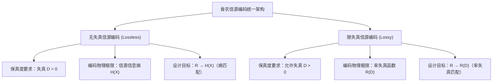

import Card from '@/components/Card.astro';
import ExerciseTrigger from '@/components/exercises/ExerciseTrigger.astro';

7.5 节给出了无失真编码的香农第一定理，7.7 节定义了信息率失真函数 $R(D)$。本节建立二者之间的桥梁 —— **限失真信源编码定理（Rate-Distortion Theorem）**。

---

## 7.8.1 限失真信源编码定理的核心陈述

<Card title="定理：离散无记忆限失真信源编码定理 (Shannon's Rate-Distortion Coding Theorem)" type="star">
设某一离散无记忆平稳信源的信息率失真函数为 $R(D)$。

1. **正定理（可达性准则）**：
   对于任意给定的允许平均失真度 $D$ 和任意小的正数 $\epsilon > 0$、$\delta > 0$，只要通信系统实际分配的信源编码传输速率满足：
   $$
   R > R(D) \quad (\text{bit/symbol})
   $$
   则只要输入序列的块长 $L$ 充分大（$L \to \infty$），**必定存在一种编码与译码映射方式**，使得重构信号的平均失真度满足：
   $$
   \bar{d} \le D + \epsilon
   $$
2. **逆定理（不可逾越性）**：
   反之，若实际编码信息率低于率失真函数界限：
   $$
   R < R(D)
   $$
   则**无论采用何种极其复杂的编解码算法或无限长的序列延时，译码重构信号的平均失真必定严格大于 $D$（$\bar{d} > D$）**。
</Card>

---

## 7.8.2 无失真与限失真信源编码的哲学辩证统一

限失真信源编码定理揭示了数据压缩在信息论上的终极统一性：

| 对比维度 | 无失真离散信源编码 | 限失真连续/离散信源编码 |
| :--- | :--- | :--- |
| **失真容限约束** | $D = 0$（零差错） | $\bar{d} \le D$（容忍有限平均误差） |
| **理论物理极限定界** | **信息熵 $H(X)$** | **信息率失真函数 $R(D)$** |
| **信源编码匹配准则** | $R \to H(X)$（熵编码） | $R \to R(D)$（率失真编码） |
| **应用技术代表** | 哈夫曼编码、算术编码、LZ 字典 | 标量量化（PCM）、矢量量化、DPCM、变换编码 |

**本质认知**：**无失真信源编码是限失真信源编码在允许失真 $D = 0$ 时的特殊退化情形**。
在现实通信工程中，绝大多数物理信号（声音、图像、视频、雷达）均为连续模拟信源，其 $H(X) = \infty$。因此，**有损压缩（限失真编码）才是现代多媒体通信与大容量信息传输的主战场**。

---

<ExerciseTrigger chapter={7} section="7.8" title="7.8 限失真信源编码定理与限失真信源编码 思考题与自测" />
