import Card from '../../../../../../components/Card.astro';
import Example from '../../../../../../components/Example.astro';
import Solution from '../../../../../../components/Solution.astro';
import ExerciseTrigger from '../../../../../../components/ExerciseTrigger.astro';

自然界中的绝大多数原始信源（语音声波、自然图像、雷达回波、模拟传感数据）在时间与幅度上均为连续变化的模拟信号。然而在现代信息基础设施中，由于数字信号具备**抗干扰与抗噪声积累能力强、易于高密度存储与加密运算、便于超大规模集成电路（VLSI）实现及多业务灵活复用**等压倒性优势，**模拟信号数字化（A/D 转换）** 已成为现代通信技术发展的绝对基石。

由于连续模拟变量拥有不可数无穷多的状态（信息熵 $H(X) = \infty$），用有限位数字符号表示模拟连续量**必然伴随失真**，因此模拟信号数字化体系在信息论范畴内严格隶属于**限失真信源编码（Lossy Source Coding）**。

---

## 7.9.1 模拟信号数字化的基本原理

模拟信号数字化（A/D 转换）在物理上严格涵盖三大有序步骤：**采样（Sampling）**、**量化（Quantization）** 与 **编码（Coding）**。

  

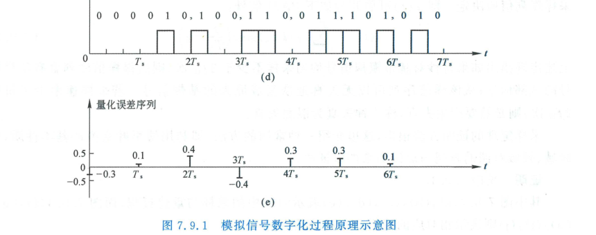

  
图 7.9.1 模拟信号数字化的三大基本物理阶段：(a) 原始模拟信号；(b) 时间离散抽样；(c) 幅度离散量化；(d) 二进制码字生成；(e) 伴生量化误差

1. **采样（时间离散化）**：按照一定的时间间隔 $T_s$ 对连续时间信号 $x(t)$ 瞬时抽样，将时间上连续的信号转换为时间轴离散的样值脉冲序列；
2. **量化（幅度离散化）**：将取值连续的样值幅度四舍五入映射到有限个离散标准电平（量化级）上。**量化误差是不可逆的，是导致信息损失的唯一物理环节**；
3. **编码（码字离散化）**：将离散量化电平按照预定规则转换为二进制码组（如 8 位二进制字节），合成基带数字码流。

---

## 7.9.2 采样定理（Sampling Theorem）

采样定理是连接模拟连续世界与数字离散世界的数理桥梁。

### 1. 低通采样定理（奈奎斯特采样定理）

设连续时间带限模拟信号 $x(t)$ 的最高截止频率为 $f_H$（角频率 $\omega_H = 2\pi f_H$），其傅里叶频谱 $X(f)$ 在 $|f| > f_H$ 时恒为零。

  

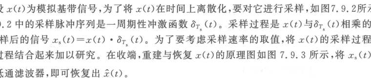

  
图 7.9.2 理想冲激抽样乘法器模型

  

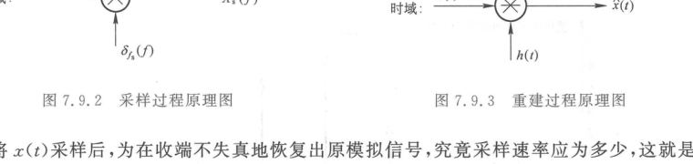

  
图 7.9.3 理想周期冲激脉冲采样序列 $s(t) = \sum_{k=-\infty}^\infty \delta(t - k T_s)$

采样过程在数学上表现为信号 $x(t)$ 与周期冲激脉冲序列 $s(t)$ 的相乘：
$$
x_s(t) = x(t) \cdot \sum_{k=-\infty}^{\infty} \delta(t - k T_s) = \sum_{k=-\infty}^{\infty} x(k T_s) \delta(t - k T_s)
$$
根据频域时域对应关系，抽样信号的傅里叶变换是原频谱 $X(f)$ 以采样角频率 $\omega_s = 2\pi / T_s$ 为周期的无限次周期拓延叠加：
$$
X_s(f) = f_s \sum_{n=-\infty}^{\infty} X(f - n f_s)
$$

  

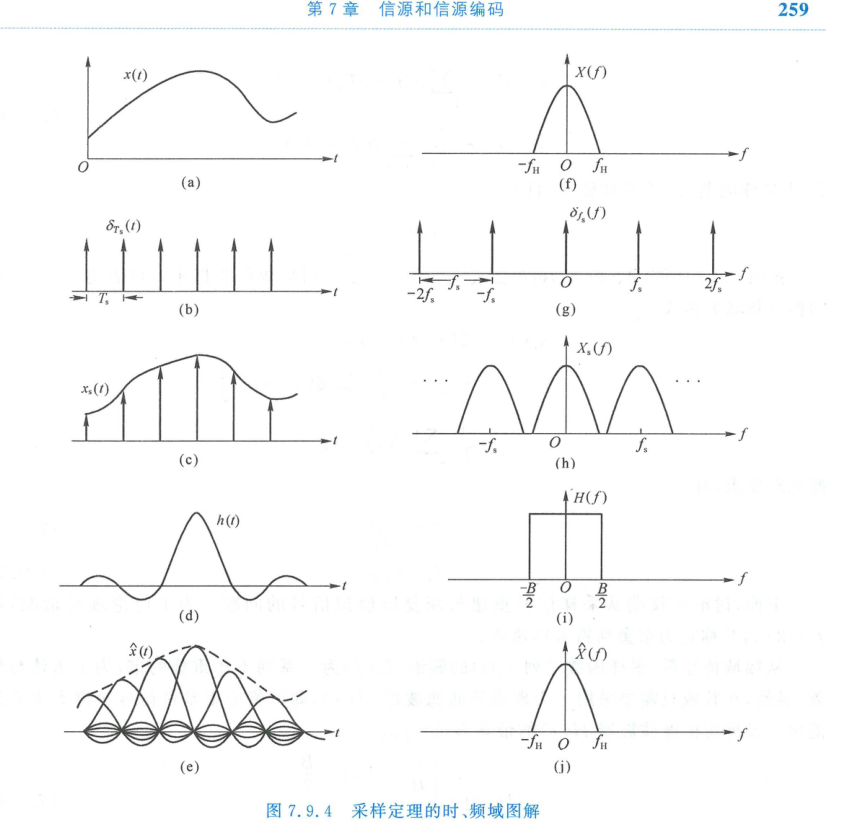

  
图 7.9.4 时域与频域采样与内插低通无失真重构全物理映射过程

#### 奈奎斯特采样准则
为了使频谱周期延拓时不发生频谱交叠，各延拓副本之间的间隔必须满足：
$$
f_s - f_H \ge f_H \implies f_s \ge 2 f_H
$$
- $f_{s,\min} = 2 f_H$ 称为**奈奎斯特速率（Nyquist Rate）**；
- 对应最大允许抽样时间间隔为**奈奎斯特间隔**：$T_{s,\max} = \frac{1}{2 f_H}$。

#### 理想重建公式（惠特克-香农内插公式）
只要满足 $f_s \ge 2 f_H$，将抽样信号 $x_s(t)$ 馈入通带增益为 $T_s$、截止频率为 $f_H$ 的理想矩形低通滤波器，在时域上对应与 $\operatorname{sinc}$ 函数的卷积，原连续信号可百分之百无失真精确重构：
$$
x(t) = \sum_{k=-\infty}^{\infty} x(k T_s) \operatorname{sinc}\left(\frac{t - k T_s}{T_s}\right) = \sum_{k=-\infty}^{\infty} x(k T_s) \frac{\sin\left[\pi (t - k T_s)/T_s\right]}{\pi (t - k T_s)/T_s}
$$

若采样频率不足（$f_s < 2 f_H$），高频成分将折叠进入低频带，产生不可逆的**混叠失真（Aliasing）**：

  

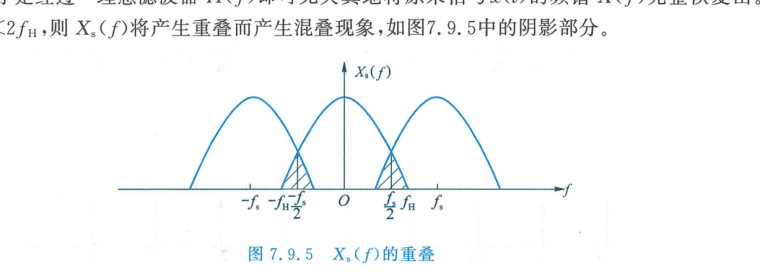

  
图 7.9.5 采样频率低于两倍最高频率引发的频谱严重混叠失真

---

### 2. 带通采样定理（Bandpass Sampling Theorem）

在无线中频接收与软件无线电（SDR）中，信号常呈现带通特性，频带限制在 $[f_L, f_H]$，绝对带宽 $B = f_H - f_L$。若直接应用低通采样定理，采样频率需达到 $f_s \ge 2 f_H$，当载频极高时对 ADC 硬件器件提出极端挑战。

带通采样定理指出：通过精心选择采样频率，使频谱周期延拓副本恰好填满频带间隙而不重叠：

  

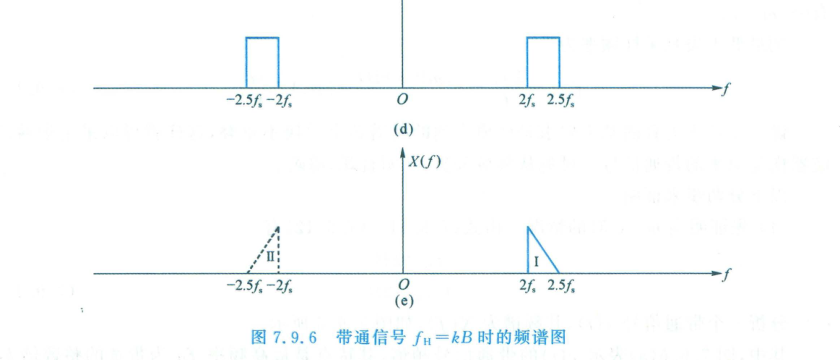

  
图 7.9.6 带通信号抽样频谱的紧密互锁周期排列

令 $k = \lfloor f_H / B \rfloor$ 为最高频率包含带宽的最大整数倍，无混叠的带通最小采样频率为：
$$
f_{s,\min} = \frac{2 f_H}{k} = 2B\left(1 + \frac{r}{k B}\right)
$$
式中 $r = f_H - k B$ 为余数（$0 \le r < B$）。

  

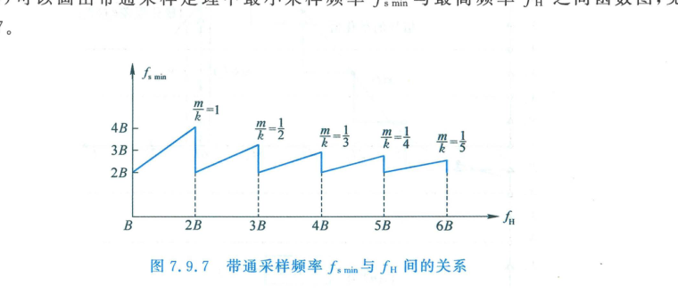

  
图 7.9.7 带通采样最小允许频率随载频变化的锯齿特性曲线（介于 $2B$ 与 $4B$ 之间）

带通采样的最低速率始终落在 **$2B \le f_s \le 4B$** 之间，极大降低了对超高速模数转换器的物理带宽苛求。

---

## 7.9.3 标量量化（Scalar Quantization）

标量量化器是将时间连续样值信号 $x$ 映射为离散量化电平 $y_k$ 的非线性运算器：

  

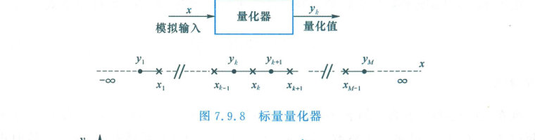

  
图 7.9.8 标量量化器的分段阶梯输入输出特性模型

### 1. 均匀量化与量化信噪比（SQNR）

若输入信号动态范围为 $[-V, +V]$，被划分为 $M$ 个等间距量化区间，每个量化间隔为：
$$
\Delta = \frac{2V}{M} = \frac{2V}{2^N}
$$
式中 $N = \log_2 M$ 为量化编码位数。

  

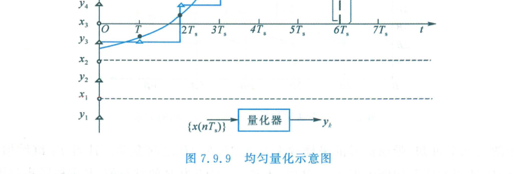

  
图 7.9.9 均匀量化阶梯特性与局限在 $[-\Delta/2, +\Delta/2]$ 内的量化误差波形

量化误差 $e_q = x - y_k$ 在 $[-\frac{\Delta}{2}, +\frac{\Delta}{2}]$ 内服从均匀分布，其量化噪声功率为：
$$
\sigma_q^2 = \int_{-\Delta/2}^{\Delta/2} e^2 \frac{1}{\Delta} \mathrm{d}e = \frac{\Delta^2}{12}
$$

对于峰值幅度为 $V$ 的满幅正弦交流信号，信号功率为 $S = \frac{V^2}{2}$。信号量化噪声比（SQNR）为：
$$
\text{SQNR} = 10 \log_{10}\left(\frac{S}{\sigma_q^2}\right) = 10 \log_{10}\left(\frac{V^2 / 2}{(2V / 2^N)^2 / 12}\right) = 10 \log_{10}\left(\frac{3}{2} \cdot 2^{2N}\right)
$$
展开计算得到著名的**数字音频/通信 6 dB 定则**：
$$
\text{SQNR} = 6.02 N + 1.76 \quad (\text{dB})
$$
**物理规律**：量化器每增加 $1\text{ bit}$ 编码精度，量化信噪比提升约 **$6\text{ dB}$**。

---

### 2. 劳埃德-麦克斯（Lloyd-Max）最佳标量量化准则

对于非均匀分布的连续信源，均匀量化并非均方误差最小的最优量化。
在均方失真 $D = \sum_{k=1}^M \int_{x_{k-1}}^{x_k} (x - y_k)^2 p(x)\mathrm{d}x$ 达到极小时，判决门限 $\{x_k\}$ 与量化电平 $\{y_k\}$ 必须严格满足**两组互锁正交条件**：

<Card title="Lloyd-Max 最佳标量量化条件" type="star">
1. **最佳判决门限（中点条件）**：
   $$
   x_k = \frac{y_k + y_{k+1}}{2}
   $$
   分层门限电平应恰好位于相邻两个重建量化电平的算术中点；
2. **最佳量化电平（概率质心条件）**：
   $$
   y_k = \frac{\int_{x_{k-1}}^{x_k} x p(x)\mathrm{d}x}{\int_{x_{k-1}}^{x_k} p(x)\mathrm{d}x} = E[X \mid X \in (x_{k-1}, x_k)]
   $$
   每个量化区间的输出值应为其在对应区间内的条件统计概率质心。
</Card>

---

### 3. 非均匀量化与对数压扩（Companding）

在语音通信中，小幅度样值出现的概率极高（服从拉普拉斯分布），大信号出现概率极低。若采用均匀量化，小信号落入固定步长 $\Delta$ 时，相对误差极大，信噪比严重恶化：

  

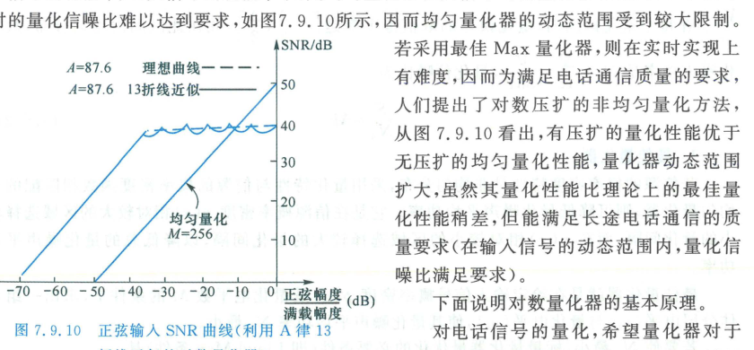

  
图 7.9.10 均匀量化与对数压扩量化信噪比随输入动态范围的变化曲线对比

为了在宽达 $40 \sim 50\text{ dB}$ 的动态范围内维持恒定高信噪比，工程上普遍采用**压扩技术（Companding）**：

  

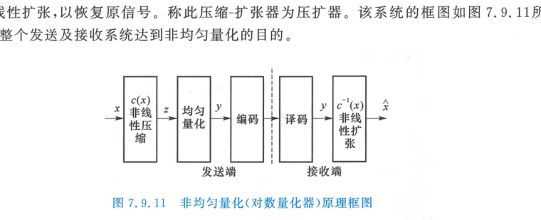

  
图 7.9.11 由发射端非线性压缩器与接收端互逆扩张器构成的压扩系统架构

#### 国际对数压扩标准
国际电信联盟（ITU-T G.711）推荐了两大经典标准：

  

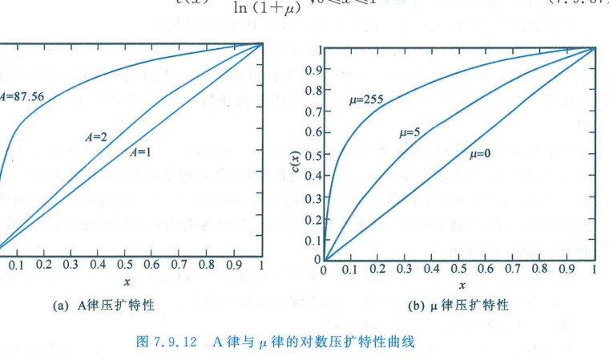

  
图 7.9.12 A 律与 $\mu$ 律对数压缩特性解析曲线

1. **A 律压扩（欧洲与中国采用，指定标准 $A = 87.56$）**：
   $$
   y = \begin{cases}
   \frac{A x}{1 + \ln A}, & 0 \le x \le \frac{1}{A} \\
   \frac{1 + \ln(A x)}{1 + \ln A}, & \frac{1}{A} < x \le 1
   \end{cases}
   $$
2. **$\mu$ 律压扩（北美与日本采用，指定标准 $\mu = 255$）**：
   $$
   y = \frac{\ln(1 + \mu x)}{\ln(1 + \mu)}, \quad 0 \le x \le 1
   $$

---

### 4. A 律 13 折线与 8 位 PCM 编码算法

在数字硬件实现中，平滑对数曲线难以精确用电路实现。工程上普遍采用 **A 律 13 折线（13-Segment Characteristic）** 逼近理论 A 律曲线。

将正负输入电压归一化范围 $[-1, +1]$ 沿横轴非均匀划分为 8 个不等长区间，各段边界依次按 $1/2$ 几何级数二等分收缩：$[0, \frac{1}{128}, \frac{1}{64}, \frac{1}{32}, \frac{1}{16}, \frac{1}{8}, \frac{1}{4}, \frac{1}{2}, 1]$。

  

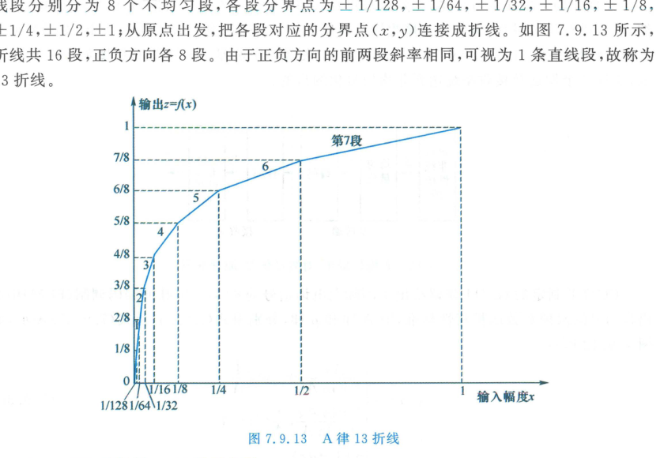

  
图 7.9.13 A 律 13 折线正极性 8 段折线几何结构与斜率倍增关系

由于正负第一段在原点处斜率相同（均为 16）并呈一条直线，正负极性共 $8 \times 2 - 2 = 14$ 段中合并中心 2 段，实际构成 **13 段线性折线**。

#### 8 位 PCM 码字结构
每个抽样值被编码为一个标准的 8 比特字节（`C1 C2 C3 C4 C5 C6 C7 C8`）：
1. **$C_1$（极性码，1 bit）**：判断样值符号。正极性取 `1`，负极性取 `0`；
2. **$C_2 C_3 C_4$（段落码，3 bit）**：标识样值落在正（或负）极性的哪一个折线段内（段落号 $0 \sim 7$，对应代码 `000` 到 `111`）；
3. **$C_5 C_6 C_7 C_8$（段内码，4 bit）**：在确定的折线段内，均匀细分 16 个量化量化级，标识样值落在段内的具体位置（$0 \sim 15$）。

| 段号 | 段落码 $C_2 C_3 C_4$ | 归一化输入电平范围 | 段落起始归一化电平 | 段内每个量化级步长 $\Delta_i$ |
| :---: | :---: | :---: | :---: | :---: |
| 1 | `000` | $[0, 1/128)$ | 0 | $1/2048$ |
| 2 | `001` | $[1/128, 1/64)$ | $16/2048$ | $1/2048$ |
| 3 | `010` | $[1/64, 1/32)$ | $32/2048$ | $2/2048$ |
| 4 | `011` | $[1/32, 1/16)$ | $64/2048$ | $4/2048$ |
| 5 | `100` | $[1/16, 1/8)$ | $128/2048$ | $8/2048$ |
| 6 | `101` | $[1/8, 1/4)$ | $256/2048$ | $16/2048$ |
| 7 | `110` | $[1/4, 1/2)$ | $512/2048$ | $32/2048$ |
| 8 | `111` | $[1/2, 1]$ | $1024/2048$ | $64/2048$ |

---

<Example title="例 7.9.1 A 律 13 折线 8 位 PCM 编码计算">
设输入模拟电压信号的最大允许动态范围为 $[-6\text{ V}, +6\text{ V}]$，当前抽样样值电压为 $x = +1.35\text{ V}$。
试求解：
1. 该抽样值的 8 位 PCM 编码码字；
2. 译码器重构恢复后的电压（取段内量化级中点），并计算量化绝对误差。
</Example>

<Solution title="解">
**(1) 归一化与极性判断**：
输入电压为正，故极性码：
$$
C_1 = 1
$$
归一化幅度电平（将最大峰值 $6\text{ V}$ 线性映射为全量程 $2048$ 个量化单位）：
$$
X_{\text{norm}} = \frac{1.35\text{ V}}{6.0\text{ V}} \times 2048 = 460.8 \text{ 单位}
$$

**(2) 确定段落码 $C_2 C_3 C_4$**：
查表对照各段起始电平范围（单位数）：
- 第 5 段（段落码 `100`）：$128 \sim 256$
- 第 6 段（段落码 `101`）：$256 \sim 512$
由于 $256 \le 460.8 < 512$，该样值落入**第 6 段**。
故段落码为：
$$
C_2 C_3 C_4 = 101
$$

**(3) 确定段内码 $C_5 C_6 C_7 C_8$**：
第 6 段起始电平为 $256$ 单位，段内量化级步长为 $\Delta_6 = 16$ 单位。
样值超出起始电平的量为：
$$
\delta = 460.8 - 256 = 204.8 \text{ 单位}
$$
计算落入第几级：
$$
m = \left\lfloor \frac{204.8}{16} \right\rfloor = \lfloor 12.8 \rfloor = 12
$$
将整数 $12$ 转换为 4 位二进制段内码（$12 = 8 + 4$）：
$$
C_5 C_6 C_7 C_8 = 1100
$$

合成 8 位 PCM 输出码字：
$$
\text{Code} = 11011100
$$

**(4) 译码重构与量化误差**：
译码端按段内中心电平重建（第 12 级的中心位置为 $12 + 0.5 = 12.5$ 步长）：
$$
Y_{\text{norm}} = 256 + 12.5 \times 16 = 256 + 200 = 456 \text{ 单位}
$$
换算回实际物理重构模拟电压：
$$
y = \frac{456}{2048} \times 6.0\text{ V} \approx 1.3359\text{ V}
$$
产生的绝对量化误差为：
$$
e_q = x - y = 1.3500 - 1.3359 = +0.0141\text{ V} \quad (+4.8 \text{ 单位})
$$
量化误差严格落在半步长范围（$\pm 0.5 \Delta_6 = \pm 8$ 单位）内。
</Solution>

---

## 7.9.4 时分复用（Time-Division Multiplexing, TDM）与 PCM 基群

由于单路话音信号经 $8\text{ kHz}$ 抽样后产生的窄脉冲宽度极窄，样值之间存在大量的空闲时间。**时分复用（TDM）** 利用这部分空闲时间交织传送多个话路的信号：

  

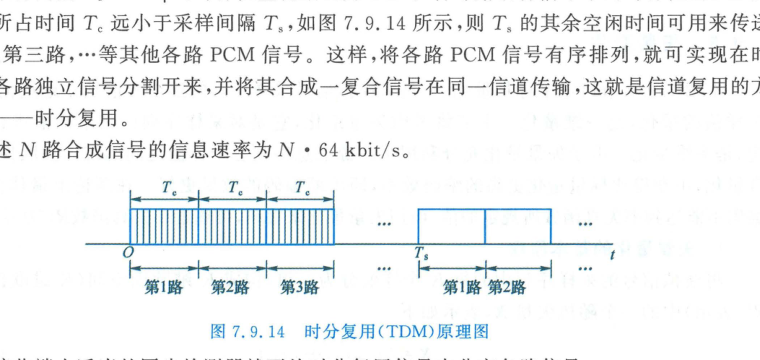

  
图 7.9.14 多路模拟信号经电子旋转分配开关实现的时分复用原理

### 1. 欧洲与中国标准：PCM 30/32 路基群（E1 系统）

国际电报电话咨询委员会（CCITT/ITU-T）规定的 PCM 30/32 路一次群帧结构是全球主流基准：

  

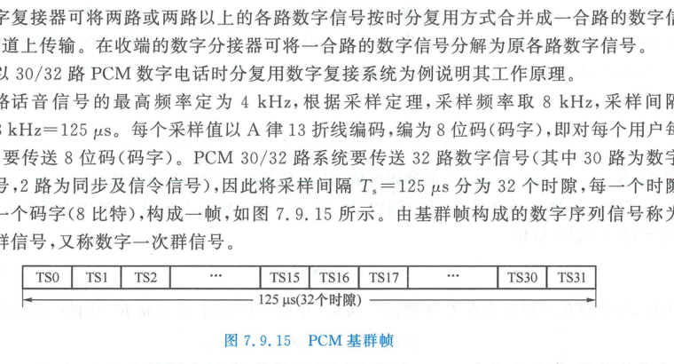

  
图 7.9.15 PCM 30/32 路一次群（E1）基群帧周期与 32 个时隙分布

- **抽样频率与帧周期**：话音截止频率 $3.4\text{ kHz}$，标准采样频率 $f_s = 8000\text{ Hz}$，对应帧周期为：
  $$
  T_f = \frac{1}{f_s} = 125\ \mu\text{s}
  $$
- **时隙划分**：每帧包含 32 个均匀时隙（$TS_0 \sim TS_{31}$），每个时隙宽度为 $\frac{125\ \mu\text{s}}{32} \approx 3.9\ \mu\text{s}$，分配 8 比特；
- **业务分配**：
  - $TS_0$：专用于传送帧同步码（偶帧）与网管告警标志（奇帧）；
  - $TS_{16}$：专用于传送信令（复帧多路信令交互）；
  - 其余 30 个时隙（$TS_1 \sim TS_{15}$ 与 $TS_{17} \sim TS_{31}$）用于承载 30 路独立话音业务；
- **总传输数率**：
  $$
  R_{\text{E1}} = \frac{32 \times 8\text{ bit}}{125\ \mu\text{s}} = 256 \times 8000 = \mathbf{2.048\text{ Mbit/s}}
  $$

### 2. 北美与日本标准：PCM 24 路基群（T1 系统）
- 包含 24 路话音时隙，每时隙 8 bit，每帧末尾追加 1 位专用帧同步比特，每帧总位数 $24 \times 8 + 1 = 193\text{ bit}$；
- **总传输速率**：
  $$
  R_{\text{T1}} = 193 \times 8000 = \mathbf{1.544\text{ Mbit/s}}
  $$

---

## 7.9.5 矢量量化（Vector Quantization, VQ）

标量量化是对单一样值独立量化。1980 年代发展的**矢量量化（Vector Quantization, VQ）** 将 $K$ 个连续样点打包为 $K$ 维欧氏空间矢量 $\boldsymbol{X} = (X_1, X_2, \dots, X_K)^T$ 实施联合量化。

  

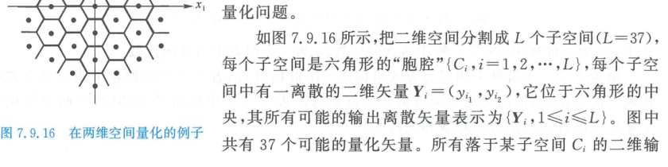

  
图 7.9.16 二维平面空间非均匀分割构成的 Voronoi 胞腔与重构码字矢量

  

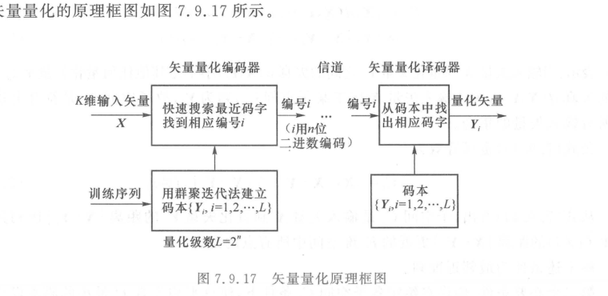

  
图 7.9.17 矢量量化器工作流程：输入矢量 $\to$ 距离最小化搜索 $\to$ 传输码本索引 $\to$ 查表重构

### 1. 矢量量化器的运行机理
1. **码书建立**：预先训练生成包含 $L$ 个代表矢量的码书 $\mathcal{Y} = \{\boldsymbol{Y}_1, \boldsymbol{Y}_2, \dots, \boldsymbol{Y}_L\}$；
2. **最近邻匹配编码**：对任意输入矢量 $\boldsymbol{X}$，在码书中搜索欧氏距离最近的码字：
   $$
   \|\boldsymbol{X} - \boldsymbol{Y}_i\|^2 = \min_{j} \|\boldsymbol{X} - \boldsymbol{Y}_j\|^2
   $$
   信道中仅需传输该最佳码字的索引序号 $i$（仅需 $\log_2 L$ 比特）；
3. **查表重建**：接收端根据接收索引 $i$ 直接查表输出矢量 $\boldsymbol{Y}_i$。

### 2. 矢量量化的压倒性增益来源（香农结论）
即使各样点在统计上完全独立，矢量量化依然全面超越标量量化：
- **超球充填增益（Sphere-Packing Gain）**：在多维空间中，Voronoi 胞腔形状逼近高维超球体，比一维/二维的超立方体晶格具有更紧凑的表面积体积比；
- **非线性记忆与相关性利用**：天然吸收样点间的互协方差与高阶相关性，成为现代低速率语音编码（CELP）与深度学习端到端神经图像压缩的核心构件。

---

<ExerciseTrigger chapter={7} section="7.9" title="7.9 连续信源的限失真编码 课后习题与自测" />
