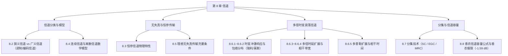

import Card from '../../../../../../components/Card.astro';
import ExerciseTrigger from '../../../../../../components/ExerciseTrigger.astro';

信道（Channel）是连接通信发送端与接收端的必经通路，是构成通信系统的核心支柱之一。在实际通信中，发送端输出的电磁信号在经过物理信道传输时，不可避免地会经历路径损耗、频率选择性衰落、色散时延扩展、多普勒频移以及各种加性噪声与乘性干扰的综合影响。

信道的传输特性不仅直接决定了接收信号的波形失真与衰减程度，更是制约通信系统传输速率、误码率性能与信道容量的最根本物理边界。

---

## 8.1.1 本章核心研究主线

本章围绕通信信道的物理传输特性与数学建模展开系统论述，知识架构如图所示：

1. **信道定义、分类与模型（8.2 ~ 8.4）**：
   - 区分狭义传输媒质与广义信道（调制信道与编码信道）；
   - 建立连续信道的加性/乘性时变滤波模型与离散信道的条件转移概率矩阵模型。
2. **恒参信道与理想无失真传输（8.3, 8.5）**：
   - 探究恒参信道的幅频失真、相频失真与群时延特性；
   - 明确信号无失真传输的线性相位充要条件。
3. **随参信道与小尺度多径衰落（8.6）**：
   - 建立多径信道的时变等效基带冲激响应 $h(\tau; t)$；
   - 剖析多径散射包络的统计分布（无视距瑞利衰落与有视距莱斯衰落）；
   - 严格界定两组对偶的时间-频率色散参数：**多径时延扩展 $\sigma_\tau$ 与相干带宽 $B_c$**（频率选择性衰落判据）、**多普勒频展 $B_d$ 与相干时间 $T_c$**（时间选择性快/慢衰落判据）。
4. **分集技术与信道容量（8.7 ~ 8.8）**：
   - 空间、频率、时间分集及三大经典合并准则（选择式 SC、等增益 EGC、最大比 MRC）；
   - 离散对称信道容量与连续高斯白噪声信道的香农容量公式 $C = B \log_2(1 + S/N)$，推导通信终极能效极限（香农界 $E_b/N_0 = -1.59\text{ dB}$）。

---

<ExerciseTrigger chapter={8} section="8.1" title="8.1 引言 思考题与自测" />
