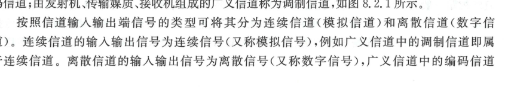
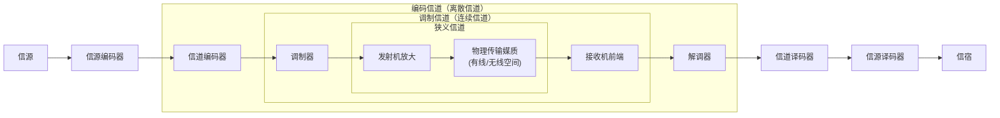

import Card from '@/components/Card.astro';
import ExerciseTrigger from '@/components/exercises/ExerciseTrigger.astro';

信道是信号从发送端向接收端传输的物理通道。在通信工程与系统理论中，根据研究层级与物理界面的不同，信道有着多维度的严格定义与分类方法。

---

## 8.2.1 狭义信道与广义信道

根据信道所包含的物理设备范畴，信道可划分为**狭义信道**与**广义信道**。

  

  
图 8.2.1 通信系统框图与狭义信道、调制信道、编码信道的边界划分

### 1. 狭义信道（物理传输媒质）
**仅指信号传播所通过的客观物理媒质**，不包含任何收发电子线路设备。
- **有线媒质**：对称双绞线（局域网网线）、同轴电缆、架空明线、单模/多模石英光纤；
- **无线媒质**：自由空间电磁波（长波地波、中波天波电离层反射、短波电离层多次跳跃、超短波/微波视距传播、卫星中继通信、对流层散射）。

### 2. 广义信道（扩展信道系统）
广义信道除传输媒质外，还涵盖了通信系统收发两端的特定变频、放大或调制解调模块。根据通信协议层级分为两类：

1. **调制信道（Modulation Channel）**：
   - **界面范围**：从**调制器输出端**（发射机基带信号输入口）至**解调器输入端**（接收机中频/基带信号输出口）；
   - **包含构件**：发射机射频上变频与功率放大器、发端天线、物理传输媒质、收端天线、低噪声放大器（LNA）及射频下变频滤波网络；
   - **信号特征**：输入与输出均为**连续时间连续模拟波形**，因此调制信道属于**连续信道（模拟信道）**。
2. **编码信道（Coding Channel）**：
   - **界面范围**：从**信道编码器输出端**至**信道译码器输入端**；
   - **包含构件**：数字调制器、调制信道、数字解调与位同步判决器；
   - **信号特征**：输入与输出均为**离散数字符号或二进制码流**，因此编码信道属于**离散信道（数字信道）**。

---

## 8.2.2 连续信道与离散信道

根据信道输入输出端口处的信号取值形态：

| 类别 | 输入/输出信号特征 | 数学描述工具 | 物理工程对应 |
| :--- | :--- | :--- | :--- |
| **连续信道（模拟信道）** | 时间连续、幅度连续的波形 $s(t) \to r(t)$ | 线性时变冲激响应 $h(\tau; t)$、传递函数 $H(f; t)$、连续转移概率密度 $p(y \mid x)$ | 物理传输媒质、调制信道、光通信放大器链路 |
| **离散信道（数字信道）** | 时间离散、字母表有限的序列 $X \to Y$ | 条件状态转移概率矩阵 $[P(y_j \mid x_i)]$、误符号率 / 转移概率 $p$ | 编码信道、数字基带传输链路、计算机网络数据链路层 |

---

## 8.2.3 恒参信道与随参信道

根据信道传输特性随时间的时变剧烈程度，信道可严格分为两大传输机理截然不同的类别：

1. **恒参信道（Time-Invariant / Constant-Parameter Channel）**：
   - 信道的时域冲激响应 $h(\tau)$ 与频域传递函数 $H(f)$ **不随时间改变或随时间极其缓慢平稳地漂移**；
   - 典型代表：光纤通信信道、同轴电缆、双绞线网络、卫星中继信道及固定视距微波中继链路。
2. **随参信道（Time-Variant / Random-Parameter Fading Channel）**：
   - 信道的衰减因子、相位突变、多径时延及等效频响呈现出**剧烈的随机时变起伏（衰落, Fading）**；
   - 典型代表：蜂窝移动通信无线多径信道、短波电离层反射跳跃信道、对流层对流散射信道及水声通信信道。

---

<ExerciseTrigger chapter={8} section="8.2" title="8.2 信道的定义和分类 思考题与自测" />
