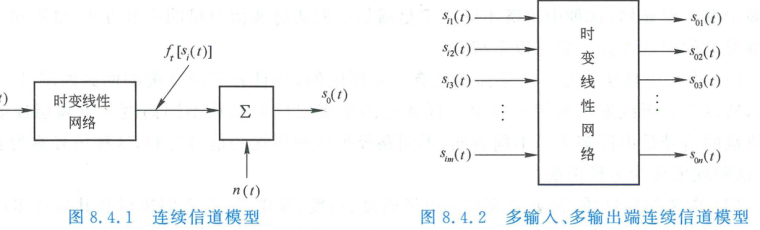
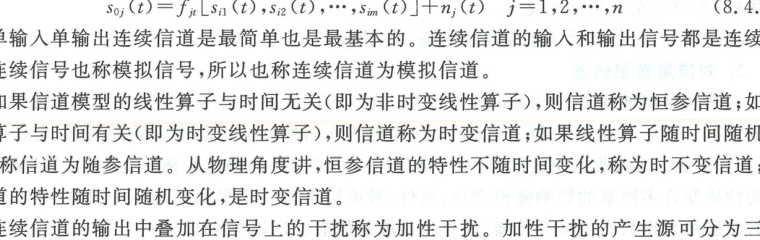
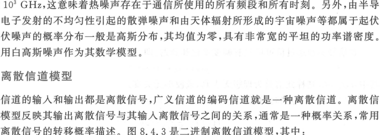
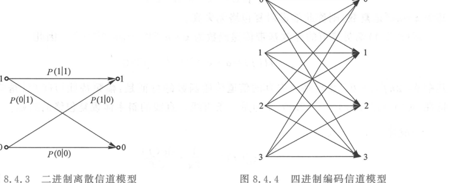

import Card from '@/components/Card.astro';
import ExerciseTrigger from '@/components/exercises/ExerciseTrigger.astro';

为了定量分析信号穿过信道后的波形畸变、误码率及信道容量极限，必须抛开错综复杂的具体物理细节，建立能够准确刻画输入输出对应关系的**信道数学模型（Mathematical Channel Models）**。

---

## 8.4.1 连续信道模型（模拟信道）

连续信道（如调制信道或物理媒质）的输入与输出均为连续时间信号。大量实验与电磁理论表明，绝大多数物理信道满足以下四大基本准则：
1. 具有输入端与输出端端口；
2. **满足线性叠加原理**：若输入信号为 $s_1(t) + s_2(t)$，输出为其单独输入时响应的线性叠加；
3. **具有传播时延与损耗**：信号波形在时间轴上产生延迟，并在幅度上经历固定或时变的衰减；
4. **存在固有加性噪声**：即便输入端无任何激励（$s_i(t) = 0$），信道输出端依然存在随机波动的背景电噪声。

### 1. 连续信道的输入输出等效网络表示

基于上述性质，连续信道可严格等效为一个**时变线性网络叠加加性噪声**的数学结构：

  

  
图 8.4.1 单输入单输出连续信道的时变线性运算加噪声模型

对于单输入单输出信道，其输出波形可解析表示为：
$$
s_o(t) = f_t\left[ s_i(t) \right] + n(t)
$$
式中：
- $f_t[\cdot]$ 代表表征信道物理响应的时变线性算子（乘性干扰项）；
- $n(t)$ 代表信道中随机叠加的加性噪声（加性干扰项）。

对于现代多天线无线通信（MIMO, 多输入多输出信道）：

  

  
图 8.4.2 多输入多输出（MIMO）连续信道矩阵时变线性网络模型

包含 $m$ 个发射输入端口与 $n$ 个接收输出端口的信道数学表达式为：
$$
s_{oj}(t) = f_{tj}\left[ s_{i1}(t), s_{i2}(t), \dots, s_{im}(t) \right] + n_j(t), \quad j = 1, 2, \dots, n
$$

---

### 2. 加性噪声（Additive Noise）分类

连续信道中的噪声独立于输入信号而客观存在：
1. **按噪声物理来源分类**：
   - **人为噪声**：电气火花、开关电源接通冲击、电车受电弓放电、同频或邻频广播干扰；
   - **自然环境噪声**：闪电雷电、磁暴暴雨、天体银河宇宙射电辐射；
   - **电子系统内部噪声**：导体电阻中自由电子无规则布朗热运动产生的**热噪声（Thermal Noise）**、半导体器件 PN 结载流子随机越过势垒起伏产生的**散弹噪声（Shot Noise）**。
2. **按统计特征分类**：
   - **单频窄带干扰**：能量高度集中在某一特定载波频率附近的随机正弦分量；
   - **突发脉冲干扰**：脉冲幅度极大、脉冲宽度极窄但时延间隔相对较长的突发冲击（具有宽阔的频带）；
   - **起伏噪声（高斯白噪声, AWGN）**：热噪声的功率谱密度在极宽的频率范围（从 $0\text{ Hz}$ 到约 $10^3\text{ GHz}$）内平坦恒定，幅度在任意瞬时服从均值为零的高斯正态分布，数学上抽象为**加性高斯白噪声（Additive White Gaussian Noise, AWGN）**：
     $$
     P_n(f) = \frac{N_0}{2} \quad (\text{W/Hz})
     $$

---

## 8.4.2 离散信道模型（数字编码信道）

离散信道（编码信道）的输入端与输出端均为离散时间符号（如二进制码流）。信道在物理上的衰减、色散与加性高斯噪声干扰，在离散数学层面上均最终抽象体现为**符号传输的错误翻转转移概率**。

  

  
图 8.4.3 二进制离散信道的状态转移概率网格模型

### 1. 条件转移概率矩阵
对于二进制离散信道，输入符号集为 $\{0, 1\}$，输出符号集为 $\{0, 1\}$，存在 4 种条件转移概率：
- $P(0 \mid 0) = P[\text{接收 } 0 \mid \text{发送 } 0]$（正确传输）
- $P(1 \mid 0) = P[\text{接收 } 1 \mid \text{发送 } 0]$（发 0 错判为 1）
- $P(0 \mid 1) = P[\text{接收 } 0 \mid \text{发送 } 1]$（发 1 错判为 0）
- $P(1 \mid 1) = P[\text{接收 } 1 \mid \text{发送 } 1]$（正确传输）

转移特性由 $2 \times 2$ **条件转移概率矩阵 $\boldsymbol{P}$** 完整描述：
$$
\boldsymbol{P} = \begin{bmatrix}
P(0 \mid 0) & P(1 \mid 0) \\
P(0 \mid 1) & P(1 \mid 1)
\end{bmatrix}
$$
由于全概率守恒，矩阵每一行的概率之和恒等于 $1$：
$$
P(0 \mid 0) + P(1 \mid 0) = 1, \quad P(0 \mid 1) + P(1 \mid 1) = 1
$$

---

### 2. 二进制对称信道（BSC）与多进制编码信道

  

  
图 8.4.4 二进制对称信道（BSC）与四进制编码信道的转移拓扑

<Card title="定义：二进制对称信道 (Binary Symmetric Channel, BSC)" type="star">
若二进制离散信道发 `0` 错译为 `1` 的转移概率，与发 `1` 错译为 `0` 的转移概率严格相等：
$$
P(1 \mid 0) = P(0 \mid 1) = p
$$
则称该信道为**二进制对称信道（BSC）**。其中 $p$ 称为信道的**交错翻转错误概率（Crossover Probability）**。
</Card>

BSC 信道的转移概率矩阵化简为：
$$
\boldsymbol{P}_{\text{BSC}} = \begin{bmatrix}
1 - p & p \\
p & 1 - p
\end{bmatrix}
$$
BSC 模型是信息论与信道编码理论中最基础、应用最广的研究原型。

若当前码元的差错发生情况与历史前后码元完全统计独立，则称其为**无记忆离散信道**；若信道衰落引起成串突发错误，前后码元错误强相关，则属于**有记忆离散信道**（需采用交织技术予以离散化）。

---

<ExerciseTrigger chapter={8} section="8.4" title="8.4 信道模型 思考题与自测" />
