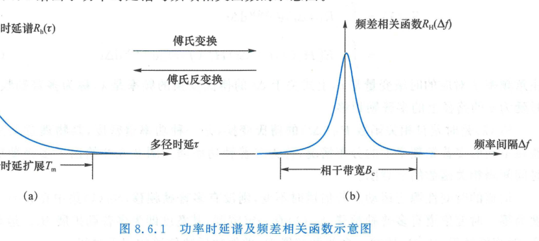
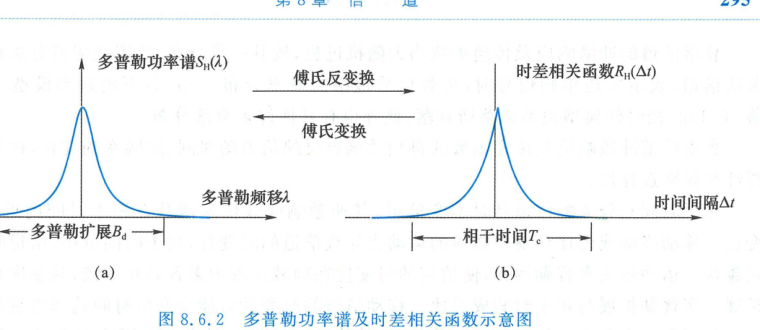
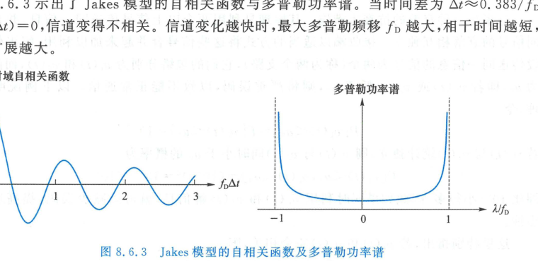

import Card from '../../../../../../components/Card.astro';
import Example from '../../../../../../components/Example.astro';
import Solution from '../../../../../../components/Solution.astro';
import ExerciseTrigger from '../../../../../../components/ExerciseTrigger.astro';

无线移动通信信道属于典型的随参信道。发射端发出的高频电信号通过天线向自由空间辐射电磁波，电磁波在传播空间扩散，接收信号的平均功率随收发距离增大而快速衰减（路径损耗）；同时在传播路径上遇到起伏地形、建筑物与树木等大型障碍物遮挡，在背光侧形成电波阴影区。当移动台穿过阴影区时，导致接收信号场强中值缓慢起伏，称此为**阴影效应**。

由路径损耗与阴影效应引起的信号强度长距离、慢时间尺度的随机变化，称为**大尺度衰落（Large-Scale Fading）**。它决定了基站覆盖半径与系统链路预算。

本节重点研究**小尺度衰落（Small-Scale Fading）**：由空间电波传播的**多径效应**以及移动台运动带来的**多普勒效应**共同诱发，在数十个波长或数毫秒微观时空范围内，导致接收信号瞬时幅度与相位发生剧烈起伏。小尺度衰落是移动通信系统产生深衰落与严重传输差错的根本物理根源。

---

## 8.6.1 多径信道的时变冲激响应与传递函数

移动通信信道的核心物理特征为：
1. **收发运动性**：移动台的高速位移使各条传播路径的几何长度随时间持续变化；
2. **多径散射性**：电磁波经历直射视距（Line of Sight, LoS）以及大量非视距（Non Line of Sight, NLoS）的反射、散射、绕射与透射，形成多条具有不同时延与衰减的散射路径。

### 1. 时变冲激响应模型
设发射端发送实带通信号为 $s(t) = \operatorname{Re}\left\{ s_L(t) e^{j 2\pi f_c t} \right\}$，忽略加性噪声时，经多径信道传播到达接收端的信号可表示为各路径响应的离散叠加：
$$
r(t) = \sum_{n} a_n(t) s[t - \tau_n(t)]
$$
式中 $a_n(t)$ 与 $\tau_n(t)$ 分别代表第 $n$ 条路径的时变增益（衰减幅度）与传播时延。将带通复包络代入展开：
$$
r(t) = \operatorname{Re}\left\{ \left( \sum_{n} a_n(t) e^{-j 2\pi f_c \tau_n(t)} s_L[t - \tau_n(t)] \right) e^{j 2\pi f_c t} \right\}
$$
接收带通信号的等效基带复包络为：
$$
r_L(t) = \sum_{n} a_n(t) e^{-j 2\pi f_c \tau_n(t)} s_L[t - \tau_n(t)] = \int_{-\infty}^{\infty} h_e(\tau, t) s_L(t - \tau) \mathrm{d}\tau
$$
式中 $h_e(\tau, t)$ 即为多径信道的**等效基带时变冲激响应（Time-Variant Impulse Response）**：
$$
h_e(\tau, t) = \sum_{n} a_n(t) e^{-j 2\pi f_c \tau_n(t)} \delta[\tau - \tau_n(t)]
$$
物理含义：$h_e(\tau, t)$ 表示在 $t$ 时刻对信道输入一个冲激脉冲后，在延迟 $\tau$ 时刻接收端所呈现的复响应。

### 2. 时变传递函数与时延-多普勒域响应
对时变冲激响应关于时延变量 $\tau$ 作傅里叶变换，得到等效基带信道的**时变传递函数（Time-Variant Transfer Function）**，亦称**时频域响应**：
$$
H_e(f, t) = \int_{-\infty}^{\infty} h_e(\tau, t) e^{-j 2\pi f \tau} \mathrm{d}\tau
$$
在正交时频空调制（OTFS）等新一代高移动性通信系统中，还广泛采用**时延-多普勒域响应** $h_{DD}(\tau, \lambda)$，它由 $h_e(\tau, t)$ 关于观测时间 $t$ 作傅里叶变换得到：
$$
h_{DD}(\tau, \lambda) = \int_{-\infty}^{\infty} h_e(\tau, t) e^{-j 2\pi \lambda t} \mathrm{d}t
$$
式中 $\lambda$ 为多普勒频移变量。

---

## 8.6.2 衰落幅度的统计分布特性

当发送无调制的单频连续载波（复包络 $s_L(t) = 1$）时，接收端复包络为大量独立多径矢量相干叠加：
$$
r_L(t) = \sum_{n} a_n(t) e^{-j \theta_n(t)} = r_I(t) + j r_Q(t)
$$
式中 $\theta_n(t) = 2\pi f_c \tau_n(t)$。由于载波波长通常在分米乃至毫米级，各路径微小的长度波动（数厘米）即可引起 $\theta_n(t)$ 在 $[0, 2\pi)$ 范围内的剧烈随机变化。当各径相位相近时相互增强，反相时相互削弱抵消，形成深衰落。

<Card title="信道幅度分布两大陆标模型" type="star">
1. **瑞利衰落（Rayleigh Fading）**：
   - **适用场景**：密集市区或无视距（NLoS）传播环境，散射路径数量充裕且无占主导地位的直射强径；
   - **统计分布**：根据中心极限定理，$r_I(t)$ 与 $r_Q(t)$ 服从均值为 0、方差相等的独立高斯分布，即 $r_L(t)$ 服从零均值**圆对称复高斯分布**。其包络 $r = |r_L(t)|$ 服从**瑞利分布**，相位 $\theta$ 在 $[0, 2\pi)$ 均匀分布：
     $$
     p(r) = \frac{r}{\sigma^2} \exp\left( -\frac{r^2}{2\sigma^2} \right), \quad r \ge 0
     $$
2. **莱斯衰落（Rician Fading）**：
   - **适用场景**：开阔郊区、室内视距或存在强视距（LoS）直射路径的无线传播环境；
   - **统计分布**：接收信号为确定性主导直射分量叠加随机复高斯散射分量，其包络服从**莱斯分布**：
     $$
     p(r) = \frac{r}{\sigma^2} \exp\left( -\frac{r^2 + A^2}{2\sigma^2} \right) I_0\left( \frac{r A}{\sigma^2} \right), \quad r \ge 0
     $$
     式中 $A$ 为视距直射径的幅度峰值，$I_0(\cdot)$ 为零阶第一类修正贝塞尔函数。定义**莱斯因子（K-factor）**为直射主径功率与随机散射径总功率的比值：
     $$
     K_{\text{Rice}} = \frac{A^2}{2\sigma^2}
     $$
     当 $K_{\text{Rice}} \to 0$ 时，莱斯分布退化为瑞利分布；当 $K_{\text{Rice}} \to \infty$ 时，退化为无衰落高斯白噪声信道。
</Card>

---

## 8.6.3 信道自相关函数与 WSSUS 模型

等效基带冲激响应 $h_e(\tau, t)$ 通常可建模为时间 $t$ 的广义平稳（WSS）零均值复随机过程，其自相关函数仅取决于观测时间差 $\Delta t$：
$$
R_h(\tau_1, \tau_2, \Delta t) = \mathbb{E}\left[ h_e(\tau_1, t + \Delta t) h_e^*(\tau_2, t) \right]
$$
实际无线物理多径传播普遍满足**不相关散射（Uncorrelated Scattering, US）**假定：经由不同时延路径到达接收端所诱发的信道响应完全不相关。此时自相关函数简化为：
$$
R_h(\tau_1, \tau_2, \Delta t) = R_h(\tau_1, \Delta t) \delta(\tau_1 - \tau_2)
$$
简记为 $R_h(\tau, \Delta t)$。该模型称为**广义平稳不相关散射（WSSUS）信道模型**。

相应地，频域时变传递函数 $H_e(f, t)$ 的频差-时差自相关函数为：
$$
R_H(f_1, f_2, \Delta t) = \mathbb{E}\left[ H_e(f_1, t + \Delta t) H_e^*(f_2, t) \right] = \int_{-\infty}^{\infty} R_h(\tau, \Delta t) e^{-j 2\pi (f_1 - f_2) \tau} \mathrm{d}\tau = R_H(\Delta f, \Delta t)
$$
式中 $\Delta f = f_1 - f_2$。**信道的时变传递函数相关函数 $R_H(\Delta f, \Delta t)$ 与冲激响应相关函数 $R_h(\tau, \Delta t)$ 构成严格的傅里叶变换对**。

---

## 8.6.4 多径时延扩展与相干带宽

令时间差 $\Delta t = 0$，定义信道的**功率时延谱（Power Delay Profile, PDP）**与**频差自相关函数**：
$$
R_h(\tau) \triangleq R_h(\tau, 0) = \int_{-\infty}^{\infty} R_H(\Delta f) e^{j 2\pi \Delta f \tau} \mathrm{d}\Delta f
$$
$$
R_H(\Delta f) \triangleq R_H(\Delta f, 0) = \mathbb{E}\left[ H_e(f + \Delta f, t) H_e^*(f, t) \right]
$$
$R_h(\tau)$ 描述了不同多径时延 $\tau$ 处的平均接收功率分布；$R_H(\Delta f)$ 描述了频率间隔为 $\Delta f$ 的两个载波信号经历衰落的相关度。两者互为傅里叶变换。

### 1. 相干带宽（Coherence Bandwidth, $B_c$）
功率时延谱中功率非零的时延跨度定义为**多径时延扩展（Multipath Delay Spread, $T_m$）**。相干带宽定义为频差相关函数 $R_H(\Delta f)$ 保持较高相关度（如 0.5 或 0.9）时的最大频率跨度，工程估算公式为：
$$
B_c \approx \frac{1}{T_m} \quad \left( \text{或精确标准下 } B_c \approx \frac{1}{5\sigma_\tau} \right)
$$
式中 $\sigma_\tau$ 为多径时延的均方根时延扩展（RMS Delay Spread）。

### 2. 平坦衰落 vs 频率选择性衰落判据
设调制信号的基带带宽为 $B_s$，符号周期为 $T_s$（符号速率 $R_s \approx 1/T_s$）：
- **平坦衰落（Flat Fading，亦称窄带衰落）**：
  $$
  B_s \ll B_c \iff T_s \gg T_m
  $$
  信号带宽远小于信道相干带宽。信道在整个信号通带内幅频特性近似平坦，所有频率分量经历一致的衰落，波形不产生畸变色散，**无符号间干扰（ISI）**；
- **频率选择性衰落（Frequency-Selective Fading，亦称宽带衰落）**：
  $$
  B_s \gg B_c \iff T_s \ll T_m
  $$
  信号带宽超过信道相干带宽。信道不同频率成分经历截然不同的深度衰落，时域多径脉冲展宽并重叠跨越相邻码元，引起**严重的符号间干扰（ISI）**，必须配置均衡器或采用 OFDM、扩频多径分集技术予以抑制。

---

## 8.6.5 多普勒扩展与相干时间

### 1. 多普勒频移与多普勒扩展
当移动台以速度 $v$ 沿与电磁波来波夹角为 $\theta$ 的方向运动时，接收载波产生的多普勒频移为：
$$
f_d = \frac{v}{c} f_c \cos\theta
$$
式中 $c$ 为光速。最大多普勒频移对应迎面运动（$\theta = 0$）：
$$
f_m = \frac{v}{c} f_c
$$
不同来波方向的散射多径具有不同的多普勒频移，在频域叠加导致原本纯净的单频载波演变为具有一定谱宽的弥散连续谱，该频谱展宽范围称为**多普勒扩展（Doppler Spread, $B_d$）**，通常 $B_d \approx 2 f_m$（双边）或以 $f_m$ 衡量。

### 2. 多普勒功率谱与相干时间
令频差 $\Delta f = 0$，时差相关函数 $R_H(\Delta t) \triangleq R_H(0, \Delta t)$ 关于时间差 $\Delta t$ 的傅里叶变换定义为**多普勒功率谱密度（Doppler Power Spectrum）**：
$$
S_H(\lambda) = \int_{-\infty}^{\infty} R_H(\Delta t) e^{-j 2\pi \lambda \Delta t} \mathrm{d}\Delta t
$$
式中 $\lambda$ 为多普勒频率。

信道的**相干时间（Coherence Time, $T_c$）**定义为时差相关函数 $R_H(\Delta t)$ 保持高度相关（信道状态近似恒定）的最大时间跨度，其与多普勒扩展成反比：
$$
T_c \approx \frac{1}{B_d} \approx \frac{1}{f_m} \quad \left( \text{严格工程定义下 } T_c \approx \frac{9}{16\pi f_m} \approx \frac{0.18}{f_m} \right)
$$

### 3. 快衰落 vs 慢衰落判据
- **慢衰落（Slow Fading）**：$T_s \ll T_c$（信号符号周期远小于信道相干时间）。信道在一个或多个符号持续期内可视为静态时不变常数，可进行可靠的相干信道估计与跟踪；
- **快衰落（Fast Fading）**：$T_s \ge T_c$。信道在一个符号周期内即发生显著的时变畸变，导致波形包络严重畸变，破坏载波相位同步，常产生误码平层（Error Floor）。

---

<Example title="例 8.6.1：Jakes 衰落信道模型">
在二维水平各向同性全向散射环境中，移动台接收到的 Jakes 衰落模型是经典小尺度衰落基准。
已知 Jakes 模型下等效基带传递函数的时域自相关函数为：
$$
R_H(\Delta t) = J_0(2\pi f_m \Delta t)
$$
式中 $J_0(\cdot)$ 为零阶第一类贝塞尔函数。

试求该信道的多普勒功率谱，并分析信道去相关的特征时间差。
</Example>

<Solution>
**1. 求解多普勒功率谱**：
利用零阶贝塞尔函数的标准傅里叶变换性质：
$$
\int_{-\infty}^{\infty} J_0(2\pi f_m t) e^{-j 2\pi \lambda t} \mathrm{d}t = \begin{cases}
\dfrac{1}{\pi f_m \sqrt{1 - (\lambda / f_m)^2}}, & |\lambda| < f_m \\
0, & |\lambda| \ge f_m
\end{cases}
$$
该谱呈现两端急剧翘起的典型“马鞍形（U型）”频谱，在边缘多普勒截止频率 $\lambda = \pm f_m$ 处存在数学极值奇异。

**2. 信道去相关分析**：
查零阶贝塞尔函数零点表可知，$J_0(x)$ 的首个正零点出现在 $x_1 \approx 2.4048$。
令 $2\pi f_m \Delta t = 2.4048$，解得信道自相关函数首次降为 0 的时间间隔为：
$$
\Delta t_0 = \frac{2.4048}{2\pi f_m} \approx \frac{0.383}{f_m}
$$
当观测时间间隔达到 $\Delta t_0$ 时，信道状态经历完全去相关。移动台速度越高，$f_m$ 越大，去相关所需时间越短，多普勒扩展越严重。
</Solution>

---

## 8.6.6 衰落信道分类与现代抗衰落技术演进

### 1. 衰落特性四象限分类矩阵

| 衰落维度 | 频域关系 | 时域关系 | 信道物理特性与主要影响 |
| :--- | :--- | :--- | :--- |
| **平坦衰落** | $B_s \ll B_c$ | $T_s \gg T_m$ | 频响平坦，无波形畸变与码间串扰，表现为纯粹幅度比例衰落 |
| **频率选择性衰落** | $B_s \gg B_c$ | $T_s \ll T_m$ | 幅频剧烈起伏，引起严重多径色散波形扩展与码间串扰（ISI） |
| **慢衰落** | $B_d \ll B_s$ | $T_c \gg T_s$ | 信道状态在多个符号期内近似恒定，适于自适应调制与估计 |
| **快衰落** | $B_d \gg B_s$ | $T_c \ll T_s$ | 信道在一个符号期内即剧烈起伏，引入多普勒弥散，破坏相干性 |

### 2. 移动通信代际抗衰落核心方案
针对多径时延扩展与多普勒频移，现代移动通信体系发展了系统化的抗衰落技术：
1. **3G 移动通信（CDMA）**：利用直接序列扩频信号的大带宽特性分辨不同时延的多径分量，采用 **Rake 接收机** 将各径独立信号同相加权合并，变有害的多径干扰为有益的多径分集；
2. **4G / 5G 移动通信（LTE / NR）**：采用**正交频分复用（OFDM）**技术，将宽带频率选择性衰落信道分解为数千个相互正交的正规窄带平坦子载波，配合循环前缀（CP）彻底消除符号间串扰；
3. **6G 移动通信探索（OTFS）**：针对超高速移动（高铁、低轨卫星通信）导致的**时频双选择性信道**，采用**正交时延-多普勒空间（OTFS）**调制，将时变衰落转化为时延-多普勒域上近似静态二维冲激响应，实现稳健的全局分集增益。

---

<ExerciseTrigger chapter={8} section="8.6" title="8.6 衰落信道 思考题与自测" />
