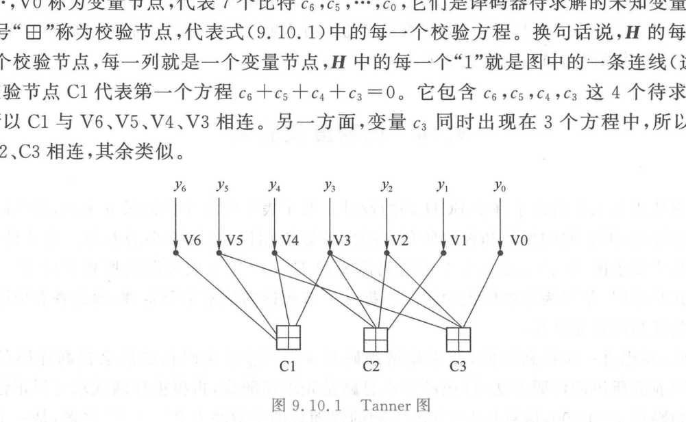

import Card from '../../../../../../components/Card.astro';
import ExerciseTrigger from '../../../../../../components/ExerciseTrigger.astro';

根据香农信道编码定理，要使信道传输误码率逼近任意小且逼近香农容量极限，**编码码长 $n$ 必须充分大**。然而对于传统的通用线性分组码，若码长达到数千乃至数万（如 $n = 1000, k = 500$），可能出现的伴随式数目将高达 $2^{n-k} = 2^{500}$ 个，在物理世界中绝无可能构建如此庞大的查找表，导致长码在工程上陷入“**理论虽好却不可译**”的死胡同。

1962 年，麻省理工学院（MIT）博士生罗伯特·加拉格尔（Robert Gallager）提出了**低密度奇偶校验码（Low-Density Parity-Check Codes, LDPC 码）**。因当时硬件技术限制，该理论沉睡了三十余年，直至 20 世纪 90 年代末被 Mackay、Neal 等人重新挖掘。如今，LDPC 码与极化码（Polar Codes）并列，成为人类史上最逼近香农理论极限的巅峰编码，并被正式确立为 **5G NR 增强移动宽带（eMBB）数据业务的全球唯一官方标准**。

---

## 9.10.1 稀疏监督矩阵与 Tanner 二分图

LDPC 码本质上是一类码长 $n$ 极长、但其监督矩阵 $\boldsymbol{H}$ 具有**极端稀疏性（Sparsity）**的线性分组码：
- 矩阵尺寸极其庞大（$m \times n$，其中 $m = n - k$ 可达数千行、上万列）；
- 矩阵内部非零元素“1”的分布密度极低（绝大部分元素均为 0），每行的行重 $d_c$ 与每列的列重 $d_v$ 远远小于码长 $n$。

### 1. 因子图模型：Tanner 图
1981 年，迈克尔·坦纳（R. Michael Tanner）引入了二分图（Bipartite Graph）工具，使得超稀疏线性方程组的拓扑关系可视化为著名的 **Tanner 图**：

Tanner 图由两类互不相交的节点集合构成：
1. **变量节点（Variable Nodes, $V_j$）**：
   共 $n$ 个（对应上图中圆圈 $V_6, V_5, \dots, V_0$），代表码字中的每一个待求解比特分量 $c_j$；
2. **校验节点（Check Nodes, $C_i$）**：
   共 $m = n - k$ 个（对应上图中正方形 $C_1, C_2, C_3$），代表每一条模 2 线性校验代数方程：
   $$
   \sum_{j=0}^{n-1} H_{ij} c_j = 0 \pmod 2
   $$
3. **边（Edges）**：
   当且仅当监督矩阵中第 $i$ 行第 $j$ 列元素 $H_{ij} = 1$ 时，变量节点 $V_j$ 与校验节点 $C_i$ 之间存在一条连边。**Tanner 图中的总连边数严格等于 $\boldsymbol{H}$ 矩阵中“1”的总总数目**。

---

## 9.10.2 置信度传播（BP）与软判决迭代译码机理

LDPC 码彻底放弃了全局指数级伴随式查找，改而在 Tanner 二分图的网络连边上实施局部的**并行消息传递算法（Message-Passing Algorithm）**，亦称**置信度传播（Belief Propagation, BP）**或**和积算法（Sum-Product Algorithm, SPA）**。

### 1. 消息传递的核心原则：排除自回路信息
节点间传递的消息代表对某个变量取值的统计概率估计（对数似然比 LLR）。
为了防止自身初始判断在闭环中形成正反馈自激死锁，**节点向某条连边发送更新消息时，必须仅综合来自其他所有相邻连边的外部输入，严禁掺杂拟发送对象此前传来的旧信息**。

### 2. 双向交替迭代四步流程
1. **初始化**：
   接收端根据解调后的信道连续波形，计算各个变量节点 $V_j$ 的初始信道先验对数似然比 $L_{\text{ch}}(y_j)$，并沿连边广播给相连的所有校验节点；
2. **校验节点更新（水平更新）**：
   校验节点 $C_i$ 依据模 2 校验奇偶和约束，计算外信息并传回各变量节点。其物理含义是：“*根据与我相连的所有其他变量节点的报告，我认为你应当取何值*”；
3. **变量节点更新（垂直更新）**：
   变量节点 $V_j$ 将信道先验软信息与除目标校验节点外的所有校验信息加权求和，生成新的置信度传回校验节点；
4. **硬判决与提前停止判据（Early Stopping）**：
   对每个变量节点的总累积 LLR 作硬判决得到临时码字 $\hat{\boldsymbol{c}}$。实时检验校验方程：
   $$
   \boldsymbol{H} \hat{\boldsymbol{c}}^T \stackrel{?}{=} \mathbf{0}^T
   $$
   - 若满足校验方程，表明译码已成功收敛至有效合法码字，**立即提前退出迭代输出结果**；
   - 若不满足且未达到最大迭代次数（通常为 $10 \sim 50$ 次），则返回第 2 步继续新一轮置信度更新。

<Card title="LDPC 码译码复杂度的革命性突破" type="star">
在 Tanner 图中，一次完整迭代的计算量**严格正比于图中的连边总数**（即 $\boldsymbol{H}$ 矩阵中 1 的总个数）。
由于 $\boldsymbol{H}$ 矩阵高度稀疏，连边数与码长呈纯粹的**严格线性关系 $O(n)$**！
这一代数稀疏性使得上万比特超长码的实时高速译码从“天方夜谭”变为完全可硬件 ASIC 芯片化的现实。
</Card>

---

## 9.10.3 校验矩阵构造与 5G 移动通信准循环 LDPC（QC-LDPC）

### 1. 消除短环与围长（Girth）优化
在 Tanner 图中，沿边循环一周回到起点的封闭路径称为**环（Cycle）**。
- 若存在长度为 4 的**短环（Length-4 Cycle）**，意味着两个变量节点同时与两个校验节点相连，局部软信息将在短短 2 次迭代内迅速自我循环污染，破坏统计独立性假定，造成严重误码平层；
- 优秀 LDPC 矩阵的构造准则必须保证**消除所有 4 环**，并最大化图的最小环长（围长 Girth $\ge 6$）。

### 2. 5G NR 标准准循环 LDPC（QC-LDPC）
在 3GPP 5G NR 物理层规范（TS 38.212）中，全面采用了高度工程结构化的**准循环 LDPC（Quasi-Cyclic LDPC, QC-LDPC）**：
- 庞大的 $\boldsymbol{H}$ 矩阵被划分为由若干个大小为 $Z \times Z$ 的子块构成的阵列，每个子块要么为全零方阵，要么为单位矩阵的**循环置换方阵（Cyclic Permutation Matrix）**；
- **工程飞跃**：QC-LDPC 能够支持极高速的大规模高度并行移位寄存器网络，吞吐量轻松突破数十吉比特每秒（$> 20\text{ Gbit/s}$），以极低的硬件能耗完美支撑了 5G 时代的超高清无线互联。

---

<ExerciseTrigger chapter={9} section="9.10" title="9.10 低密度校验码 思考题与自测" />
