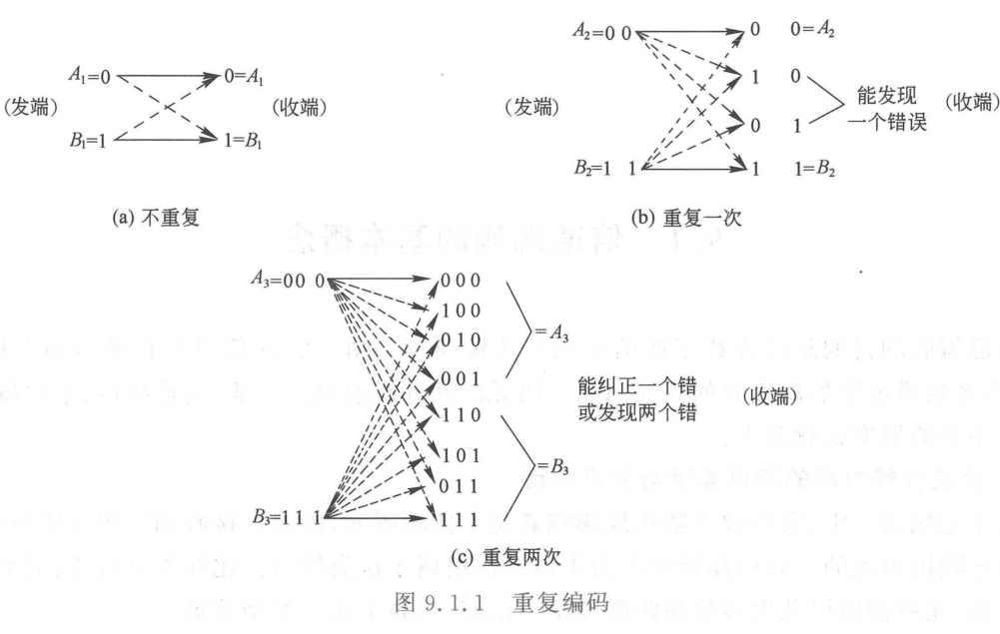
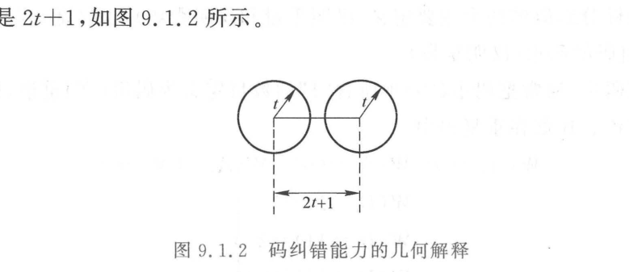

import Card from '../../../../../../components/Card.astro';
import Example from '../../../../../../components/Example.astro';
import Solution from '../../../../../../components/Solution.astro';
import ExerciseTrigger from '../../../../../../components/ExerciseTrigger.astro';

信道编码（Channel Coding，亦称差错控制编码）的核心使命是：**在实际受限且存在加性噪声与物理畸变的传输信道中，通过对信息序列实施受控的代数变换与冗余扩展，最大限度抑制差错，保障数字传输的绝对可靠性**。

---

## 9.1.1 信道差错类型与编码分类

数字信号在物理信道传输中产生的差错模式与信道本身的物理冲击记忆特性紧密相关：

1. **随机差错信道（无记忆信道）**：
   - **机理**：信道噪声对各个传输符号的作用在统计上相互独立，每个码元的翻转错误独立、随机出现。
   - **典型信道**：深空通信信道、卫星通信信道、视距微波中继信道、高品质同轴电缆与单模光纤。以加性高斯白噪声（AWGN）为主导。
   - **对策**：采用**纠随机差错码**（如汉明码、BCH 码、卷积码、LDPC 码）。
2. **突发差错信道（有记忆信道）**：
   - **机理**：物理噪声与干扰具有明显的时间相关性或长脉冲特性，错误往往表现为密集集中出现的成串“突发错误群”，但错误群之间存在较长的时间间隙。
   - **典型信道**：短波电离层反射信道、移动无线多径衰落信道、高压电网脉冲干扰线缆以及高密度磁光存储介质（划痕、缺陷）。
   - **对策**：采用**纠突发差错码**（如 RS 码、循环交织纠错码）。
3. **混合差错信道**：
   - **机理**：同时叠加了独立离散的背景高斯白噪声与随机爆发的长突发深衰落脉冲。
   - **对策**：采用**级联码（Concatenated Codes）**或**交织技术（Interleaving）**与纠错码的组合体制。

---

## 9.1.2 受控冗余思想与重复码

信道编码的本质是：**根据严密的数学规则在待发送的 $k$ 个信息比特中人为引入 $r = n - k$ 个多余校验码元，利用多余度建立码字各分量之间的内在代数约束关系，从而赋予码组在接收端的检错与纠错能力**。

衡量编码冗余代价的核心指标为**编码效率（Code Rate，码率）**：
$$
R = \frac{k}{n} \quad (0 < R \le 1)
$$

### 1. 重复码（Repetition Code）机制对比
考虑发送 1 比特二进制信息 $u \in \{0, 1\}$，采用不同程度的人为冗余扩展：
1. **不重复传输（$n=1, k=1, R=1$）**：直接发送 0 或 1。信道翻转即导致不可察觉的错误，抗干扰能力为零；
2. **重复一次传输（$n=2, k=1, R=1/2$）**：发送 $00$ 或 $11$。若接收端出现 $01$ 或 $10$，可判定发生单比特差错，但无法确定哪一位翻转，**能检 1 错，不能纠错**；
3. **重复两次传输（$n=3, k=1, R=1/3$）**：发送 $000$ 或 $111$。若接收端为 $001$、$010$、$100$，依据“多数表决”准则判决为发送 0；若接收端为 $110$、$101$、$011$，判决为发送 1。**能纠正 1 个错，或检测 2 个错**。

---

<Example title="例 9.1.1：三重复码的抗噪声性能分析">
设二元对称信道的误比特率为 $p = 0.01$。发送二进制信息比特 $u \in \{0, 1\}$，采用 $n=3$ 的三重复码编码传输。接收端采用硬判决多数表决译码准则。
试求译码后的等效剩余误码率 $P_e$，并与未经编码的系统进行对比。
</Example>

<Solution>
发送码字为 $\boldsymbol{c}_0 = (0, 0, 0)$ 或 $\boldsymbol{c}_1 = (1, 1, 1)$。
以发送 $\boldsymbol{c}_0$ 为例，当且仅当接收码组中出现 2 个或 3 个比特翻转时，多数表决译码器才会判错。

译码后的剩余错误概率为：
$$
P_e = \binom{3}{2} p^2 (1 - p) + \binom{3}{3} p^3 = 3 p^2 (1 - p) + p^3 = p^2(3 - 2p)
$$
将 $p = 0.01$ 代入：
$$
P_e = (0.01)^2 \times (3 - 0.02) = 10^{-4} \times 2.98 = 2.98 \times 10^{-4}
$$
**对比结论**：采用三重复码后，误码率由 $10^{-2}$ 骤降至 $2.98 \times 10^{-4}$（改善近两个数量级）。但代价是传输效率跌落至 $R = 1/3$，占用了 3 倍的信道带宽。
</Solution>

---

## 9.1.3 汉明重量、汉明距离与检纠错能力判据

设编码输出长度为 $n$ 的二元码字 $\boldsymbol{c} = (c_{n-1}, c_{n-2}, \dots, c_0) \in \{0, 1\}^n$。

### 1. 汉明重量（Hamming Weight）
码字 $\boldsymbol{c}$ 中非零码元（“1”）的个数称为该码字的**汉明重量**，简记为 $w(\boldsymbol{c})$：
$$
w(\boldsymbol{c}) = \sum_{i=0}^{n-1} c_i
$$

### 2. 汉明距离（Hamming Distance）
两个等长码字 $\boldsymbol{c}_1$ 与 $\boldsymbol{c}_2$ 在对应坐标位置上具有不同码元的数目，称为两个码字之间的**汉明距离**，简记为 $d(\boldsymbol{c}_1, \boldsymbol{c}_2)$：
$$
d(\boldsymbol{c}_1, \boldsymbol{c}_2) = w(\boldsymbol{c}_1 \oplus \boldsymbol{c}_2)
$$
式中 $\oplus$ 为按位模 2 加法。

一个码集合中所有不同合法码字之间汉明距离的最小值，称为该码组的**最小码距（Minimum Distance）**：
$$
d_{\min} = \min_{\boldsymbol{c}_i \ne \boldsymbol{c}_j} d(\boldsymbol{c}_i, \boldsymbol{c}_j)
$$

### 3. 最小码距与检纠错能力的关系
在由 $M = 2^k$ 个合法码字构成的超立方体顶点几何空间中，接收端根据**最小距离译码准则**，将接收向量 $\boldsymbol{y}$ 判决给与它汉明距离最近的合法码字 $\boldsymbol{c}_i$。以每个合法码字 $\boldsymbol{c}_i$ 为中心、以 $t$ 为汉明半径构成的判决超球体集合互不相交。

<Card title="定理：最小码距与检纠错能力的三大充要判据" type="star">
设某个分组码的最小汉明距离为 $d_{\min}$：
1. **纯检错能力**：若要能够检测出码字中发生的任何不超过 $e$ 个的随机差错，充要条件为：
   $$
   d_{\min} \ge e + 1
   $$
2. **纯纠错能力**：若要能够纠正码字中发生的任何不超过 $t$ 个的随机差错，充要条件为：
   $$
   d_{\min} \ge 2t + 1
   $$
3. **同时纠检错能力**：若要能够纠正不超过 $t$ 个差错、同时检测出 $e$ 个差错（$e > t$），充要条件为：
   $$
   d_{\min} \ge t + e + 1
   $$
</Card>

---

## 9.1.4 奇偶校验码与漏检率分析

奇偶校验码是一类最简便的单比特检错系统码，记为 $(n, n-1)$ 码。输入 $n-1$ 个信息比特 $(c_{n-1}, \dots, c_1)$，附加 1 个校验比特 $c_0$。

- **偶校验码（Even Parity Code）**：
  校验位 $c_0$ 强制使码字中“1”的总个数为偶数，满足模 2 线性约束方程：
  $$
  c_{n-1} \oplus c_{n-2} \oplus \dots \oplus c_1 \oplus c_0 = 0 \iff c_0 = \sum_{i=1}^{n-1} c_i \pmod 2
  $$
- **奇校验码（Odd Parity Code）**：
  强制使码字中“1”的总个数为奇数：$\sum_{i=0}^{n-1} c_i = 1 \pmod 2$。⚠️ **奇校验码不满足线性代数封闭性，不属于线性码**。

对于偶校验码，任意两个合法码字之间至少有两位不同（因为改变单个比特必然导致 1 的个数奇偶性翻转），故最小码距 $d_{\min} = 2$。根据判据 $d_{\min} \ge e + 1 = 2 \implies e = 1$，**它能 100% 检测出所有奇数个（1、3、5...）传输比特差错，但完全无法检测偶数个（2、4...）比特差错**。

---

<Example title="例 9.1.2：(4,3) 偶校验码的漏检概率推导">
构建一个 $(4, 3)$ 偶校验码，校验比特位于最右端。设二元对称信道的单个码元独立错误概率为 $p = 10^{-3}$。
试列出全部合法码字，分析其错误检测能力，并计算接收端发生差错却无法检测到的漏检概率 $P_e$。
</Example>

<Solution>
**1. 合法码字集合构建**：
$k=3$ 个信息比特共有 $2^3 = 8$ 种状态，依据 $c_0 = c_3 \oplus c_2 \oplus c_1$ 得到如下 8 个合法码字：

| 信息比特 $(c_3 c_2 c_1)$ | 校验比特 $c_0$ | 完整码字 $\boldsymbol{c}$ |
| :---: | :---: | :---: |
| `0 0 0` | `0` | `0 0 0 0` |
| `1 0 0` | `1` | `1 0 0 1` |
| `0 1 0` | `1` | `0 1 0 1` |
| `1 1 0` | `0` | `1 1 0 0` |
| `0 0 1` | `1` | `0 0 1 1` |
| `1 0 1` | `0` | `1 0 1 0` |
| `0 1 1` | `0` | `0 1 1 0` |
| `1 1 1` | `1` | `1 1 1 1` |

**2. 检错图样与漏检概率分析**：
偶校验只能破坏奇数个错误的奇偶平衡性。因此，凡是在传输中发生 **2 个比特翻转** 或 **4 个比特翻转** 时，接收端校验和仍为 0，系统发生误判与漏检。

无法检测到的漏检概率为：
$$
P_{\text{undetected}} = \binom{4}{2} p^2 (1 - p)^2 + \binom{4}{4} p^4 = 6 p^2 (1 - p)^2 + p^4
$$
展开多项式：
$$
P_{\text{undetected}} = 6 p^2 - 12 p^3 + 7 p^4
$$
将 $p = 10^{-3}$ 代入，高阶项 $p^3, p^4$ 极小可忽略：
$$
P_{\text{undetected}} \approx 6 \times (10^{-3})^2 = 6 \times 10^{-6}
$$
漏检率仅为六百万分之一，展现了高性价比的检错效益。
</Solution>

---

## 9.1.5 差错控制的三大系统工作体制

在工程通信网体系中，根据是否具备反向反馈信道以及如何协同处理差错，差错控制系统划分为三种核心体制：

1. **前向纠错（Forward Error Correction, FEC）**：
   - **工作原理**：发端发射具备自动纠错能力的码组，收端译码器在差错数不超过纠错能力 $t$ 时，自行定位并自动纠正差错，无需发端介入；
   - **优缺点**：无需反馈信道，单向通信即可完成，实时性极高，无往返时延；但编码器与译码算法复杂度较高，需占用较多校验开销；
   - **适用场景**：卫星与深空通信、单向广播数字电视、实时交互音视频及高速光纤骨干网。
2. **检错重发（Automatic Repeat reQuest, ARQ）**：
   - **工作原理**：发端发送仅具备检错能力的码组（如 CRC）。收端若检出差错，立即通过反向反馈信道向发端发送否定应答（NAK），发端重新发送该数据帧，直至收端正确确认（ACK）；
   - **主要分类**：停等式 ARQ（Stop-and-Wait）、退 N 步 ARQ（Go-Back-N）、选择性重传 ARQ（Selective Repeat）；
   - **优缺点**：只需极少的多余校验码（$5\% \sim 20\%$），译码电路极其简单；但严重依赖双向低延迟信道，恶劣信道下重传频繁导致吞吐量崩溃；
   - **适用场景**：计算机互联网络数据链路层与高层传输协议（如 TCP）。
3. **混合自动重发请求（Hybrid ARQ, HARQ）**：
   - **工作原理**：现代移动通信（4G LTE / 5G NR）的核心机制。发端数据首先进行 CRC 检错编码，外层再套用高效 FEC 纠错编码。收端先利用 FEC 算法尝试前向纠正信道中的微弱差错；若差错严重超出 FEC 纠错能力，CRC 校验报错，此时触发 ARQ 请求发端重传增量冗余软信息，结合软合并（Chase Combining 或 Incremental Redundancy）进一步提升译码成功率。

---

## 9.1.6 伽罗华有限域 GF(2) 及其向量空间代数基础

信道编码的严格数学建构深度依托近世代数（Modern Algebra）中的有限域（Galois Field）理论。

### 1. 二元有限域 $\mathrm{GF}(2)$（或 $\mathbb{F}_2$）
由二元离散集合 $\{0, 1\}$ 及其上定义的**模 2 加法 $\oplus$** 与**模 2 乘法 $\cdot$** 构成：

| 模 2 加法 $\oplus$ | 0 | 1 |
| :---: | :---: | :---: |
| **0** | 0 | 1 |
| **1** | 1 | 0 |

| 模 2 乘法 $\cdot$ | 0 | 1 |
| :---: | :---: | :---: |
| **0** | 0 | 0 |
| **1** | 0 | 1 |

二元有限域具有重要性质：**在 $\mathrm{GF}(2)$ 中，加法与减法完全等价**（$1 \oplus 1 = 0 \iff 1 = -1$），不存在负号概念。

### 2. $n$ 维二元向量空间 $\mathrm{GF}(2)^n$
由全体长度为 $n$ 的二进制向量 $\boldsymbol{x} = (x_{n-1}, x_{n-2}, \dots, x_0)$ 构成的空间：
- **向量加法**：按分量模 2 异或相加：
  $$
  \boldsymbol{x} \oplus \boldsymbol{y} = (x_{n-1} \oplus y_{n-1}, \; x_{n-2} \oplus y_{n-2}, \; \dots, \; x_0 \oplus y_0)
  $$
- **标量乘法**：对于标量 $a \in \mathrm{GF}(2)$：
  $$
  a \cdot \boldsymbol{x} = (a \cdot x_{n-1}, \; a \cdot x_{n-2}, \; \dots, \; a \cdot x_0)
  $$
$\mathrm{GF}(2)^n$ 构成定义在二元域 $\mathrm{GF}(2)$ 上的 $n$ 维向量空间。信道编码正是利用线性代数工具，在 $n$ 维空间中构建一个维数为 $k$ 的**线性子空间**，这一子空间便被称为**线性分组码**。

---

<ExerciseTrigger chapter={9} section="9.1" title="9.1 信道编码的基本概念 思考题与自测" />
