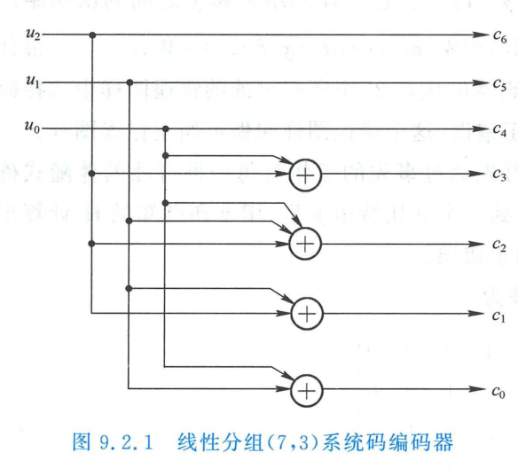
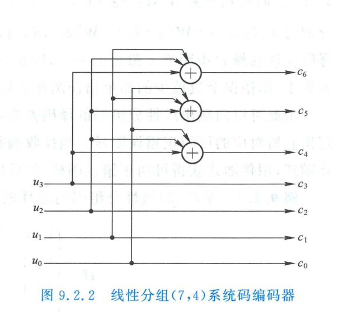
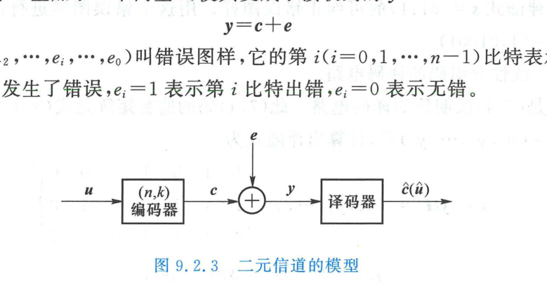
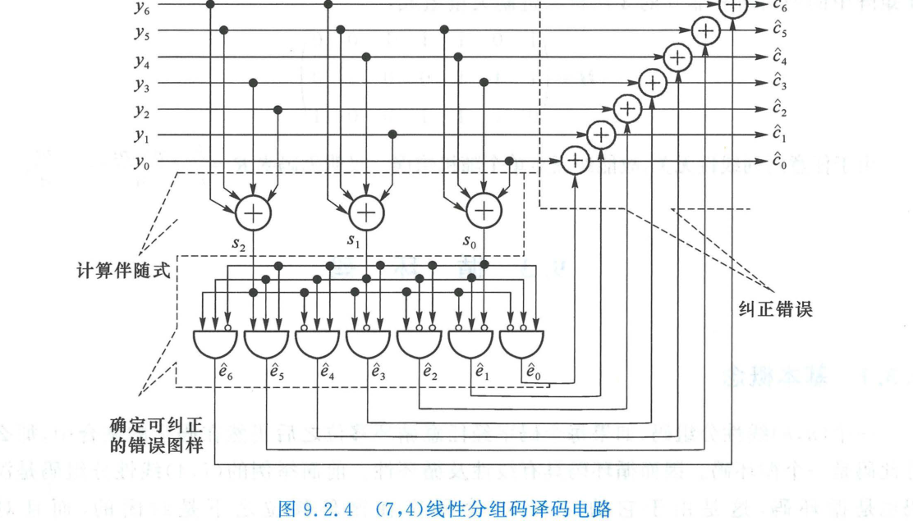

import Card from '@/components/Card.astro';
import Example from '@/components/Example.astro';
import Solution from '@/components/Solution.astro';
import ExerciseTrigger from '@/components/exercises/ExerciseTrigger.astro';

线性分组码（Linear Block Codes）是代数编码理论中最重要、应用最广泛的一类结构化分组码。其核心特征在于：**信息元与校验元之间的代数约束关系完全由有限域上的线性方程组决定**。

---

## 9.2.1 线性分组码的基本概念与代数性质

### 1. 严格数学定义
设信息分组为长为 $k$ 的二元向量 $\boldsymbol{u} = (u_{k-1}, u_{k-2}, \dots, u_0) \in \mathrm{GF}(2)^k$。
信道编码映射 $f$ 将信息空间 $\mathcal{U}^k$ 映射为长为 $n$（$n > k$）的码字空间 $\mathcal{C}^n$：
$$
f: \mathcal{U}^k \to \mathcal{C}^n
$$
若映射 $f$ 满足线性变换条件：
$$
f(\alpha \boldsymbol{u} \oplus \beta \boldsymbol{u}') = \alpha f(\boldsymbol{u}) \oplus \beta f(\boldsymbol{u}'), \quad \forall \alpha, \beta \in \mathrm{GF}(2), \; \boldsymbol{u}, \boldsymbol{u}' \in \mathcal{U}^k
$$
且 $f$ 为一一对应映射（唯一可译），则由 $f$ 生成的码集合称为 **$(n, k)$ 线性分组码**。编码效率为 $R = k/n$。

### 2. 核心代数性质
1. **加法封闭性**：
   若 $\boldsymbol{c}_1, \boldsymbol{c}_2 \in \mathcal{C}$，则其按位模 2 加法和必为合法码字：
   $$
   \boldsymbol{c}_1 \oplus \boldsymbol{c}_2 \in \mathcal{C}
   $$
   线性分组码是 $n$ 维向量空间 $\mathrm{GF}(2)^n$ 的一个 $k$ 维线性子空间。
2. **全零码字必然存在**：
   由封闭性可知，$\boldsymbol{c} \oplus \boldsymbol{c} = \mathbf{0} \in \mathcal{C}$。全零向量 $(0, 0, \dots, 0)$ 必然属于任何线性分组码。
3. **最小码距与非零最小码重等价定理**：

<Card title="定理：d_min = w_min（线性分组码核心测度定理）" type="star">
对于任何线性分组码，其合法码字之间的最小汉明距离 $d_{\min}$ **严格等于该码集合中除全零码以外所有非零码字的最小汉明重量 $w_{\min}$**：
$$
d_{\min} = w_{\min} \triangleq \min_{\boldsymbol{c} \ne \mathbf{0}} w(\boldsymbol{c})
$$
**严格证明**：
根据汉明距离定义：
$$
d(\boldsymbol{c}_i, \boldsymbol{c}_j) = w(\boldsymbol{c}_i \oplus \boldsymbol{c}_j)
$$
由于线性码对加法封闭，若 $\boldsymbol{c}_i \ne \boldsymbol{c}_j$，则其模 2 和必为码集合中的某个非零合法码字：$\boldsymbol{c}_k = \boldsymbol{c}_i \oplus \boldsymbol{c}_j \in \mathcal{C}$ 且 $\boldsymbol{c}_k \ne \mathbf{0}$。
因此：
$$
\min_{\boldsymbol{c}_i \ne \boldsymbol{c}_j} d(\boldsymbol{c}_i, \boldsymbol{c}_j) = \min_{\boldsymbol{c}_k \ne \mathbf{0}} w(\boldsymbol{c}_k) \iff d_{\min} = w_{\min}
$$
**工程价值**：检验一个 $(n, k)$ 线性分组码的最小距离，无需对全部 $\binom{2^k}{2}$ 对码字进行繁杂的两两比对，只需遍历考察 $2^k - 1$ 个非零码字的重量分布即可！
</Card>

---

<Example title="例 9.2.1：线性分组码的代数封闭性验证">
已知某 $(5, 2)$ 分组码的码字集合定义为：
$$
\mathcal{C} = \left\{ (00000), \; (10100), \; (01111), \; (11011) \right\}
$$
其信息映射规则为：
$00 \to 00000, \; 10 \to 10100, \; 01 \to 01111, \; 11 \to 11011$。
试判定该码是否属于线性分组码，并求其最小汉明距离 $d_{\min}$。
</Example>

<Solution>
**1. 验证加法封闭性**：
- $(10100) \oplus (01111) = (11011) \in \mathcal{C}$；
- $(10100) \oplus (11011) = (01111) \in \mathcal{C}$；
- $(01111) \oplus (11011) = (10100) \in \mathcal{C}$；
- 全零码字 $(00000) \in \mathcal{C}$。
码字集合对模 2 加法完全封闭，满足线性空间定义，故为**线性分组码**。

**2. 求解最小码距**：
非零码字的汉明重量分别为：
$w(10100) = 2, \; w(01111) = 4, \; w(11011) = 4$。
根据 $d_{\min} = w_{\min}$ 定理：
$$
d_{\min} = \min\{2, 4, 4\} = 2
$$
该码最小距离为 2，能够检测 1 个随机错误，但无法纠正错误。
</Solution>

---

## 9.2.2 生成矩阵与监督矩阵

### 1. 生成矩阵（Generator Matrix, $\boldsymbol{G}$）
$(n, k)$ 线性分组码可以由输入信息向量 $\boldsymbol{u} = (u_{k-1}, \dots, u_0)$ 经线性变换生成：
$$
\boldsymbol{c} = \boldsymbol{u} \boldsymbol{G}
$$
式中 $\boldsymbol{G}$ 为 $k \times n$ 阶矩阵：
$$
\boldsymbol{G} = \begin{bmatrix}
g_{k-1, n-1} & g_{k-1, n-2} & \dots & g_{k-1, 0} \\
g_{k-2, n-1} & g_{k-2, n-2} & \dots & g_{k-2, 0} \\
\vdots & \vdots & \ddots & \vdots \\
g_{0, n-1} & g_{0, n-2} & \dots & g_{0, 0}
\end{bmatrix} = \begin{bmatrix}
\boldsymbol{g}_{k-1} \\
\boldsymbol{g}_{k-2} \\
\vdots \\
\boldsymbol{g}_0
\end{bmatrix}
$$
- **生成矩阵性质**：
  1. $\boldsymbol{G}$ 的各行矢量 $\boldsymbol{g}_i$ 在 $\mathrm{GF}(2)$ 上**线性无关**，矩阵的秩为 $k$；
  2. $\boldsymbol{G}$ 的每一行本身就是一个合法码字（当输入为单位基向量时产生）；
  3. 码空间 $\mathcal{C}$ 即为由 $\boldsymbol{G}$ 的 $k$ 个行基向量所张成的 $k$ 维行子空间。

### 2. 系统码与典型生成矩阵
若信息位以原样未变的形式直接出现在码字的前 $k$ 位（或后 $k$ 位），称其为**系统码（Systematic Code）**。
系统码的**典型生成矩阵**可分块表示为：
$$
\boldsymbol{G} = \left[ \boldsymbol{I}_k \;\middle|\; \boldsymbol{Q} \right]
$$
式中 $\boldsymbol{I}_k$ 为 $k \times k$ 阶单位矩阵，$\boldsymbol{Q}$ 为 $k \times (n-k)$ 阶监督生成子块。
此时码字前 $k$ 位为原始信息 $\boldsymbol{u}$，后 $n-k$ 位为校验向量 $\boldsymbol{u}\boldsymbol{Q}$：
$$
\boldsymbol{c} = \boldsymbol{u} \boldsymbol{G} = \left( \boldsymbol{u} \;\middle|\; \boldsymbol{u}\boldsymbol{Q} \right)
$$

### 3. 监督矩阵（Parity-Check Matrix, $\boldsymbol{H}$）
合法码字必须满足 $r = n - k$ 个独立的线性校验方程，以约束冗余度。写成矩阵紧凑形式：
$$
\boldsymbol{c} \boldsymbol{H}^T = \mathbf{0} \iff \boldsymbol{H} \boldsymbol{c}^T = \mathbf{0}^T
$$
式中 $\boldsymbol{H}$ 为 $(n-k) \times n$ 阶矩阵，称为**监督矩阵（或校验矩阵）**。
对于典型系统生成矩阵 $\boldsymbol{G} = [\boldsymbol{I}_k \mid \boldsymbol{Q}]$，由于 $\boldsymbol{G}$ 的每行都是合法码字，必须满足：
$$
\boldsymbol{G} \boldsymbol{H}^T = \mathbf{0}
$$
设典型监督矩阵表示为 $\boldsymbol{H} = [\boldsymbol{P} \mid \boldsymbol{I}_{n-k}]$，代入上式展开：
$$
\boldsymbol{G} \boldsymbol{H}^T = \left[ \boldsymbol{I}_k \;\middle|\; \boldsymbol{Q} \right] \begin{bmatrix} \boldsymbol{P}^T \\ \boldsymbol{I}_{n-k} \end{bmatrix} = \boldsymbol{P}^T \oplus \boldsymbol{Q} = \mathbf{0} \implies \boldsymbol{P} = \boldsymbol{Q}^T
$$

<Card title="典型系统码 G 与 H 的对偶转换公式" type="star">
对于任意 $(n, k)$ 典型系统线性分组码：
$$
\boldsymbol{G} = \left[ \boldsymbol{I}_k \;\middle|\; \boldsymbol{Q} \right] \iff \boldsymbol{H} = \left[ \boldsymbol{Q}^T \;\middle|\; \boldsymbol{I}_{n-k} \right]
$$
生成矩阵 $\boldsymbol{G}$ 负责**发端编码映射**，监督矩阵 $\boldsymbol{H}$ 负责**收端差错校验**，两者通过有限域零空间正交性完全对称绑定。
</Card>

---

<Card title="定理：监督矩阵列线性相关度与最小码距判定准则" type="star">
$(n, k)$ 线性分组码的最小汉明距离为 $d_{\min}$ 的**充要条件**是：
1. **$\boldsymbol{H}$ 矩阵中任意 $d_{\min} - 1$ 个列向量线性无关**；
2. **$\boldsymbol{H}$ 矩阵中存在某 $d_{\min}$ 个列向量线性相关**。

**严格证明**：
将 $\boldsymbol{H}$ 展开为列向量形式 $\boldsymbol{H} = [\boldsymbol{h}_{n-1}, \boldsymbol{h}_{n-2}, \dots, \boldsymbol{h}_0]$。校验方程为：
$$
\boldsymbol{c} \boldsymbol{H}^T = \sum_{i=0}^{n-1} c_i \boldsymbol{h}_i^T = \mathbf{0}^T
$$
- 若存在重量为 $w$ 的非零码字 $\boldsymbol{c}$，则上式意味着对应的 $w$ 个非零分量所指引的 $\boldsymbol{H}$ 的列向量模 2 线性相加为零（线性相关）；
- 反之，若 $\boldsymbol{H}$ 中某 $w$ 列线性相关，即可构造出一个重量为 $w$ 的合法非零码字。
根据 $d_{\min} = w_{\min}$ 定理，最小非零码重对应的正是 $\boldsymbol{H}$ 中能构成线性相关的最少列数！
</Card>

---

<Example title="例 9.2.2：非系统码生成矩阵向等价系统码转换">
已知某 $(7, 4)$ 线性分组码的非系统生成矩阵为：
$$
\boldsymbol{G} = \begin{bmatrix}
0 & 1 & 0 & 1 & 0 & 1 & 0 \\
1 & 0 & 1 & 0 & 1 & 0 & 1 \\
0 & 0 & 0 & 1 & 1 & 1 & 1 \\
1 & 1 & 0 & 0 & 0 & 0 & 1
\end{bmatrix}
$$
试求其等价的系统码典型生成矩阵 $\boldsymbol{G}_{\text{sys}}$ 与典型监督矩阵 $\boldsymbol{H}_{\text{sys}}$。
</Example>

<Solution>
在线性分组码中，对生成矩阵实施**初等行变换**（行交换、行模 2 异或相加）不改变行张成的子空间；实施**列交换**相当于对码字各分量位置进行置换，不改变码的距离分布与纠错能力。

通过初等行变换与列交换将左侧 $4 \times 4$ 子块消元规约化为单位矩阵 $\boldsymbol{I}_4$，最终求得其等价系统生成矩阵为：
$$
\boldsymbol{G}_{\text{sys}} = \left[ \boldsymbol{I}_4 \;\middle|\; \boldsymbol{Q} \right] = \begin{bmatrix}
1 & 0 & 0 & 0 & 0 & 1 & 1 \\
0 & 1 & 0 & 0 & 1 & 0 & 1 \\
0 & 0 & 1 & 0 & 1 & 1 & 0 \\
0 & 0 & 0 & 1 & 1 & 1 & 1
\end{bmatrix}
$$
由 $\boldsymbol{H}_{\text{sys}} = [\boldsymbol{Q}^T \mid \boldsymbol{I}_3]$ 直接写出其典型监督矩阵：
$$
\boldsymbol{H}_{\text{sys}} = \begin{bmatrix}
0 & 1 & 1 & 1 & 1 & 0 & 0 \\
1 & 0 & 1 & 1 & 0 & 1 & 0 \\
1 & 1 & 0 & 1 & 0 & 0 & 1
\end{bmatrix}
$$
$\boldsymbol{H}_{\text{sys}}$ 的 7 个列向量两两均不相同且非零，任意 2 列均线性无关，但显然存在 3 列之和为零（例如第 5、6、7 列之和为零），故验证得 $d_{\min} = 3$。
</Solution>

---

## 9.2.3 对偶码（Dual Codes）

对于由生成矩阵 $\boldsymbol{G}_{k \times n}$ 张成的 $k$ 维子空间 $V_k$，在 $\mathrm{GF}(2)^n$ 中与 $V_k$ 中所有向量模 2 正交的向量全体构成一个 $n - k$ 维的正交补子空间 $V_{n-k}$：
$$
V_{n-k} = \left\{ \boldsymbol{x} \in \mathrm{GF}(2)^n \;\middle|\; \boldsymbol{x} \boldsymbol{c}^T = 0, \; \forall \boldsymbol{c} \in V_k \right\}
$$
该子空间 $V_{n-k}$ 称为原 $(n, k)$ 码的**对偶码（Dual Code）**，其参数为 $(n, n - k)$：
- 原码的监督矩阵 $\boldsymbol{H}$ 正是对偶码的生成矩阵 $\boldsymbol{G}^\perp$；
- 原码的生成矩阵 $\boldsymbol{G}$ 正是对偶码的监督矩阵 $\boldsymbol{H}^\perp$。

若某个线性码与其对偶码完全一致（$\mathcal{C} = \mathcal{C}^\perp$），则称该码为**自对偶码（Self-Dual Code）**。自对偶码的参数必然满足 $n = 2k$（码率恒为 $1/2$）。

---

## 9.2.4 系统码的硬件编码器与伴随式最优译码

### 1. 硬件编码电路
系统码的物理实现极为简捷：信息位直接输出作为码字前 $k$ 位；后 $n-k$ 位校验位通过多输入模 2 异或门（XOR）依据生成方程硬件瞬时输出。

*(a) (7,3) 系统码编码器*

*(b) (7,4) 系统码编码器*

### 2. 二元加性信道模型与错误图样
设发送码字为 $\boldsymbol{c}$，信道物理畸变与加性噪声诱发差错。二元信道模型可等效为发送码字叠加一个**加性错误图样向量（Error Pattern）** $\boldsymbol{e}$：
$$
\boldsymbol{y} = \boldsymbol{c} \oplus \boldsymbol{e}
$$
式中 $\boldsymbol{e} = (e_{n-1}, e_{n-2}, \dots, e_0)$。$e_i = 1$ 表示第 $i$ 位传输发生错误，$e_i = 0$ 表示该位正确接收。

### 3. 伴随式（Syndrome，校验子）理论
接收端收到向量 $\boldsymbol{y}$ 后，利用已知的信道监督矩阵 $\boldsymbol{H}$ 计算 $r = n - k$ 维的**伴随式向量** $\boldsymbol{s}$：
$$
\boldsymbol{s} = \boldsymbol{y} \boldsymbol{H}^T
$$
将信道模型代入展开：
$$
\boldsymbol{s} = (\boldsymbol{c} \oplus \boldsymbol{e}) \boldsymbol{H}^T = \boldsymbol{c}\boldsymbol{H}^T \oplus \boldsymbol{e}\boldsymbol{H}^T = \mathbf{0} \oplus \boldsymbol{e}\boldsymbol{H}^T = \boldsymbol{e}\boldsymbol{H}^T
$$

<Card title="伴随式的核心物理特征" type="star">
伴随式 $\boldsymbol{s} = \boldsymbol{e}\boldsymbol{H}^T$ 的取值**完全唯一地取决于传输错误图样 $\boldsymbol{e}$，与发端发送的实际有效码字 $\boldsymbol{c}$ 彻底无关**！
- 若 $\boldsymbol{s} = \mathbf{0}$，表明接收码字满足监督方程，判决未发生错误（或错误不可检）；
- 若 $\boldsymbol{s} \ne \mathbf{0}$，则精准表征了错误图样对监督关系的破坏特征，为后继差错定位提供了完备信息。
</Card>

### 4. 伴随式译码与标准阵列（Standard Array）
方程 $\boldsymbol{e} \boldsymbol{H}^T = \boldsymbol{s}$ 在 $\mathrm{GF}(2)^n$ 中存在 $2^k$ 个数学可能解（构成一个陪集）。
根据最大后验概率（MAP）准则，在二元对称信道（$p < 0.5$）中，发生差错比特数越少的错误图样先验概率越高。因此，**最佳译码策略是在该伴随式对应的全部可能解中，选取汉明重量最小的向量作为最优估算错误图样 $\hat{\boldsymbol{e}}$（陪集首，Coset Leader）**。

最终纠正错误输出码字为：
$$
\hat{\boldsymbol{c}} = \boldsymbol{y} \oplus \hat{\boldsymbol{e}}
$$

以 $(7, 4)$ 汉明码为例，全部 8 种伴随式与可纠正错误图样对应关系如下表所示：

| 伴随式 $(s_2 s_1 s_0)$ | 可纠正错误图样 $\hat{\boldsymbol{e}}$ | 纠错物理含义 |
| :---: | :---: | :---: |
| `0 0 0` | `0 0 0 0 0 0 0` | 传输无差错 |
| `0 0 1` | `0 0 0 0 0 0 1` | 第 0 位校验位 $c_0$ 出错 |
| `0 1 0` | `0 0 0 0 0 1 0` | 第 1 位校验位 $c_1$ 出错 |
| `1 0 0` | `0 0 0 0 1 0 0` | 第 2 位校验位 $c_2$ 出错 |
| `1 0 1` | `0 0 0 1 0 0 0` | 第 3 位信息位 $c_3$ 出错 |
| `0 1 1` | `0 0 1 0 0 0 0` | 第 4 位信息位 $c_4$ 出错 |
| `1 1 1` | `0 1 0 0 0 0 0` | 第 5 位信息位 $c_5$ 出错 |
| `1 1 0` | `1 0 0 0 0 0 0` | 第 6 位信息位 $c_6$ 出错 |

---

## 9.2.5 汉明码（Hamming Codes）

汉明码是理查德·汉明（Richard Hamming）于 1949 年提出的最早且最经典的**单错纠正完全线性分组码**。

### 1. 结构参数
设监督位数为 $m \ge 3$：
- **码长**：$n = 2^m - 1$
- **信息位数**：$k = 2^m - 1 - m$
- **校验位数**：$r = n - k = m$
- **最小码距**：$d_{\min} = 3$（保证纠正所有 $t=1$ 单比特差错）
- **码率**：$R = \frac{2^m - 1 - m}{2^m - 1} = 1 - \frac{m}{2^m - 1} \xrightarrow{m \to \infty} 1$

### 2. 构造机理与硬件定位
汉明码监督矩阵 $\boldsymbol{H}$ 的 $n = 2^m - 1$ 列由**全体非全零的 $m$ 维二进制列向量**按任意次序排列构成。
由于每列互不相同且非零，当发生单比特错误时（设第 $i$ 位出错，$\boldsymbol{e} = [0, \dots, 1, \dots, 0]$）：
$$
\boldsymbol{s} = \boldsymbol{e} \boldsymbol{H}^T = \boldsymbol{h}_i^T
$$
**伴随式 $\boldsymbol{s}$ 的值恰好就是 $\boldsymbol{H}$ 矩阵中第 $i$ 列的向量！**
若在设计时将 $\boldsymbol{H}$ 的各列按自然二进制数值次序从小到大编排，则计算得到的伴随式二进制数值即为错误比特所在的绝对硬件位置索引，接收机无需查表即可直通纠错，展现了数学与工程融合的极致美感。

---

<ExerciseTrigger chapter={9} section="9.2" title="9.2 线性分组码 思考题与自测" />
