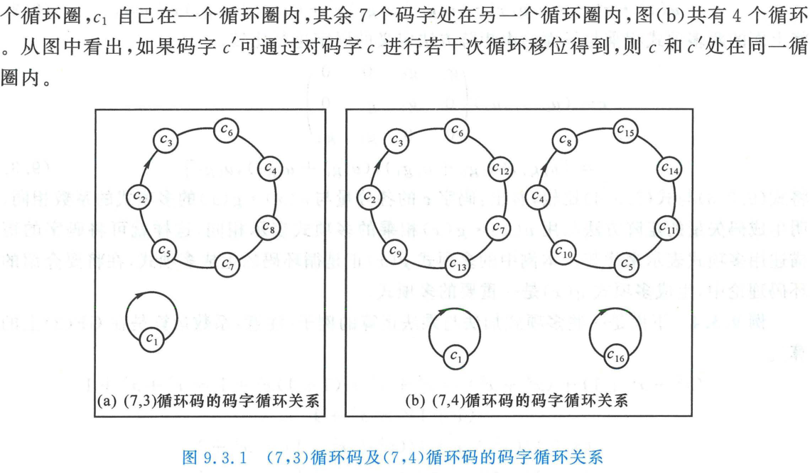
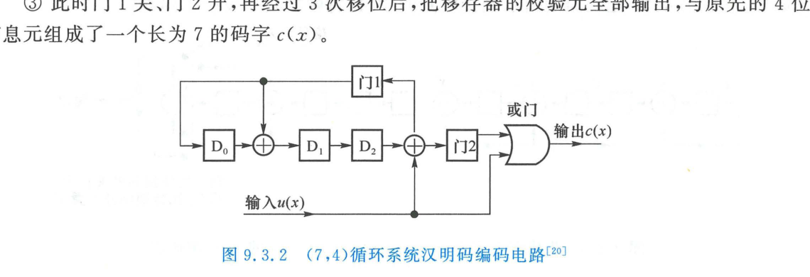
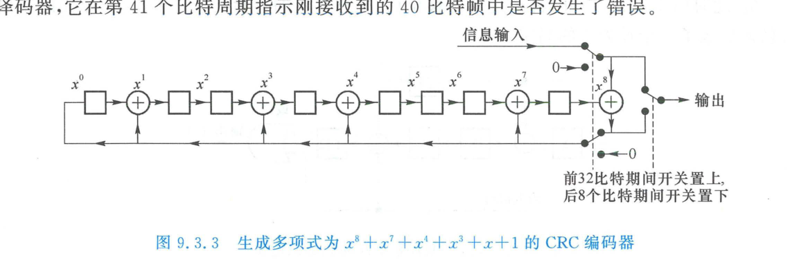
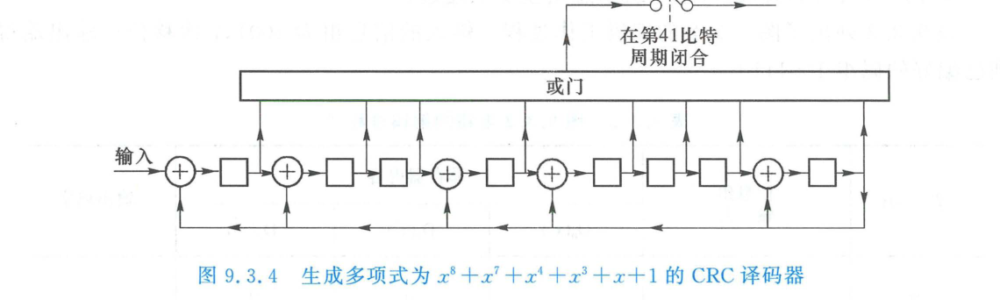

import Card from '@/components/Card.astro';
import Example from '@/components/Example.astro';
import Solution from '@/components/Solution.astro';
import ExerciseTrigger from '@/components/exercises/ExerciseTrigger.astro';

循环码（Cyclic Codes）是线性分组码中最核心、最具实用工程价值的代数码类。它不仅继承了线性码的全部优秀代数性质，更具备独特的**循环移位不变性**，使得复杂的矩阵编码与译码操作能够完全转换为**多项式除法与线性反馈移位寄存器（LFSR）**的超高速硬件实现。

---

## 9.3.1 循环码的基本概念

### 1. 严格数学定义
设 $\mathcal{C}$ 为长为 $n$、信息位长为 $k$ 的二元线性分组码集合。

<Card title="定义：循环码（Cyclic Codes）" type="star">
若对码集合 $\mathcal{C}$ 中的任意码字 $\boldsymbol{c} = (c_{n-1}, c_{n-2}, \dots, c_1, c_0) \in \mathcal{C}$，将其各个分量沿右（或沿左）循环移动任意一位后所得到的向量：
$$
\boldsymbol{c}^{(1)} = (c_{n-2}, c_{n-3}, \dots, c_0, c_{n-1})
$$
**依然是该集合 $\mathcal{C}$ 中的合法码字**，则称该线性分组码为**循环码**。
</Card>

由数学归纳法易知，若单次循环移位封闭，则对其进行任意 $i$ 次（$0 \le i \le n-1$）循环移位后得到的向量：
$$
\boldsymbol{c}^{(i)} = (c_{n-1-i}, \dots, c_0, c_{n-1}, \dots, c_{n-i}) \in \mathcal{C}
$$
均必然属于合法码字集合。

上图揭示了 $(7,3)$ 与 $(7,4)$ 循环码内部的码字循环轨道结构：全零码字自身形成退化的单点独立循环圈；其余非零码字按周期划分为互不相交的循环置换群。

---

## 9.3.2 多项式代数描述与模 $x^n + 1$ 运算

### 1. 码多项式表示
一个长为 $n$ 的码字 $\boldsymbol{c} = (c_{n-1}, c_{n-2}, \dots, c_1, c_0)$ 可以一一对应地表示为系数取值于 $\mathrm{GF}(2)$ 的一元多项式，称为**码多项式（Code Polynomial）**：
$$
c(x) = c_{n-1} x^{n-1} + c_{n-2} x^{n-2} + \dots + c_1 x + c_0
$$
多项式的加法即为对应项系数的模 2 异或相加，乘法则按照普通代数展开后对系数取模 2。

### 2. 循环移位的多项式同余准则

<Card title="定理：循环移位与模 x^n + 1 同余映射" type="star">
对于 $(n, k)$ 循环码中的任意码多项式 $c(x)$，其**单次循环左移**对应的码多项式 $c^{(1)}(x)$ 严格等于 $x \cdot c(x)$ 对多项式 $x^n + 1$ 的**模余式**：
$$
c^{(1)}(x) = [x \cdot c(x)] \bmod (x^n + 1)
$$
相应地，进行 $i$ 次循环移位后的码多项式为：
$$
c^{(i)}(x) = [x^i \cdot c(x)] \bmod (x^n + 1)
$$

**严格数学证明**：
对码多项式乘以 $x$：
$$
x c(x) = c_{n-1} x^n + c_{n-2} x^{n-1} + \dots + c_1 x^2 + c_0 x
$$
在二元域上，$x^n \equiv 1 \pmod{x^n + 1}$。将其恒等变形为：
$$
x c(x) = c_{n-1}(x^n + 1) + \left( c_{n-2} x^{n-1} + \dots + c_0 x + c_{n-1} \right)
$$
等式右端括号内的多项式最高次数为 $n-1$，其各项系数构成的向量恰好为 $(c_{n-2}, \dots, c_0, c_{n-1}) = \boldsymbol{c}^{(1)}$。
因此：
$$
[x c(x)] \bmod (x^n + 1) = c^{(1)}(x)
$$
证毕。
</Card>

这一结论表明：**$(n, k)$ 循环码的全部代数结构，等价于多项式商环 $\mathrm{GF}(2)[x] / (x^n + 1)$ 中的一个理想（Ideal）**。

---

<Example title="例 9.3.1：循环移位的多项式模运算验证">
在 $(7, 4)$ 循环码中，某已知码字为 $\boldsymbol{c} = (1, 1, 0, 1, 0, 0, 0)$，其对应的码多项式为：
$$
c(x) = x^6 + x^5 + x^3
$$
试通过多项式模长除法，计算该码字连续循环左移 3 次后的码多项式 $c^{(3)}(x)$ 及对应二进制码字。
</Example>

<Solution>
根据移位同余定理：
$$
x^3 c(x) = x^3(x^6 + x^5 + x^3) = x^9 + x^8 + x^6
$$
在 $\mathrm{GF}(2)$ 上用 $x^7 + 1$ 除 $x^9 + x^8 + x^6$ 进行多项式长除法：
$$
\begin{aligned}
x^9 + x^8 + x^6 &= x^2(x^7 + 1) \oplus x(x^7 + 1) \oplus (x^6 \oplus x^2 \oplus x) \\
&= (x^2 \oplus x)(x^7 + 1) \oplus (x^6 \oplus x^2 \oplus x)
\end{aligned}
$$
求得余式为：
$$
c^{(3)}(x) = [x^3 c(x)] \bmod (x^7 + 1) = x^6 + x^2 + x
$$
对应的二进制码字为：
$$
\boldsymbol{c}^{(3)} = (1, 0, 0, 0, 1, 1, 0)
$$
直接检验原始向量 $(1, 1, 0, 1, 0, 0, 0)$ 向左循环移位 3 位的物理结果，完全一致！
</Solution>

---

## 9.3.3 生成多项式与生成矩阵

### 1. 生成多项式定义与五大根本性质

<Card title="定义：生成多项式 g(x)" type="star">
在 $(n, k)$ 循环码全部合法非零码多项式集合 $\mathcal{C}(x)$ 中，**除 0 多项式以外次数最低且唯一的首一（Monic）多项式**，称为该循环码的**生成多项式（Generator Polynomial）**，记为 $g(x)$。
</Card>

生成多项式 $g(x) = x^r + g_{r-1} x^{r-1} + \dots + g_1 x + 1$ 具备以下 5 项充要代数性质：

1. **常数项必为 1（$g_0 = 1$）**：
   若 $g_0 = 0$，则 $g(x) = x \cdot g'(x)$，表明 $g(x)$ 是更低阶多项式 $g'(x)$ 循环移位的结果，与 $g(x)$ 次数最低的定义矛盾；
2. **唯一性**：
   商环中次数为 $r$ 的最低阶码多项式在 $\mathrm{GF}(2)$ 上是绝对唯一的；
3. **整除倍式性**：
   循环码中的**每一个码多项式 $c(x)$ 都是 $g(x)$ 的倍式**；反之，任何次数不超过 $n-1$ 的 $g(x)$ 的倍式必为合法码多项式：
   $$
   c(x) = u(x) g(x)
   $$
4. **次数严格等于校验位长**：
   生成多项式 $g(x)$ 的最高次数为：
   $$
   \deg g(x) = r = n - k
   $$
5. **因式分解因子性**：
   **$g(x)$ 必然是多项式 $x^n + 1$ 的因式**：
   $$
   x^n + 1 = g(x) h(x)
   $$
   式中 $h(x)$ 为次数为 $k$ 的**监督多项式（Parity Polynomial）**。

<Card title="寻找循环码的充要设计准则" type="tip">
设计一个码长为 $n$ 的循环码，数学实质完全等价于**在 $\mathrm{GF}(2)$ 上将二项式 $x^n + 1$ 分解为不可约素多项式的乘积**。任意选取其中若干个因式的乘积作为 $g(x)$（设次数为 $r$），即可构造出一个唯一的 $(n, n-r)$ 循环码！
</Card>

---

### 2. 系统循环码的构成算法
直接采用 $c(x) = u(x) g(x)$ 编码产生的是非系统码。为了使原始 $k$ 位信息比特无失真地出现在码字的前 $k$ 位（高次项），必须采用多项式除法构造**系统循环码**：

1. **左移腾位**：将输入信息多项式 $u(x) = u_{k-1} x^{k-1} + \dots + u_0$ 乘以 $x^{n-k}$，使信息位移至高位阶；
2. **除法求余**：用生成多项式 $g(x)$ 除 $x^{n-k} u(x)$，得到商式 $Q(x)$ 和余式 $r(x)$：
   $$
   x^{n-k} u(x) = Q(x) g(x) \oplus r(x)
   $$
   余式 $r(x)$ 的最高次数必定小于 $n - k$（即 $\deg r(x) \le n - k - 1$），该余式即为**校验多项式**；
3. **模 2 拼接**：利用二元加减等价性，合成完整码多项式：
   $$
   c(x) = x^{n-k} u(x) \oplus r(x) = Q(x) g(x)
   $$
   由于 $c(x)$ 严格为 $g(x)$ 的整倍式，故其必然属于合法循环码字，且高位完整保持原始信息！

---

<Example title="例 9.3.2：(7,4) 系统循环码的代数编码推导">
已知 $(7, 4)$ 循环汉明码的生成多项式为 $g(x) = x^3 + x + 1$。
输入信息分组为 $\boldsymbol{u} = (1, 0, 0, 1)$，对应多项式 $u(x) = x^3 + 1$。
试求编码后的 $(7, 4)$ 系统循环码字。
</Example>

<Solution>
**1. 信息多项式升阶**：
$n - k = 7 - 4 = 3$，升阶多项式为：
$$
x^3 u(x) = x^3(x^3 + 1) = x^6 + x^3
$$

**2. 模 2 长除法求校验余式**：
用 $g(x) = x^3 + x + 1$ 除 $x^6 + x^3$：
$$
\begin{aligned}
x^6 + x^3 &= x^3(x^3 + x + 1) \oplus (x^4 \oplus x^3 \oplus x^3) = x^3(x^3 + x + 1) \oplus x^4 \\
&= (x^3 \oplus x)(x^3 + x + 1) \oplus (x^2 \oplus x)
\end{aligned}
$$
解得商式 $Q(x) = x^3 + x$，余式为：
$$
r(x) = [x^3 u(x)] \bmod g(x) = x^2 + x
$$

**3. 合成系统码多项式**：
$$
c(x) = x^3 u(x) \oplus r(x) = x^6 + x^3 + x^2 + x
$$
展开为 7 维二进制码向量：
$$
\boldsymbol{c} = (\underbrace{1, \; 0, \; 0, \; 1}_{\text{信息位}}, \quad \underbrace{1, \; 1, \; 0}_{\text{校验位}})
$$
编码过程清晰展现了“前 $k$ 位直通、后 $n-k$ 位填补余式”的系统码标准结构。
</Solution>

---

## 9.3.4 循环码的硬件除法编码电路与时序节拍

系统循环码的核心操作是多项式模 $g(x)$ 求余。在数字逻辑电路中，这一运算由**线性反馈移位寄存器（Linear Feedback Shift Register, LFSR）**以极高的时钟频率流水线完成。

### 1. 电路拓扑与工作模式
以上图 $(7, 4)$ 循环码编码器为例（生成多项式 $g(x) = x^3 + x + 1$）：
- 包含 $r = n - k = 3$ 级 D 触发器移存单元（$D_0, D_1, D_2$）；
- 模 2 加法器（XOR）的位置由 $g(x)$ 的非零系数严格决定（在 $x^1$ 处引入反馈加法器）；
- 双刀逻辑控制门（门 1 与门 2）：
  - **前 $k = 4$ 个时钟节拍（信息发射与除法阶段）**：门 1 导通、门 2 关断。信息比特流一方面直接输出至信道，另一方面同时注入 LFSR 进行多项式除法迭代；
  - **第 4 节拍结束瞬时**：4 位信息全部移入，此时移位寄存器 $D_2, D_1, D_0$ 中锁存的状态恰好就是多项式除法的最终余式系数（即校验比特）；
  - **后 $n - k = 3$ 个时钟节拍（校验输出阶段）**：门 1 关断、门 2 导通，切断输入反馈。移位时钟连续驱动 3 拍，将寄存器中存储的校验元依次推入信道，完成一个完整码字的发射。

### 2. 详细时序推演表（以输入 1001 为例）

| 时钟节拍 | 信息输入 | 寄存器 $D_0(x^0)$ | 寄存器 $D_1(x^1)$ | 寄存器 $D_2(x^2)$ | 输出码元 | 状态说明 |
| :---: | :---: | :---: | :---: | :---: | :---: | :---: |
| **初始** | — | `0` | `0` | `0` | — | 复位清零 |
| **1** | `1` | `1` | `0` | `0` | `1` | 输出首个信息位 |
| **2** | `0` | `0` | `1` | `0` | `0` | 输出第 2 信息位 |
| **3** | `0` | `0` | `0` | `1` | `0` | 输出第 3 信息位 |
| **4** | `1` | `0` | `1` | `1` | `1` | 4 位信息输出完毕，**余式锁定为 110** |
| **5** | — | `0` | `0` | `1` | `1` | 输出校验位 $r_2$ |
| **6** | — | `0` | `0` | `0` | `1` | 输出校验位 $r_1$ |
| **7** | — | `0` | `0` | `0` | `0` | 输出校验位 $r_0$ |

整整 7 个时钟周期，无需微处理器介入，纯硬件自动吐出完整系统码字 `1001110`！

---

## 9.3.5 循环冗余校验（CRC）与工业标准

**循环冗余校验（Cyclic Redundancy Check, CRC）**是现代计算机网络（以太网、Wi-Fi、TCP/IP、USB、CAN 总线）中应用最为普及的高速硬件检错编码。

### 1. CRC 与循环码的辩证关系
作为检错系统，CRC 核心利用了“**合法码多项式必能被生成多项式 $g(x)$ 整除**”这一代数特性：
- 接收端用同样的 $g(x)$ 对接收码字 $y(x)$ 进行模 2 除法：若余式为零，判定帧无差错；若余式非零，立即上报 CRC 校验失败并丢弃损坏帧；
- ⚠️ **重要工程差异**：作为纯检错码，CRC **并不苛求 $g(x)$ 必须为 $x^n + 1$ 的因式**。只要给定一个 $r$ 阶生成多项式 $g(x)$，任意长度 $k$ 的数据帧均可后缀 $r$ 位校验元构成 $(k+r, k)$ 分组检错码，其编码与译码硬件结构与循环码完全通用。

*(a) 生成多项式为 $x^8 + x^7 + x^4 + x^3 + x + 1$ 的 CRC 编码器*

*(b) 对应的 CRC 硬件检错译码器*

---

### 2. 国际标准 CRC 生成多项式大全

<Card title="工业通信标准经典 CRC 多项式" type="star">

| CRC 标准 | 校验位数 $r$ | 标准生成多项式 $g(x)$ | 主要应用领域与协议 |
| :--- | :---: | :--- | :--- |
| **CRC-4** | 4 | $x^4 + x + 1$ | 电信 E1 多帧对齐监控 |
| **CRC-8** | 8 | $x^8 + x^2 + x + 1$ | ATM 信元头差错控制（HEC）、1-Wire 总线 |
| **CRC-16-CCITT** | 16 | $x^{16} + x^{12} + x^5 + 1$ | X.25、HDLC 帧同步、蓝牙链路层 |
| **CRC-16-ANSI** | 16 | $x^{16} + x^{15} + x^2 + 1$ | USB 令牌包、Modbus 工业总线 |
| **CRC-24** | 24 | $x^{24} + x^{23} + x^{14} + x^{12} + x^8 + 1$ | 3GPP LTE / 5G NR 物理层传输块校验 |
| **CRC-32 (IEEE 802.3)**| 32 | $x^{32} + x^{26} + x^{23} + x^{22} + x^{16} + x^{12} + x^{11} + x^{10} + x^8 + x^7 + x^5 + x^4 + x^2 + x + 1$ | **以太网（Ethernet）**、Wi-Fi (802.11)、ZIP/PNG 压缩校验 |
| **CRC-64-ISO** | 64 | $x^{64} + x^4 + x^3 + x + 1$ | 高性能分布式文件系统、大型数据库完整性校验 |

</Card>

---

### 3. CRC 的漏检概率理论极限分析
设信道发生非全零错误图样 $e(x)$。当且仅当错误图样 $e(x)$ 自身**恰好能够被生成多项式 $g(x)$ 整除**时，接收端除法余数依然为 0，差错将彻底骗过译码器产生**不可检测差错（漏检）**。

在长为 $n = k + r$ 的空间中：
- 全部可能的非零错误图样总数为 $2^{k+r} - 1$ 个；
- 其中能被 $g(x)$ 整除的非零错误图样恰好有 $2^k - 1$ 个。

因此，在所有可能发生的错误模式中，CRC 的理论宏观漏检比例为：
$$
P_{\text{leak}} = \frac{2^k - 1}{2^{k+r} - 1} \approx 2^{-r}
$$
- 对于 **CRC-16**：漏检率上限仅为 $2^{-16} \approx 1.52 \times 10^{-5}$；
- 对于 **CRC-32**：漏检率上限急剧降至 $2^{-32} \approx 2.33 \times 10^{-10}$（百亿分之二）！

加上实际物理信道中错误图样多为短突发，而 CRC 对于长度不超过 $r$ 的**全部连续突发错误具有 100% 的绝对检出率**，因而在工程上被公认为最为坚固、高效的检错屏障。

---

<ExerciseTrigger chapter={9} section="9.3" title="9.3 循环码 思考题与自测" />
