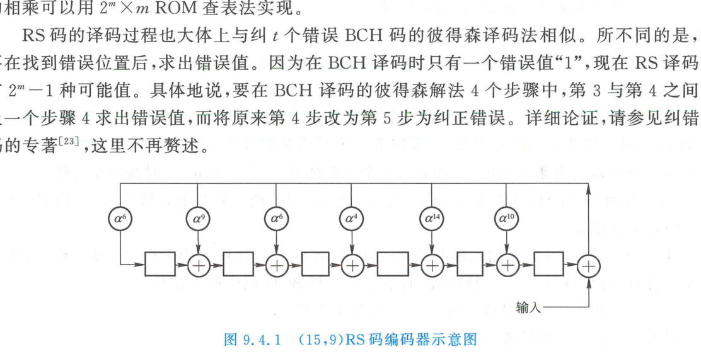

import Card from '../../../../../../components/Card.astro';
import Example from '../../../../../../components/Example.astro';
import Solution from '../../../../../../components/Solution.astro';
import ExerciseTrigger from '../../../../../../components/ExerciseTrigger.astro';

在实际通信与数字存储系统中，信道差错往往不仅限于单比特翻转，而是存在多比特独立随机差错乃至长时间突发错误。**BCH 码**与 **RS 码（Reed-Solomon Codes）**是代数编码理论中性能最为强悍、工程应用最为广泛的经典结构化多纠错循环码。

---

## 9.4.1 BCH 码

BCH 码是由霍昆格姆（Hocquenghem，1959年）以及玻斯（Bose）、乔杜里（Chaudhuri，1960年）各自独立发现的具有严密代数构造的循环码，以三人姓氏首字母命名。

### 1. 生成多项式构造定理
设 $\alpha$ 为有限域 $\mathrm{GF}(2^m)$ 上的本原元，$m_i(x)$ 为以 $\alpha^i$ 为根的 $\mathrm{GF}(2)$ 上的最小不可约素多项式。

<Card title="定理：BCH 码生成多项式构造" type="star">
若循环码的生成多项式 $g(x)$ 包含 $2t$ 个连续的本原元幂次 $\alpha, \alpha^2, \dots, \alpha^{2t}$ 为根，则该多项式可由前 $t$ 个奇数次幂对应的最小素多项式取**最小公倍式（LCM）**构成：
$$
g(x) = \operatorname{LCM}\left[ m_1(x), \; m_3(x), \; \dots, \; m_{2t-1}(x) \right]
$$
由此生成的循环码称为 **BCH 码**。
- **设计码距**：$d_0 = 2t + 1$；
- **纠错能力**：在每个包含 $n$ 个码元的分组内，**保证纠正全部 $t$ 个以内的随机独立差错**（实际最小距离 $d_{\min} \ge d_0$）。
</Card>

### 2. 本原 BCH 码与非本原 BCH 码
- **本原 BCH 码（狭义 BCH 码）**：码长严格满足 $n = 2^m - 1$；
- **非本原 BCH 码**：码长 $n$ 为 $2^m - 1$ 的某个真因数。

---

### 3. 经典传奇：(23,12) 戈莱码（Golay Code）
$(23, 12)$ 戈莱码是一个非本原 BCH 码，由马塞尔·戈莱（Marcel Golay）于 1949 年发现。其参数为 $n = 23, k = 12, r = 11$。

生成多项式由八进制系数 $(5343)_8$ 查得：
$$
g_1(x) = x^{11} + x^9 + x^7 + x^6 + x^5 + x + 1
$$
其互反多项式 $g_2(x) = x^{11} + x^{10} + x^6 + x^5 + x^4 + x^2 + 1$ 亦为生成多项式，满足因式分解：
$$
x^{23} + 1 = (x + 1) g_1(x) g_2(x)
$$

<Card title="(23,12) 戈莱码的完备性（Perfect Code）" type="star">
$(23, 12)$ 戈莱码的最小码距严格达到 $d_{\min} = 7$，**能够纠正分组内的任意 3 个随机错误（$t = 3$）**。

其汉明球包装边界（Hamming Bound）满足：
$$
2^k \sum_{i=0}^t \binom{n}{i} = 2^{12} \left[ \binom{23}{0} + \binom{23}{1} + \binom{23}{2} + \binom{23}{3} \right] = 4096 \times [1 + 23 + 253 + 1771] = 4096 \times 2048 = 2^{12} \times 2^{11} = 2^{23} = 2^n
$$
**所有以码字为中心、以 $t=3$ 为半径的汉明超球恰好毫无缝隙、毫无重叠地填满了整个 $2^{23}$ 空间的全部向量！**
这是数学上**唯一已知的二元多纠错非平凡完备线性码**，其校验冗余度得到了百分之百的理论极致利用。在深空探测（如美国旅行者 1 号、2 号木星与土星成像传回）中发挥了历史性作用。
</Card>

工程上常在其生成式中乘入 $(x+1)$ 构成 **$(24, 12)$ 扩展戈莱码**，码距增至 $d_{\min} = 8$，可同时**纠 3 错、检 4 错**。

---

## 9.4.2 里德-所罗门码（RS 码）

实际无线传输、光盘存储（CD / DVD / Blu-ray）及深空通信中，信道差错往往以长突发错误的形式爆发。二元 BCH 码在应对连续长串错误时代价高昂，而 **里德-所罗门码（Reed-Solomon Codes, RS 码）** 则是专为解决突发错误而设计的**非二元（Non-Binary）BCH 码**。

### 1. 结构参数与最大距离可分（MDS）特性
RS 码定义在伽罗华扩域 $\mathrm{GF}(2^m)$ 上。每个码元不再是单个 0 或 1 比特，而是由 **$m$ 个二进制比特组成的一个符号（Symbol，例如 $m=8$ 时为一个字节 Byte）**。

一个能够纠正 $t$ 个符号错误的 RS 码参数为：
- **符号码长**：$n = 2^m - 1$ 符号（对应比特长度 $n_{\text{bit}} = m(2^m - 1)$）
- **信息符号数**：$k$ 符号（对应信息比特 $k_{\text{bit}} = km$）
- **校验符号数**：$n - k = 2t$ 符号
- **最小符号距离**：
  $$
  d_{\min} = 2t + 1 = n - k + 1
  $$

<Card title="定理：Singleton 界与 RS 码的 MDS 最优性" type="star">
根据编码理论著名的 **Singleton 界**，任何线性分组码的最小距离必满足：
$$
d_{\min} \le n - k + 1
$$
RS 码的最小码距**严格取等号达到了这一数学理论上限**（$d_{\min} = n - k + 1$）。这类码被称为**最大距离可分码（Maximum Distance Separable, MDS 码）**。在相同的信息位数和校验位数下，**RS 码具有人类所能构造出的最大纠错能力**。
</Card>

### 2. 卓越的抗突发差错机理
RS 码以符号为单位纠错。对于一个 $m$ 比特构成的符号，**无论信道噪声在该符号内部引起了 1 个比特翻转，还是全部 $m$ 个比特被彻底打烂破坏，在 RS 译码器视角下均仅仅视为 1 个符号错误**！

- 纠正 $t$ 个符号错误的 RS 码，能够轻松消除长度高达：
  $$
  b_1 = (t - 1)m + 1 \quad (\text{比特})
  $$
  的任意单比特连续突发长错误群！例如对于 $m=8$（字节码）、$t=8$ 的 RS 码，单次即可吞噬长达 57 个比特的连续爆鸣干扰，其抗突发能力是二元码无法比拟的。

---

<Example title="例 9.4.1：(15,9) RS 码的代数构造推导">
试设计一个基于有限域 $\mathrm{GF}(2^4)$（$m=4$）、能够纠正 $t=3$ 个符号错误的 RS 码。
试求其符号参数、等效二进制参数，并给出其生成多项式。
</Example>

<Solution>
**1. 参数计算**：
- 符号位数：$m = 4$（每符号含 4 比特）；
- 码长：$n = 2^4 - 1 = 15$ 符号（等效 $15 \times 4 = 60\text{ bit}$）；
- 纠错能力：$t = 3$ 符号；
- 校验段长：$n - k = 2t = 6$ 符号（等效 $6 \times 4 = 24\text{ bit}$）；
- 信息段长：$k = n - 2t = 15 - 6 = 9$ 符号（等效 $9 \times 4 = 36\text{ bit}$）；
- 最小符号距离：$d_{\min} = 2t + 1 = 7$ 符号（等效 $7 \times 4 = 28\text{ bit}$）。
因此该码为 $(15, 9)$ RS 码，亦可等效视为 $(60, 36)$ 二进制抗突发码。

**2. 生成多项式求解**：
在 $\mathrm{GF}(2^4)$ 上，生成多项式包含本原元 $\alpha$ 的前 $2t = 6$ 个连续幂次为根：
$$
g(x) = \prod_{i=1}^6 (x + \alpha^i) = (x + \alpha)(x + \alpha^2)(x + \alpha^3)(x + \alpha^4)(x + \alpha^5)(x + \alpha^6)
$$
展开并在有限域 $\mathrm{GF}(2^4)$ 模不可约多项式（如 $p(x) = x^4 + x + 1$）下求系数简化：
$$
g(x) = x^6 + \alpha^{10} x^5 + \alpha^3 x^4 + \alpha^4 x^3 + \alpha^6 x^2 + \alpha^9 x + \alpha^6
$$
</Solution>

---

## 9.4.3 RS 码硬件除法编码电路

RS 码的系统编码流程与二进制循环码在拓扑上一致，区别在于**整个数据通路被拓宽为 $m$ 比特并行总线**：



- 寄存器单元由 $m$ 位宽并行触发器组成，存储域元素；
- 乘法器不是简单的模 2 与门，而是**有限域乘法器**（乘以多项式系数 $\alpha^i$），在硬件上通过 $2^m \times m$ 的只读存储器（ROM）查表或组合逻辑阵列瞬间完成；
- 加法器全部升级为 $m$ 位逐比特异或阵列（XOR bus）。

---

## 9.4.4 BCH 与 RS 码的代数译码流水线

BCH 与 RS 码的高效译码是现代数字信号处理的杰作，主要包含四大经典解算阶段：

```
接收多项式 y(x)
      │
      ▼
┌──────────────┐
│ 计算伴随式   │ S_i = y(α^i),  i = 1, 2, ..., 2t
└──────┬───────┘
      │
      ▼
┌──────────────┐
│ 解关键方程   │ 求解错误位置多项式 σ(x)
│ (BM 算法)    │ (Berlekamp-Massey 算法迭代，O(t^2) 复杂度)
└──────┬───────┘
      │
      ▼
┌──────────────┐
│ 钱氏搜索     │ 代入域元素检测零点 σ(α^{-j}) = 0
│ (Chien 搜索) │ 确定全部差错位置索引 j
└──────┬───────┘
      │
      ▼
┌──────────────┐
│ 福尼算法     │ 求解差错幅度值 e_j（RS 码特有，二元 BCH 码直接翻转）
│ (Forney 算法)│ 修正接收数据：c_j = y_j ⊕ e_j
└──────────────┘
```

这一整套严谨的代数译码流水线被固化进全球数十亿台 CD/DVD 光驱控制器、DVB 卫星机顶盒以及固态硬盘（SSD）主控芯片中，构成了现代信息社会高密度存储与通信的基础防线。

---

<ExerciseTrigger chapter={9} section="9.4" title="9.4 BCH码与RS码 思考题与自测" />
