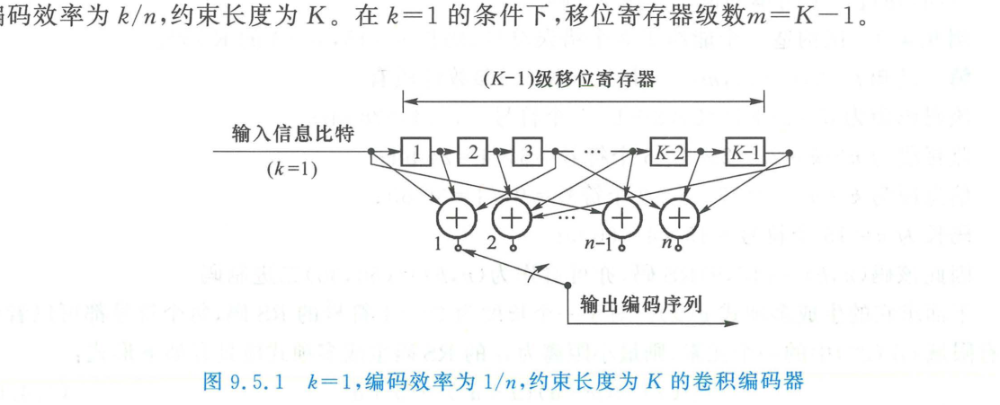
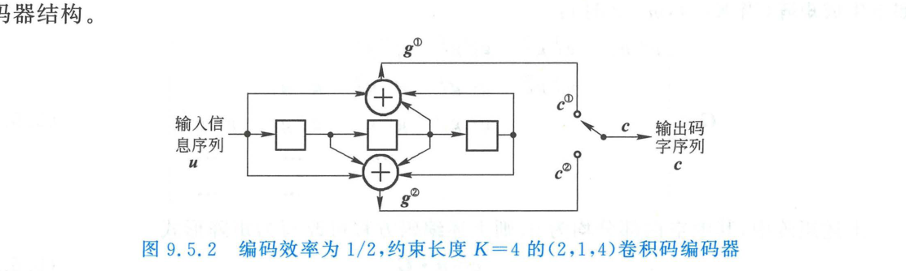
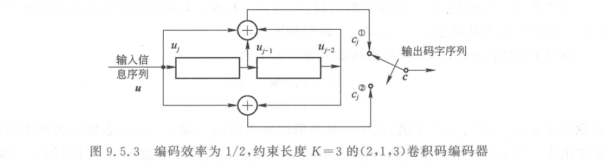
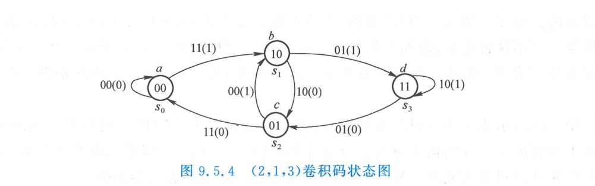
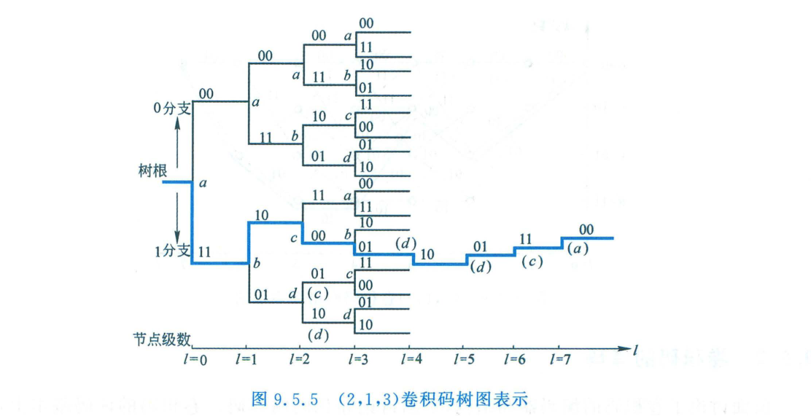
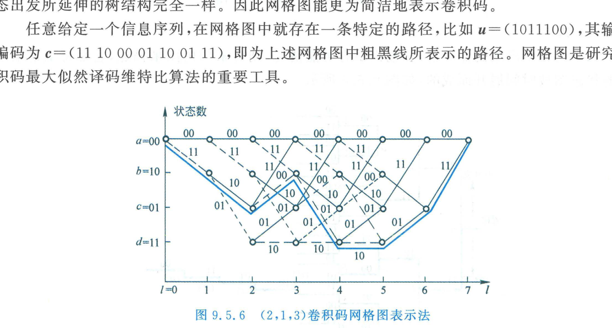
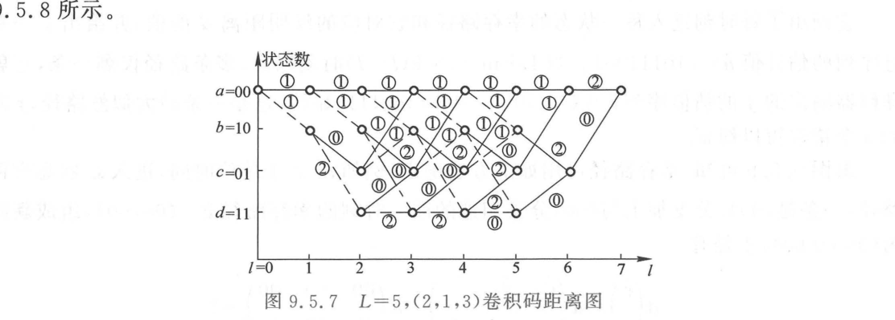
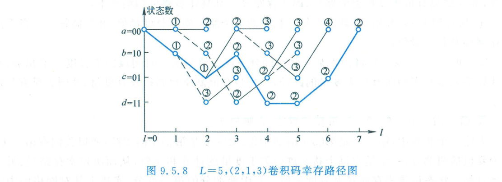
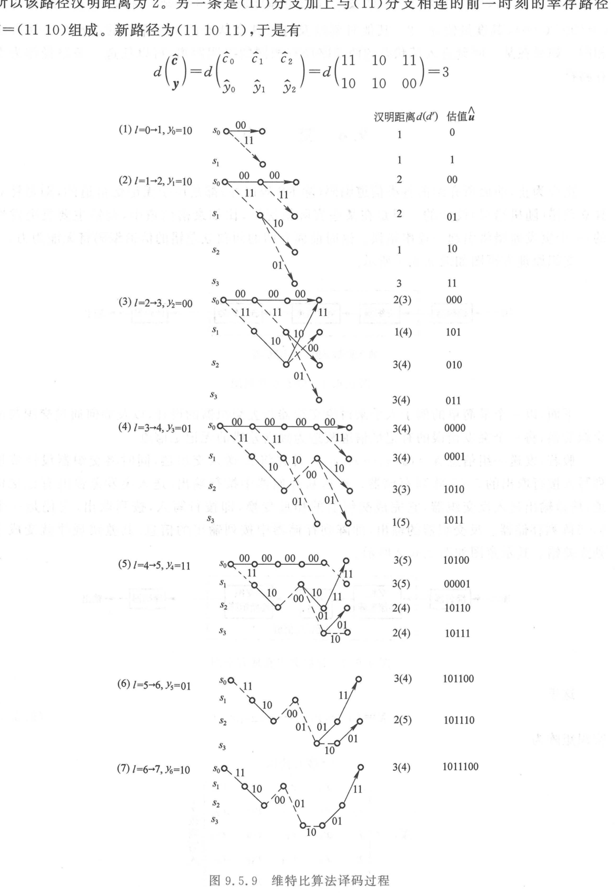

import Card from '../../../../../../components/Card.astro';
import Example from '../../../../../../components/Example.astro';
import Solution from '../../../../../../components/Solution.astro';
import ExerciseTrigger from '../../../../../../components/ExerciseTrigger.astro';

前面讨论的线性分组码与循环码属于“无记忆分组编码”：每个时段输出的 $n$ 个码元仅受本组 $k$ 个信息位约束，各码块之间互不关联。

**卷积码（Convolutional Codes）**则是 1955 年由埃利亚斯（Peter Elias）提出的**有记忆线性时序网络编码**：编码器在任意时段输出的 $n$ 个码元，不仅取决于当前时段输入的 $k$ 个信息位，还深度关联着前 $K-1$ 个历史时段的信息比特。利用时间上的连续代数约束，卷积码具备强大的纠错能力，配合维特比算法构成了 3G/4G 移动通信、深空通信及卫星链路的核心基石。

---

## 9.5.1 卷积码的结构模型与三大解析表示法

### 1. 结构参数与通用模型
卷积码通常表示为 $(n, k, K)$：
- $k$：每时钟周期输入的信息比特数（工程上通常 $k=1$）；
- $n$：每时钟周期输出的编码比特数（编码效率 $R = k/n$）；
- $K$：**约束长度（Constraint Length）**，表示当前输出所关联的历史时段总跨度；
- $m = K - 1$：编码器中移位寄存器的级数（存储历史阶数），系统记忆总比特数为 $mk$。

以最经典的 $(2, 1, 4)$ 卷积码（$k=1, n=2, K=4, m=3$）为例：

### 2. 解析表示法一：离散时域卷积（Discrete Convolution）
设输入信息序列为 $\boldsymbol{u} = (u_0, u_1, u_2, \dots)$。
当输入序列为单冲激脉冲 $\boldsymbol{u} = (1, 0, 0, \dots)$ 时，编码器各输出支路产生的响应序列称为**冲激响应序列（生成序列）** $\boldsymbol{g}^{(j)}$：
$$
\boldsymbol{g}^{(1)} = (g_0^{(1)}, g_1^{(1)}, \dots, g_m^{(1)}), \quad \boldsymbol{g}^{(2)} = (g_0^{(2)}, g_1^{(2)}, \dots, g_m^{(2)})
$$
对于任意信息输入，各支路输出即为输入序列与对应生成序列的**离散线性卷积**：
$$
\boldsymbol{c}^{(1)} = \boldsymbol{u} * \boldsymbol{g}^{(1)}, \quad \boldsymbol{c}^{(2)} = \boldsymbol{u} * \boldsymbol{g}^{(2)}
$$
最终交错并串转换输出总码字序列：
$$
\boldsymbol{c} = (c_0^{(1)} c_0^{(2)}, \; c_1^{(1)} c_1^{(2)}, \; c_2^{(1)} c_2^{(2)}, \; \dots)
$$
这正是“卷积码”名称的数学本源。

### 3. 解析表示法二：半无限生成矩阵（Semi-Infinite Generator Matrix）
将生成序列按时序交错对齐排列，写为矩阵形式 $\boldsymbol{c} = \boldsymbol{u} \boldsymbol{G}$：
$$
\boldsymbol{G} = \begin{bmatrix}
g_0^{(1)} g_0^{(2)} & g_1^{(1)} g_1^{(2)} & \dots & g_m^{(1)} g_m^{(2)} & 0 \; 0 & \dots \\
0 \; 0 & g_0^{(1)} g_0^{(2)} & g_1^{(1)} g_1^{(2)} & \dots & g_m^{(1)} g_m^{(2)} & \dots \\
0 \; 0 & 0 \; 0 & g_0^{(1)} g_0^{(2)} & g_1^{(1)} g_1^{(2)} & \dots & \dots \\
\vdots & \vdots & \vdots & \ddots & \ddots & \dots
\end{bmatrix}
$$
生成矩阵 $\boldsymbol{G}$ 呈现为沿对角线阶梯平移的半无限托普利茨（Toeplitz）结构，适合理论空间分析。

### 4. 解析表示法三：码多项式法（Polynomial Representation）
将序列表示为时延算子 $x$ 的多项式：
$$
u(x) = \sum_l u_l x^l, \quad g^{(j)}(x) = \sum_{i=0}^m g_i^{(j)} x^i
$$
各支路输出码多项式为：
$$
c^{(j)}(x) = u(x) \cdot g^{(j)}(x)
$$
多项式乘法在工程硬件计算与仿真中最为直观便捷。

---

## 9.5.2 卷积码的三大图形拓扑表示法

以广泛作为教学与工业基准的 **$(2, 1, 3)$ 卷积码**（$k=1, n=2, K=3, m=2$）为例展开剖析：
- 生成多项式：$g^{(1)}(x) = 1 + x + x^2$，对应连接系数 $(111)_2$；$g^{(2)}(x) = 1 + x^2$，对应连接系数 $(101)_2$。

编码输出方程为：
$$
c_j^{(1)} = u_j \oplus u_{j-1} \oplus u_{j-2}, \quad c_j^{(2)} = u_j \oplus u_{j-2}
$$

### 1. 状态图（State Diagram）
编码器在 $j$ 时刻的内部记忆状态由两级寄存器的现态唯一决定：
$$
S_j = (u_{j-1}, u_{j-2}) \in \left\{ s_0(00), \; s_1(10), \; s_2(01), \; s_3(11) \right\}
$$
共有 $2^m = 2^2 = 4$ 种可能状态。下一时刻状态转移仅取决于当前状态与新输入比特 $u_j$。

图中每个圆圈代表一个状态，有向弧线标注转移时的“输出码字（输入信息）”。状态图紧凑揭示了马尔可夫转移特性。

### 2. 树图（Tree Diagram）
若将状态转移沿时间轴逐级展开，以初始状态 $s_0(00)$ 为根节点，输入 0 则向上分支，输入 1 则向下分支，形成随时间指数扩散的完全二叉树结构：

树图时序脉络完全清晰，每一条从根节点延伸出的独特路径均严格对应一个输入序列。但缺点是节点数量随时间按 $2^l$ 几何级暴增。

### 3. 网格图（Trellis Diagram，篱笆图）
在树图中，当时间步长 $l > m = 2$ 时，不同路径所到达的寄存器状态开始发生大量重合。**若将同一时刻处于相同状态的节点折叠合并，二叉树便优雅地收敛为高度恒为 $2^m = 4$ 的周期性格子拓扑——网格图（Trellis）**：

- **横轴**：离散时间步 $l = 0, 1, 2, \dots$；
- **纵轴**：$2^m$ 个离散物理状态；
- **分支标号**：实线表示输入 $u=0$，虚线表示输入 $u=1$；分支旁标注输出二元组 $c^{(1)} c^{(2)}$。
**网格图是所有现代概率图模型与维特比最优译码算法的物理宿主**。

---

## 9.5.3 最大似然译码准则与汉明距离等价性

设发端经网格图映射发射了码字序列 $\boldsymbol{c}$，收端接收到受干扰序列 $\boldsymbol{y}$。

根据最大后验概率（MAP）准则，在码字先验等概条件下，最优判决为**最大似然（Maximum Likelihood, ML）准则**：
$$
\hat{\boldsymbol{c}} = \arg\max_{\boldsymbol{c} \in \mathcal{C}} \log P(\boldsymbol{y}|\boldsymbol{c})
$$
对于离散无记忆信道（DMC），长为 $L$ 个符号的似然函数可分解为各时间步条件概率的乘积：
$$
\log P(\boldsymbol{y}|\boldsymbol{c}) = \sum_{l=0}^{L-1} \log P(\boldsymbol{y}_l | \boldsymbol{c}_l)
$$
在转移概率为 $p < 0.5$ 的二元对称信道（BSC）中：
$$
\log P(\boldsymbol{y}|\boldsymbol{c}) = d(\boldsymbol{y}, \boldsymbol{c}) \log \frac{p}{1-p} + L \log(1-p)
$$
由于 $\log \frac{p}{1-p} < 0$，**最大化对数似然函数严格等价于最小化累加汉明距离**：
$$
\hat{\boldsymbol{c}} = \arg\min_{\boldsymbol{c} \in \mathcal{C}} d(\boldsymbol{y}, \boldsymbol{c}) = \arg\min_{\boldsymbol{c} \in \mathcal{C}} \sum_{l=0}^{L-1} d(\boldsymbol{y}_l, \boldsymbol{c}_l)
$$
**最大似然译码的物理本质：在网格图全部可能的连通路径中，搜寻一条与接收序列 $\boldsymbol{y}$ 汉明距离之和最小的全局最优路径！**

---

## 9.5.4 维特比算法（Viterbi Algorithm）与动态规划

若采用蛮力穷举，长为 $L$ 的序列拥有 $2^L$ 条可能路径，计算量随帧长呈指数爆炸。
安德鲁·维特比（Andrew Viterbi）于 1967 年利用贝尔曼（Bellman）**动态规划最优化原理**，提出了革命性的网格图剪枝算法：

<Card title="维特比算法核心定理：局部最优决定全局最优" type="star">
在网格图的任意时刻 $l$，若多条不同历史路径汇聚汇流至**同一个状态节点 $S_i$**，则无论未来的接收序列如何，**最终全局最优路径在 $l$ 时刻之前的那段子路径，必然是这些汇流路径中累加度量最优（汉明距离最小）的那一条**！

因此，对于进入该状态节点的全部竞选路径，**仅需保留一条累加度量最小的最优路径（幸存路径，Survivor Path），其余所有竞争路径均可永久丢弃（剪枝）**，绝不影响全局最终判定！
</Card>

### 1. 核心硬件算子：加-比-选（ACS, Add-Compare-Select）
在每个时间步，对网格图中的每个状态执行流水线操作：
1. **加（Add）**：将输入分支度量（当前接收符号与分支标签的汉明距离）加上前一时刻该状态累积的路径度量；
2. **比（Compare）**：对汇聚到当前状态的各条输入分支总度量进行数值大小比对；
3. **选（Select）**：选择度量值最小的分支，将其锁存为新的**幸存路径度量**并更新路径存储器（PM），其余路径直接切除。

*(a) 接收序列在网格图各分支上的汉明距离累加*

*(b) 经 ACS 剪枝后保留的全局唯一粗黑幸存路径*

---

<Example title="例 9.5.1：(2,1,3) 卷积码维特比全流程译码实战">
发送端采用 $(2, 1, 3)$ 卷积码（$g^{(1)} = 1+x+x^2, g^{(2)} = 1+x^2$）。输入信息序列为 $L=5$ 比特长 $\boldsymbol{u} = (1, 0, 1, 1, 1)$，并在尾部追加 $m=2$ 个清除比特（Tail bits）`0 0` 使编码器最终可靠归零复位至 $s_0(00)$。
编码器总共输出 $L+m = 7$ 组码字：
$$
\boldsymbol{c} = (11, \; 10, \; 00, \; 01, \; 10, \; 01, \; 11)
$$
经恶劣信道传输后，接收端收到发生 3 处比特翻转的错误序列：
$$
\boldsymbol{y} = (10, \; 10, \; 00, \; 01, \; 11, \; 01, \; 10)
$$
（第 0 组、第 4 组、第 6 组各错 1 位）。试通过维特比算法推演逐步译码过程。
</Example>

<Solution>
维特比算法在每个时钟周期的网格图推演轨迹如下图所示：

推演过程逐步展开如下：
1. **$l = 0 \to 1$（接收 $\boldsymbol{y}_0 = 10$）**：
   - 始于 $s_0(00)$。输入 0 分支输出 $00$，分支距离 $d(10, 00) = 1$，到达状态 $s_0$（累加度量 1）；
   - 输入 1 分支输出 $11$，分支距离 $d(10, 11) = 1$，到达状态 $s_1$（累加度量 1）。
2. **$l = 1 \to 2$（接收 $\boldsymbol{y}_1 = 10$）**：
   - 从 $s_0$ 延伸至 $s_0$（输出 00，度量 $1+1=2$）与 $s_1$（输出 11，度量 $1+1=2$）；
   - 从 $s_1$ 延伸至 $s_2$（输出 10，度量 $1+0=1$）与 $s_3$（输出 01，度量 $1+2=3$）。
3. **$l = 2 \to 3$（网格图充满，ACS 正式启动，接收 $\boldsymbol{y}_2 = 00$）**：
   - 进入 $s_0$ 有两条路径：来自 $s_0$（分支 00，度量 $2+0=2$）；来自 $s_2$（分支 11，度量 $1+2=3$）。
   - **比选裁决**：保留来自 $s_0$ 的路径，幸存度量锁存为 **$2$**，丢弃度量为 3 的分支；
   - 类似地对 $s_1, s_2, s_3$ 各节点独立完成加比选。
4. **$l = 3 \to 7$ 持续推进迭代**：
   在 $l=4$（$\boldsymbol{y}_4 = 11$）时，尽管信道再次发生突发翻转，但此前累积的度量差异使得正确路径的累加优势持续领先。
5. **$l = 7$ 归零收敛与回溯（Traceback）**：
   在第 7 步结束时，由于尾比特强制归零，最终汇聚于终点状态 $s_0(00)$ 的全局幸存路径仅剩唯一一条（上图粗实线）：
   $$
   s_0 \to s_1 \to s_2 \to s_1 \to s_3 \to s_3 \to s_2 \to s_0
   $$
   该路径对应的译码输出码字为：
   $$
   \hat{\boldsymbol{c}} = (11, \; 10, \; 00, \; 01, \; 10, \; 01, \; 11) = \boldsymbol{c}
   $$
   沿幸存路径回溯各分支输入比特，成功恢复出原始发送信息：
   $$
   \hat{\boldsymbol{u}} = (1, 0, 1, 1, 1, 0, 0) \implies \text{有效信息 } (1, 0, 1, 1, 1)
   $$
   信道中发生的全部 3 处随机比特错误被百分之百完全纠正！
</Solution>

---

<ExerciseTrigger chapter={9} section="9.5" title="9.5 卷积码 思考题与自测" />
