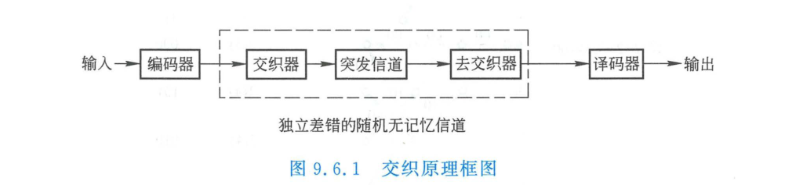
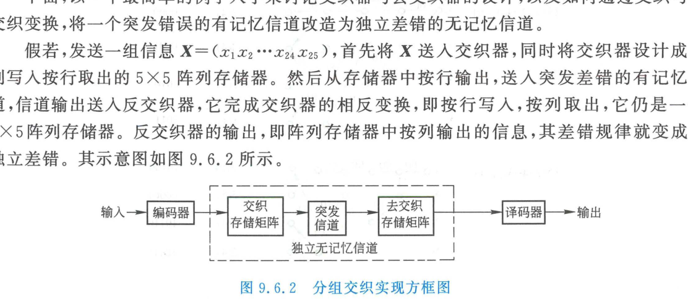

import Card from '@/components/Card.astro';
import Example from '@/components/Example.astro';
import Solution from '@/components/Solution.astro';
import ExerciseTrigger from '@/components/exercises/ExerciseTrigger.astro';

除里德-所罗门（RS）码等特定多进制代数码外，绝大多数前向纠错码（如汉明码、BCH 码、卷积码）均是针对**无记忆信道中的独立随机差错**设计的，其纠错能力具有严格的单块上限 $t$。

然而在移动无线多径深衰落、电离层短波反射及电磁脉冲干扰信道中，噪声呈现出强烈的时域相关性，差错往往以几十乃至数百个比特密集爆发的**长突发差错群（Burst Errors）**形式出现。若突发长度超过码字的纠错容量，纠错码将彻底瘫痪。**交织技术（Interleaving）**通过在时域对码元序列实施可逆的重排打散，成为化解这一物理矛盾的终极利器。

---

## 9.6.1 交织的基本原理与系统架构

交织的核心哲学是：**在发送端通过置换规则打乱码元的时间先后次序，拉大原本相邻码元在物理信道中的传输时间间隔；在接收端实施逆置换（解交织），在恢复原始数据时序的同时，将信道中高度集中的长突发连续错误打散成离散孤立的单个随机差错**。



```
发送信息序列 ──► [ 信道编码器 ] ──► [ 交织器 ] ──► 突发差错有记忆信道 ──┐
                                                                      │
接收恢复数据 ◄── [ 信道译码器 ] ◄── [ 解交织器 ] ◄────────────────────┘
```

从外层编解码系统视角审视：**“交织器 + 突发差错有记忆信道 + 解交织器”构成的复合传输信道，在统计特性上被重塑为一个理想的无记忆独立随机差错信道**。常规纠错码得以充分释放纠错潜能。

---

## 9.6.2 分组交织器（Block Interleaver）设计与矩阵推导

最经典、直观的交织器是**分组交织器**，其物理实质是一个由 $M$ 行 $N$ 列构成的二维双口存储矩阵（RAM）。



### 1. 读写映射法则
- **交织器（发端）**：
  数据流**按列顺序写入**存储矩阵（填满一列再填下一列），填满 $M \times N$ 矩阵后，**按行顺序读出**并推入物理信道发射；
- **解交织器（收端）**：
  接收数据流**按行顺序写入** $M \times N$ 解交织存储矩阵，填满后**按列顺序读出**送入信道译码器。

---

<Example title="例 9.6.1：5×5 分组交织器消除突发长错误全过程推导">
设待发送二进制数据序列长度为 25 比特：
$$
\boldsymbol{X} = (x_1, x_2, x_3, \dots, x_{24}, x_{25})
$$
发端配置一个 $M=5, N=5$ 的分组交织器。物理信道在传输期间遭遇突发深衰落，导致产生两个连续错误群：
1. 第一个突发在信道连续传输的第 1 到第 5 位发生全翻转（5 连错）；
2. 第二个突发在第 13 到第 16 位发生连续翻转（4 连错）。
试推导经解交织器恢复后的序列差错分布规律。
</Example>

<Solution>
**1. 交织写入与读出矩阵**：
将输入序列 $\boldsymbol{X}$ 按列写入 $5 \times 5$ 矩阵：
$$
\boldsymbol{X}_{\text{matrix}} = \begin{bmatrix}
x_1 & x_6 & x_{11} & x_{16} & x_{21} \\
x_2 & x_7 & x_{12} & x_{17} & x_{22} \\
x_3 & x_8 & x_{13} & x_{18} & x_{23} \\
x_4 & x_9 & x_{14} & x_{19} & x_{24} \\
x_5 & x_{10} & x_{15} & x_{20} & x_{25}
\end{bmatrix} \quad \xrightarrow{\text{按行读出发射}}
$$
交织器输出并推入信道的物理传输序列为：
$$
\boldsymbol{X}' = (x_1, x_6, x_{11}, x_{16}, x_{21}, \quad x_2, x_7, x_{12}, x_{17}, x_{22}, \quad x_3, x_8, \dots, x_{25})
$$

**2. 突发错误注入**：
信道产生两个突发错误群：
- 错误群 1 覆盖前 5 位：$x_1, x_6, x_{11}, x_{16}, x_{21}$ 全部翻转；
- 错误群 2 覆盖第 13 至 16 位：$x_8, x_{13}, x_{18}, x_{23}$ 全部翻转。
带错序列记为：
$$
\boldsymbol{Y}' = (\mathbf{x_1^*, x_6^*, x_{11}^*, x_{16}^*, x_{21}^*}, \; x_2, x_7, x_{12}, x_{17}, x_{22}, \; x_3, \mathbf{x_8^*, x_{13}^*, x_{18}^*, x_{23}^*}, \; x_4, \dots)
$$

**3. 解交织还原**：
收端解交织器按行将 $\boldsymbol{Y}'$ 存入矩阵，然后**按列读出**：
$$
\boldsymbol{X}''' = (\mathbf{x_1^*}, x_2, x_3, x_4, x_5, \quad \mathbf{x_6^*}, x_7, \mathbf{x_8^*}, x_9, x_{10}, \quad \mathbf{x_{11}^*}, x_{12}, \mathbf{x_{13}^*}, x_{14}, x_{15}, \quad \mathbf{x_{16}^*}, x_{17}, \mathbf{x_{18}^*}, x_{19}, x_{20}, \quad \mathbf{x_{21}^*}, x_{22}, \mathbf{x_{23}^*}, x_{24}, x_{25})
$$
**结论分析**：
观察解交织后的序列，原本在信道中连续集中翻转的 5 连错和 4 连错，被**彻底瓦解并均匀离散在时间轴上，任意两个错误比特之间的间距至少为 2 到 5 个正常比特**！后续的单错纠错码或短卷积码译码器即可轻松完成全部纠错。
</Solution>

---

## 9.6.3 交织深度与工程权衡

### 1. 交织深度（Interleaving Depth）
在 $M \times N$ 分组交织器中：
- 行数 $M$ 称为**交织跨度（Interleaving Span）**；
- 列数 $N$ 称为**交织深度（Interleaving Depth）**。
若信道中发生的连续突发错误长度为 $B \le N$，则经解交织后，**原本连续的错误比特被拉开至少 $M$ 个码元的保护间距**。

### 2. 卷积交织器（Convolutional Interleaver）演进
分组交织器必须等待整整 $M \times N$ 个比特全部写满后才能开始读出，引入了 $2MN$ 的端到端时延与高额内存开销。
为此，拉姆齐（Ramsey）与福尼（Forney）提出了**卷积交织器**：
- 采用由 $B$ 个不同延迟长度的移位寄存器支路构成的换向开关结构（第 $i$ 支路延迟为 $i \times M$ 个码元）；
- **核心优势**：在达到相同抗突发离散化能力的前提下，**端到端时延和 RAM 存储器开销均比分组交织器骤降一半**。被广泛固化在 DVB-T 数字电视地面广播与 3GPP 移动通信物理层中。

---

<ExerciseTrigger chapter={9} section="9.6" title="9.6 交织 思考题与自测" />
