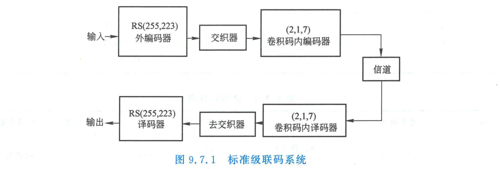
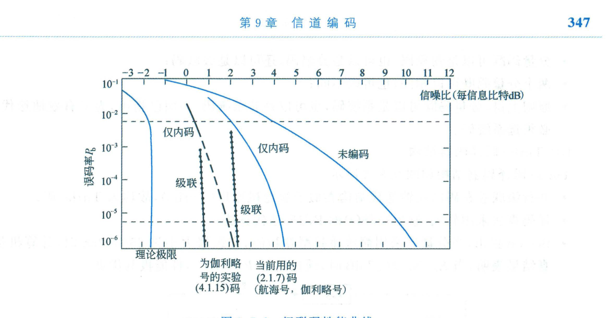

import Card from '@/components/Card.astro';
import ExerciseTrigger from '@/components/exercises/ExerciseTrigger.astro';

在香农信息论中，要使通信信道误码率无限逼近于零，纠错码的码长 $n$ 必须趋于无穷大。然而，单个超长代数码或超长约束卷积码的最优最大似然译码算法，其计算复杂度与硬件门限随码长呈指数爆炸（$O(2^n)$ 或 $O(2^K)$），在工程物理上不可实现。

1966 年，戴维·福尼（G. David Forney Jr.）在其麻省理工学院（MIT）博士论文中提出了革命性的**级联码（Concatenated Codes）**架构：**通过串联两级相对简单的短码构造出等效超长纠错码，而译码总复杂度仅为两个短码译码器复杂度的线性相加**。这一方案成功打破了“长码译码复杂性壁垒”。

---

## 9.7.1 标准级联码系统拓扑与核心构成

1984 年，美国国家航空航天局（NASA）正式确立了用于外太阳系深空探测飞行器（如旅行者号、伽利略号探测器）的数据传输标准，被通信学术界奉为**标准级联码系统（Standard Concatenated Coding System）**。



```
                    ┌──────────── 发送端 ────────────┐
输入数据 ──► [ 外编码器 ] ──► [ 交织器 ] ──► [ 内编码器 ] ──► 物理信道
             (RS 码)                        (卷积码)           │
                                                              │
                    ┌──────────── 接收端 ────────────┘
输出数据 ◄── [ 外译码器 ] ◄── [ 解交织 ] ◄── [ 内译码器 ] ◄── AWGN 信道
             (代数译码)                     (维特比算法)
```

系统由以下三大核心组件级联组成：
1. **外码（Outer Code）**：
   - 选用高码率、长块长、强抗突发的**非二元里德-所罗门码（RS 码）**，NASA 标准为 $\mathrm{GF}(2^8)$ 上的 $(255, 223)$ RS 码（$m=8\text{ bit}, t=16$ 符号）；
2. **符号交织器（Interleaver）**：
   - 位于内外码之间，以 RS 符号（字节）为单位实施时间置换重排；
3. **内码（Inner Code）**：
   - 选用短约束长度、适于软判决最大似然译码的**二元卷积码**，NASA 标准为 $R=1/2, K=7$ 的 $(2, 1, 7)$ 卷积码。

---

## 9.7.2 协同纠错与差错净化机理

级联系统的超高纠错增益源于**内译码器与外译码器在差错统计特性上的完美互补**：

1. **内译码器的初级净化**：
   - 物理信道吸入加性高斯白噪声（AWGN），内译码器（维特比算法）充分利用接收波形的软判决信息，以极高效率吞噬绝大部分信道白噪声，使信噪比门限大幅前移；
2. **内码译码差错的时域突发性**：
   - 维特比算法的核心短板在于：当信噪比极低导致网格图走错路径时，一旦发生判决错误，往往伴随着**连续几个分支、长达十几个比特的密集突发差错群（Error Bursts）**；
3. **交织器的去相关打散**：
   - 内译码器喷吐出的成串突发错误流进入解交织器，被在时间轴上大幅拉开并均匀稀释到多个不同的 RS 码块中；
4. **外码 RS 译码器的二次终极清洗**：
   - 外码 RS 译码器以字节为单位进行代数译码。稀释后的突发碎片在各个 RS 码字中仅占用极少数符号错误（远低于 $t=16$ 的纠错上限），被 RS 译码器全部彻底扫除。

---

## 9.7.3 NASA 标准级联系统参数与性能曲线

<Card title="NASA 标准级联码技术参数规范" type="star">

| 模块类别 | 选用码型与参数 | 关键多项式 / 算法 | 码率与增益特性 |
| :--- | :--- | :--- | :--- |
| **外码（Outer）** | $(255, 223)$ RS 码 | 本原多项式 $p(x) = x^8 + x^4 + x^3 + x^2 + 1$，纠错 $t=16$ 字节 | $R_{\text{out}} = \frac{223}{255} \approx 0.875$ |
| **交织器** | 卷积交织器（深度 $I=2, 4, 8$）| 符号级时域置换 | 零冗余，时延受控 |
| **内码（Inner）** | $(2, 1, 7)$ 卷积码 | $G_1 = (171)_8, \; G_2 = (133)_8$（维特比软判决译码） | $R_{\text{in}} = 1/2$，自由距离 $d_f = 10$ |
| **总级联系统** | 综合等效超长码 | 软输入内译码 + 硬输入外译码 | 总码率 $R_{\text{total}} = 0.437$ |

</Card>



在加性高斯白噪声（AWGN）信道中，该标准级联系统的误比特率曲线呈现出极其陡峭的“瀑布效应（Waterfall）”：
- 当 $E_b/N_0 = 2.53\text{ dB}$ 时，输出误比特率即骤降至 $P_b < 10^{-6}$；
- 相比未编码 BPSK 系统（达到 $10^{-6}$ 误码率需 $E_b/N_0 = 10.5\text{ dB}$），**提供了高达近 $8\text{ dB}$ 的净编码增益**！
- 相比单独使用 $(2, 1, 7)$ 卷积码（需 $E_b/N_0 \approx 4.5\text{ dB}$），亦大幅提升了 $2\text{ dB}$，成为 20 世纪 80~90 年代深空探测与卫星通信的绝对统治体制。

---

<ExerciseTrigger chapter={9} section="9.7" title="9.7 级联码 思考题与自测" />
