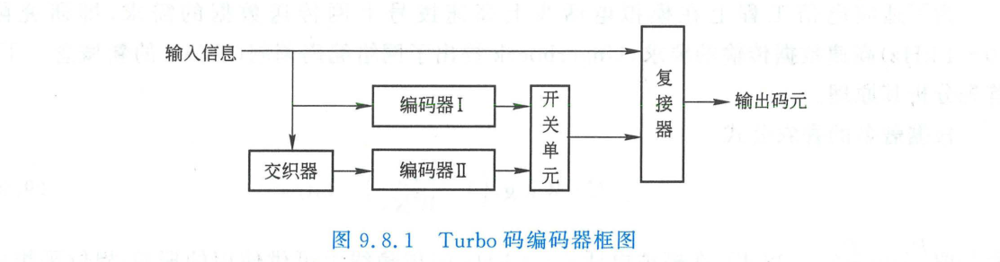
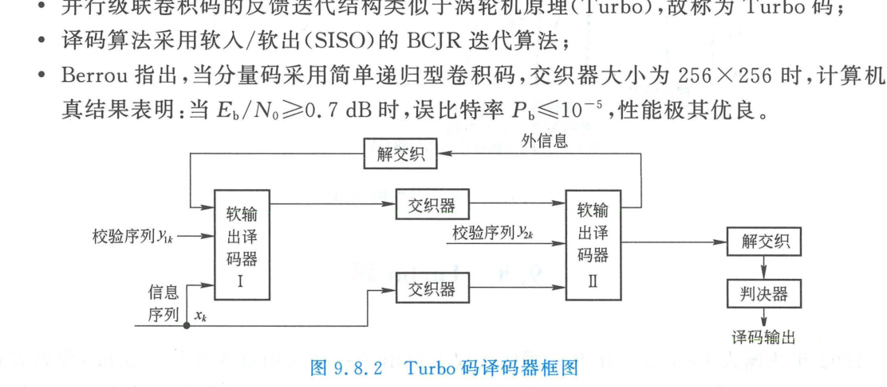

import Card from '../../../../../../components/Card.astro';
import ExerciseTrigger from '../../../../../../components/ExerciseTrigger.astro';

自香农 1948 年发表奠基性论文以来的近半个世纪中，“寻找能够无限逼近香农信道容量极限且译码复杂度可实现的实用好码”一直是信息论学者孜孜以求的学术圣杯。

1993 年，在日内瓦召开的 IEEE 国际通信大会（ICC'93）上，法国学者克劳德·贝鲁（Claude Berrou）、阿兰·格拉维厄（Alain Glavieux）以及缅甸籍学者普尼亚·蒂蒂马什玛（Punya Thitimajshima）联合发表了一项震惊世界的突破性成果——**Turbo 码（Turbo Codes，涡轮码）**。在加性高斯白噪声（AWGN）信道中，当误比特率 $P_b \le 10^{-5}$ 时，Turbo 码所需的 $E_b/N_0$ 达到了令人难以置信的 **$0.7\text{ dB}$**，距香农理论终极极限仅差约 $0.7\text{ dB}$！

---

## 9.8.1 Turbo 码的设计哲学与编码架构

Turbo 码在构想上引入了“**随机性构造（Random-like Code）**”与“**软信息迭代反馈（Soft Iterative Feedback）**”两大核心创新。其名称借用了内燃机中的“废气涡轮增压器（Turbocharger）”概念：通过将系统的次级输出信息反馈至前端反复加压循环，在极短的迭代周期内榨取出极致的能量增益。

### 1. 并行级联卷积码（PCCC）编码器结构
经典的 Turbo 码采用**并行级联卷积码（Parallel Concatenated Convolutional Codes, PCCC）**架构：

编码器主要由三部分构成：
1. **直接信息支路（系统位，Systematic Bit）**：
   原始信息比特序列 $u_k$ 原封不动直接输出为 $x_k$；
2. **第一分量编码器（Component Encoder 1）**：
   输入为原始信息序列 $u_k$，输出第一组校验序列 $y_{1k}$；
3. **交织器（Interleaver, $\Pi$）与第二分量编码器（Component Encoder 2）**：
   原始信息序列 $u_k$ 首先通过一个长伪随机交织器打散顺序，再输入至第二分量编码器，输出第二组校验序列 $y_{2k}$；
4. **凿孔选通与复接器（Puncturing & Mux）**：
   根据预设的系统码率要求，对两路校验序列 $y_{1k}, y_{2k}$ 实施周期性抽取截短（Puncturing，例如交替保留偶数位和奇数位以实现 $R=1/2$ 码率），最终并串转换为码字流输出。

### 2. 分量编码器：递归系统卷积码（RSC）
分量编码器必须采用**递归系统卷积码（Recursive Systematic Convolutional Codes, RSC）**，而不是传统的前馈非系统卷积码（NSC）：
- **无限冲激响应（IIR）**：RSC 编码器引入了内部模 2 线性反馈通道，单个孤立的“1”输入将引发寄存器产生长周期的无限循环响应；
- **消除低重码字**：若某输入序列在第一编码器中产生了极低重量的校验输出，经过大尺度伪随机交织器打散后，极大概率在第二编码器中激发出非常高权重的校验序列，从而**在统计上极其有效地抹平了整个码集的低距离谱，极大增大了有效自由距离**。

---

## 9.8.2 Turbo 码的迭代软译码机理（SISO / BCJR 算法）

Turbo 码的奇迹不仅在于编码构造，更在于其优雅的**软输入软输出（Soft-Input Soft-Output, SISO）迭代译码引擎**：

### 1. 软信息与对数似然比（LLR）
译码器放弃了 0/1 硬判决，全程处理连续的实数**对数似然比（Log-Likelihood Ratio, LLR）**：
$$
L(u_k) = \ln \frac{P(u_k = 1 \mid \boldsymbol{y})}{P(u_k = 0 \mid \boldsymbol{y})}
$$
LLR 的正负符号代表硬判决方向（$>0$ 判为 1，$<0$ 判为 0），绝对值大小精准刻画了该判决的统计置信度（Reliability）。

### 2. 外部信息传递（Extrinsic Information Exchange）
SISO 译码器采用著名的 **BCJR 算法（Bahl-Cocke-Jelinek-Raviv 算法，亦称前向-后向最大后验概率 MAP 算法）**。在每一个译码半周期内，译码器将接收到的对数似然比精准解耦为三部分：
$$
L(u_k \mid \boldsymbol{y}) = \underbrace{L_{\text{ch}}(u_k)}_{\text{信道观测软信息}} + \underbrace{L_{\text{apr}}(u_k)}_{\text{先验先导信息}} + \underbrace{L_{\text{ext}}(u_k)}_{\text{本级新榨出的外信息}}
$$

<Card title="涡轮增压循环：外信息的协作迭代" type="star">
1. **译码器 1** 结合信道输入与来自译码器 2 的先验信息，算出纯净的**外信息 $L_{\text{ext}, 1}$**；
2. 经过交织器 $\Pi$ 置乱后，作为**译码器 2 的先验先导信息**；
3. **译码器 2** 结合交织后的信道信息与该先验信息，算出第二组外信息 $L_{\text{ext}, 2}$；
4. 经过解交织器 $\Pi^{-1}$ 还原后，再次**回传喂给译码器 1 作为下一轮迭代的先验更新**！

这种“双子译码器互通有无、相互激励、循环精炼”的机制，使得译码器置信度随迭代次数单调递增，一般仅需 $6 \sim 8$ 次迭代即可完全收敛。
</Card>

---

## 9.8.3 性能评价与代际演进

在 3G 移动通信（WCDMA / cdma2000）以及 4G 移动通信（LTE）中，Turbo 码被正式确立为主力数据信道编码标准。随着交织块长 $N \ge 65536$（如 $256 \times 256$ 阵列），误码率曲线出现急剧下坠的“瀑布区”，在极低信噪比下展现出逼近香农理论边界的卓越表现，彻底改写了现代数字通信的技术版图。

---

<ExerciseTrigger chapter={9} section="9.8" title="9.8 Turbo码 思考题与自测" />
