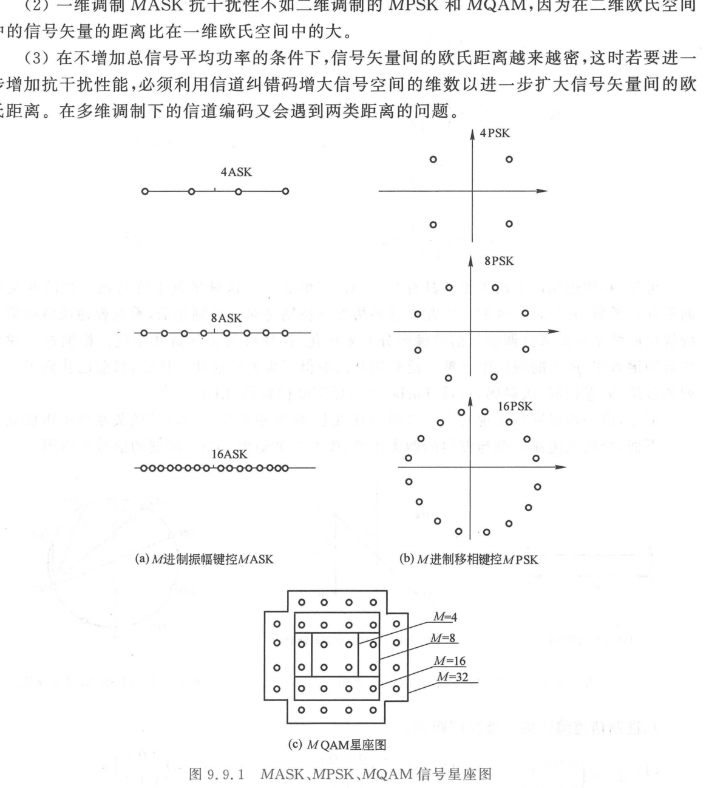
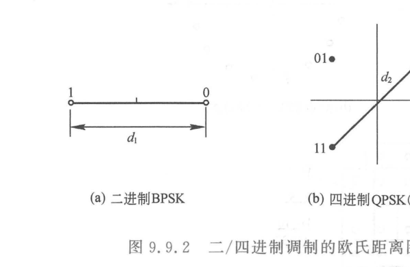
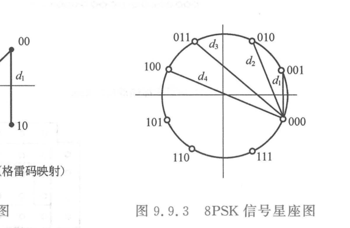
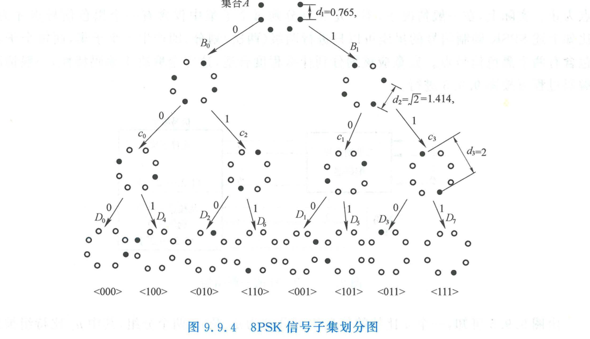
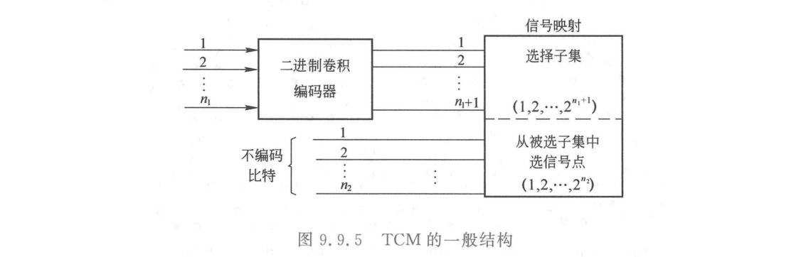
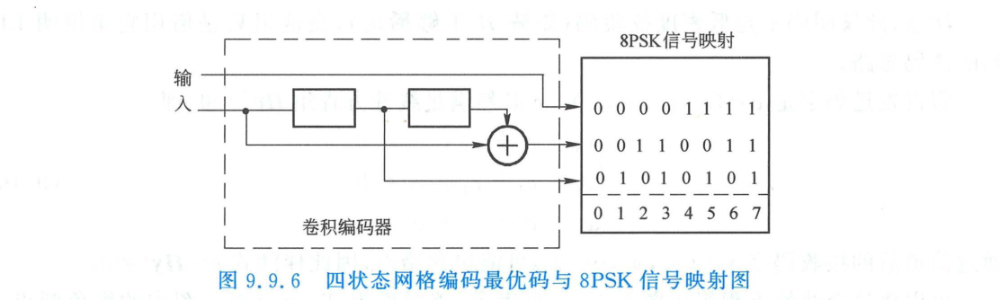

import Card from '@/components/Card.astro';
import ExerciseTrigger from '@/components/exercises/ExerciseTrigger.astro';

在前面的各节中，我们所探讨的信道纠错码（汉明码、BCH 码、卷积码、Turbo 码）均属于**低频谱效率（$\eta = R_b / B < 1\text{ bit/(s}\cdot\text{Hz)}$）系统**。其获取编码增益的基本手段是在时域插入冗余校验位，代价是**必须扩展传输频带宽度**。

然而在大量经典高价值电信信道中（如模拟电话双绞线语音频段 $0 \sim 4\text{ kHz}$、微波中继频段、数字微波中继与卫星通信），**信道可用物理带宽受到极其严苛的物理与法规限制，频带被完全锁死**。为了在该类信道上实现高速数据传输，戈特弗里德·翁格博克（Gottfried Ungerboeck）于 1982 年提出了开创性的**网格编码调制（Trellis Coded Modulation, TCM）**，创立了编码与调制联合优化的高效传输新流派。

---

## 9.9.1 频带受限信道与两类距离的根本矛盾

### 1. 多进制高阶调制星座图
根据香农信道容量公式 $C = B \log_2(1 + S/N)$，在物理带宽 $B$ 恒定受限的条件下，提高数据传输速率 $R_b$ 的唯一途径是大幅提升信噪比并采用**多进制高阶调制（$M$-ary Modulations）**：

### 2. 汉明距离与欧氏距离的脱节矛盾
- **调制的抗噪声判决基础**：取决于已调信号点在实数或复数**连续欧氏空间（Euclidean Space）中的几何直线距离**。两信号点欧氏距离越远，高斯白噪声将其击穿引发判决错误的概率越低；
- **编码的纠错判决基础**：取决于有限域上离散码字序列之间的**汉明距离（Hamming Distance）**。

在低阶调制（二进制 BPSK 与四进制 QPSK）中，经由格雷码映射后，**汉明距离与欧氏几何距离保持着严格单调的“一一对应”正相关关系**（汉明距离为 1 对应最小欧氏距离，汉明距离为 2 对应对角线最大欧氏距离）：

*(a) 二进制 BPSK* 
*(b) 四进制 QPSK（格雷码映射）*

因此，对于二进制通信，香农曾建议将**调制与信道编码完全独立分开设计**。

然而，**当调制阶数进入八进制（8PSK, 16-QAM）及以上时，两类距离的严格单调对应关系彻底破裂**！
以 8PSK 星座为例：
- 坐标相邻的两个信号点，相位差仅为 $\pi/4$，欧氏距离极小（$d = 0.765$）；
- 相位差为 $\pi$ 的两个正对信号点，欧氏距离达到最大值（$d = 2.0$）；
- 若直接套用传统二进制卷积码，极可能出现**汉明距离很大但欧氏距离极小**的致命失配，导致接收机误符号率剧烈劣化。

---

## 9.9.2 Ungerboeck 集合分割理论（Set Partitioning）

为了在多进制高阶调制中最大化输出信号序列间的**自由欧氏距离（Free Euclidean Distance, $d_{\text{free}}$）**，Ungerboeck 提出了著名的**子集划分（Set Partitioning）理论**。

其核心规则是：**以“一分为二”树状迭代方式递归划分调制星座点集合，使得随着子集划分层级的加深，留在同一步骤子集内的各信号点之间的最小欧氏几何距离单调阶梯式递增**！

以单位圆上的 8PSK 星座（全集 $A$）的三级分割推导为例：
1. **全集 $A$（8 个信号点）**：
   相邻点几何距离为：
   $$
   d_1 = 2 \sin\frac{\pi}{8} = \sqrt{2 - \sqrt{2}} \approx 0.765
   $$
2. **一级分割（划分为两个交错子集 $B_0$ 与 $B_1$，各含 4 点）**：
   子集内部各点相位差扩展为 $\pi/2$（正交结构），子集内最小欧氏距离暴增至：
   $$
   d_2 = 2 \sin\frac{\pi}{4} = \sqrt{2} \approx 1.414 \quad (\text{功率增益 } 3\text{ dB})
   $$
3. **二级分割（划分为 4 个子集 $C_0, C_1, C_2, C_3$，各含 2 点）**：
   子集内部两点为反相正对点（相位差 $\pi$），子集内最小欧氏距离跃升至：
   $$
   d_3 = 2 \sin\frac{\pi}{2} = 2.000 \quad (\text{相比原集增益 } 6\text{ dB})
   $$
4. **三级分割（划分为 8 个单点子集 $D_0 \sim D_7$）**：
   每个子集退化为唯一确定信号点。

---

## 9.9.3 TCM 编码架构与最优网格映射

TCM 突破传统思路，将原本发送 $n$ 比特所需的 $2^n$ 进制星座**扩充一倍为 $2^{n+1}$ 进制星座**（例如传输 2 比特信息原需 4PSK，TCM 升级采用 8PSK；传输 3 比特原需 8PSK，升级为 16-QAM）：

### 1. 比特分流与联合映射机理
输入 $n$ 个信息比特被划分为两部分 $n = n_1 + n_2$：
1. **编码信息比特（$n_1$ 比特）**：
   送入码率为 $n_1 / (n_1 + 1)$ 的卷积编码器，输出 $n_1 + 1$ 个冗余比特。这 $n_1 + 1$ 个比特专门**用于索引选择经子集划分后的 $2^{n_1 + 1}$ 个高欧氏距离子集之一**；
2. **未编码信息比特（$n_2$ 比特）**：
   不参与卷积运算，直接**用于在已选定的子集内部挑选具体的星座物理信号点**（在网格图上体现为状态转移分支之间的**并行转移支路，Parallel Transitions**）。

### 2. 四状态 8PSK-TCM 最优实现实例
对于每符号传输 2 比特信息的系统（$n=2, n_1=1, n_2=1$），采用 4 状态卷积编码驱动 8PSK：

- 4 状态网格图中，由于 $n_2=1$，每个转移状态之间包含 $2^{n_2} = 2$ 条并行转移分支；
- 并行分支信号点取自子集 $C_i$（欧氏距离 $d_3 = 2.0$）；
- 跨状态转移路径之间的累积欧氏自由距离经全局搜索优化达到 $d_{\text{free}} = \sqrt{d_1^2 + d_2^2 + d_1^2} = \sqrt{0.586 + 2 + 0.586} = \sqrt{3.172} \approx 1.78$；
- 综合最小自由距离达到 $d_{\text{free}} = \min\{d_3, \sqrt{3.172}\} = \sqrt{3.172}$。

---

<Card title="TCM 的革命性工业价值：免费的午餐" type="star">
相比于未编码的 QPSK 系统：
1. **带宽完全零扩展**：两者每个符号周期均精确传送 2 比特有效信息，信号波特率与占用物理频带严格相等；
2. **平均发射功率完全不变**：调制星座的归一化平均信号能量保持一致；
3. **巨大的净编码增益**：
   四状态 8PSK-TCM 相比未编码 QPSK **净提升了整整 $3.0\text{ dB}$ 的渐近编码增益**；若扩展为 8 状态或 16 状态卷积网格，编码增益可进一步拔高至 **$3.6\text{ dB} \sim 4.1\text{ dB}$**！

在 20 世纪 80 年代末至 90 年代初，TCM 技术被全面写入国际电报电话咨询委员会（CCITT）V.32、V.34 电话线调制解调器（Modem）国际标准，在 $3\text{ kHz}$ 的窄带电话线上将拨号上网速率由最初的 $2.4\text{ kbit/s}$ 奇迹般推高至 $33.6\text{ kbit/s}$，写下了通信工程史上的辉煌一页。
</Card>

---

<ExerciseTrigger chapter={9} section="9.9" title="9.9 高效率信道编码TCM 思考题与自测" />
