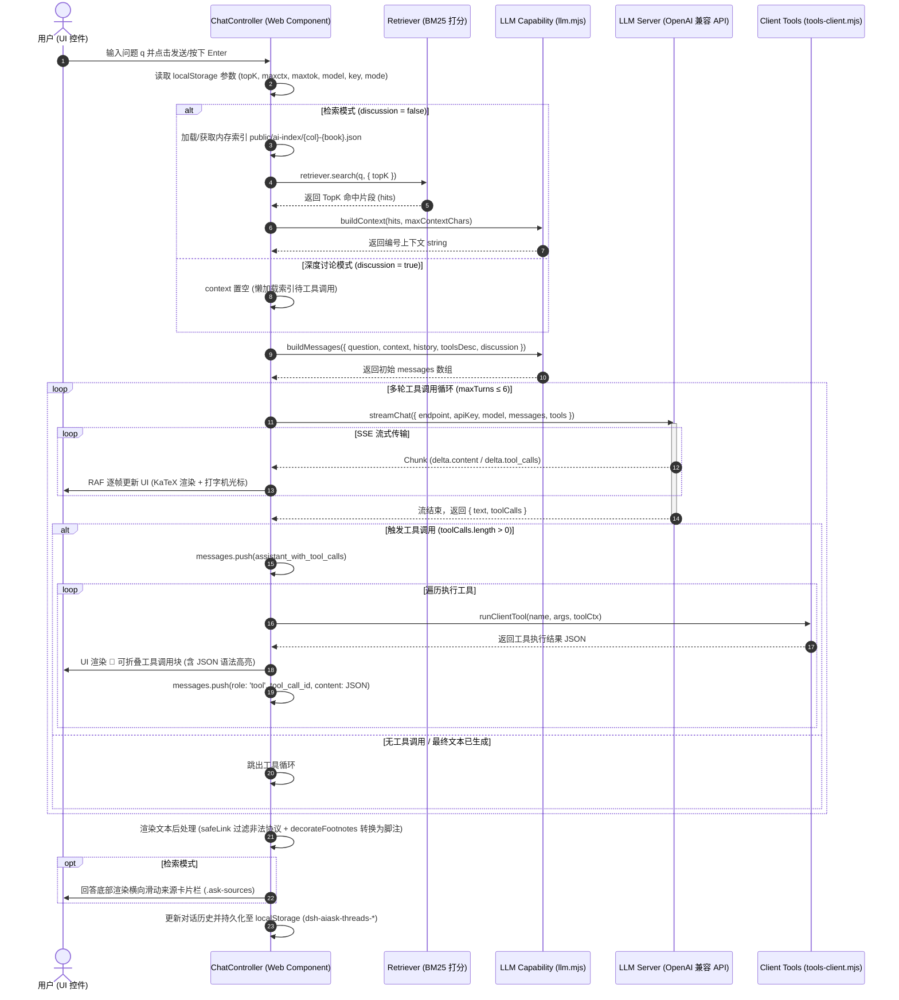

# AI 书内问答 (RAG) 开发者指南

AstroLib 集成了 **AI 书内问答（RAG - 检索增强生成）** 系统，定位为在「当前阅读的书」内提供智能检索与可溯源提问能力。

本文档专为开发人员与 Agent 编写，详细说明 **已有 MCP/客户端工具规格**、**动态 Prompt 串联架构** 及 **单次 AI 请求的完整链条与控制流**。

---

## 一、 架构设计与体系定位

1. **Feature Registry 平级开关**：
   受 `src/config/features.config.mjs` 中的 `features.aiAsk` Manifest 统一管控。关闭时构建期跳过索引生成，前端零打包开销。
2. **构建期语义切块**：
   运行 `scripts/build-ai-index.mjs`，复用卡片识别逻辑与 `cleanSlug()`，按语义单元（`<Example>`、`<Knowledge>` 卡片或 Heading 标题）切块生成 `public/ai-index/<col>-<book>.json` 索引文件。
3. **客户端 BYOK 直连与双轨工具架构**：
   采用 BYOK (Bring Your Own Key) 模式，前端控件 (`src/ai/client/chat-controller.ts` / `src/components/AIAsk.astro`) 直连 OpenAI 兼容端点流式生成答案，同时支持浏览器端纯客户端检索工具与 Node 端 MCP Server 检索工具。

---

## 二、 已有 MCP / 客户端工具全景规格

本项目采用了 **“Node MCP 服务端”与“浏览器客户端”双轨运行** 的工具架构：
- **Node MCP 服务端**（`src/ai/mcp/tools.mjs` + `server.mjs`）：独立 MCP Server 进程，可供 CLI、外置 Agent 或本地调试使用，具有文件系统（`fs`）、子进程（`child_process`）和 Python 执行（`python_exec`）能力。
- **浏览器端工具**（`src/ai/tools-client.mjs` + `chat-controller.ts`）：运行于 Web Component 内，**零后端、纯客户端执行**，完全基于内存中按需加载的书内 JSON 索引（`public/ai-index/<col>-<book>.json`）与导航大纲。

### 1. 全量 8 个工具速查表

| 工具名称 (`name`) | 运行环境 | 核心功能说明 | 关键输入参数 | 返回值关键结构 | 文本与成本限制 |
|---|---|---|---|---|---|
| `list_books` | 双轨 (Node / Client) | 列出题库合集与图书 | 无 | `{ books: [{ col, book, title }] }` | 零限制，读配置 |
| `book_toc` | 双轨 (Node / Client) | 获取图书目录树/章节列表 | `col`, `book` (Node) | `{ title, toc: [{ title, url }] }` | 上限 120 条目录项 |
| `book_retrieve` | 双轨 (Node / Client) | BM25 强标识符加权检索片段 | `question`, `topK` (1~12), `col`, `book` | `{ results: [{ id, type, title, url, score, matched, text, truncated }] }` | 单条 `TEXT_CAP=800` 字符硬截断 |
| `book_chunk` | 双轨 (Node / Client) | 按 id 取单个片段全文 | `id`, `col`, `book` | `{ found: true, id, type, title, url, text, truncated }` | 单条 `TEXT_CAP=800` 字符截断 |
| `book_slice_search` | 双轨 (Node / Client) | 正则/子串匹配正文，带上下文窗口 | `pattern`, `mode` (`substring`/`regex`), `limit` (1~20) | `{ hits: [{ id, type, title, url, text, context }], count }` | 过滤 LaTeX 噪声，`context` 截取前后 130 字符窗口 |
| `book_chapter_outline` | 双轨 (Node / Client) | 查看某章大纲与卡片编号/锚点 | `chapter` (章号/关键词), `col`, `book` | `{ found: true, chapter: { number, title, sections: [{ cards: [{ number, title, url }] }] } }` | 单章预算上限 500 卡片，小节上限 100 |
| `book_read_section` | 双轨 (Node / Client) | 从起点片段连续读取正文 | `start` (id/标题/编号), `count` (1~12), `end` | `{ found: true, items: [{ kind, type, title, url, text, truncated }] }` | 单段 `SECTION_TEXT_CAP=1400` 字符截断 |
| `python_exec` | 仅 Node MCP | 执行 Python 脚本对片段做二次处理 | `code`, `input` | `{ stdout: string }` | 15s 超时，输出上限 8000 字符，需 `python` 环境 |

---

## 三、 动态 Prompt 串联机制

### 1. 动态解耦设计思想
前端 UI 组件 (`AIAsk.astro` / `chat-controller.ts`) **绝不硬编码任何系统提示词或格式模板**。所有 Prompt 的构建统一由能力层 `src/ai/llm.mjs` 中的纯函数驱动。当项目逻辑改变（如修改 KaTeX 格式要求、变更超链接格式、增加工具或切换讨论模式）时，只需修改 `llm.mjs` 中的三元组函数，整个应用自动同步生效。

```
┌─────────────────────────────────────────────────────────────────────────────┐
│ 运行时状态 (BookTitle, DiscussionMode, TopK Hits, History, ToolsDesc)       │
└──────────────────────────────────────┬──────────────────────────────────────┘
                                       │ 传入
┌──────────────────────────────────────▼──────────────────────────────────────┐
│ Prompt 构建三元组 (src/ai/llm.mjs)                                          │
│                                                                             │
│  1. buildSystemPrompt(bookTitle, { toolsDesc, discussion })                 │
│     ├── 注入学科角色 + 公式规范 ($..$)                                     │
│     ├── 注入「给出总结性内容本身」指令（严禁打发式引导语）                 │
│     ├── 注入站内绝对路径超链接规范 [标题](url)                             │
│     ├── 模式分支：                                                         │
│     │    ├─ discussion=false: 强约束根据【书中片段】作答 + [n] 上标引用    │
│     │    └─ discussion=true : 基于理解自由讨论 + 默认不检索/拿不准才查     │
│     └── 动态工具清单注入 (toolsDesc())                                     │
│                                                                             │
│  2. buildContext(chunks, capChars)                                          │
│     └── 将 topK 片段格式化为:                                              │
│         [n] 【类型｜标题】                                                   │
│         来源：/collections/...                                              │
│         正文内容...                                                         │
│                                                                             │
│  3. buildMessages({ question, context, bookTitle, history, discussion })     │
│     └── [System Message] + [History Messages] + [User Message (带Context)]  │
└──────────────────────────────────────┬──────────────────────────────────────┘
                                       │ 产出 messages 数组
┌──────────────────────────────────────▼──────────────────────────────────────┐
│ OpenAI 流式请求层 (streamChat)                                              │
└─────────────────────────────────────────────────────────────────────────────┘
```

### 2. 关键 Prompt 约束规则一览
1. **总结性回答要求**（防打发）：明确禁止输出“相关内容在第 X 章 / 请去查看原文”这类空洞引导，要求 AI 必须整理好定义、定理、推导与方法后完整讲给读者。
2. **站内绝对路径超链接**：要求引用具体知识点时直接输出 `[标题](/collections/col/book/...#anchor)` 形式的 markdown 链接（利用片段与工具结果返回的 `url`）。
3. **KaTeX 渲染兼容**：行内公式统一采用 `$..$`，块级公式统一采用 `$$..$$`。
4. **脚注引用对齐**：仅在 `discussion=false` 时要求模型在句末标注 `[1]`..`[n]` 上标，对应 `buildContext` 提供的 TopK 片段。

---

## 四、 发送每一个 AI 请求的完整逻辑链

以下展示用户从输入问题到收到回答的完整流转过程与架构流向：



### 逻辑链各阶段深度解析

1. **阶段一：状态解析与配置准备**
   - 监听发送事件，重置当前会话 UI。
   - 从 `localStorage` 中提取：选中的 `modelId`、对应端点 `endpoint`、`apiKey`、TopK 数量（`topK`）、上下文上限（`maxContextChars`）、回答 Token 上限（`maxAnswerTokens`）及回答模式（`retrieve` 检索模式 / `discussion` 深度讨论模式）。

2. **阶段二：检索与上下文预处理**
   - **检索模式**：确保获取/加载对应书的 `/ai-index/<col>-<book>.json` 索引文件；执行强标识符加权 BM25 检索（拉丁专名 x4.0、数字编号 x3.0、概念词 x1.8），获取 TopK 片段。调用 `buildContext()` 生成带来源编号 `[n]` 和链接 URL 的文本。
   - **讨论模式**：跳过初始检索，上下文留空。索引用作工具调用的懒加载备选。

3. **阶段三：Prompt 与 Messages 消息链构建**
   - 调用 `buildMessages()`：
     - 构建 `system` 消息（包含角色、公式规则、超链接规范及由 `toolsDesc()` 生成的动态工具说明）。
     - 提取历史对话记录 `history`（自动截取最近 12 条有效 user/assistant 对话）。
     - 拼接当前 `user` 消息（带 Context 约束或纯 Question）。

4. **阶段四：流式请求与 Function Calling 工具循环（最高 6 轮）**
   - 发起 `streamChat` POST 请求，开启 SSE 接收。
   - **流式增量解析**：`onDelta` 逐字追加响应，使用 `requestAnimationFrame` 驱动 Markdown 转 HTML 与 KaTeX 实时公式渲染（`renderMathInElement`），防止卡顿。
   - **工具调用处理**：若 SSE 中收到 `delta.tool_calls`，按 `index` 增量拼接参数。流结束时：
     1. 将 Assistant 带有 `tool_calls` 声明的消息加入 `messages`；
     2. 依次调用 `runClientTool(tc.name, tc.arguments, toolCtx)`；
     3. 捕获工具结果并调用 `toolSummary()` 生成简短摘要，UI 上渲染可折叠工具块（包含 JSON 语法高亮）；
     4. 将 `{ role: 'tool', tool_call_id, content: JSON.stringify(out) }` 压入 `messages` 队列；
     5. 重新发起下一轮 `streamChat` 请求，直到 LLM 输出最终自然语言回答。

5. **阶段五：后处理、安全净化与 UI 渲染**
   - **超链接安全净化 (`safeLink`)**：解析回答中的 Markdown 链接 `[标题](url)` 与裸 `collections` 路径，阻断 `javascript:` / `data:` 等恶意 Scheme，自动将相对路径转换为当前站点规范的绝对路径。
   - **脚注转换 (`decorateFootnotes`)**：在检索模式下，使用正则将回答中的 `[1]`..`[n]` 替换为指向底部来源卡片锚点的 `<a class="cite-ref">`。
   - **来源卡片渲染 (`_renderSources`)**：在回答下方追加横向可调滚动的来源卡片，显示片段类型、标题、内容摘要，支持点击跳转至对应卡片原文。

6. **阶段六：本地持久化与状态同步**
   - 将当前对话的消息队列、使用的工具日志、渲染分段（`segments`）保存至 `localStorage`（键为 `dsh-aiask-threads-<col>-<book>`）。
   - 更新头部历史面板列表与页签 Tabs，以便刷新或再次进入时即时恢复会话状态。
